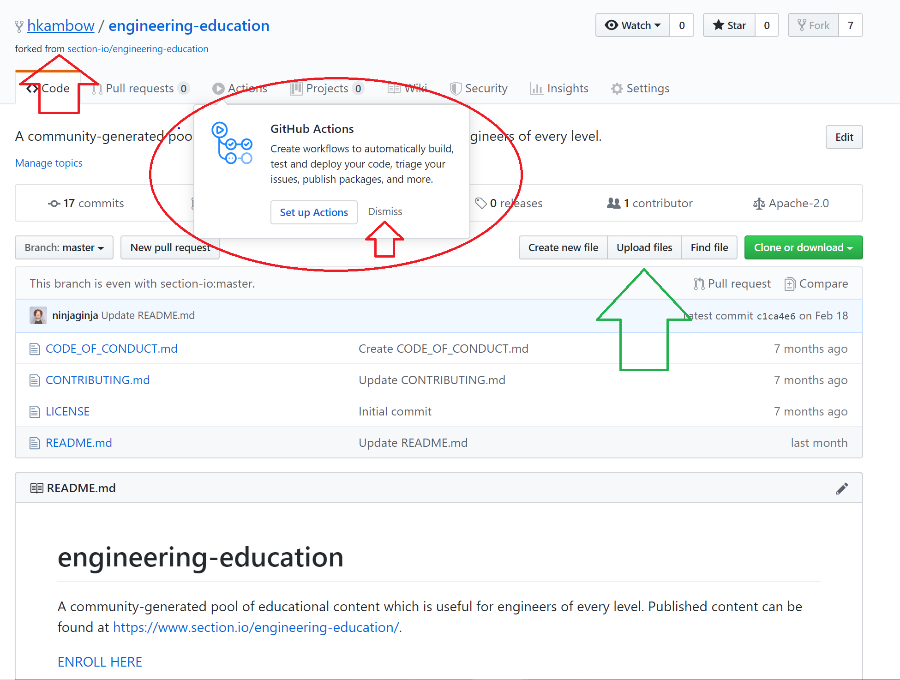
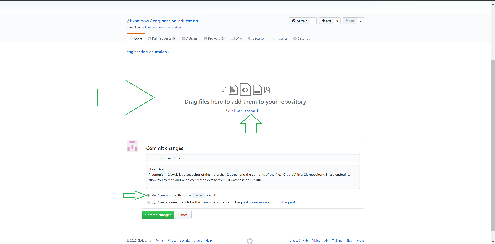
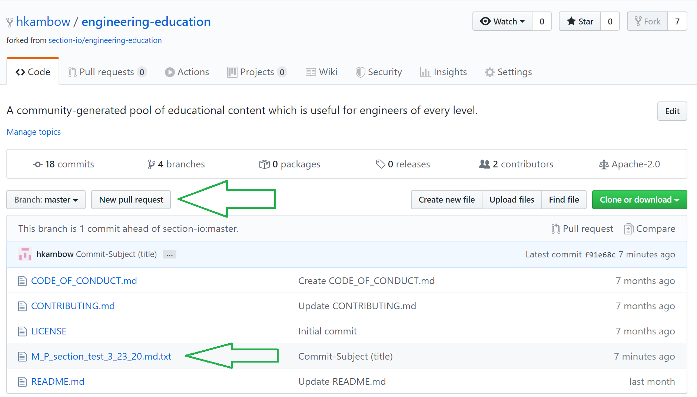
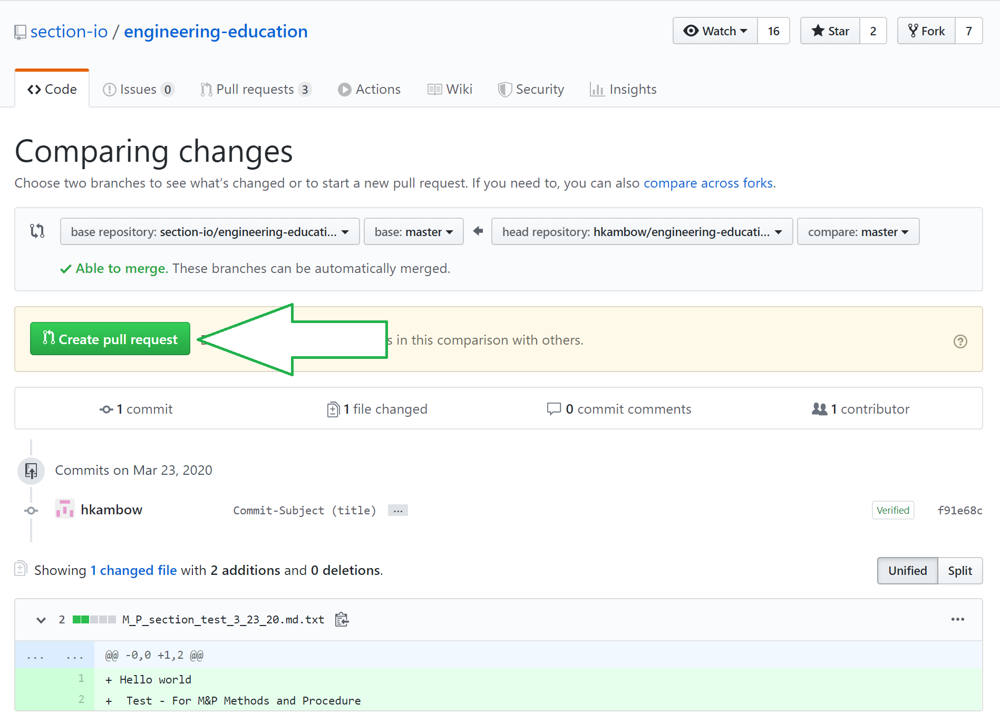

### How to upload your first article for Section’s Engineering Education Program:

You must have an account created with Github already.

In order to upload your prepared .md file to Github, first, click the **Fork** option in the upper right-hand corner (pictured below).

When you click the **Fork** button, you will see a screen similar to the one below indicating you are copying over to your own repository.

Once you have successfully forked over to your repository, you will see a screen similar to the one below. A few notes:
You should notice your username in the upper left-hand corner (top red arrow).
If a Github Action notice pops up, click **Dismiss** (red arrow in the middle).
Now you are able to **Upload** your .md files (click **Upload files** button).

Now you are ready to upload your article in .md format. You can Upload your .md file(s), image files, etc either by dragging and dropping in the box indicated by the large green arrow below or by clicking choose your files in the box.

### Commit Message
Write a short commit message with a description and you can choose to commit to the master branch or work from dedicated branches, (completely up to you as you get more comfortable using Github). Here is a [short video](https://www.youtube.com/watch?v=oPpnCh7InLY&t=577s) 
on how Github Branches work.

You should be able to see your .md file and an alert that says your branch is (X) commit ahead of section.io:master (bottom green arrow). 

Now click **New pull request** to create a PR (pull request) for review and approval by the Section team (top green arrow).

This will take you to a screen similar to the one below. On this screen, click **Create Pull Request** in the green box (green arrow).

Once you click **Create pull request**, it will open a request for you, which should look something like this:

Add a commit subject and message before clicking the final **Create pull request** button (green arrow).

Here is a [link](https://www.youtube.com/watch?v=nT8KGYVurIU&t=47s) to a short video further explaining what a **pull request** is and how to **fork** a Github repository.

Congratulations! Your article has been submitted for review and approval by the Section team.

