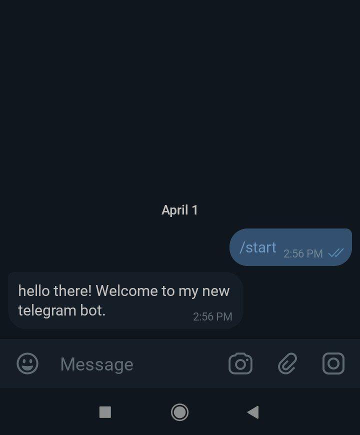
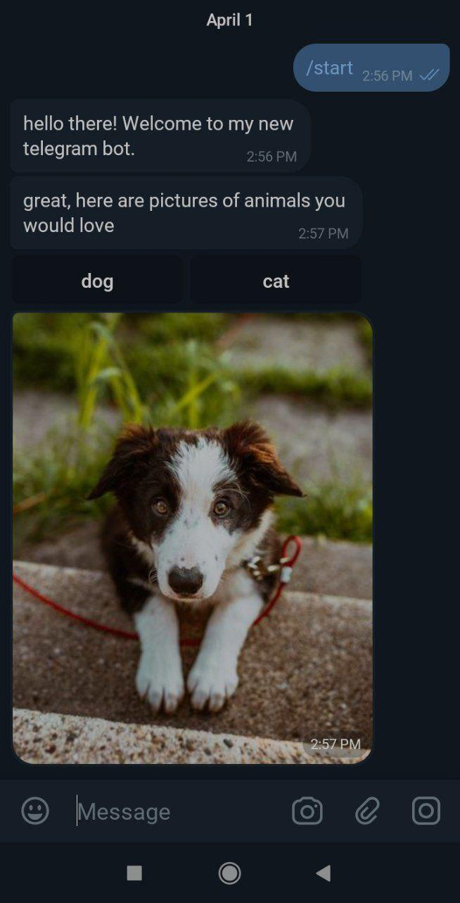
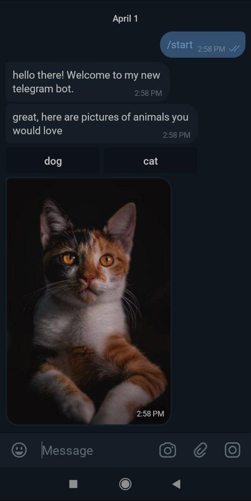

# Building your first Telegram bot in Node.js and Telegraf library 

## Introduction

What are telegram bots? Bots are third-party application accounts that run inside the Telegram application. Users can interact with bots by sending them messages, commands, and inline requests. You control your bots using HTTPS requests from the Telegram Bot API.

Telegram bots have made it easy to automate task in telegram channels and groups. You can even build your own telegram bot to curate news or monitor cryptocurrencies trend for you. 

In this tutorial, you will learn how to build telegram bots using node.js runtime environment and telegraf library from scratch. This will act as an introduction to the Telegram bot environment that will enable you to build weather bot, vendor bots, e-commerce bot, or even dictionary bot. This tutorial will be as beginner-friendly as possible.

## Prerequisite
Before you begin this guide you’ll need the following:

1.node.js installed
2.npm installed
3.visual studio code installed
4.Commandline use knowledge
5.Telegram account


## Setting up your bot

First go to the the telegram search bar and search @botfather(this is a special telegram bot that controls all others).We are going to use this to get a token for our new bot.

There are several commands associated with @botfather , we are going to start with /newbot then provide the desired name for the bot. The name must always end with 'bot'. Now that we have the token we can write the code.


## The coding
Lets first create a folder for our new project e.g myfirstbot. Open the commandline and navigate to the folder. Initialize the project by running the following commands to install telegraf.

```bash
$npm init
$npm install telegraf

```

 Create a javascript file app.js 
 
```javascript

 const Telegraf = require('telegraf');

 const bot = new Telegraf('insert_bot_token_here');

```  

Lets write a simple script that will welcome us every time we start the bot.
```javascript

bot.command('start', ctx => {
console.log(ctx.from)
bot.telegram.sendMessage(ctx.chat.id, 'hello there! Welcome to my new telegram bot.', {

})
})
```

To make it more interesting lets write a code that shows you images of animals when you click inline keyboard buttons. Create a res folder and add images into it.

```javascript

bot.hears('animals', ctx => {
    console.log(ctx.from)
    let animalMessage = `great, here are pictures of animals you would love`;
    ctx.deleteMessage();
    bot.telegram.sendMessage(ctx.chat.id, animalMessage, {
        reply_markup: {
            inline_keyboard: [
                [
                    { text: "dog", callback_data: 'dog' },
                    { text: "cat", callback_data: 'cat' }
                ],

            ]
        }
    })
})

bot.action('dog', ctx => {
    bot.telegram.sendPhoto(ctx.chat.id, { source: "res/dog.jpeg" })

})

bot.action('cat', ctx => {
        bot.telegram.sendPhoto(ctx.chat.id, { source: "res/cat.jpeg" })

    })

bot.launch();

```


## Using the bot

We have successfully written two blocks of codes, one thats welcomes you when you start the bot and the other sends you images when you click inline keyboard buttons. 

Run the bot in the terminal and then go to the telegram search bar and search the name of your bot.

```javascript

$node app.js

```

Here are the results from telegram.






## Summary

In this article we have gone through how to get your telegram bot token, setting up your environment and writing a simple bot for displaying imagesof animals using inline keyboard feature.

Follow this series of articles over the coming days as we will code bots that have more functionality.

happy coding and stay safe!


