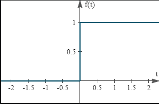
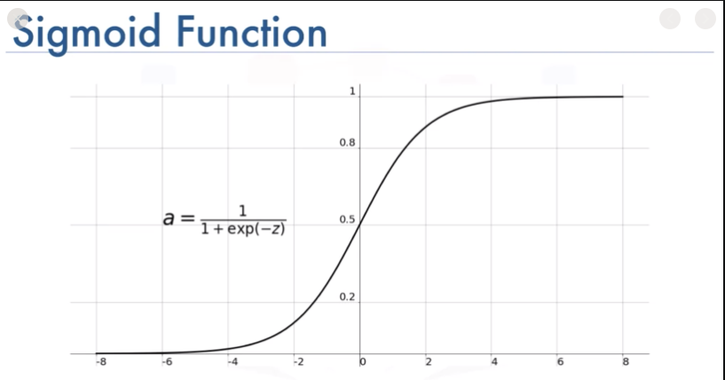
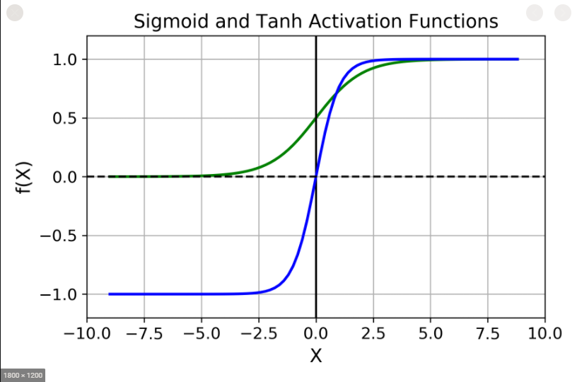
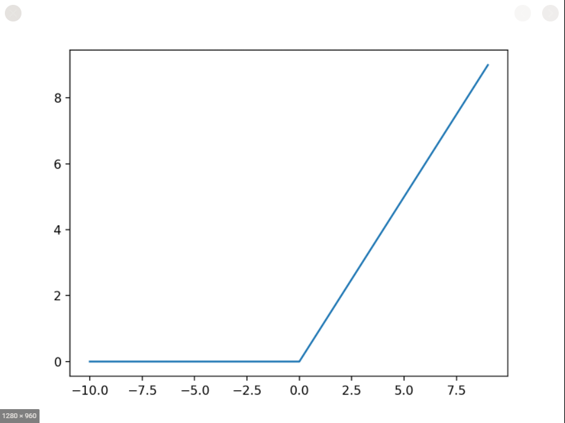
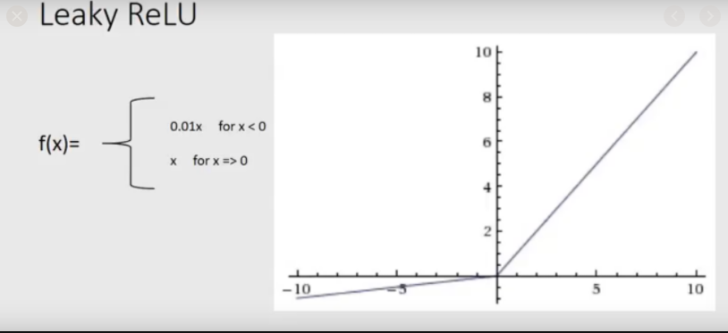

### Activation Functions

In the earlier article on [perceptron](engineering-education/perceptron-algorithm/), we looked at the concept of the weighted sum and thresholding. The output was passed through a threshold function, which blocked all the negative values from passing. The disadvantage with the use of a unit step function is that it is not continuous. Therefore, weight updation is not done efficiently. Thus, several activation functions were introduced to ensure better generalization of the models. 

This tutorial will look at some of the activation functions used frequently and implement them from scratch. Since this is an article on activation functions, we will code each of them using Python Classes. We will make use of these classes in the upcoming articles.  

### What are activation functions?

The datasets that we work with are usually non-linear. The decision boundaries are non-linear most of the time. A perceptron model without the threshold function is just a linear shift and scale operation performed on the inputs. To model the non-linear datasets, one needs to add a layer of nonlinearity. Therefore activation functions introduce nonlinearity to better model the information. The universal approximation theorem states that if a neural network has more than 2 non-linear layers, it can model any input irrespective of its nonlinearity degree. 

### Why have so many activation functions?

The reason for introducing the various activation functions is to reduce the computational load and improve the computation of gradients during gradient computation. Back-propagation is the algorithm that introduced making small changes in the weights according to minimize the error. This idea works well in theory, but computing the gradients and finding the global minimum is a computationally challenging task. There are many optimization techniques, such as gradient-based techniques, meta-heuristic optimization algorithms, etc. These activation functions are used with gradient descent optimization algorithms. 

### Activation functions

Let us list some of the activation functions that we will be covering in this tutorial:
1. Step activation function
2. Sigmoid activation function
3. Softmax activation function
4. Hyperbolic Tangent activation function
5. Rectified Linear Unit (ReLU) activation function
6. Leaky ReLU activation function

#### Step activation function

The step activation function, as discussed in the perceptron algorithm, is shown below. It is discontinuous, and therefore, the gradient computations are erroneous at points of discontinuity.  


[*Image Source*](https://www.google.com/url?sa=i&url=https%3A%2F%2Fwww.intmath.com%2Flaplace-transformation%2F1a-unit-step-functions-definition.php&psig=AOvVaw1XjHjFjI93-cSbYQYy1jYq&ust=1606899070976000&source=images&cd=vfe&ved=0CA0QjhxqFwoTCMCuo-G0rO0CFQAAAAAdAAAAABAD)

For a more in-depth discussion on the step function, refer to my previous article on [perceptrons](/engineering-education/perceptron-algorithm/).

#### Sigmoid activation function

Step functions are not as informative as we would like to be due to the discontinuity present at 0. During training and optimizing networks, the step function gathers minimal information from the training data and therefore is of no use. The sigmoid function represents the same range and is a continuous variant of the step function. It is given by the formula below:

$$ sigmoid(x) = \frac{1}{1+\exp(-x)} $$


[*Image Source*](https://www.google.com/url?sa=i&url=https%3A%2F%2Fmedium.com%2F%40toprak.mhmt%2Factivation-functions-for-deep-learning-13d8b9b20e&psig=AOvVaw1LlfJR-_qjbU6wAMK-Rnzf&ust=1606899316672000&source=images&cd=vfe&ved=0CA0QjhxqFwoTCPDwncy0rO0CFQAAAAAdAAAAABAD)

This function works very well with shallow neural network architectures. However, for deeper neural architectures, it is replaced with the Rectified Linear Unit activation function.

##### Code

```py
import numpy as np

class Sigmoid():
    def __call__(self, x):
        return 1 / (1 + np.exp(-x))

```

#### Softmax activation function

Softmax is an activation function that stems from logistic regression. Logistic regression is a classification algorithm where the outputs are numbers. The class that outputs the largest number is denoted as the output class. However, if two numbers are 400 and 500, can we confidently say that the class with output 500 is the target? There is a chance that 400 could also be the output. 

To avoid such confusion, softmax outputs the probability distribution of the class outputs. Moreover, we can think of it as a squeeze function. If the output is small, then it makes it as close to 0. On the other hand, if the output is relatively large, it increases the output probability to the neighborhood of 1.

Mathematically it is given as:

$$ softmax(x) = \frac{\exp(x)}{\sum_{i=0}^n \exp(x_i) } $$


[*Image Source*](https://www.researchgate.net/figure/Softmax-activation-function_fig2_319121953) 

##### Code

```py
import numpy as np

class Softmax():
    def __call__(self, x):
        e_x = np.exp(x - np.max(x, axis=-1, keepdims=True))
        return e_x / np.sum(e_x, axis=-1, keepdims=True)
```
#### Hyperbolic tangent activation function

This is similar to the sigmoid activation function, except for the range of output values. The range of sigmoid output is $[0,1]$. The range of the tanH function is $[-1,1]$. The distinction between tanH and sigmoid is visible in the image shown below.



[*Image Source*](https://debuggercafe.com/activation-functions-in-neural-networks/)

Mathematically, it is given by the following equation:

$$ tanH(x) = \frac{2}{1+\exp(-2*x)}$$

For more information on the mathematical formula to represent tanH, visit the following [link](https://mathworld.wolfram.com/HyperbolicTangent.html).
##### Code

```py
import numpy as np

class TanH():
    def __call__(self, x):
        return 2 / (1 + np.exp(-2*x)) - 1

```
#### Rectified Linear Unit activation function

ReLU is one of the most widely used activation functions today. We will understand the elegance of this function. Overall it allows positive values to pass through and stops negative values. It is linear in the domain $(0,\infty]$. 

The first question that one must ask is how a non-continuous linear function is introducing nonlinearity? ReLU, when used individually, does not non-introduce linearity. But, when more than a couple of non-linear layers of ReLU is used, nonlinearity sets in. 

A more detailed explanation for the working of ReLU is given at this [link](https://machinelearningmastery.com/rectified-linear-activation-function-for-deep-learning-neural-networks/).



[*Image Source*](https://machinelearningmastery.com/rectified-linear-activation-function-for-deep-learning-neural-networks/)

Mathematically, it is given by the following equation:
$$ 
  ReLU(x)= \
    1  \text{ if $x>0$}; \
    0 \text{ otherwise}
$$
##### Code

```py
import numpy as np

class ReLU():
    def __call__(self, x):
        return np.where(x >= 0, x, 0)

```
#### Leaky Rectified Linear Unit activation function

Leaky ReLU is a modification of the Rectified Linear Unit. In ReLU, there is an absolute cutoff present at 0. Any value less than zero is discarded. In leaky ReLU, the positive values are passed through. The negative values are multiplied by a constant between 0 and 1 and then passed through. This way, only a fraction of the negative values are passed through, thus striking a balance between gradient computations and information loss.



[*Image Source*](https://towardsdatascience.com/activation-functions-in-neural-networks-58115cda9c96)

##### Code

```py
import numpy as np

class LeakyReLU():
    def __init__(self, alpha=0.2):
        self.alpha = alpha

    def __call__(self, x):
        return np.where(x >= 0, x, self.alpha * x)
```

### Conclusion

In this article, we have looked at some of the most frequently used activation functions. The code given is a blueprint for these activation functions. We will make use of these blueprints in the upcoming articles to come. 