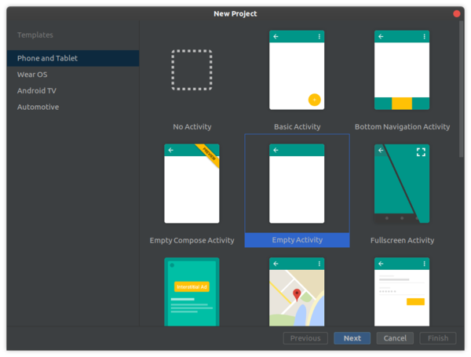

### Android notifications
A notification is a message widget that is displayed outside the application's user interface. When a notification is issued, it appears as an icon in the notification area. To view the details of the notification, the user opens the notification drawer.

### Prerequisites
1. [Android Studio](https://developer.android.com/studio) installed on your computer.
2. Some knowledge of [Kotlin](https://kotlinlang.org/docs/home.html) programming language.
3. Some knowledge of [Android](https://kotlinlang.org/docs/android-overview.html) app development.

### Application setup
Start android studio and create a new android project with an empty activity template. 



### Creating and Sending Notifications
**Basic notification**
- Create a function with the name `basicNotification`.
- The function created above should have the code snippets below. The function creates a basic notification with an icon, title, and notification content.

```Kotlin
    private fun basicNotification() {
        val builder = NotificationCompat.Builder(this, CHANNEL_ID)
            .setSmallIcon(R.mipmap.ic_launcher)
            .setContentTitle("Test notification")
            .setContentText("Test Notification body")
            .setPriority(NotificationCompat.PRIORITY_DEFAULT)
        with(NotificationManagerCompat.from(this)) {
            notify(notificationId, builder.build())
        }
    }
```
From the above code snippet:-
- `NotificationCompat.Builder(this, CHANNEL_ID)` takes in the context and the channel id. Channel id is required for notifications to work on android 8.0  and later versions, channel id is used to manage notifications on the later android versions.
- `setSmallIcon(R.drawable.notification_icon)` sets the notification icon that appears on the notification drawer.
- `setContentTitle(textTitle)` sets the title of the notification that is shown on the notification drawer.
- `setContentText(textContent)` sets the body of the notification.
- `setPriority(NotificationCompat.PRIORITY_DEFAULT)` sets how the android system will notify the user of the notification based on the priority set, it works on android 7.0 and below.
- The code snippet below creates and shows the notification in the systems notification drawer.
  ```kotlin
  with(NotificationManagerCompat.from(this)) {
            notify(notificationId, builder.build())
        }
    ``` 
  
**Pending intent notification**
It is possible to add an intent to a notification such that whenever a user clicks on the notification it opens up an activity or fragment from a pending intent.
To create a notification with a pending intent, create a function with the name `pendingNotification` in the `MainActivity.kt` and add the code snippet below.

```kotlin
    private fun pendingNotification() {
        val intent = Intent(this, MainActivity::class.java).apply {
            flags = Intent.FLAG_ACTIVITY_NEW_TASK or Intent.FLAG_ACTIVITY_CLEAR_TASK
        }
        val pendingIntent: PendingIntent = PendingIntent.getActivity(this, 0, intent, 0)

        val builder = NotificationCompat.Builder(this, CHANNEL_ID)
            .setSmallIcon(R.mipmap.ic_launcher)
            .setContentTitle("My notification")
            .setContentText("Hello World!")
            .setPriority(NotificationCompat.PRIORITY_DEFAULT)
            .setContentIntent(pendingIntent)
            .setAutoCancel(true)
        with(NotificationManagerCompat.from(this)) {
            notify(notificationId, builder.build())
        }
    }
```

- `val intent = Intent(this, MainActivity::class.java).apply {
            flags = Intent.FLAG_ACTIVITY_NEW_TASK or Intent.FLAG_ACTIVITY_CLEAR_TASK
        }` creates a pending intent that gets executed whenever the notification is clicked.
- `.setContentIntent(pendingIntent)` attaches the pending intent created to the notification, this makes it possible for the notification to handle the pending intent operation.

**Notification with action button**
Android system makes it possible to perform certain operations through notification action buttons i.e receive an incoming call, snooze an alarm through the notification buttons.
Notification actions were introduced with Android version 5.0, that's the reason why we will annotate the function `actionNotification` with `@RequiresApi(Build.VERSION_CODES.O)` annotation.
Create a function with the name `actionNotification` and add the code snippets below.

```kotlin
    @RequiresApi(Build.VERSION_CODES.O)
    private fun actionsNotification() {
        val snoozeIntent = Intent(this, MyBroadCastReceiver::class.java).apply {
            action = "snooze"
            putExtra(EXTRA_NOTIFICATION_ID, 0)
        }
        val snoozePendingIntent: PendingIntent =
            PendingIntent.getBroadcast(this, 0, snoozeIntent, 0)
        val builder = NotificationCompat.Builder(this, CHANNEL_ID)
            .setSmallIcon(R.mipmap.ic_launcher)
            .setContentTitle("My notification")
            .setContentText("Hello World!")
            .setPriority(NotificationCompat.PRIORITY_DEFAULT)
            .setContentIntent(snoozePendingIntent)
            .addAction(
                R.drawable.ic_baseline_alarm_off_24, "Snooze",
                snoozePendingIntent
            )
        with(NotificationManagerCompat.from(this)) {
            notify(notificationId, builder.build())
        }
    }
```
To perform an action from the notification, we will create a new kotlin class with the name `MyBroadCastReceiver`. `MyBroadCastReceiver` class extends the `BroadCastReceiver` interface and implements the `onReceive()` method of the `BroadCastReceiver`interface.

**Notification channel**
Android version 8.0 and later versions require the notification channel for notification to be displayed on the notifications drawer. It is through notification channels that the android operating system manages notifications.
Create a function with the name `createNotificationChannel()` in the `MainActivity` and add the code snippets below.

```kotlin
 private fun createNotificationChannel() {
        if (Build.VERSION.SDK_INT >= Build.VERSION_CODES.O) {
            val name = "test_notification"
            val descriptionText = "test_notification_description"
            val importance = NotificationManager.IMPORTANCE_DEFAULT
            val channel = NotificationChannel(CHANNEL_ID, name, importance).apply {
                description = descriptionText
            }
            val notificationManager: NotificationManager =
                    getSystemService(Context.NOTIFICATION_SERVICE) as NotificationManager
            notificationManager.createNotificationChannel(channel)
        }
    }
```
**BroadCastReceiver**

In the project package, create a kotlin class with the name `MyBroadCastReceiver` and add the code snippets below.

```kotlin
import android.content.BroadcastReceiver
import android.content.Context
import android.content.Intent

class MyBroadCastReceiver : BroadcastReceiver() {
    override fun onReceive(context: Context?, intent: Intent?) {
        //Action to be perfomed placed here
        context?.startActivity(intent)
    }

}
```

In the `oncreate()` function of the `MainActivity` add the code snippet below.
```kotlin
 override fun onCreate(savedInstanceState: Bundle?) {
        super.onCreate(savedInstanceState)
        setContentView(R.layout.activity_main)
        createNotificationChannel()
        btnShowNotification = findViewById(R.id.btnShowNotification)
        btnShowPendingNotification = findViewById(R.id.btnShowPendingNotification)
        btnShowActionNotification = findViewById(R.id.btnShowActionNotification)

        btnShowNotification.setOnClickListener {
            basicNotification()
        }
        btnShowPendingNotification.setOnClickListener {
            pendingNotification()
        }

        btnShowActionNotification.setOnClickListener {
            //Checks the android version
            if (Build.VERSION.SDK_INT >= Build.VERSION_CODES.O) {
                actionsNotification()
            }
        }
    }
```
**User interface**
In the `activity_main.xml` file add the code snippet below. There are three buttons in the XML design below. The first button fires up the basic notification, the second button fires up the pending intent notification, and the last button fires the action button notification.

```xml
<?xml version="1.0" encoding="utf-8"?>
<androidx.constraintlayout.widget.ConstraintLayout 
    xmlns:android="http://schemas.android.com/apk/res/android"
    xmlns:app="http://schemas.android.com/apk/res-auto"
    xmlns:tools="http://schemas.android.com/tools"
    android:layout_width="match_parent"
    android:layout_height="match_parent"
    tools:context=".MainActivity">

    <Button
        android:id="@+id/btnShowNotification"
        android:layout_width="wrap_content"
        android:layout_height="wrap_content"
        android:text="Show Basic Notification"
        app:layout_constraintBottom_toTopOf="@+id/btnShowPendingNotification"
        app:layout_constraintEnd_toEndOf="parent"
        app:layout_constraintStart_toStartOf="parent"
        app:layout_constraintTop_toTopOf="parent" />

    <Button
        android:id="@+id/btnShowPendingNotification"
        android:layout_width="wrap_content"
        android:layout_height="wrap_content"
        android:text="Show Pending Intent Notification"
        app:layout_constraintBottom_toTopOf="@+id/btnShowActionNotification"
        app:layout_constraintEnd_toEndOf="parent"
        app:layout_constraintStart_toStartOf="parent"
        app:layout_constraintTop_toBottomOf="@+id/btnShowNotification" />

    <Button
        android:id="@+id/btnShowActionNotification"
        android:layout_width="wrap_content"
        android:layout_height="wrap_content"
        android:text="Show Action Notification"
        app:layout_constraintBottom_toBottomOf="parent"
        app:layout_constraintEnd_toEndOf="parent"
        app:layout_constraintStart_toStartOf="parent"
        app:layout_constraintTop_toBottomOf="@+id/btnShowPendingNotification" />
</androidx.constraintlayout.widget.ConstraintLayout>
```

### Conclusion.
Now that you understand how notifications work, implement a push notification using firebase cloud messaging. Full source code for the application we have built can be downloaded from [here](https://github.com/paulodhiambo/Notification). To read more on the notification anatomy visit [android documentation](https://developer.android.com/guide/topics/ui/notifiers/notifications#Templates).

Happy coding

Peer Review Contributions by: [Miller Juma](/engineering-education/authors/miller-juma/)