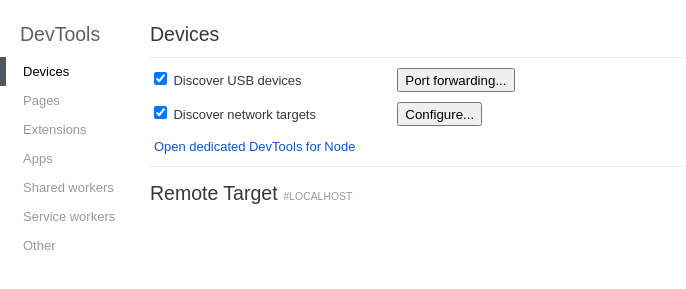
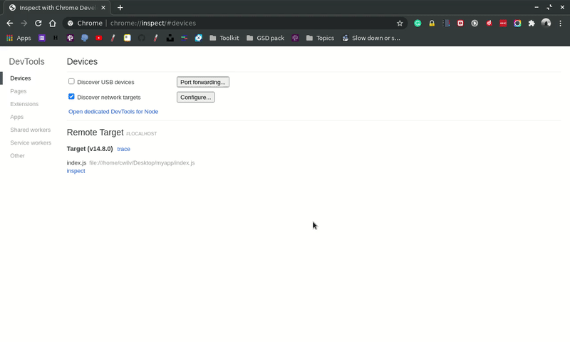
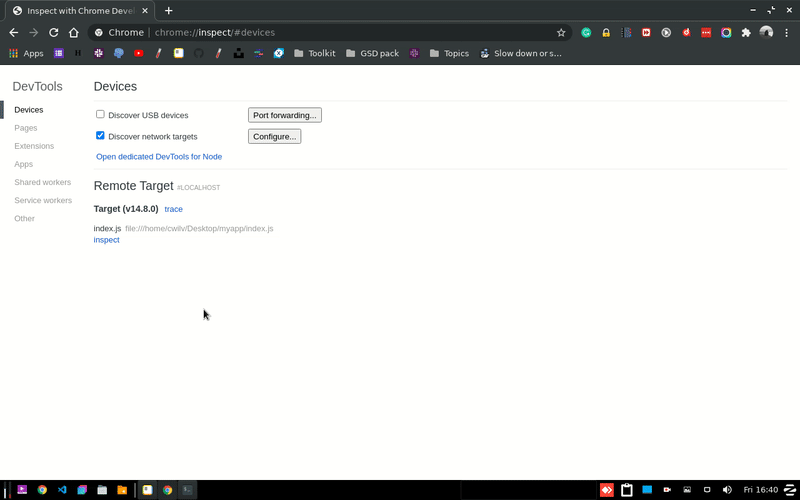
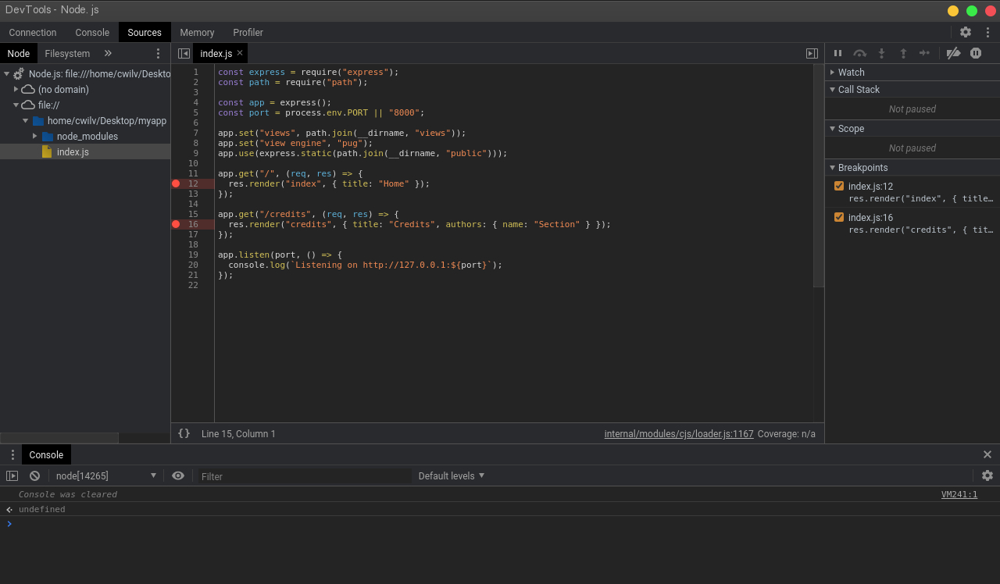
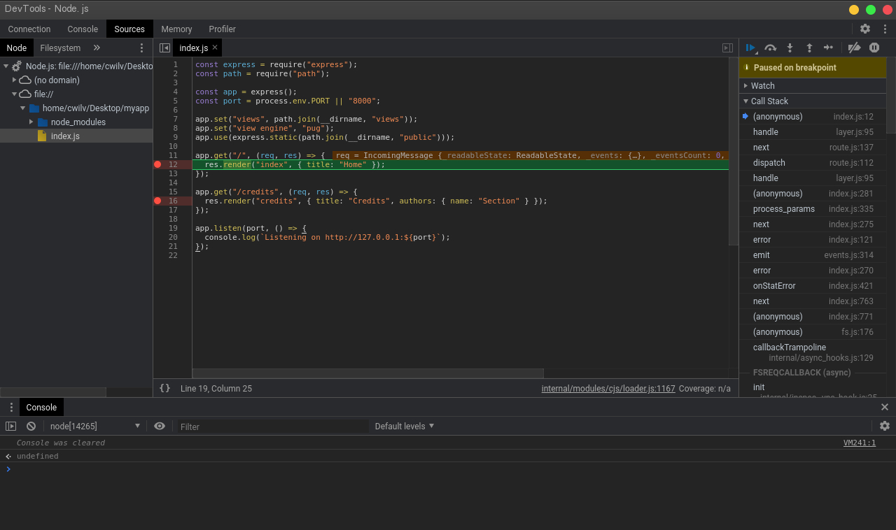
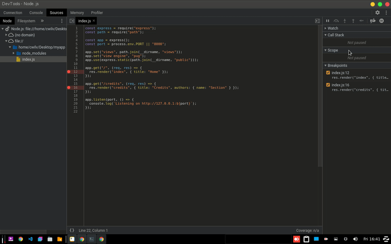

Node.js is a robust technology stack with a rich ecosystem. However, debugging Node.js applications remains a difficult task, since they can fail without any error message. Using Chrome Dev Tools is a simple solution to finding errors in your code.
<!--more-->
### Introduction

Node.js is a fast, asynchronous and event driven server-side JavaScript technology. You can read [why Node.js is popular among developers](https://www.section.io/engineering-education/why-node-js-is-popular/). 

A debugger is a program that is used to inspect a program as it runs. It enables running the code line-by-line and following the execution process. In the process, you can see the code as a flow chart and logically interpret it. This enables you to find bugs more easily.

The most popular way JavaScript and Node developers track bugs in their programs is printing data to the console. They use methods like [console.log()](https://developer.mozilla.org/en-US/docs/Web/API/Console/log) and [console.debug()](https://developer.mozilla.org/en-US/docs/Web/API/Console/debug). Although these methods can be helpful, they require a lot of manual effort and are not foolproof. Suppose you have a large app, how many `console.log()` statements would you need? Hundreds, perhaps. 

Logging sensitive information can occur, exposing your app to malicious exploitations and data breaches. Debuggers come handy in a situation like this. They help track bugs without exposing your app to security threats.

Sometimes Node.js apps can fail without error messages. This occurs mainly in cases where [error handling](https://nodejs.dev/learn/error-handling-in-nodejs) is not employed. Debuggers can watch behaviors of specific objects throughout program execution by adding breakpoints in a program. Breakpoints are points in your code where you pause execution and examine various factors. By watching objects, you can evaluate their values and type as the execution goes on. 

Although Node comes with a [built-in debugger](https://nodejs.org/api/debugger.html), it's not as flexible. It is a CLI-based debugger where typing things is not an option. Google Chrome DevTools is a non-CLI debugger alternative. It requires no additional installation if you are using a Chromium-based browser like Google Chrome, Chromium and Microsoft Edge, etc. 

## The Setup

Install a Chromium-based browser if you haven't already. You can download Google Chrome [here](https://www.google.com/chrome/).

### On the command line

Run your Node app with the `inspect flag` like this: `node --inspect <filename>`. Example: 

```bash
$ node --inspect server.js
```
 Running your app with the `--inspect` flag allows third-party debuggers to attach to your app and access all the app files. 

You should have an output like this:

```bash
Debugger listening on ws://127.0.0.1:9229/31dc8b93-3f2c-4352-aa7b-e9357bbabccc
For help, see: https://nodejs.org/en/docs/inspector
Listening on http://127.0.0.1:8000
```

### Debugging a remote app 

If you want to debug your remote in your browser, it's recommended to use SSH tunnels. By doing this, I assume that you understand the security risks associated with allowing remote access to privileged services. Unauthorized database access, website defacement and phishing attacks are some of these risks. 

Let's say that your app is running on remote machine `remote.machine.com`, run it with the inspect flag in your remote machine . `node --inspect <filename>`

Setup an SSH tunnel to connect to your remote machine. On your local machine, run:

```bash
$ ssh -L 9221:localhost:9229 user@remote.machine.com
```

The port 9221 on your local machine will be forwarded to port 9229 on `remote.machine.com`.  You can change the local port if it's occupied by another process. 

**Note**: When running an app in debug mode, security should be considered. Exposing the debug port poses security threats to your app. By default, 127.0.0.1:9229 is the debug port. If the debugger is bound to a **public** address, any client reaching your IP address can connect to it without any restriction. At that point, your code, data, and device are at risk.

### Debugger in action

Open your browser and open the URL: `chrome://inspect`. If you are using Microsoft Edge, `edge://inspect` will open the same page.  The page looks something like this:



If you are debugging a remote app, after setting up an SSH tunnel, you need to add your local port to discoverable targets. To do this, make sure the **Discover network targets** checkbox is checked. Click the **Configure...** button and add your IP address and port. 



To open DevTools dedicated to Node.js debugging, click **Open dedicated DevTools for Node** .



To debug your app, navigate to the **Sources** tab. This is where you will be editing your code. Expand the file tree on the left and click the file you want to debug. The selected file opens in the central part of the sources tab. You can open multiple files for debugging. 

> **Note:** Editing code in DevTools does not change your local or remote files. To make permanent changes you must edit you local or remote files.

Add breakpoints to your code by clicking on the left side of the line number. Once set, a red dot will appear on those lines. On the right panel in the **Sources** tab,  you can watch objects and activate/deactivate breakpoints. To watch a variable, add a variable defined in your code in the **Watch** pane. In the **Scope** pane, you can view the local and global variables currently defined. 



To step through your code, navigate to the app URL and refresh the app. You can also open the URL in a new window. On hitting the reload button, the DevTools window comes into focus. If it doesn't, you can navigate to the DevTools window manually. You can also restart the app instance on a terminal using the `curl` command. Open a **new** terminal or tab and run:

```bash
$ curl http://127.0.0.1:8000
```  



If you want to run some JavaScript code on the built-in JavaScript console, press `Esc` to open the console, or open the **Console** tab in DevTools.




The debugger pauses on your breakpoints while printing to the console, watch, call stack, and scope panes. You can resume code execution using the resume button right above the **Watch** pane. 

### Conclusion

We have looked at how you can debug a local and remote app using Chrome DevTools. In DevTools, you can observe variable changes and track bugs more easily without printing to the console through watch variables and breakpoints.  This also helps prevent security loopholes. By not logging sensitive data, data breaches and hacking can't occur.

Alteratively, if you'd like to debug a Node.js app straight from Visual Studio Code, check out the following page:

[**Debugging a Node.js app in VS Code** ](https://www.section.io/engineering-education/debug-nodejs-vscode/)
