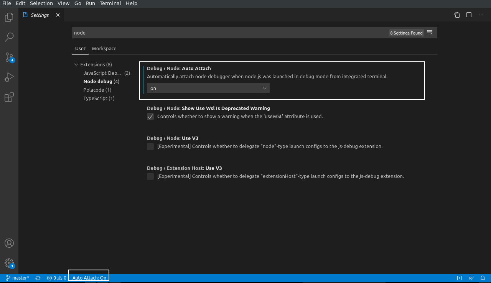
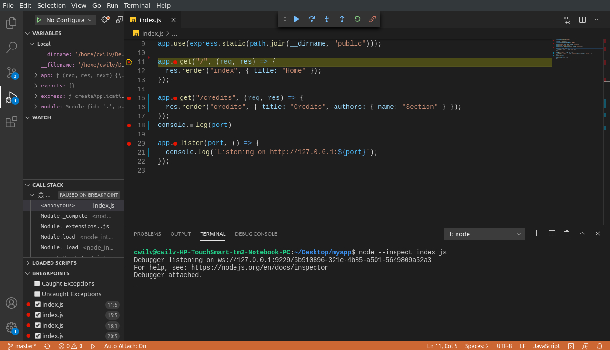
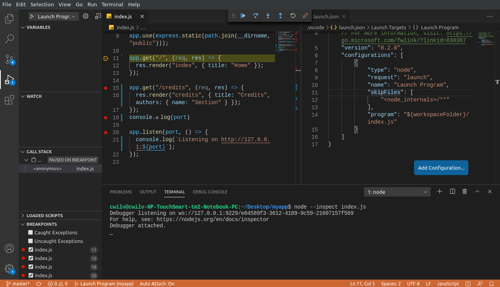
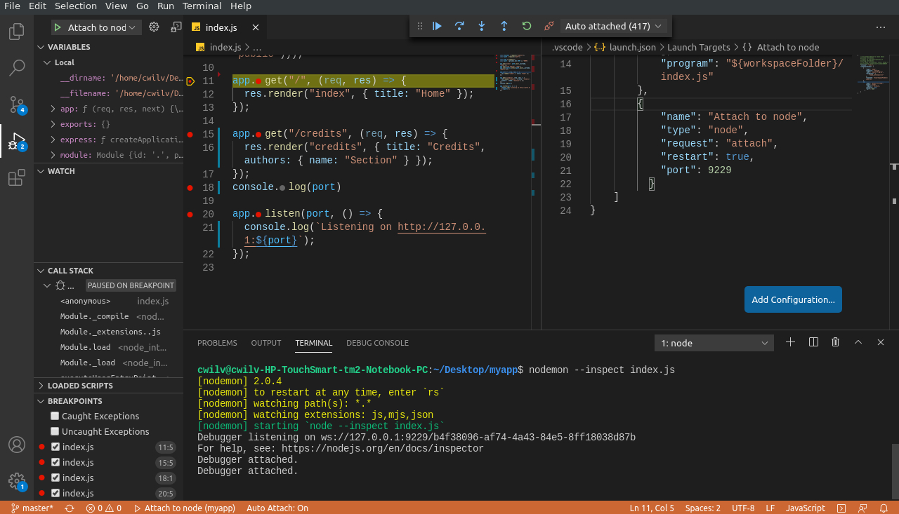


## Debugging a Node.Js app in VS Code.

Debugging node.js code is quite a problem for many people. It always includes putting `console.log`s at every corner in your code. But, what if I tell you there is a simpler method? We will be looking at how you can use VS Code to debug a node application.

### Meet the savior

[Visual Studio Code](https://code.visualstudio.com/) (VS Code) is a code editor made by Microsoft. It is used by developers worldwide due to the many tools and features it offers. Its features can be further enhanced by the use of extensions. VS Code can be used to debug many languages eg. Python, JavaScript, etc. It has made debugging Node.js apps a very simple and straight forward process. Before proceeding, make sure you have VS code installed on your computer. If not, download the latest version from [here](https://code.visualstudio.com/download). 

### The Setup

I will assume you have VS Code installed by now. If you haven't, install using this [link](https://code.visualstudio.com/download). Now we are ready to start the setup.

Open the Settings by pressing `CTRL+,`. You can also open the Command Pallete (`Ctrl+Shift+P`) and type **Preferences: Open Settings(UI)**.  In the search box, type in "node". On the left side under **Extensions**, click **Node debug**. Look for **Debug > Node: Auto Attach**. It is set to **disabled** by default. Click it and set it to **on**. This will always be enabled for Node.js applications from now on. You can look for  **Auto Attach: On** statement at the bottom blue bar in VS Code to confirm.  



Open the Node.js file you want to debug and set some breakpoints. Do this by clicking on the left side of the line numbers where you would like your code to stop. A red dot will appear when a breakpoint has been set. Breakpoints will aid at identifying the line or region your code is failing. You can place them in between suspected regions or randomly if you have no idea where the bug is hiding. Open the debug panel by clicking the bug icon on the activity bar. You can also press `Ctrl+Shift+D` to open the same.

### Debugging without configurations.
 If no prior configurations had been made, there are 2 tabs in the debug panel. **Run** and **Breakpoints**. In the "Breakpoints" panel you can activate and deactivate your breakpoints using the checkboxes.  In the "Run" tab,  there are 2 options, **Run and Debug** and **Node.js Debug Terminal**. Click "Node.js Debug Terminal" to open the in-built terminal. Switch to the debug console using`Ctrl+Shift+Y` or by pressing "Debug Console".  This is where you will view the debug logs. To start the debugging process, press the **Run and Debug** button on the debug panel and select node.js if prompted. You can also run the app on a terminal using the `--inspect` flag like this  `node --inspect <filename>`.
 

 
### Debugging with configurations.
Press **create a launch.json** and select node.js in the prompt to create a launch.json configurations file. You can also create via **Run**>**Add Configuration** and selecting Node.js. By default, it contains the following content:
```json
{
	// Use IntelliSense to learn about possible attributes.
	// Hover to view descriptions of existing attributes.
	// For more information, visit: https://go.microsoft.com/fwlink/?linkid=830387
	"version": "0.2.0",
	"configurations": [
		{
			"type": "node",
			"request": "launch",
			"name": "Launch Program",
			"skipFiles": [
				"<node_internals>/**"
			],
			"program": "${workspaceFolder}/<your opened file>"
		}
	]
}
``` 
You can add more configurations via the floating "Add configuration" button. You can learn about the different options available, [here](https://code.visualstudio.com/docs/nodejs/nodejs-debugging/#_launch-configurations-for-common-scenarios). The configurations tell VS Code how to handle debugging. Then run the app in a terminal using the `--inspect` flag like this  `node --inspect <filename>`. Example:`node --inspect server.js`. You can also start the debugger by pressing `F5`.



### Debug with [Nodemon](https://nodemon.io/)

Nodemon is a tool that auto-reloads the server and re-attaches the debugger after you make changes to your app. You can install it via npm using `npm i nodemon`. Then add the following under configurations in your launch.json.

```json
{
  "name": "Attach to node",
  "type": "node",
  "request": "attach",
  "restart": true,
  "port": 9229
}
```
You can then launch your app normally replacing `node` with `nodemon`. Example: `nodemon --inspect <filename>`. If you get this error: `nodemon: command not found`, it means nodemon was not installed properly. Try using this: `sudo npm install -g --force nodemon`. It worked in my case. If you are using Windows `npm i -g nodemon` should work. Edit and save your app to see nodemon in action. You can then continue with the debugging process below.
For more on using nodemon and VS Code, click [here](https://code.visualstudio.com/docs/nodejs/nodejs-debugging/#_restarting-debug-sessions-automatically-when-source-is-edited).



### The debugger in action

 The terminal prints some lines along with "`Debugger Attached`". The bottom blue bar color in VS Code turns to orange after the debugger is attached to your app. There also appears a floating button with play/pause, restart, and stop at the top center in VS Code. The debugger pauses at the first breakpoint. You can follow through and resume the process using the play button. The debugger prints all `console.log`s in your code to the debug console. If the app breaks the logs will be shown in the debug console. 
 
### Conclusion

In this article, we have looked at how you can debug your misbehaving Node.js app without hassle using VS Code. VS Code comes in handy especially if you don't like to switch between programs and windows. From now on I hope it won't be a problem debugging node apps, especially if you are a VS Code user. **Node: Auto Attach** saves us a lot, right?

