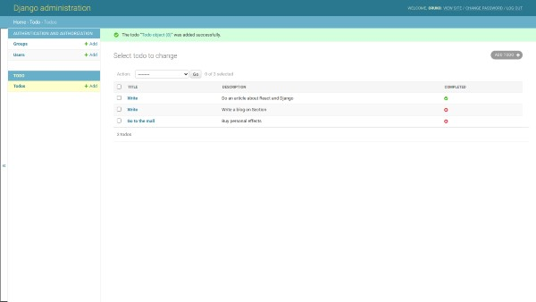
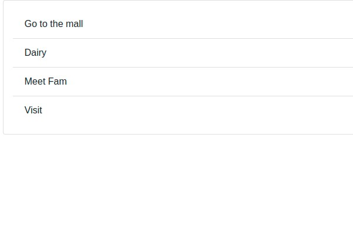

In this article, we build a Todo application using React and Django. [React](https://reactjs.org/) is a JavaScript framework for building painless interactive UIs. [Django](https://www.djangoproject.com/) is a powerful web framework that is used to develop web applications. It is well termed as the web framework for perfectionists with deadlines.

We are going to create an application that consumes [React](https://reactjs.org/) for the user interface and [Django](https://www.djangoproject.com/) for the API of our application using Django REST framework(DRF).

### Prerequisites

Basic knowledge of `React`, `Python(Django)` is required but I'll be able to try and boil things down as possible.

You can check out these articles to get started with React and Python:

- [Introduction to React](https://www.freecodecamp.org/news/react-introduction-for-people-who-know-just-enough-jquery-to-get-by-2019-version-28a4b4316d1a/)

- [Django Tutorials](https://realpython.com/tutorials/django/)

Before getting our hands dirty, you may need to:

1. [Install Python 3](https://www.python.org/downloads/)

2. [Install Node.js](https://nodejs.org/en/download/)

### Step 1: Backend using Django

From a terminal create a new project directory called `django-react-todoApp`

```bash
mkdir django-react-todoApp
cd django-react-todoApp
```

We must have a virtual environment activated to be able to install django. Let's create a virtual environment and activate it:

```bash
pip install pipenv
pipenv shell
```

Install django and create a project named `backend`:

```bash
pipenv install django
django-admin startproject backend
```

Now that we have created our project, let's go ahead and create an application called `todo` and migrate the models into the database.

If everything works you should see the "Congratulations" page from Django.

Navigate to `backend/settings.py` and add `todo` to the list of `INSTALLED_APPS`

```python
# backend/settings.py

INSTALLED_APPS = [
    'django.contrib.admin',
    'django.contrib.auth',
    'django.contrib.contenttypes',
    'django.contrib.sessions',
    'django.contrib.messages',
    'django.contrib.staticfiles',
    'todo', # Add this
]
```

Let's create a model to specify the Todo item fields. Modify `todo/models.py` as follows:

```python
# todo/models.py
from django.db import models
#create your models here.

# add this
class Todo(models.Model):
   title = models.CharField(max_length=100)
   description = models.TextField()
   completed = models.BooleanField(default=False)

   def _str_(self):
     return self.title
```

The model contains:

- Title: What the task is.

- Description: Give more explanation about a particular task.

- Completed: Completed is the status of a task; either completed or not completed.

We need to tell Django which attribute to use by default when it displays information about Todo. Django calls a `_str_()` method to display a simple representation of a model. Here we've defined a `_str_()` method that returns the string stored in the `title` attribute.

Let us run migrations to add our model to the database schema.

```bash
python manage.py makemigrations todo
python manage.py migrate todo
```

Django comes with a built-in admin interface. With Django's admin we can authenticate users, display and handle forms automatically. It reads data from our models to provide a quick interface where trusted users can manage content on your site.

We can add models to our Admin page using the `admin.site.register()` functions. In the todo app's `admin.py`, let's add the model to our admin page.

```python
# todo/admin.py

from django.contrib import admin
from .models import Todo # add this

class TodoAdmin(admin.ModelAdmin):
  list = ('title', 'description', 'completed')

  # Register your models here
  admin.site.register(Todo, TodoAdmin)
```

Let's create a superuser for the admin page to login.

```bash
python manage.py createsuperuser
```

This will prompt you to enter the `username`, `email`, `password`, `password(again)`. We can open the admin page using the following link `http://localhost:8000/admin`

```bash
python manage.py runserver
```


We can now add and delete items from the admin page. Great!



### Step 2: Putting in the APIs

You can learn more about APIs in this amazing [article](https://www.section.io/engineering-education/rest-api/)

Install the `djangorestframework` and `django-cors-headers`:

```bash
pipenv install djangorestframework django-cors-headers
```

Add `rest_framework` and `corsheaders` to the `INSTALLED_APPS` in `backend/settings.py` file and modifiy the `MIDDLEWARE`:

```python
INSTALLED_APPS = [
    'django.contrib.admin',
    'django.contrib.auth',
    'django.contrib.contenttypes',
    'django.contrib.sessions',
    'django.contrib.messages',
    'django.contrib.staticfiles',
    'todo',
    'corsheaders', # add this
    'rest_framework', # add this
]

MIDDLEWARE = [
    'corsheaders.middleware.CorsMiddleware', # add this
    'django.middleware.security.SecurityMiddleware',
    'django.contrib.sessions.middleware.SessionMiddleware',
    'django.middleware.common.CommonMiddleware',
    'django.middleware.csrf.CsrfViewMiddleware',
    'django.contrib.auth.middleware.AuthenticationMiddleware',
    'django.contrib.messages.middleware.MessageMiddleware',
    'django.middleware.clickjacking.XFrameOptionsMiddleware',
]
```

Add this code snippet in `backend/settings.py` file:

```python
CORS_ORIGIN_WHITELIST = [
    'http://localhost:3000',
]
```

Django-cors-headers helps in handling the server headers required for [Cross-origin Resource Sharing (CORS)](https://developer.mozilla.org/en-US/docs/Web/HTTP/CORS). Within the `CORS_ORIGIN_WHITELIST` , `localhost:3000` will serve as our port.

Now, Let's create a serializer file.

Serializers allow complex data such as querysets and model instances to be converted to native python dataypes that can then be easily rendered into JSON, XML, or other content types.

```bash
touch todo/serializers.py
```

Let's add this to `serializers.py` file:

```python
# todo/serializers.py

from rest_framework import serializers
from .models import Todo

class TodoSerializer(serializers.ModelSerializer):
    class Meta:
        model = Todo
        fields = ('id' ,'title', 'description', 'completed')
```

A view function takes in information from a request, prepares the data required to generate a page, then sends the data to the browser using a template that defines how the page will look like.

A `ViewSet` class is a type of class-based View, that does not provide any method handlers such as `.get()` or `.post()`.

The `ModelViewSet` is an extention of the `ViewSet`. It inherits from `GenericAPIView` which provide the `queryset` and the `serializer_class` attributes. The `queryset` has all the CRUD operations which we use to get all the instances of the model `Todo`.

Let's also update the `todo/views.py`:

```python
# todo/views.py

from django.shortcuts import render
from rest_framework import viewsets      # add this
from .serializers import TodoSerializer  # add this
from .models import Todo                 # add this

# Create your views here.

class TodoView(viewsets.ModelViewSet):   # add this
    serializer_class = TodoSerializer    # add this
    queryset = Todo.objects.all()        # add this
```


URL stand for Uniform Resource Locator. It is the address used by your server to search for the right webpage.

Making webpages in Django involves three steps: defining URLs, writing views and writing templates.

Defining URL pattern describes the way the URL is laid out and tells Django what to look for when matching a browser request with a site URL so it knows which site to return.

The body of the file defines the `urlpatterns` variable. The `urlpatterns` variable includes sets of URLs, one is the module `admin.site.urls`, which defines all the URLs that can be requested from the admin site.

In the `backend/urls.py` we define the URL routes for the API:

```python
# backend/urls.py

from django.contrib import admin
from django.urls import path,include               # add this
from rest_framework import routers                 # add this
from todo import views                             # add this

router = routers.DefaultRouter()                   # add this
router.register(r'todos', views.TodoView, 'todo')  # add this

urlpatterns = [
    path('admin/', admin.site.urls),
    path('api/', include(router.urls))             # add this
]
```

The next module is the `router.urls` which provides routing for our API.

The `router` enables  us to create the subsequent operations:

* `/todos/` - This returns a list of all the Todo items (Create and Read operations can be done here).

* `todos/id` - Returns a specific Todo using the `id` primary key.

```
python manage.py runserver
```


We have set our backend let us move forward to frontend.

### Step 3: Frontend using React

To install `create-react-app` use the following command. `-g` stands for global as we are first installing `create-react-app` globally:

```bash
npm install -g create-react-app
```

While in the parent directory - `django-react-todoApp`- create a React application, `frontend`:

```bash
create-react-app frontend
```

To start server:

```bash
cd frontend
npm start
```

You should be able to see the default React app by now.

```javascript
// frontend/src/index.js

import React from 'react';
import ReactDOM from 'react-dom';
import App from './App';
import reportWebVitals from './reportWebVitals';

ReactDOM.render(
    <App />,
    document.getElementById('root')
);

// If you want to start measuring performance in your app, pass a function
// to log results (for example: reportWebVitals(console.log))
// or send to an analytics endpoint. Learn more: https://bit.ly/CRA-vitals
reportWebVitals();
```

`ReactDOM.render()` uses a DOM node in HTML to replace it with Javascript XML (JSX).

It enable us to integrate React in every foreign application.

`ReactDOM.render()` takes two arguments. First is the JSX being rendered. Second argument specifies where React application hooks into HTML. 

It expects an element with an `id='root'`.

Substitute the below code in `src/App.js`:

```javascript 
// frontend/src/App.js

import React, { Component } from "react";

const todoItems = [
  {
    id: 1,
    title: "Go to the market",
    description: "Buy ingredients to buy supper",
    completed: true
  },

  {
    id: 2,
    title: "Study",
    description: "Read algebra and history books about the coming test",
    completed: true
  },

  {
    id: 3,
    title: "Sally's Book",
    description: "Go to the library to rent Sally's books",
    completed: true
  },

];
class App extends Component {
  constructor(props) {
    super(props);
    this.state = {todoItems};
    };
    render() {
      return (
        <div>
          {this.state.todoItems.map(item => (
            <div>
              <h1>{item.title}</h1>
              <span>{item.description}</span>
            </div>
          ))}
        </div>
      )
    }
  }
export default App;
```

We start by rendering a list of items. The list will be artificial data but later we will fetch the data from the API we created in the previous chapter.

We define the list of items, an item in the list has an `id`, `title`, `description` and status of whether the task is completed or not, `completed`.

We introduce the class constructor where we set the initial internal component state. In our case the internal state is the dummy list of items, `todoItems`.

We use the built-in JavaScript `map` functionality in our JavaScript XML (JSX). It allow us to iterate over the list of items and display them. We use the curly braces to encapsulate our item property since it evaluate Javascript expressions during compilation.

When the component file is called it calls the `render()` method by default displaying th JSX syntax.

We use [arrow functions](https://developer.mozilla.org/en/docs/Web/JavaScript/Reference/Functions/Arrow_functions) because they shorten our functions declaration.

Your User Interface should resemble the one below:


It is time to consume the API we created earlier.

```bash
cd backend
python manage.py runserver
```

We will need to modify the `frontend/package.json`:

```javascript
// frontend/package.json

[...]
"name": "frontend",
  "version": "0.1.0",
  "private": true,
  "proxy": "http://localhost:8000",   // Add this
  "dependencies": {
    "@testing-library/jest-dom": "^5.11.9",
    "@testing-library/react": "^11.2.3",
    "@testing-library/user-event": "^12.6.0",
    "react": "^17.0.1",
    "react-dom": "^17.0.1",
    "react-scripts": "4.0.1",
    "web-vitals": "^0.2.4"
  },
  [...]
```

First, lets install the bootstrap module that we will use to create a jumbotron header:

```bash
npm install --save react-bootstrap-validation
```

We then import the `Jumbotron` in our `App.js` file.

To consume our API instead of the artificial data, update the `frontend/src/App.js` with the snippet below:

```javascript
// frontend/src/App.js

import React, { Component } from "react"
import Jumbotron from 'react-bootstrap/Jumbotron' // Add this


class App extends Component {
    state = {
      todoList: []
    };

    async componentDidMount() {
      try {
        const res = await fetch('http://localhost:8000/api/todos/');
        const todoList = await res.json();
        this.setState({
          todoList
        });
      } catch (e) {
        console.log(e);
    }
    }

    render() {
      return (
        <div>
          <Jumbotron>
          <h1>Todo App</h1>
          </Jumbotron>
          {this.state.todoList.map(item => (
            <div>
              <h1>{item.title}</h1>
              <span>{item.description}</span>
            </div>
          ))}
        </div>
      )
    }
  }
  
export default App;
```

We assign our `todoList` an empty array because we are going to fetch our data from an API.

First, we wrap Fetch in a `try/catch` block to handle any network errors. We then call `fetch()` with the `await` keyword, where we pass our apiEndpoints. We're telling the  `async` function to stop executing untill the promise is resolved at which point it can resume execution and return the resolved value. Rather than getting promises, we will get back the parsed JSON data that we expect.

We are using the `async` to fetch data from the API we created. Our application uses the `componentDidMount()` method from `React.Component` but defining it as an `async` function. This allows our use of `await` for each fetch. Using `await` outside of the `async` function results in a syntax error.

`componentDidMount()` function is called by React to either fetch data from an External API or perform unique operations which need the JSX elements. In our case we use it for the former. Read more about [life cycle methods in React.](https://reactjs.org/docs/react-component.html)

In the `componentDidMount()` function we call `setState()` method to change the state of our application and `render()` the updated data loaded JSX. 

There are third party node packages that we can use in place of the native `fetch` API: [superagent](https://www.npmjs.com/package/superagent) and [axios](https://www.npmjs.com/package/axios).


The consumed data from the API should be displayed as follows:



### Step 4: Testing


Let us test our application backend by doing the following:

```bash
cd backend
pipenv shell
python manage.py runserver
```

Serving frontend:

```bash
npm start
```

Check the address- http://localhost:8000 - to see the final look.

### Conclusion


We've come to the end of this tutorial and learnt how to configure Django and React to interact with each other. Hope you have learnt one thing or two from this.

Check [more](https://www.digitalocean.com/community/tutorials/build-a-to-do-application-using-django-and-react) on Django and React(Jordan Irabor, 2020).

