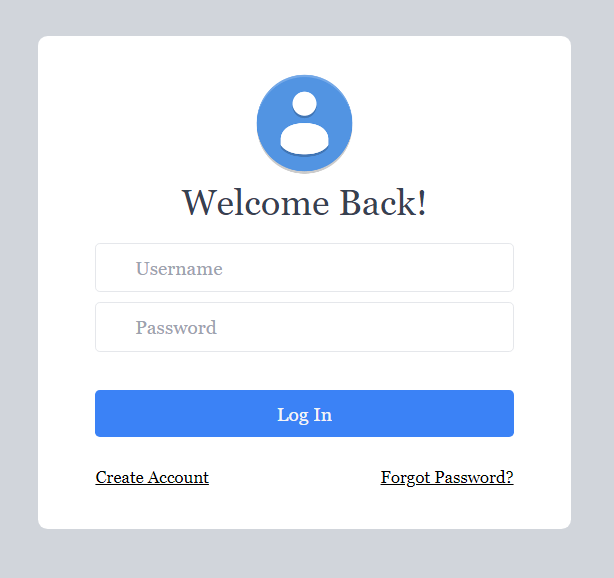

# 
### Introduction

The usual approach to building websites when working with HTML and CSS is to write the structure in a HTML file then implementing the styles in a CSS file.But now,the new framework-Tailwind CSS allows us to add the styles using classes right in your HTML. 

Tailwind CSS is one of the most popular frameworks for building custom user interfaces for a web application. It is different from other CSS frameworks such as Bootstrap because of the new way of building using utility-first approach rather than the object-oriented one.

During this tutorial,we'll be using Tailwind to build a login form from scratch that will look like this when complete:



### Adding Tailwind CSS to your project.

There are multiple ways of including Tailwind into your project.The most recommended method is to use a package manager and then make full use of the configuration possibilities via PostCSS using building tools.
Visit the link below for the full installation process;https://github.com/section-engineering-education/engineering-education/blob/master/articles/introduction-to-tailwind-css/index.md

Now,let's get started on our form!

#### Step 1: Setting up our HTML.
```HTML
<!DOCTYPE html>
<html lang="en">
  <head>
    <meta charset="UTF-8" />
    <meta name="viewport" content="width=device-width, initial-scale=1">
    <title> Login Form</title>
    <link 
      rel="stylesheet" 
      href="./css/tailwind.css" />    
  </head>
  ```

In our snippet, we gave our form a title "Login Form"

Next add the following classes to the ````<body>```` :
```HTML
 <body class="bg-gray-300" style="font-family:Roboto">
 ```

In the above snippet, we have added a background  for some color and the font for our form.

Now add a ``<div>`` with the following classes that wraps around the header(logo), and the form.

```HTML
<div class="w-full h-screen flex items-center justify-center">
```

In the ``<div>`` we have added classes :
  - ``w-full``, ``h-screen`` , ``flex`` ``items-center`` ``justify-center`` -which will allow us to set the form to 100% width, 100% height and the rest will allow us to horizontally and vertically align our form to the centre respectively.
  
So now lets add our header and the logo:

```HTML
 <form class="w-full md:w-96 bg-white rounded-lg">
         <div class="flex font-bold justify-center mt-6">
            
         </div>
         <h2 class="text-3xl text-center text-gray-700 mb-4">Welcome Back!</h2>
```

In the above snippet the classes;
- ``w-full`` will set the form widt to 100%,
- ``bg-white`` will set the bacground of our form to white,
- ``rounded-lg`` will set the edges of the form to be rounded,
- ``md:w-96`` will set the minimum width to 384px.

Inside the ``<div>`` our logo is designed as follows:
- ``flex`` will allow items to grow and shrink hence preventing overflow.
- ``font-bold`` sets our heading to bold
- ``justify-center`` aligns the heading and logo to center
- ``mt-6`` sets the margin from top to 24px.
  
 We then used the ```` tag to add and design our logo. the height and the width are both set to 94px (``h-24``,``w-24``).

Our header "Welcome Back!" is set to:
- font size 30px and line height 36px-``text 3x1``
- center- ``text-center``
- color gray-``text-gray-700``
- margin-bottom to 16px-``mb-4``

Now, lets build the input fields and style them!

Our code will look like this;

```HTML
 <div class="px-12 pb-10">
            <div class="w-full mb-2">
               <div class="flex items-center">
                  <input type='text' placeholder="Username"
                     class="-mx-6 px-8  w-full border rounded py-2 text-gray-700 focus:outline-none" />
               </div>
            </div>
            <div class="w-full mb-2">
               <div class="flex items-center">   
                  <input type='password' placeholder="Password"
                     class="-mx-6 px-8 w-full border rounded py-2 text-gray-700 focus:outline-none" />
               </div>
            </div>
```            

- So basically our input fields (Username and password) have the same style.
   
   1. all items are aligned center using ``items-center`` and display is flex.
   
   2. Text is gray in color.(``text-gray-400``).

   3. width is set to 100% (w-full) and the margin bottom to 10px (``mb-2``)- The margin of the Username field from password field.

   4. The borders of both input fields are set to a width of 1px using ``border``.

  
   5. The margin left and right of the text in the fields are set to 24px using class ``mx-3``, and the padding left and right to 32px using ``px-8``.
   6. borders are rounded and the border radius set to 4px using class  ``rounded``.

The input fields are done!

Now we add a button at the bottom for our users to log in!

Our code is as follows;

```HTML
 <button type="submit"
               class="w-full py-2  rounded bg-blue-500 text-gray-100  focus:outline-none ">Log In</button>
```

- the button will have rounded borders from class ``rounded-full``,
- the top and bottom padding to 8px (``py-2``),
- the button also has a blue background color set by ``bg-blue-500`` and a text color of grey.
- full width of 100% (``w-full``)
- and no outline focus``(focus:outline-none``).

Finally, lets finish our form by adding a link for new users and for users who forgot their passwords!

```HTML
<a href="#" class="text-sm text-opacity-100 float-right mt-4 mb-4 hover:text-blue-600 underline">Forgot Password?</a>
               <a href="#" class="text-sm text-opacity-100 float-left mt-4 mb-8 hover:text-blue-600 underline">Create Account</a>
```

- the links are set to blue on hover (``hover:text-blue-600)
- the links are underlined (``underline``) with a text size set to small (``text-sm``)


Our form is done!

Here is our full code;

```HTML

<!DOCTYPE html>
<html lang="en">
  <head>
    <meta charset="UTF-8" />
    <meta name="viewport" content="width=device-width, initial-scale=1">
    <title> Login Form</title>
    <link 
      rel="stylesheet" 
      href="./css/tailwind.css" />    
  </head>
   <body class="bg-gray-300" style="font-family:Roboto">
      <div class="w-full h-screen flex items-center justify-center">
      <form class="w-full md:w-96 bg-white rounded-lg">
         <div class="flex font-bold justify-center mt-6">
            
         </div>
         <h2 class="text-3xl text-center text-gray-700 mb-4">Welcome Back!</h2>
         <div class="px-12 pb-10">
            <div class="w-full mb-2">
               <div class="flex items-center">
                  <input type='text' placeholder="Username"
                     class="-mx-6 px-8  w-full border rounded py-2 text-gray-700 focus:outline-none" />
               </div>
            </div>
            <div class="w-full mb-2">
               <div class="flex items-center">   
                  <input type='password' placeholder="Password"
                     class="-mx-6 px-8 w-full border rounded py-2 text-gray-700 focus:outline-none" />
               </div>
            </div>
            <button type="submit"
               class="w-full py-2  rounded bg-blue-500 text-gray-100  focus:outline-none ">Log In</button>
               <a href="#" class="text-sm text-opacity-100 float-right mt-4 mb-4 hover:text-blue-600 underline">Forgot Password?</a>
               <a href="#" class="text-sm text-opacity-100 float-left mt-4 mb-8 hover:text-blue-600 underline">Create Account</a>
      </form>
      </div>
   </body>
</html>
```

### Conclusion.
A log in form is a simple example since it uses many of the key Tailwind classes.Hopefully this tutorial has shown just  how easy and fast custom components can be built using Tailwind.