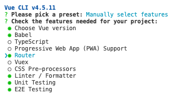
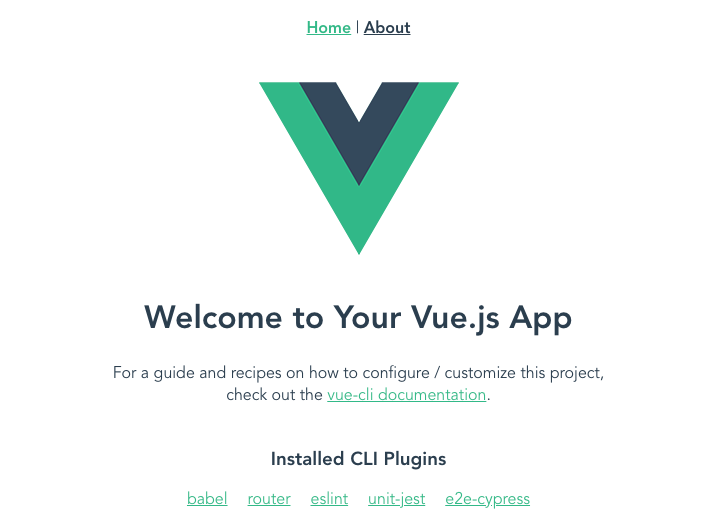
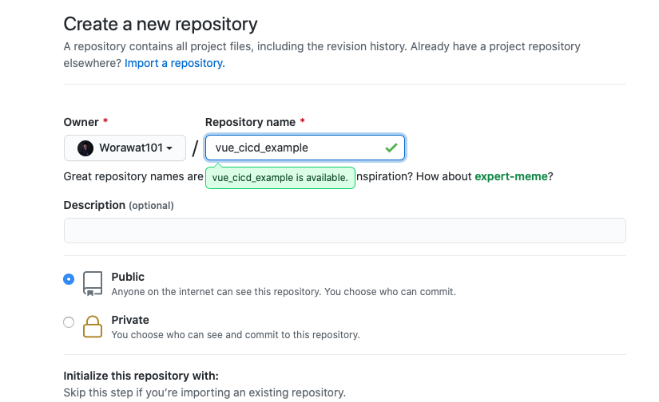
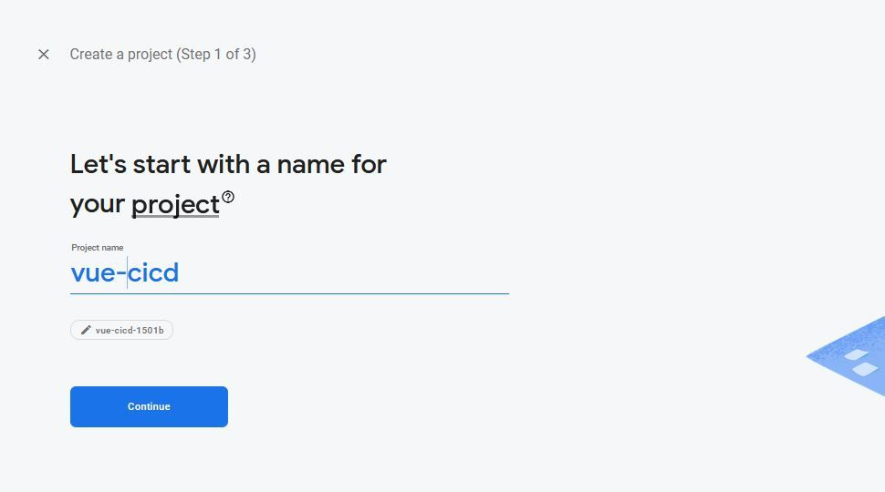
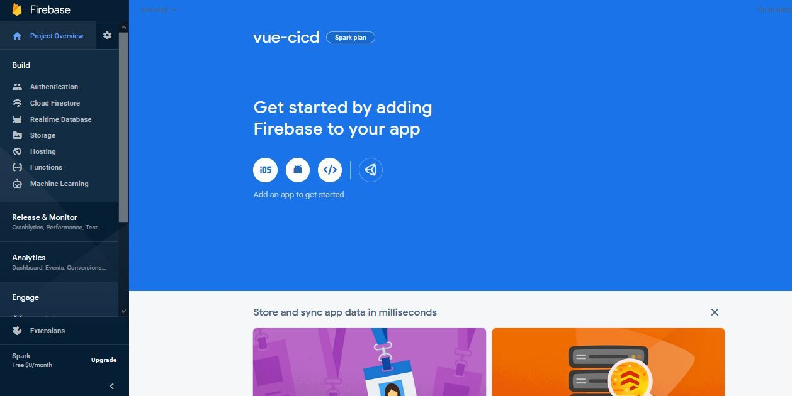
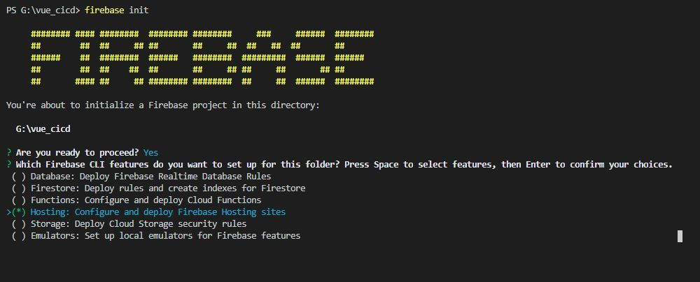
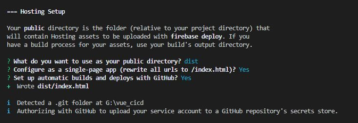

Well the solution to this is to automate the entire deployment process. And, this can be done by applying CI/CD to our project. Most of the workflow includes running, testing, building, and deploying the project manually. Each time we have any changes or updates we push the code to our version control system and deploy it manually. In any development phase, it can be measured inefficient to fix bugs and update new features manually as it consumes a lot of time and accuracy. And here, we are going to do that using Vue, Firebase Hosting, and GitHub workflows. The overall process automates the process of software development and management and makes it easy to test and deploy the final results. The end goal is to automatically build and deploy the updates to the main server after each pull request or change has been merged to the master branch of our GitHub repository. Hence, the overall process involves:

- Setting up the Vue project.
- Pushing the Vue project to the GitHub repository.
- Setting up the Firebase project.
- Setting up Firebase hosting in Vue project using latest firebase-tools.
- Configuring the connection between Firebase Hosting and GitHub by applying GitHub workflows.

What will happen as a result:

- Push the code to the master branch or create a pull request to merge the branch.
- Triggers the GitHub actions workflow scripts.
- After the successful merge action, the changes will be automatically deployed to the live website without having to do any manual configurations.
- We can also include the testing scripts in the workflow scripts to automate testing before merging.

### Pre-requisites

- [Git Version Control](https://github.com/git-for-windows/git/releases/download/v2.29.1.windows.1/Git-2.29.1-64-bit.exe)
- [GitHub Account](http://github.com/)
- [Firebase Account](https://firebase.google.com/)
- [Vue CLI](https://cli.vuejs.org/)
- Knowledge of [Vue JavaScript framework](https://vuejs.org/).

### Step 1: Vue Boilerplate

The first step is to get out Vue project ready. For the Vue boilerplate project, we are going to make use of Vue CLI. So first, we need to install the latest version of Vue CLI globally in our system. It allows us to download the starter Vue template based on various configurations. The required packages are pre-installed. It also enables us to manage the Vue project. To install it, we need to run the following command in our system terminal:

```bash
npm install @vue/cli -g
```

After Vue CLI has been installed, we can now start a new Vue Project. For that, we need to run the following command in the directory where we want to download the project:

```bash
vue create vue_cicd
```

After running the command instead of executing the automatic setup of features, we need to select manual configuration. In the manual configuration option, we will need to specify which Vue features to include. The required features are marked as shown in the screenshot below:



All of the features are unnecessary for this tutorial but for an actual Vue project, the selected features may be a pre-requisite. We have also selected the Unit testing and E2E testing which can be also automated using the GitHub workflow actions. 

After the selection is done, we can hit 'Enter' to go on to the next process which is shown in the screenshot below:


Here, we have selected the other additional requirements such as Vue version 3, enable history mode is the router, Prettier as code formatted, Jest for unit testing, and Cypress for E2E testing, etc. All the configurations will be saved to their default config files.

After then successful installation of the project, we need to go to the project directory using the following command:

```bash
cd vue_cicd
```

Then, we need to execute the following command to run the project in the localhost:

```bash
npm run serve
```

Hence, we will get the following result in the browser:



### Step 2: Push Project to GitHub

Now, we are going to upload for code to GitHub using Git. GitHub is an online cloud platform that stores the accurate versions of our coding project after each upload. It is a project management system designed to facilitate version control for Git. Git is a version control tool used to provide a proper version to our coding project after each push or upload. Another major feature it provides is GitHub actions that which be used to automate the workflow. It helps to ease up the build and deployment process.

First, we need to login into a GitHub account and create a repository as directed in the screenshot below:



After mentioning the repository name, we can simply hit the 'Create repository' to create a repo. Now, this repository is where we can push our Vue project.

Here, we are going to make use of Git commands to push the project files. In the root project folder, we need to open the terminal or Git Bash and execute the following commands given order:

```bash
git init
git add .
git commit -m "<your comment or message>"
git remote add origin <git repo origin link>
git push -u origin master
```

This will push our project to the master branch of our GitHub repository 'vue_cicd_example'.

*After the successful update, you can check your GitHub repo where you will find the project files just as in your vue project folder*

This completes our setup of the GitHub repo and pushing of our project to the GitHub repo.

### Step 3: Integrating Firebase Hosting along with GitHub workflow

This step is the major one for this tutorial where we are going to link the Firebase Hosting with GitHub workflow actions. The process is to connect Firebase hosting with GitHub actions so as to automate the process of deployment after each push and merge.

But first, we need to create a Firebase project in order to link firebase to our Vue project. 

### Step 3.1: Creating Firebase Project

To create a Firebase project, we need to log in to the [Firebase](https://firebase.google.com/) and navigate to the firebase console. There we can simply click on 'Add a project' to get our project started.

At first, a window will appear asking to input the project name. Here, we have kept the project name as **`vue-cicd`** as shown in the screenshot below:



We can continue to the next step until the project has been created. After the project has been set up, we will get a project console as shown in the screenshot below:



Hence, the setup of the Firebase project is complete. Now, we can configure the Firebase hosting in our Vue project.

### Step 3.2: Configure Firebase Hosting

Now that we have our repo in GitHub and the Firebase project, let’s initialize Firebase hosting for the project.

For this, we need to have Firebase CLI installed on our local machine. Hence, we need to globally install the firebase-tools package by executing the following command in our terminal:

```bash
npm install -g firebase-tools
```

> *Note that: We need to install the **latest version of firebase-tools** to get the configurations to connect with the GitHub project repo automatically through the firebase commands.*

Now, we need to make sure that we are in the root project folder, and then execute the following command:

```bash
firebase init
```

This command will provide us the configurations to initialize the Firebase project in our Vue project directory:

First, it will ask us for the Firebase CLI feature that we want to set up in our project folder as shown in the screenshot below:



Since we are going to link the Firebase hosting, we at least need to select the Hosting feature. Since,

After that, we will be asked to select the Firebase Project. For this, we need to select the Firebase project from the existing list of projects in our Firebase console. Since we already have a Firebase project **`vue-cicd`** created in the earlier steps, we need to make sure to select that one. 

After the Firebase project has been selected, we will be asked to configure the hosting setups. The configurations that we need to apply is demonstrated in the screenshot below:



Here, we have selected our public directory as **'dist'** which will contain the Hosting assets to be uploaded during firebase deployment. Then, we are going to configure our project as a **single-page app** that will link all our coding files to **index.html**. 

Here, the last configuration question asking **'Set up automatic builds and deploys with GitHub?'** is the most important one. We need to make sure to give 'Yes' as an answer for this as it will connect our Firebase Hosting setup to GitHub and automate the builds and deployments. 

At this stage, it will connect to our GitHub to be able to get the repository information after a **simple authorization process** that will open up in the browser. 

### Step 3.3: Integrating GitHub workflow actions to Hosting

After the successful authorization, we will be linked with our GitHub account from we can connect for repositories to Firebase hosting. Then, we will ask to select the existing repositories in our GitHub account in which we would like to set up the GitHub workflow as shown in the screenshot below:


Here, we need to enter our [**GitHub username/GitHub project repository name**(created earlier)].

Then, we will be asked if we would like to run the build script before every deploy to which we need to put 'Yes' as an answer. The script to run and commands are automatically given for the next configuration for which we simply need to press the 'Enter' button. The configuration screenshot is provided below:


This will create a workflow file called **firebase-hosting-pull-request.yml** in our project directory inside the **.github/workflows** folder.

Then, the additional configuration steps to automate the deployment to our site and which GitHub branch to deploy is shown in the screenshot below:


Here, we are choosing to automate the deployment to our site in real-time when each pull-request to the master branch in our GitHub repo is merged. 

This will create a workflow file called **firebase-hosting-merge.yml** in our project directory inside the **.github/workflows** folder.

After these successful configurations, the Firebase project with hosting enabled will be created which will connect the Firebase project to the repository in Github. As a result, the workflow folder and files will be created as shown in the screenshot below:


The major objective of these two workflows is to build the application and deploy it to Firebase Hosting automatically. 

The first workflow file **firebase-hosting-merge.yml** will execute in every merge to the master branch. It will deploy the merge to our production or live website environment. 

The second workflow file **firebase-hosting-pull-request.yml** will only execute when a pull-request is created from any arbitrary branch to the master branch. It will deploy the push to a separate URL which will enable us to test out the result before executing the merge to the pull request.

Now, with these two workflow scripts running, we won't have to deal with deployment every time we make changes to the code and push to the GitHub repo. We only need to push and merge the changes to the master branch. The rest of the build and deployment process will be automatically taken care of by Firebase and GitHub will automatically execute the deployment. 

### Step 4: Testing to see if GitHub actions works

Now that we have everything set up, let's test it out. Since we have two workflow files already in our Vue project directory, we already have some changes to push. 

Now, we need to create a new **Git branch** in the root project and push the branch to the GitHub repo.

Now from the GitHub console, we can navigate to that branch and create a **pull request** in GitHub from the created branch to the master branch, which will automatically trigger the workflow with Github actions as shown in the screenshots below:


This proves that our configuration is working properly. Now after accepting the pull-request and merging the branch to the master branch will automatically trigger deployment as well.

We can check the successful deployment action from the [GitHub repo actions](https://github.com/Worawat101/vue_cicd_example/runs/1760954615?check_suite_focus=true). 

The changes will be deployed live in the hosted website [demo here](https://vue-cicd-b28ff.web.app/).

### Recap

Well, the overall objective of the article was to get ourselves familiar with CI/CD  with Vue.js project, Firebase, and GitHub actions workflows. This tutorial article delivered the detailed stepwise concepts of how to configure the CI/CD process. The major step revolved around the configuration of Firebase Hosting with GitHub workflows. The steps are simple and easy to understand and apply. All the manual work for iteratively building and deploying to the live server is nullified by this process. The only work we have to do is to push our changes and merge the changes to the master branch. The rest of the operation is automatically handled by Firebase and GitHub action scripts. 

There is so much more to GitHub actions workflows that we can explore. Remember that we also included the testing configurations in our setup of the Vue project at the beginning. We can also trigger the automatic Unit and E2E testing using the workflow scripts while merging before the deployment. This will easily identify any errors or bugs in the changes automatically without having to do manual testing. Hence, this is highly advantageous in the case of an overall software development cycle.