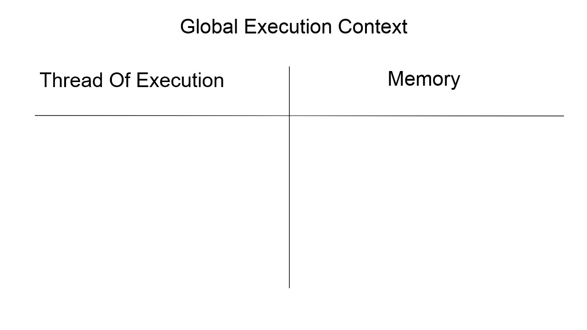
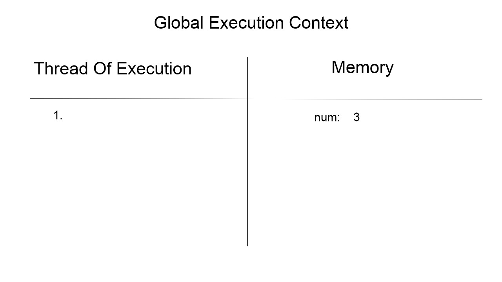
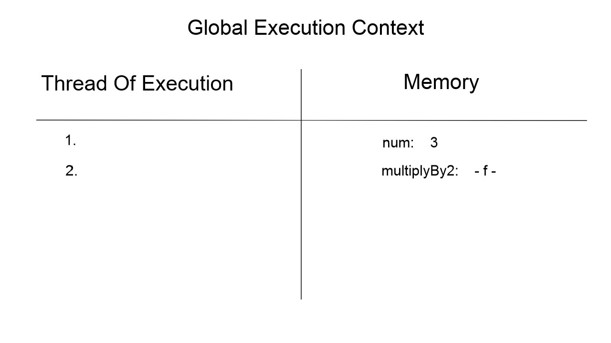
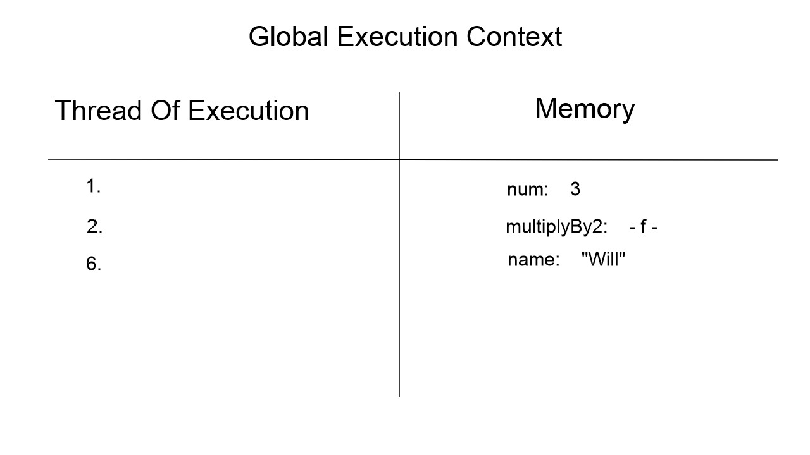
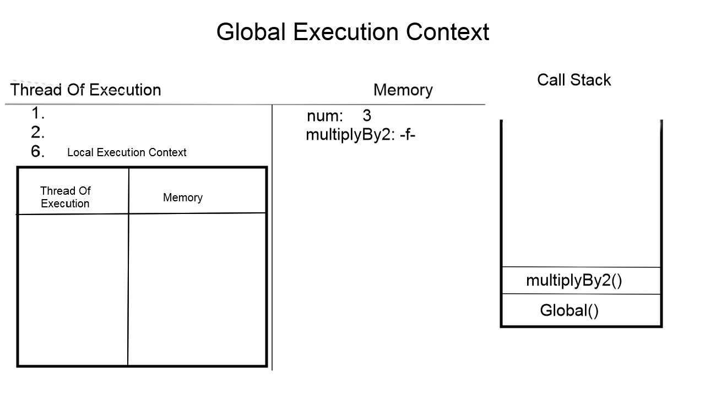
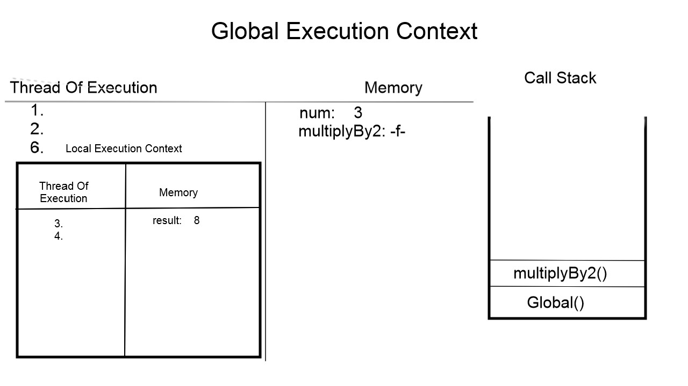
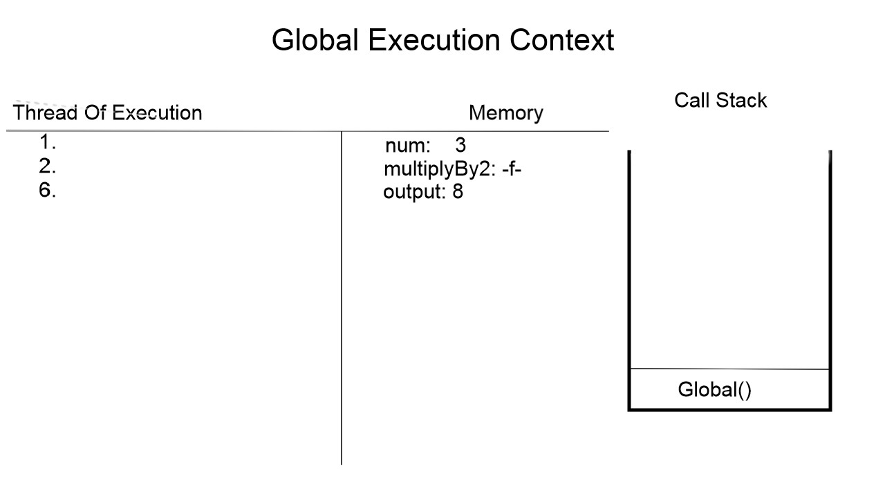
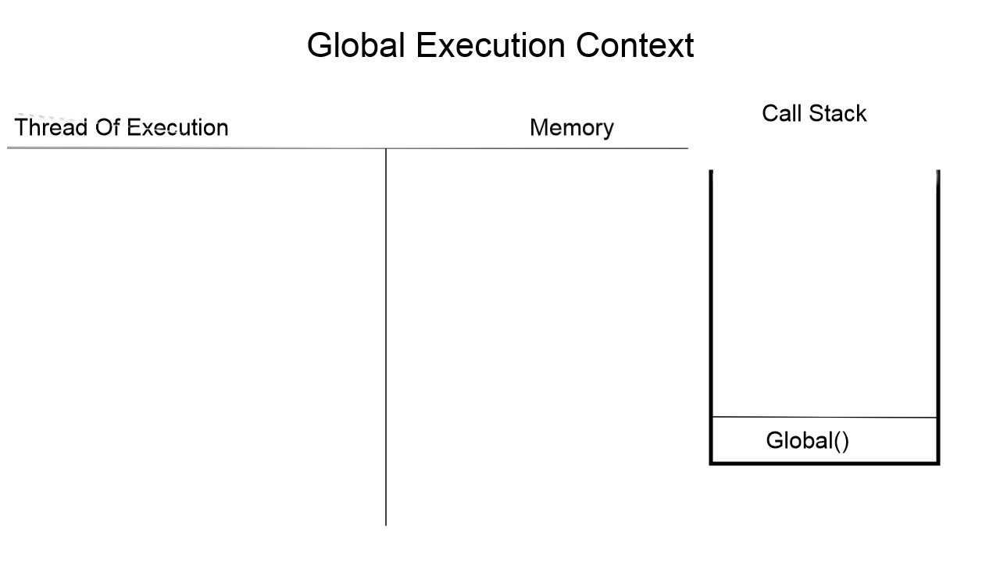

### Introduction
JavaScript is a single-threaded language, where only one command executes at a time. And, it has a Synchronous model of execution, where each line executes line by line, top to bottom.

In this guide, you get to understand what happens as the JavaScript engine threads down your code.

## Prerequisites

Before you begin this guide you'll need the following:

- A basic understanding of JavaScript Functions

## Step 1 — What Happens When JavaScript Executes My Code?

```javascript 
1. const num = 3;
2. function multiplyBy2 (inputNumber){
3.     const result = inputNumber*2;
4.     return result;
5.     }
6. const name = "Will"
```

In this step, you will walk through the above lines of code like the JavaScript engine would.

Why?

To understand what happens when you execute the code above.

First, as soon as you start executing your code, there are two halves to that process:

1. One, the process of stepping through your code line by line, top to bottom. Referred to as the **Thread Of Execution**.
2. Two, the storage of the bits of data that you announce as you go through your code's execution in live **Memory**. Referred to as the **Variable Environment**.

Together, known as an **Execution Context**. Where a context is a space to do something. In this case, it is a space where you execute code, hence an execution context.

There are two types of Execution contexts:

1. Global Execution Context.
2. Local Execution Context.

Below is a table that illustrates your Global Execution Context before code execution.



For each line, there will be a visual representation of what the Global Execution Context looks like at that moment.

Line 1: Save in memory a constant, **num**, as the label for an integer, **3**.



Line 2: You meet a JavaScript keyword [**function**](https://developer.mozilla.org/en-US/docs/Web/JavaScript/Guide/Functions). The function keyword means, save in memory **multiplyBy2**, as the label for the functionality of the function, `multiplyBy2()` (denoted as -f- in the image).

This process is also known as **defining/declaring** a function.



At this point, if you were to run:
```javascript
console.log(multiplyBy2.toString());
```
You would the source code for `multiplyBy2()`.

To understand what `toString()` does see [the MDN Documentation](https://developer.mozilla.org/en-US/docs/Web/API/Location/toString)

From line 2, you would then move on to line 6 and not line 3. 

Why?

This is because in JavaScript you **do not** go into the body of a function until it is called. And our function `multiplyBy2()` in this case, is defined, but never called.

Line 6: Save in memory a constant, **name**, as the label for a string, **"Will"**.



For the entire Step 1, you stayed in the Global Execution Context.

Why? 

Because you did not call `multiplyBy2()`.

In the next step, you will get to see when a Local Execution Context is created and what exactly happens under the hood when during that process.

## Step 2 — What Happens When a Function Is Called in JavaScript?

```javascript
1. const num = 3;
2. function multiplyBy2 (inputNumber){
3.     const result = inputNumber*2;
4.     return result;
5.     }
6. const output = multiplyBy2(4);
```

As you execute functions, you will switch Execution Contexts. From Global to Local, and back to Global.

This switching of Execution Contexts raises, in JavaScript, an issue of tracking where one is in their Thread Of Execution.

To keep track of this, JavaScript uses a [**Call Stack**](https://developer.mozilla.org/en-US/docs/Glossary/Call_stack).

And so now, you have a third element to the execution of your JavaScript code. The image below illustrates the three elements before any code is executed.


Having understood that, you now get to see exactly how the call stack comes into play here.

Line 1: Save in memory a constant, **num**, as the label for an integer, **3**.

Line 2: Save in memory **multiplyBy2**, as the label for the functionality of the function, `multiplyBy2()`.

Line 6: Save in memory a constant, **output**, as the label for whatever the result of the function  `multiplyBy2()` returns after executing.

At this point, you call  `multiplyBy2()`.

This adds `multiplyBy2()` to the call stack. And creates a Local Execution Context for the execution of the code inside  `multiplyBy2()`.As illustrated in the image below.



Once inside the Local Execution Context, you carry on with the two parts of an Execution context.

The code executed in this case is the body of `multiplyBy2()`. Since, in JavaScript, you go into the body of a function when it is called.

Line 3: Save in memory a constant, **result**, as the label for the product of the argument **inputNumber** and an integer **2**, an integer, **8**.

Line 4: The [**return**](https://developer.mozilla.org/en-US/docs/Web/JavaScript/Reference/Statements/return) keyword then ends function execution and specifies a value to be returned to the function caller.



You then return to the Global Execution Context. A few things happen when you do:

1. JavaScript [**Garbage Collects**](https://developer.mozilla.org/en-US/docs/Web/JavaScript/Memory_Management) the Local Execution Context's Variable Environment (Memory).
2. The Call Stack is cleared.
3. The return value is assigned to the constant **output**.

The image below illustrates the Global Execution Context after all this is done.



Once all the lines of code are executed, JavaScript garbage collects the Global Execution Context's Variable Environment (Memory). 

This brings you back to where you started as illustrated below.



Congratulations! You now have the full circle of what happens under the hood when you execute your JavaScript Code.

## Citations & Resources

[Frontend Masters - JavaScript: The New Hard Parts](https://frontendmasters.com/courses/javascript-new-hard-parts/)

[MDN Web Docs](https://developer.mozilla.org/en-US/)
