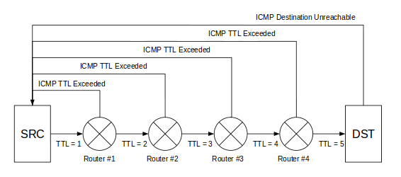
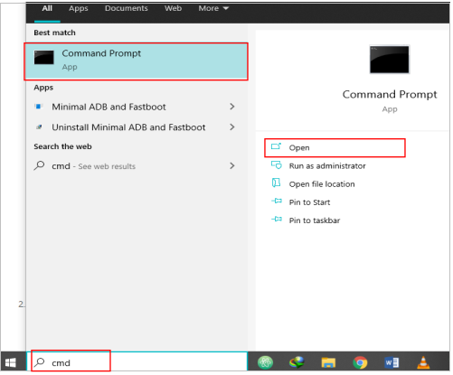
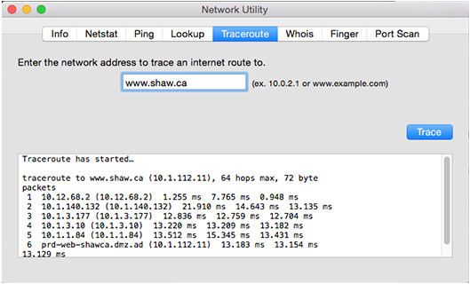
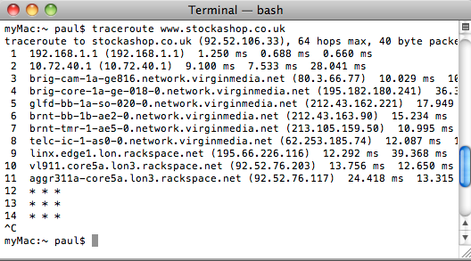
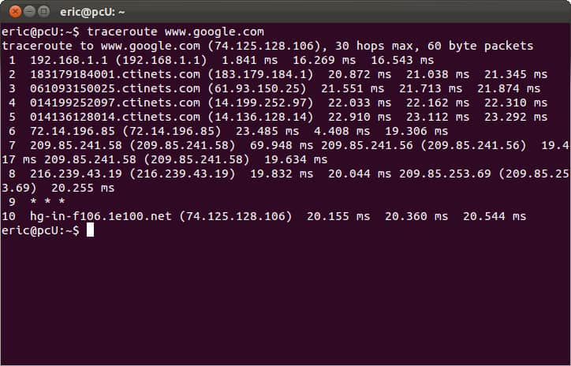
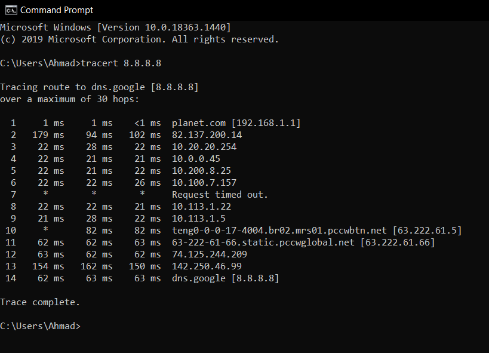
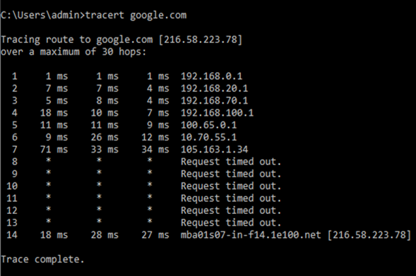

### Network Troubleshooting Using Traceroute Utility

#### Introduction

The internet is a revolutionary technological marvel that has allowed for faster transfer of data between people. The world has been converted into a global village through the internet, allowing businesses to thrive as they offer their services. The internet constitutes a series of interconnected routers that transfer data from one computer to another. Due to the importance that the internet possesses, any networking professional must first be equipped with the basic network troubleshooting skills to allow them to be able to diagnose and repair network issues.

#### Definition

**Traceroute** is a command-line utility used in network troubleshooting to find the exact route data packets take as they travel across the internet from a source to their destination addresses.

#### Other uses of traceroute

- The utility can show an estimate of the time taken by packets as they move through intermediate routers. 
- Traceroute is used to determine routers and devices' names and identities within the chosen destination path.

#### The functionality behind the utility

> **Note:** Understanding what packets are, allows us to understand better how the traceroute utility functions. 

Data packets are units of communication that travel along a given network path [site]. Any data packet sent over the internet contains the Time To Live (TTL) field located in their headers. The TTL field is essential in a data packet as it prevents data packets from forever traveling in an endless route while searching for their destination. Traceroute uses the TTL field to measure the distances between the source and destination and find the devices/routers between the paths.

When forwarding a packet, routers edit the TTL field of packets by decreasing the packet's TTL value by one every time the packet reaches a device on the path. When the TTL value of a packet is zero, the router discards the packet and sends back a 'TTL exceeded message.' to the source.

The TTL exceeded message is what traceroute utility looks for as it contains information, like:

- The time it took to reach a hop referred to as the round trip time(RTT) 
- The identity, given by the name or IP address, of the device/server/router, replying

***Example***

Suppose you indicate a maximum limit of 20 hops when running a traceroute exercise. The traceroute utility first sends packets with a maximum TTL value of one to the destination device. While traveling through the network, the first router automatically diminishes the TTL value of the data packets by one; hence their value becomes zero. This action results in the first router sending back a "TTL exceed message" to the source after dropping the packets.

After receiving the TTL information from the first router, the source responds by sending packets with a TTL value of two. As the packets pass through the first router, their TTL value is again reduced by one. Since the TTL of these packets is one, the packets continue to the second router, which decreases the TTL value to zero. Thus, the second router sends a TTL exceeded message back to the source.

The traceroute utility repeats the above process until the sent packets reach their specified destination, or the total maximum number of hops specified at the start (which is 20) is achieved.

*Pictorial demonstration*

#### Using traceroute on Windows, macOS, and Linux distributions

Most operating systems come bundled with the traceroute utility program installed. Below are some of the basic procedures for running traceroute on Windows, Linux, and Mac operating systems.

**1.** *For Windows*

To access traceroute utility, one must first:

**i.** Open the command prompt by going to start on the taskbar.

**ii.** In the search box, type cmd, then press search.

**iii.** Open the desktop app called **command prompt**.

**iv.** In the command prompt, type the keyword tracert followed by the destination IP address or hostname as shown below.

> **N/B**: the keyword ``tracert`` is applicable only in Windows-based systems.

**v.** Press enter to start the troubleshooting test and wait for the process to complete.

> **N/B**: please note that the test may take up to a minute or more to finish depending on the number of routers between the packets' destination and the internet's bandwidth and speed

**vi.** After the test completion message, analyze the data in the list generated. 

**2.** *For MacOS*

Running traceroute on a mac system is a little different from Windows. There are two ways of running the utility; using the network utility application or through the terminal. Below are the steps that you should use to run traceroute:

***a) Through the network utility***

**i.** Launch apple spotlight, search for network utility, then run the application.

**ii.** Inside the application, click on traceroute. 

**iii.** In the text field provided, key in the destination IP address or hostname.
  
**iv.** Click on the Trace button to start the test.

**v.** Wait for the test to complete.

**vi.** Analyze your data.

***b) Through the network utility***

**i.** Navigate to GO, then select utilities.

**ii.** In utilities, find Terminal and open it.

**iii.** Inside Terminal, type in the keyword: traceroute followed by the hostname or IP address.

**iv.** Wait for the test to finish, then analyze the data.

**3.** *For Linux*

Running traceroute on a Linux system is almost the same as running the utility on macOS. In Linux, one should:

**i.** Open the terminal by either searching the application through the search bar or by pressing key combination ctrl+ alt+ T. 

**ii.** Inside the terminal, type in the keyword traceroute proceeded with the hostname or IP address.

>**N/b:** Ensure that you install traceroute on your Linux distribution. To install traceroute, one can run the commands: Sudo apt-get install traceroute for those using Ubuntu.

**iii.** Run the commands and wait for the results of the test.

**iv.** Analyze your data.

#### Understanding the data from the generated list.

Since we know the basic functionality and different procedures of running traceroute on all of the three major operating systems, let's find out how to interpret the utility's output.

>**N/b:** The data interpreted in this Example was from a Windows system.

The data displayed within the traceroute utility is divided into five columns.  The first column holds the number of hops; the second, third, and fourth columns show the roundtrip time (RTT) which packets take to get to a gateway and back; the last column holds the identity of a gateway in the network path.

#### common errors from the utility's results

***1. A "request timed out" message***

This message mainly occurs due to several reasons such as:

- The host you are pinging might be down. 
- The command may be disabled for that gateway.
 - A firewall may be blocking the request sent out by our utility.
- There might be a problem in the return path from a target system.
- A connection problem might be causing the error.

***2. An asterisk(****) ***in the RTT field***

This usually means that the data packet did not return. This can happen when:
- There is packet loss
- Routers may intentionally discard the ping commands.

***3.Abnormal intervals in RTT***

In the above example, the second column of the seventh row of the table contains an abnormal RTT value compared to the other RTT values in the table. The significant difference between RTT values is mainly caused by a delay in the network, particularly because the router processing our request may treat it as a low priority function.

#### Using traceroute with IPv6 addresses

Traceroute is set by default to test the path for an IPv4 address. Despite this fact, one can still use the utility to test an IPv6 address, whether it's on Windows, macOS, or a Linux system. The only difference when testing an ipv6 address from an ipv4 address is a change in the traceroute and tracert keywords.
- In Windows, add a hyphen then a six before typing in your ipv6 address

E.g., tracert -6 your ipv6 address.
- In macOS and Linux, write the traceroute keyword, then add a six.

E.g., traceroute6 your ipv6 address

#### Conclusion

I hope this article has helped you understand the basic functionality behind traceroute, how to use the program, and finally, how to interpret data produced by the program. 

That's all for now, and thank you for reading this article. 

