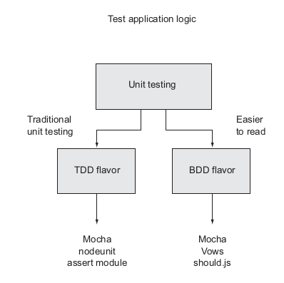

# Testing Node.js Applications


[Node.js](http://nodejs.org/)  is used to develop applications ranging from a simple portfolio website to complex APIs and applications used by millions. As the size of the application grows, the risk of bugs also grows. An application is not complete until it is tested. A test can be a simple `console.log` to a function to see if it is working as intended. 

```javascript
function addNumbers(a,b){
	return a+b;
}
console.log(addNumbers(1,2));
```

We can conclude that the function above is working correctly because we know basic math. What if there are many functions like this or what if the functions are much more complex than this, automated testing solves this problem. Manual testing is tedious and prone to human error, automatic testing involves writing logic to test your code rather than running through application functionality by hand.  We’ll look at [Unit Testing]() and [Acceptance Testing]() as methods of automated testing.

## Unit Testing

Unit testing is a type of automated testing where you write logic to test discrete parts of your application. Unit testing test code logic directly at function or method level and it’s applicable to all types of applications. Writing tests make you think about your application design choices and helps you avoid pitfalls early. Unit-testing methodology can be divided into two major forms: [test-driven development]() and [behaviour-driven development](). 



Unit tests

### Unit testing with Node `assert` module.

The basis for most Node testing is the built-in **assert** module, *which tests a condition and, if condition is not met, throws an error. *

Lets look at a simple example of assertion testing.

```javascript
//index.js
function addTwo(a){
  return a+2; 	//a normal function
}

function testAddTwo() {
  var x = 5;
  var x2 = x + 2;
  var x3 = addTwo(x);

  console.log("Expected "+x2+" Got " + x3);

  if (x2 === x3){
    return console.log("Passed");
  }
  
  console.log("Failed");
  
}

testAddTwo();
```

In the above example we used a test case of `x=5` and when we run this script we can see on the console.

```
Expected 7 Got 7
Passed
```
We have written our first unit test. The `if` condition in the above code sample ***asserts*** that the code is working correctly or not. Node.js comes with an [assert module](https://nodejs.org/api/assert.html) with it. Let's do the same action using `assert`.

```javascript
var assert = require("assert")
function addTwo(a){
  return a+2; 	
}
function testAddTwo(){
	var x = 5;
	var y1 = x + 2;
	var y2 = addTwo(x);
	console.log("Expected "+y1+" Got " +y2);
	try{
		assert.equal(y1,y2);
		console.log("Passed");
	 } catch (err) {
	 	console.log("Failed");
		console.log(err);
		}
	}

testAddTwo();
```

We can exprect the following result on the console for correct code.

```
Expected 7 Got 7
Passed
```
When we deliberately change `var y1 = x + 2;` to `var y1 = x + 1;` we see the following error message.

```
Expected 6 Got 7
Failed
AssertionError [ERR_ASSERTION]: 6 == 7
{
  generatedMessage: true,
  code: 'ERR_ASSERTION',
  actual: 6,
  expected: 7,
  operator: '=='
}
```

`equal` tests if the contents of a variable are indeed equal to a value specified in the second argument. Let's look at various methods in the assert module and how we can use them.

* Example Usage: `assert.equal(a,b,c)`. Throws error c if a is not equal to b. c can be a sentence. 
* `assert.notEqual`. Used when the generation of a certain value by application indicates a problem in logic. 
* `assert.strictEqual`. This uses [strict equality](https://stackoverflow.com/questions/359494/which-equals-operator-vs-should-be-used-in-javascript-comparisons) (===) rather than (==).
* `assert.deepEqual`. This compares the objects. They recursively compare two objects, comparing two object’s properties and, if the properties are themselves objects, comparing these as well.
* `assert.ok`. This is used for testing [asynchronous functions](https://bitsofco.de/asynchronous-functions-101/). When we use it as `assert.ok(value, error_message)` if value is false then it throws the `error_message`. Example usage:
```javascript
 function doAsync (callback) {
	setTimeout(callback, 2000, true); // "callback" function with arguements "true"
 }

function testAsync (callback) {
	 doAsync(function (value) {
	 	assert.ok(value, "Callback should be passed true, got false");
	 	callback();  //trigger callback when done
	}) //if we deliberately change the value in doAsync to false then we can see the error.
 }
```

## Mocha 

[Mocha](https://mochajs.org/) is a popular JavaScript testing framework that runs on both Node.js and the browser. Mocha is simple, extensible and fast, it's used for unit and integration testing. Mocha does not have in-built assertion so it is used with libraries like *assert*, [chai](https://www.chaijs.com/), etc. Mocha provides easy asynchronous and synchronous testing with an easy interface. 

### Installation and Set-up

Create a new directory and initialize a node project (if you don't already have a node project).

```
mkdir test-project
cd test-project

npm init -y

npm install --save-dev mocha`
```

Add the `test` script to your `package.json`. 

```
//package.json
...
{
	"scripts": {
    "test": "mocha"
  }
}
...
```
### Unit Testing with Mocha and Assert

Mocha follows this template for writing tests.

```
describe([String with Test Group Name], function() {
    it([String with Test Name], function() {
        [Test Code]
    });
});
```
The `describe()` function is used to group similar tests, grouping tests make our test code easier to maintain. The `it()` contains our test code. We will use the BDD interface of Mocha. Let's write a simple script which returns the sum of numbers. 


## References
* [Node.js in Action Book]()
* [Wikipedia](https://en.wikipedia.org/wiki/Software_testing)
* [hackernoon.com](https://hackernoon.com/a-crash-course-on-testing-with-node-js-6c7428d3da02)
* [https://www.digitalocean.com/community/tutorials/how-to-test-a-node-js-module-with-mocha-and-assert]
* [https://blog.logrocket.com/](https://blog.logrocket.com/a-quick-and-complete-guide-to-mocha-testing-d0e0ea09f09d/)
