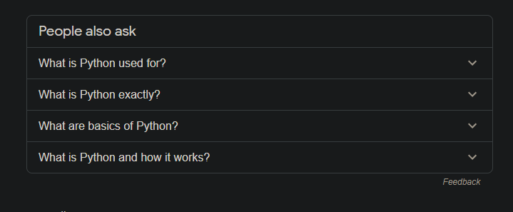
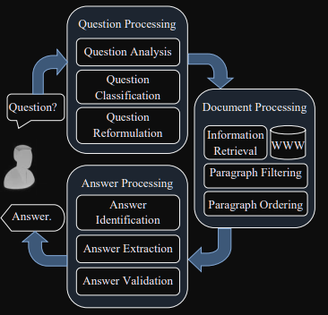

Recently, I came across this library that enables one to create large-scale and distributed question answering systems. It solves a significant problem that we usually face in the vast field of Natural Language Processing. The problem of creating models that work accurately with large amount of data. Hence, my interest in the area of question answering systems arose.

In this article, I have tried to put together the general trends in the field of question answering systems. Once we have a good picture of the area, we will explore the library **Haystack**, which arose my interest in the first place.
<!--more-->

### Goal of Question Answering Systems
What are the question answering systems trying to achieve? Given a question, should the system return the nearest answer? What if the answer is a mixture of multiple answers that it has been trained on? We are trying to build intelligent systems that don't just return documents related to the question, but extract relevant information within the documents and puts forth the detailed answer, like one that a human would have come up with. This task comes under the fields of [Information Retrieval ](https://nlp.stanford.edu/IR-book/pdf/01bool.pdf)(IR), [Information Extraction](https://www.ontotext.com/knowledgehub/fundamentals/information-extraction/) (IE), and Natural Language Processing (NLP).

Google is a search engine. But, some questions are generated automatically while we search. This is due to the [knowledge graphs](/engineering-education/web-developers-guide-seo/#pagerank) that Google uses to represent vast amounts of data.

### Structure of Question Answering System
The design of a question answering system has specific vital components. There are three distinct modules used in a question-answering system:
- **Query Processing Module:** Classifies questions according to the context. This module identifies the context and focus, classifies the type of question, and sets the answer type's expectations.
- **Document Processing Module:** Information retrieval module that focuses on gathering relevant documents.
- **Answer Processing Module:** Once the relevant documents are retrieved, they need to be parsed through to obtain an accurate and appropriate answer.

Each of these modules performs a different task to give relevant answers. The image below summarizes the entire architecture.

 
[*Image Source*](http://www.aliallam.net/upload/598575/documents/ECFF549932079694.pdf)

### Query Processing Module
As mentioned earlier, the query processing system deals with three main tasks:
1. *Analysis* of the question to obtain preliminary information from it.
2. *Classification* of the type of question to better understand the required context for the answer. For example, the phrase _Python error_ should lead to answers related to coding, and _Python bite_ should lead to snake bites.
3. *Reformulation* of the question to obtain relevant answers. Therefore, the question is converted into a pre-trained vector with several examples of question and answer pairs. This aspect is responsible for information retrieval.

### Document Processing Module
The document processing module accepts the reformulated question as its input. The document processing module uses an internal information retrieval (IR) system to map the closest documents to the question presented. The documents are sorted according to their similarity and relevance to the question. The document processing module performs three main tasks.

1. *Retrieve* the set of documents from the IR system.
2. *Filter* the set of documents obtained from the previous step, and reduce the amount of text in each document to produce a concise answer.
3. *Order* the documents by similarity and relevance to the question.

### Answer Processing Module
The final module gets the list of concise documents filtered and ordered by the previous module. The answer processing module considers the set of documents and performs three major tasks:

1. *Identify* statements/answers within the concise set of documents.
2. *Extract* the relevant answer by choosing the appropriate phrases and words that answer the question. This used to be performed heuristically. *Heuristic algorithms* are a way of solving problems where solving in the best possible way is given importance. Parameters such as cost, complexity in terms of space and time, accuracy, or speed are neglected, and instead, obtaining a solution close to the actual answer is emphasized.

   Heuristic algorithms are usually used to solve [NP-complete problems](https://www.britannica.com/science/NP-complete-problem), where there is no known efficient way to find a solution. However, it can be verified if the answer is known by plugging the parameters into the algorithm. Therefore, developing heuristic algorithms involves going back and forth between the solution produced and the algorithm itself.

   The algorithm is said to perform well when the algorithm's solution is as efficient as possible, given the constraints.

3. *Validation* of the answers obtained by the previous step. This is usually used during the design of such question-answering systems to evaluate the outputs obtained. During deployment, the evaluation metrics are reduced to achieve high data throughput from the system.

### Evaluating the answers obtained
The criteria can vary from paper to paper. But more generally, we want the question answering system to produce relevant, correct, and complete answers to the point. Hence many evaluation metrics were developed to measure such ambiguous terminologies. A few of those metrics are F1-scores, precision, recall, etc. For a detailed insight into evaluation metrics, refer to this [article](/engineering-education/evaluating-ml-model-performance/).

Transformers at scale for question answering & neural search. Using NLP via a modular Retriever-Reader-Pipeline. Supporting DPR, Elasticsearch, HuggingFace's Modelhub

### Applications
The applications of such systems are varied and exciting. Currently used in commercial applications, these have a broad scope in almost every aspect. Humans are question-driven organisms, and therefore these systems are the easiest way for humans to interact with machines.

1. **Customer Support**: The most common application is using such systems to reduce the loads on customer service teams. The idea behind introducing such systems was to remove the early jitters that these systems face uncertainty related to the queries. This enables the customer service team to focus on things that truly matter. However, today, the quest for complete automation is on, and question answering systems integrated into chatbots are revolutionizing the digital experience rapidly.
2. **Education**: Google is a great search engine. But [Chegg](https://www.chegg.com/) is a great search engine built for finding answers to questions. Imagine a world where such devices power up the entire thought process required for a kid to learn. The kid is prompted with the right questions to understand the concepts. This is an example of a question answering system integrated into personalized learning systems.
3. **Search Engines**: As mentioned above, Google uses such systems to come up with questions and answers. When clicked on either of the questions, the number of questions shown increases. The updated list is more similar to the question that was clicked on. If not observed, next time you click on a question on Google, be sure to check it out.
4. **Data Analytics**: [HyperVerge](https://hyperverge.co/) is an exciting company that works on generating analytical reports based on queries typed by the user in natural language. This application is liberating an entire generation of the workforce from developing reports to identifying patterns in data. Just asking for specific queries results in beautiful reports. This is an example of a question and answering system integrated with an analytics engine.  

### Research Direction
The building of such distributed systems is a very tough job. The real-time question and answering machines are challenging due to the scale at which they operate. Today's databases are in Petabytes, and accessing information rapidly is a huge challenge.

Many solutions for efficient storage and computation are present. But, ensuring algorithms work correctly with such solutions is a significant challenge. One such example is [Haystack](https://haystack.deepset.ai/). They have brought together neural question answering systems and made it compatible with distributed file systems such as [Hadoop](https://hadoop.apache.org/), [Elasticsearch](https://www.elastic.co/), etc. This way, we have the advantage of the most powerful [language models](https://huggingface.co/) generating answers and the power of speedy information retrieval systems taking in as much data as possible to generate the responses.

### Conclusion
In this article, we considered the various aspects of a question answering system and its applications. The possibilities are endless. I hope I have succeeded in kindling the curiosity within you to explore the topic furthermore. I would recommend reading this [survey paper](https://www.sciencedirect.com/science/article/pii/S1877050915034663) published in 2015 at Elsevier.

---
Peer Review Contributions by: [Peter Kayere](/engineering-education/authors/peter-kayere/)
