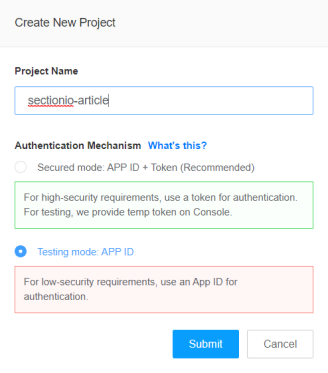
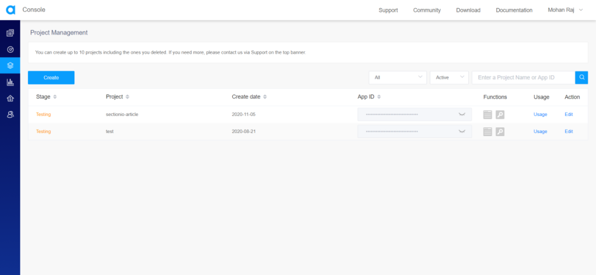
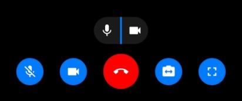

In this tutorial, we'll build a Video Conference app with React Native and [Agora](https://www.agora.io/en/about-us/).

### Goals

By the end of the tutorial, you’ll know:

- How to create/join a video conference using Agora.

- How to mute local/remote audio and video feed.

- How to share a room code for others to join the video conference.

### Prerequisites

The fundamentals of React and React Native will not be covered in this tutorial. If you don't know the fundamentals, please refer to [some tutorials](https://reactnative.dev/docs/tutorial) before beginning with this project.

### Agora

Founded in 2014, Agora.io is a service provider for real-time voice and video. Its core technology is real-time communication (RTC).
Agora provides SDKs to build apps that require real-time engagement like:

- Audio/Video calls

- Interactive Livestreaming (Audio/ Video)

- Interactive Gaming

- Real-Time Messaging (which is in BETA at the time of writing this article)

Agora supports upto 1 million users in a channel. They also recommend to limit the number of users sending streams concurrently to 17 at most. You can learn more about Agora's capacity [here](https://docs.agora.io/en/All/faq/capacity).

Agora is a paid service, but the first 10,000 minutes are free every month. You can check their pricing [here](https://www.agora.io/en/pricing/).

If you'd like to learn more about Agora, visit their [website](https://www.agora.io/en/) or read [this article](https://equalocean.com/analysis/201904121773).

Here is the [documentation for React Native Agora](https://docs.agora.io/en/Video/API%20Reference/react_native/index.html).

### Overview

We'll be going through these steps in this article,

1. Creating an Agora account
2. Development environment
3. Clone the starter code
4. Installing dependencies
5. Pass channel ID while navigating
6. Setting up the video conference
7. Recap

> If you want to take a look at the final code, check out the [Github Repo](https://github.com/zolomohan/rn-agora-video-conference-app). I've made a commit for every step in this tutorial.

### Creating an Agora account

Head to Agora and create an account. You can reach the signup page from [here](https://sso.agora.io/en/v2/signup).

Fill in the details and create an account or you can signup with Google, Github, or Cocos. Once you've signed up, you'll see the dashboard.


Click on New Project.

You'll see this form. Fill out the Project Name and set the Authentication Mechanism to Testing.



Once you hit on submit, it'll create a new project and you should see it on the Project Management Console.



Now, click on the closed eye icon near the App ID to reveal it and copy the App ID. We'll be needing this later while setting up Agora in our app.

### Development environment

> **IMPORTANT** - We will not be using Expo in our project. Agora's React Native SDK does NOT work with expo managed workflow. This is because video calling SDKs need native modules that are not supported by Expo.

You can follow [this](https://reactnative.dev/docs/environment-setup) documentation to set up the environment.

Make sure you're follwing the React Native CLI Quickstart and not the Expo CLI Quickstart.

### Clone the starter code

To focus more on the Video conference, I've prepared a starter code. You can clone it [from this repository](https://github.com/zolomohan/react-native-agora-app-starter) on GitHub. Follow the Repository's README for instructions.

In the starter code, the Navigation is set up using a [Stack Navigator](https://reactnavigation.org/docs/stack-navigator/) with the Home screen and a dummy Video Conference Screen. You can find the documentation for the React Native Navigation [here](https://reactnavigation.org/docs/getting-started).

The Home Screen has 2 buttons, Start and Join. The Join button has a text input associated with it to provide the channel ID to join the stream. When the text input is empty, the join button will be disabled.

This is the Home Screen you'll see when you open the app.


### Installing Dependencies

You can install these packages either in advance or while going through the tutorial.

```json
"@react-native-community/masked-view": "^0.1.10",
"@react-navigation/native": "^5.8.6",
"@react-navigation/stack": "^5.12.3",
"agora-rn-uikit": "^3.0.1",
"react": "16.13.1",
"react-native": "0.63.3",
"react-native-agora": "^3.1.3",
"react-native-gesture-handler": "^1.8.0",
"react-native-get-random-values": "^1.5.0",
"react-native-reanimated": "^1.13.1",
"react-native-safe-area-context": "^3.1.8",
"react-native-screens": "^2.13.0",
"uuid": "^8.3.1"
```

To install a dependency, run:

```bash
npm i --save <package-name>
```

After installing the packages, for iOS, go into your `ios/` directory, and run:

```bash
pod install
```

> **IMPORTANT FOR ANDROID**
>
> As you add more native dependencies to your project, it may bump you over the 64k method limit on the Android build system. Once you reach this limit, you'll start to see the following error while attempting to build your Android application.
>
> `Execution failed for task ':app:mergeDexDebug'.`
>
> Use [this documentation](https://rnfirebase.io/enabling-multidex) to enable mulitdexing.
> To learn more about multidex, view the official [Android documentation](https://developer.android.com/studio/build/multidex#mdex-gradle).

### Pass channel ID while navigating

When we create or join a conference, we need to give a channel ID to Agora.

For a new video conference, we'll generate a new channel ID. To join a conference, we'll use the channel ID from the text input. We need to pass the channel ID from the Home Screen to the Conference Screen.

You can learn more about route props [here](https://reactnavigation.org/docs/route-prop/).

Let's install the `uuid` package to generate a new channel ID.

```bash
npm install uuid
```

In React Native, you'll run into an error with the message `crypto.getRandomValues() is not supported` when you try to use `uuid`.

To fix this, you'll need to install `react-native-get-random-values`.

```bash
npm install react-native-get-random-values
```

In `screens/Home.js`, let's import both of those packages.

> We must import the `react-native-get-random-values` before the `uuid` import to avoid the error.

```JavaScript
import "react-native-get-random-values";
import { v4 as uuid } from "uuid";
```

In the `createConference` function, we'll generate a new UUID and pass it as a route prop for the Channel ID.

In the `joinConference` function, we'll pass the text input's value for the Channel ID.

You can learn more about route props [here](https://reactnavigation.org/docs/route-prop/).

```JavaScript
const createConference = () => navigation.navigate("Conference", { channel: uuid() });

const joinConference = () => navigation.navigate("Conference", { channel: joinChannel });
```

When you press these buttons, it should be the same as before. But, we can access the `channel` route prop in the Conference Screen.

You can learn more about the `useNavigation` hook which is present in the starter code [here](https://reactnavigation.org/docs/use-navigation/).

### Setting up the video conference screen

To use Agora, we need to install `react-native-agora`. There is a community managed package called `agora-rn-uikit` to help us build the UI.
Here is the [Github Repository](https://github.com/AgoraIO-Community/ReactNative-UIKit) of `agora-rn-uikit`.

Let's install both the packages.

```bash
npm install react-native-agora agora-rn-uikit
```

After npm install, For iOS, go into the `iOS/` directory and run:

```bash
pod install
```

#### Agora UI Kit

In `screens/Conference.js`, let's import the Agora UI Kit.

```JavaScript
import AgoraUIKit from "agora-rn-uikit";
```

It accepts a prop named `rtcProps` through which we can pass the Agora app ID and the channel ID. We can also pass an optional UID and an optional authentication token for the user. You can learn more about Agora Token Authentication [here](https://www.section.io/engineering-education/agora-express-token-server/).

You can access the route prop like `props.route.params.propname`. In our case, it'll be `props.route.params.channel`.

```JavaScript
export default function Conference(props) {
  const rtcProps = {
    appId: "<-- Your App ID Here -->",
    channel: props.route.params.channel,
  };
  return <AgoraUIKit rtcProps={rtcProps} />;
}
```

When you open this page now, you should be in the video conference and others should be able to join the conference.

The app will prompt the user for camera and microphone permissions when you launch a conference for the first time.

When no one else is at the conference except you, you'll see the local feed. When others start to join the conference, you can view their remote feed.

#### Callbacks

You'll see 5 buttons on the conference screen. They are toggle audio, toggle video, end conference, toggle camera, and toggle full screen. We can pass callback functions for each button.


When someone joins the stream, you'll see two more buttons. These buttons will let you mute remote audio and video streams.



Let's pass a callback function to navigate back to the home page when we press the End button.

To navigate back, we need to import the `useNavigation` hook from `@react-navigation/native`.

```JavaScript
import { useNavigation } from "@react-navigation/native";
```

```JavaScript
const navigation = useNavigation();

const callbacks = {
  EndCall: () => navigation.goBack(),
};

return <AgoraUIKit rtcProps={rtcProps} callbacks={callbacks} />;
```

Here is the list of callbacks that you can pass for each button.

- EndCall
- FullScreen
- SwitchCamera
- SwapVideo
- UserMuteRemoteAudio
- UserMuteRemoteVideo
- LocalMuteAudio
- LocalMuteVideo

#### Styling

You can pass styles as a prop to the component. You can style the container, the local buttons, and the remote buttons. Let's style our buttons to match the blue buttons on the home screen.

```JavaScript
const localButtonStyle = {
  backgroundColor: "#78b0ff",
  borderColor: "#78b0ff",
};

const styleProps = {
  localBtnStyles: {
    muteLocalAudio: localButtonStyle,
    muteLocalVideo: localButtonStyle,
    switchCamera: localButtonStyle,
    fullScreen: localButtonStyle,
  },
};

return <AgoraUIKit rtcProps={rtcProps} callbacks={callbacks} styleProps={styleProps} />;
```


Here is the list of styles that you can pass.

- theme (Icon color of the Buttons)
- BtnTemplateStyles
- maxViewStyles
- minViewStyles
- remoteBtnContainer
- localBtnContainer
- remoteBtnStyles
  - muteRemoteAudio
  - muteRemoteVideo
  - remoteSwap
  - minCloseBtnStyles
- localBtnStyles
  - muteLocalAudio
  - muteLocalVideo
  - switchCamera
  - endCall
  - fullScreen

#### Share channel ID

Let's add a share button on the top right corner to share the channel ID.

```JavaScript
import { TouchableOpacity, Text, StyleSheet } from "react-native";

return (
  <>
    <AgoraUIKit
      rtcProps={rtcProps}
      callbacks={callbacks}
      styleProps={styleProps}
    />
    <TouchableOpacity style={styles.shareButton}>
      <Text style={styles.shareButtonText}>Share</Text>
    </TouchableOpacity>
  </>
);
```

Styles for the share button:

```JavaScript
const styles = StyleSheet.create({
  shareButton: {
    right: 0,
    width: 80,
    height: 40,
    margin: 25,
    borderRadius: 8,
    position: "absolute",
    alignItems: "center",
    justifyContent: "center",
    backgroundColor: "#78b0ff",
  },
  shareButtonText: {
    fontSize: 16,
  },
});
```

Now, Let's import the `Share` component from React Native. The Share component has a method `share` on it, which accepts two arguments, `content` and `options`. We'll pass the channel ID in content like this:

```
{ message: props.route.params.channel }
```

You can learn more about the `Share` component [here](https://reactnative.dev/docs/share).

Let's write the function to share the channel ID.

```JavaScript
import { Share } from "react-native";

export default function Conference(props) {
  const onShare = async () => {
    try {
      await Share.share({ message: props.route.params.channel });
    } catch (error) {
      console.log(error.message);
    }
  };

  // Rest of the Code
}
```

Pass the `onShare` function to the Share button's `onPress` prop.

```JavaScript
<TouchableOpacity style={styles.shareButton} onPress={onShare}>
  <Text style={styles.shareButtonText}>Share</Text>
</TouchableOpacity>
```

### Let's Recap

1. We set up our Agora Account

2. We created a project using the Project Management Dashboard and acquired the App ID

3. We cloned the starter code.

4. We passed a UUID when we navigated to the Conference screen which is the channel ID used for the Conference.

5. We set up the Agora UI Kit by passing the App ID and the Channel ID as a prop.

6. We added an End Call Callback to go back to the Home Screen.

7. We modified the button styles to match the button color in the Home Screen.

8. We added a Share button to share the UUID with others from the Conference screen.

Congratulations, :partying_face: You did it.

Thanks for Reading!
