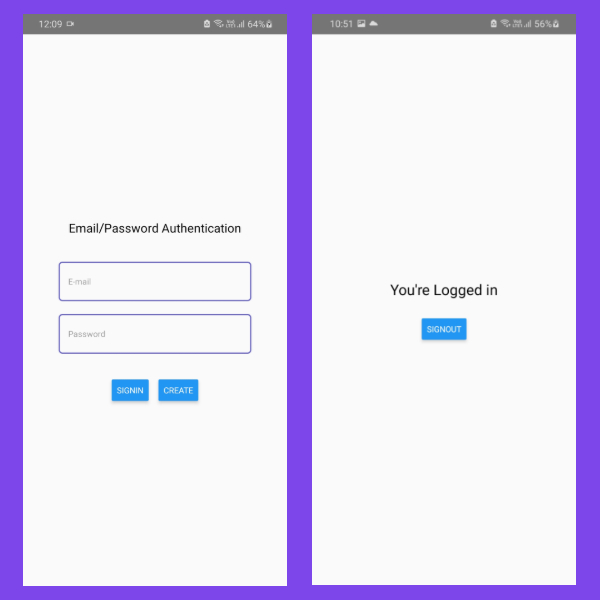
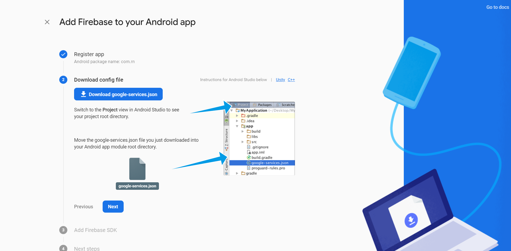
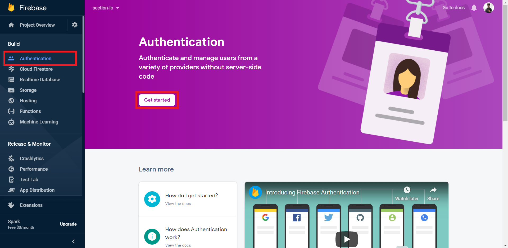

In this tutorial, we will learn how to authenticate users with their email and password using Firebase's authentication module in a Non-Expo React Native application.

### Firebase

Firebase is a platform developed by Google for creating mobile and web applications. It was originally an independent company founded in 2011. In 2014, Google acquired the platform and it is now their flagship offering for app development.

### Firebase Authentication

Firebase's authentication module provides backend services and SDKs to authenticate users in your app. It supports authentication using passwords, phone numbers, popular identity providers like Google, Facebook and Twitter, and more.

The native Firebase SDKs ensures that a users authentication state between app sessions is persisted. The user can clear their authentication state by clearing the app's data/cache.

### Prerequisites

The basics of React and React Native will not be covered in this tutorial. If you are not comfortable with the basics, this is a [helpful tutorial](https://reactnative.dev/docs/tutorial).

### Overview

We'll be going through these steps in this article:

1. Development environment.
2. Cloning the starter code.
3. Setting up the Firebase project.
4. Setting up Firebase Authentication.
5. Create Account.
6. Sign in to Existing Account.
7. Authenticated Screen.
8. Signout.
9. Recap.

### Development environment

> **IMPORTANT** - We will not be using [Expo](https://expo.io/) in our project.

You can follow [this documentation](https://reactnative.dev/docs/environment-setup) to set up the environment and create a new React app.

Make sure you're following the React Native CLI Quickstart, not the Expo CLI Quickstart.


### Cloning the starter code

To focus more on the authentication module, You can clone the starter code from this [repository](https://github.com/zolomohan/rn-firebase-phone-auth-starter) on GitHub. Follow the Repository's README for instructions.

For the final code, you can look at this [GitHub Repository](https://github.com/zolomohan/rn-firebase-phone-auth).

This will be the folder structure of the application.

I've set up 2 screens in the `screens/` directory:

- _Authentication.js_: Screen to login or create account.

- _Authenticated.js_: Screen that the user can see only if he is logged in.



In the _App.js_, the *Authentication* screen is exported. As we write the code for the, we will conditionally display the *Authenticated* screen after authenticating the user.

### Setting up the Firebase project

Head to the [Firebase console](console.firebase.google.com/u/0/) and sign in to your account.

Create a new project.


Once you create a new project, you'll see the dashboard.


Now, click on the Android icon to add an android app to the Firebase project.


You will need the package name of the application to register application. You can find the package name in the `AndroidManifest.xml` which is located in `android/app/src/main/`.

Now, Proceed to the next step, you can download the `google-services.json` file. You should place this file in the `android/app` directory.

This file contains configurations that'll enable your application to access firebase services.



After adding the file, proceed to the next step. It will ask you to add some configurations to the `build.gradle` files.

First, add the `google-services` plugin as a dependency inside of your `android/build.gradle` file:

```gradle
buildscript {
  dependencies {
    // ... other dependencies

    classpath 'com.google.gms:google-services:4.3.3'
  }
}
```

Then, execute the plugin by adding the following to your `android/app/build.gradle` file:

```Gradle
apply plugin: 'com.android.application'
apply plugin: 'com.google.gms.google-services'
```

You need to perform some additional steps to configure `Firebase` for `iOS`. Follow [this documentation](https://rnfirebase.io/#3-ios-setup) to set it up.

Finally, We should install the `@react-native-firebase/app` package in our app to complete the set up for Firebase.

```bash
npm install @react-native-firebase/app
```

### Setting up Firebase Authentication

Head over to the Authentication section in the dashboard and click on the `Get Started` button. This will enable the authentication module in your project.



Next, you should enable email/password authentication in the sign-in methods. Once you've enabled it, press save.


Let's install the `@react-native-firebase/auth` package in our app.

```bash
npm install @react-native-firebase/auth
```

Let's declare the dependency for the authentication module in the `android/app/build.gradle` file using the [Firebase Android BoM](https://firebase.google.com/docs/android/learn-more?authuser=0#bom)

```gradle
dependencies {
    // Add these lines
    implementation platform('com.google.firebase:firebase-bom:26.3.0')
    implementation 'com.google.firebase:firebase-auth'
}
```

With this, the firebase authentication module is set up in our application.

### Create user acccount

The Firebase `auth` module has a function called `createUserWithEmailAndPassword` that'll help creating a new user in the application with an email and a password.

For exmaple:

```JSX
auth().createUserWithEmailAndPassword('johndoe@gmail.com', 'helloworld123');
```

This will create a new user in the Firebase app with the email ID `johndoe@gmail.com` and his respective password. Two users in the same application can't have the same email ID.

This function will also login the user into the application after creating an user account.

In the *App.js*, Let's import the `auth` module.

```JSX
import auth from '@react-native-firebase/auth';
```

Let's write a function that will accept an email and a password and call the `createUserWithEmailAndPassword` to create a new user.

The `createUserWithEmailAndPassword` is an asynchronous function.

```JSX
const createUser = (email, password) => {
  try {
    auth().createUserWithEmailAndPassword(email, password);
  } catch (error) {
    alert(error);
  }
};
```

Now, Let's pass this function to the *Authentication* screen.

```JSX
return <Authentication createUser={createUser} />;
```

When the user presses the *create* button, we should call this function. We should pass the email and the password from the state to this function when it is called.

```JSX
<Button title="Create" onPress={() => props.createUser(email, password)} />
```

Now, when a user presses this button, the `createUserWithEmailAndPassword` is called with the email and password, and this will create a new user in the Firebase app. If there is any error, we'll display it to the user using `alert()`. 

He/She will also be logged in to the application after the user account is created. To track whether the user is authenticated or not, let's create a state and set the initial value to false.

```JSX
const [authenticated, setAuthenticated] = useState(false);
```

The `onAuthStateChanged` event will be triggered whenever the authentication state of the user changes inside the application.

You can set an event handler for this listener. This handler will receive the `user` object. If the `user` object is `null`, it means the user is signed-out, otherwise, they are signed-in. 

Let's set the `authenticated` state to `true` if the `user` object is not `null` in the `onAuthStateChanged` handler.

```JSX
auth().onAuthStateChanged((user) => {
  if(user) {
    setAutheticated(true);
  }
})
```

Now, let's return the *Authenticated* screen if the user is authenticated in the application.

```JSX
if (authenticated) {
  return <Authenticated />;
}

return <Authentication createUser={createUser} />;
```

### Sign in user

The Firebase `auth` module has a function called `signInWithEmailAndPassword` that'll sign in the user into the application with an email and a password.

For exmaple, This will sign in the user into the app with the email ID:

```JSX
auth().signInWithEmailAndPassword('johndoe@gmail.com', 'helloworld123');
```


Let's write a function that will accept an email and a password and call the `signInWithEmailAndPassword` to sign in the user.

The `signInWithEmailAndPassword` is an asynchronous function.

```JSX
const login = (email, password) => {
  try {
    auth().signInWithEmailAndPassword(email, password);
  } catch (error) {
    alert(error);
  }
};
```

Now, Let's pass this function to the *Authentication* screen.

```JSX
return <Authentication login={login} createUser={createUser} />;
```

When the user presses the *login* button, we should call this function. We should pass the email and the password from the state to this function when it is called.

```JSX
<Button title="Login" onPress={() => props.login(email, password)} />
```

Now, when a user presses the *Login* button, the `signInWithEmailAndPassword` is called with the email and password, and this login the user into the app. If there is any error, we'll display it to the user using `alert()`.

