In this tutorial, we will learn how to authenticate users with their Facebook accounts using the authentication module in Firebase in a Non-Expo React Native application.

<!--more-->

### Firebase

Firebase is a platform developed by Google for creating mobile and web applications. It was an independent company founded in 2011. In 2014, Google acquired the platform, and now it's their flagship offering for application development.

Firebase's authentication module provides backend services and SDKs to authenticate users in your app. It supports authentication using passwords, phone numbers, popular identity providers like Google, Facebook and Twitter, and more.

The native Firebase SDKs ensure that a user's authentication state between app sessions persists. The user can clear their authentication state by clearing the app's data/cache.

### Prerequisites

The basics of React and React Native will not be covered in this tutorial. If you are not comfortable with the basics, this is a [helpful tutorial](https://reactnative.dev/docs/tutorial).

### Overview

We'll be going through these steps in this article:

1. [Development environment](#development-environment).
2. [Cloning the starter code](#cloning-the-starter-code).
3. [Setting up the Firebase project](#setting-up-the-firebase-project).
4. [Setting up Facebook App](#setting-up-facebook-app)
5. [Setting up Firebase Authentication](#setting-up-firebase-authentication).
6. [Sign-in](#sign-in)
7. [Display authenticated screen](#display-authenticated-screen)
8. [Sign out](#sign-out)
9. [Recap](#lets-recap)

### Development environment

> **IMPORTANT** - We will not be using [Expo](https://expo.io/) in our project.

You can follow [this documentation](https://reactnative.dev/docs/environment-setup) to set up the environment and create a new React app.

Make sure you're following the React Native CLI Quickstart, not the Expo CLI Quickstart.


### Cloning the starter code

To focus more on the authentication, You can clone the starter code from this [repository](https://github.com/zolomohan/rn-firebase-phone-auth-starter) on GitHub. Follow the Repository's README for instructions.

For the final code, check out this [GitHub Repository](https://github.com/zolomohan/rn-firebase-phone-auth).

This will be the folder structure of the application.

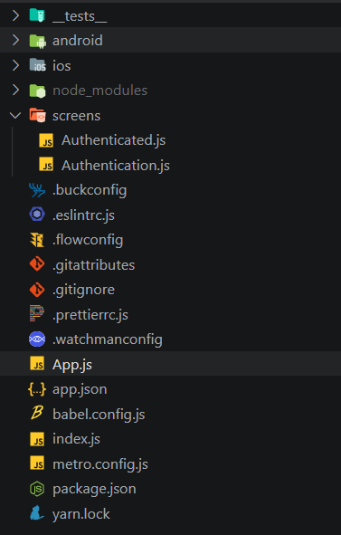

I've set up 2 screens in the `screens/` directory:

- _Authentication.js_: Screen with a Facebook Sign-in button to initiate the sign-in process.

- _Authenticated.js_: Screen that the user can see only if he is logged in.

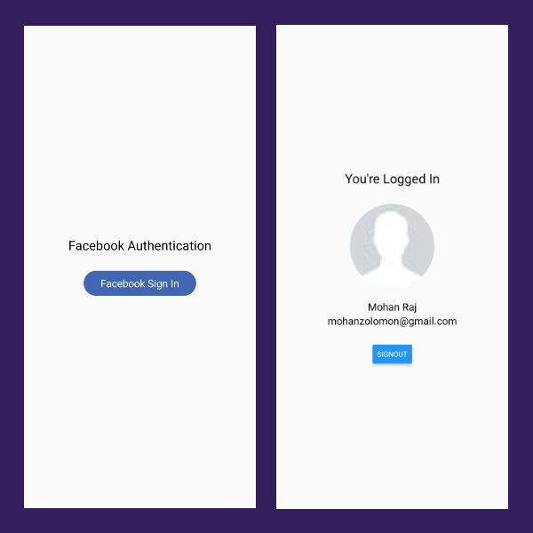

### Setting up the Firebase project

Head to the [Firebase console](console.firebase.google.com/u/0/) and sign in to your account.

Create a new project.

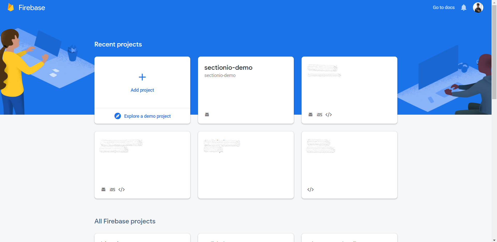

Once you create a new project, you'll see the dashboard.

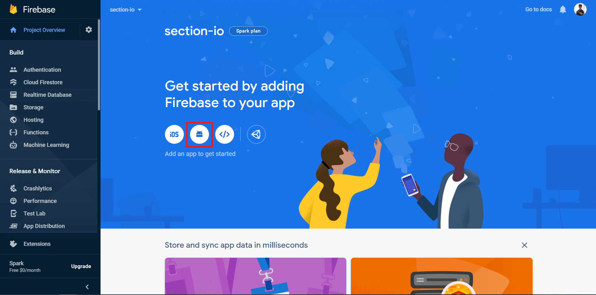

Now, click on the Android icon to add an android app to the Firebase project.


You will need the package name of the application to register application. You can find the package name in the `AndroidManifest.xml` which is located in `android/app/src/main/`.

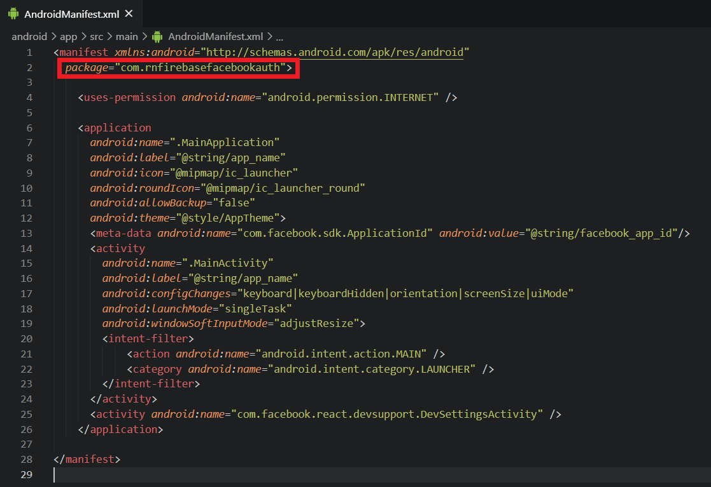

Now, Proceed to the next step, you can download the `google-services.json` file. You should place this file in the `android/app` directory.

This file contains configurations that'll enable your application to access firebase services.


After adding the file, proceed to the next step. It will ask you to add some configurations to the `build.gradle` files.

First, add the `google-services` plugin as a dependency inside of your `android/build.gradle` file:

```gradle
buildscript {
  dependencies {
    // ... other dependencies
    classpath 'com.google.gms:google-services:4.3.3'
  }
}
```

Then, execute the plugin by adding the following to your `android/app/build.gradle` file:

```Gradle
apply plugin: 'com.android.application'
apply plugin: 'com.google.gms.google-services'
```

You need to perform some additional steps to configure `Firebase` for `iOS`. Follow [this documentation](https://rnfirebase.io/#3-ios-setup) to set it up.

Finally, We should install the `@react-native-firebase/app` package in our app to complete the set up for Firebase.

```bash
npm install @react-native-firebase/app
```

### Setting up Facebook App

Head to [developers.facebook.com](https://developers.facebook.com/) and create a developer account.

Go to the [Apps](https://developers.facebook.com/apps) section and create a new app.

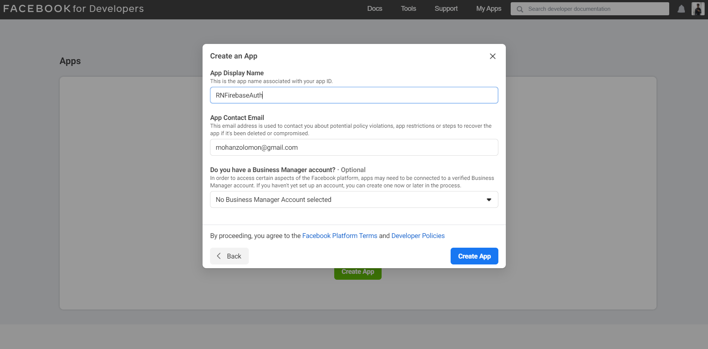

Once you create an application, you will be greeted with the App Dashboard. Add the Facebook Login product to your app from the dashboard.

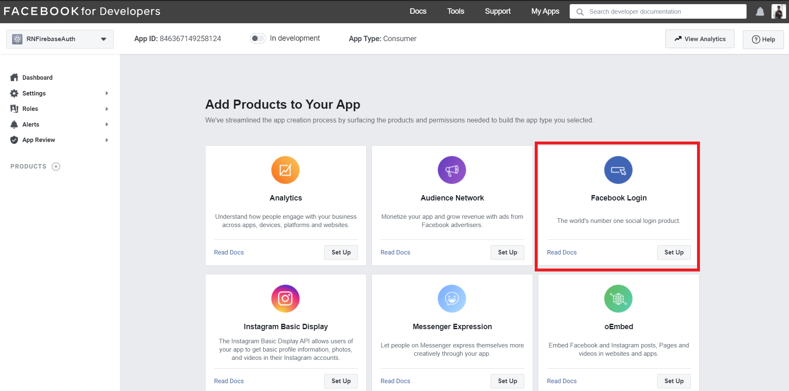

To find the App ID and the App secret, which will be required in the later steps, head to basic settings.

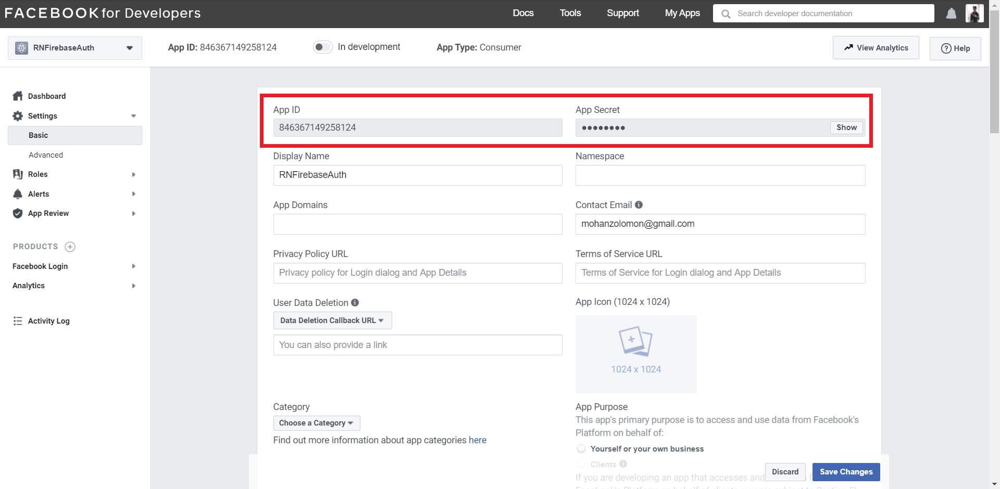

Once you make a copy of it, Scroll down until you find **Add Platform**.

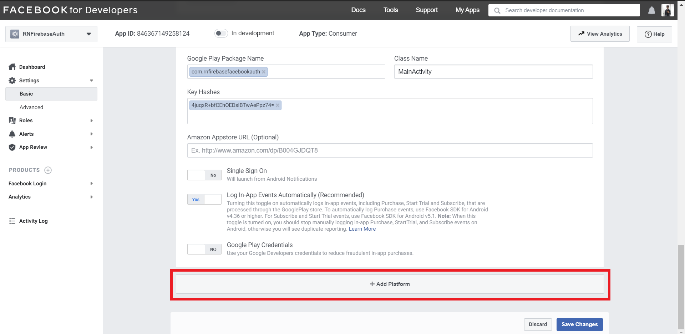

Once you click on it, Select Android. Fill out the **Package Name**, which you can find the package name in the `AndroidManifest.xml` which is located in `android/app/src/main/`.

For the **Class Name**, fill it out as `MainActivity`.

For the **Key Hash**, you need to generate it using [openSSL](https://www.openssl.org/). You can download it from [Google Code Archive](https://code.google.com/archive/p/openssl-for-windows/downloads). Download the **K** version.

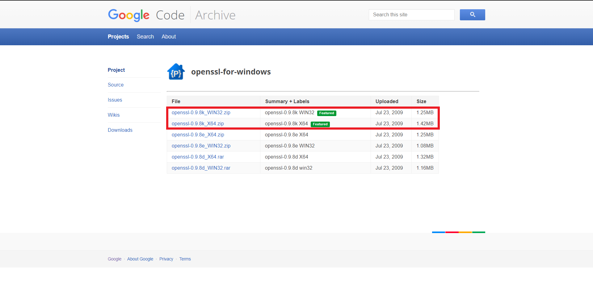

Once you've downloaded it, extract it and copy the folder to `C:/`.

Detect your `keytool.exe`, which can be found in the JDK directory inside the `bin/` directory. It's usually in a location like `C:\Program Files\Java\jdk1.8.0_261\bin`.

Now, inside the `bin/` folder, run:

```bash
keytool -exportcert -alias androiddebugkey -keystore "C:\Documents and Settings\Administrator.android\debug.keystore" | "C:\OpenSSL\bin\openssl" sha1 -binary |"C:\OpenSSL\bin\openssl" base64
```

Output:

```bash
4iuaxR+bpCEhMEQslBTwAePpz74=
```

Refer to this [StackOverflow Question](https://stackoverflow.com/questions/7506392/how-to-create-android-facebook-key-hash) for more details on how to generate a Key Hash.

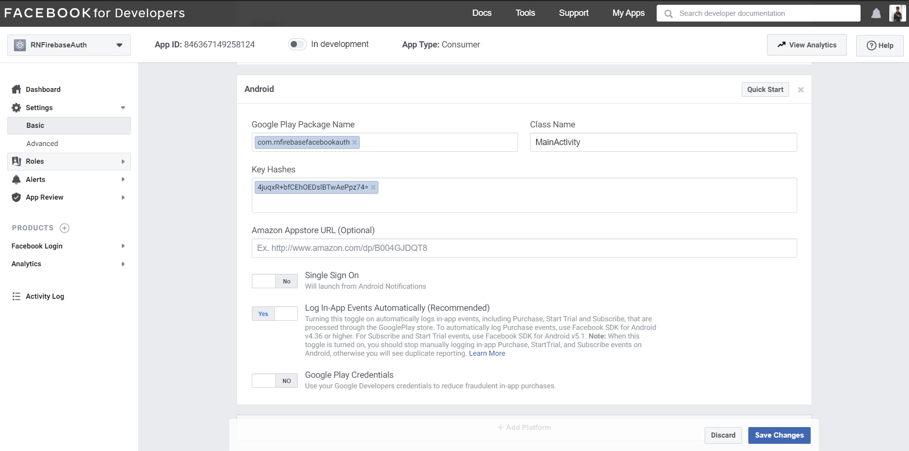

For iOS setup, refer to this [Quick Start](https://developers.facebook.com/quickstarts/?platform=ios) Guide.

### Setting up Firebase Authentication

Head over to the Authentication section in the dashboard and click on the `Get Started` button. This will enable the authentication module in your project.


Next, you should enable Facebook authentication in the sign-in methods. Once you've enabled it, you should provide the App ID and the App secret from the Facebook Developer Console and press Save.

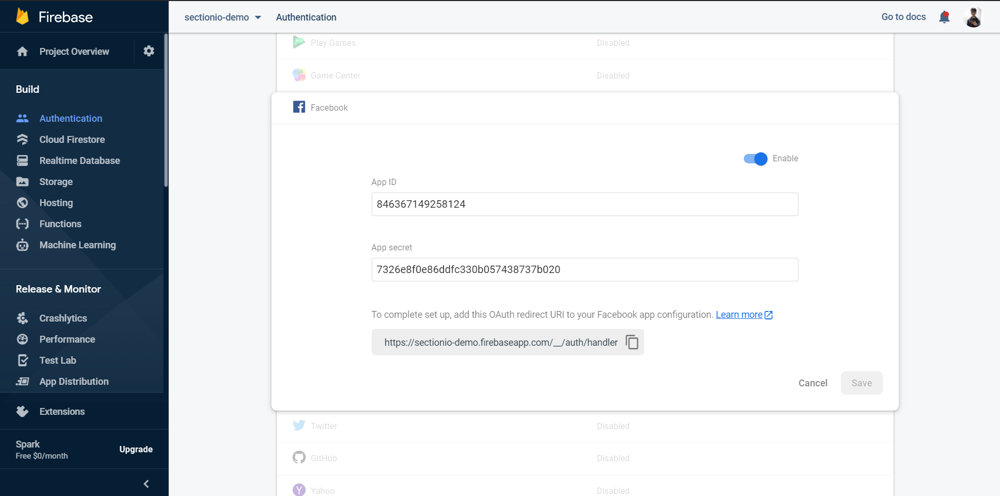

To complete set up, you should OAuth redirect URI to your Facebook app configuration.

Copy the OAuth redirect URI and head to the Facebook Developer console.

Under Products, head to Settings in Facebook Login. Paste the redirect URI under Valid OAuth Redirect URIs in Clien OAuth Settings.

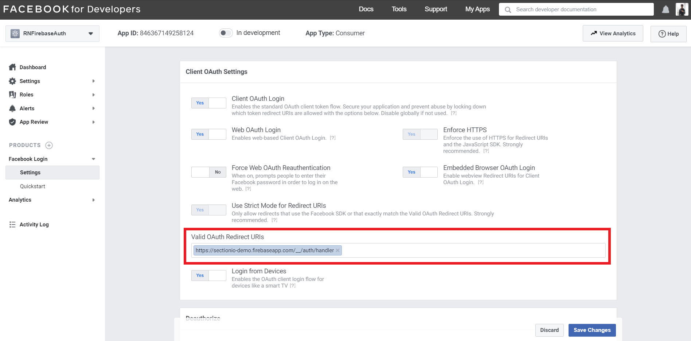

Now, let's head to the application and install the auth module.

Let's install the `@react-native-firebase/auth` package in our app.

```bash
npm install @react-native-firebase/auth
```

Let's declare the dependency for the authentication module in the `android/app/build.gradle` file using the [Firebase Android BoM](https://firebase.google.com/docs/android/learn-more?authuser=0#bom)

```gradle
dependencies {
    // Add these lines
    implementation platform('com.google.firebase:firebase-bom:26.3.0')
    implementation 'com.google.firebase:firebase-auth'
}
```

Next, let's install the React Native Facebook SDK.

```bash
npm install react-native-fbsdk
```

In `android/build.gradle`, add `mavenCentral()` under `repositories` in `buildscript`:

```gradle
buildscript {
    repositories {
        google()
        jcenter()

        // Add this line
        mavenCentral()
    }
}
```

In `android/app/build.gradle`, add the following under `dependencies`:

```gradle
implementation 'com.facebook.android:facebook-android-sdk:[5,6)'
```

Now, you should add your Facebook App ID to your project's strings file in `android/app/res/values/strings.xml`.

```XML
<resources>
  <string name="app_name">RNFirebaseFacebookAuth</string>
  <string name="facebook_app_id"><-- Your App ID here --></string>
</resources>
```

In the `AndroidManifest.xml` file, add a `uses-permission` element under `manifest`:

```XML
<uses-permission android:name="android.permission.INTERNET" />
```

Next, add a `meta-data` to the `application` element:

```XML
<application android:label="@string/app_name" ...>
    ...
    <meta-data android:name="com.facebook.sdk.ApplicationId" android:value="@string/facebook_app_id"/>
    ...
</application>
```

Follow this [Getting Started Guide](https://developers.facebook.com/docs/ios/getting-started/?sdk=cocoapods) to set up the SDK for iOS.

### Sign-in

In *App.js*, Let's create a function called `signIn` which will be called when the user presses the Sign in button. Let's wrap all the code inside the function in a `try/catch` block to display any error that may arise during the sign in flow.

```JSX
async function signIn() {
  try {

    // Code goes here

  } catch (error) {
    alert(error);
  }
}
```

Let's use the Login Manager to log in with permissions. We need to pass a array of permissions that the app needs to the function.

```JSX
const result = await LoginManager.logInWithPermissions([
  'public_profile',
  'email',
]);
```

If the result contains an `isCancelled` propery, it means the user cancelled process. Let's throw an error which will then be handled by `catch` block.

```JSX
if (result.isCancelled) {
  throw 'User cancelled the login process';
}
```

Once signed in, we should get the users AccesToken.

```JSX
const data = await AccessToken.getCurrentAccessToken();
```

If the data is empty, let's throw an error.

```JSX
if (!data) {
  throw 'Something went wrong obtaining access token';
}
```

Now, we should create a credential using the access token and sign in the user into the app.

```JSX
const facebookCredential = auth.FacebookAuthProvider.credential(data.accessToken,);
return auth().signInWithCredential(facebookCredential);
```

Here is the complete code for the signIn function:

```JSX
async function signIn() {
  try {
    // Attempt login with permissions
    const result = await LoginManager.logInWithPermissions([
      'public_profile',
      'email',
    ]);

    if (result.isCancelled) {
      throw 'User cancelled the login process';
    }

    // Once signed in, get the users AccesToken
    const data = await AccessToken.getCurrentAccessToken();

    if (!data) {
      throw 'Something went wrong obtaining access token';
    }

    // Create a Firebase credential with the AccessToken
    const facebookCredential = auth.FacebookAuthProvider.credential(
      data.accessToken,
    );

    // Sign-in the user with the credential
    return auth().signInWithCredential(facebookCredential);
  } catch (error) {
    alert(error);
  }
}
```

### Display Authenticated Screen

The `onAuthStateChanged` event will be triggered whenever the authentication state of the user changes inside the application.

You can set an event handler for this listener. This handler will receive the `user` object. If the `user` object is `null`, it means the user is signed-out, otherwise, they are signed-in.

You can access the current authenticated user's details using `auth().currentUser` from anywhere in the application. The user object will contain the `displayName`, `email`, and `photoURL` which were copied from Google to Firebase.

To learn more about the user object, refer to this [documentation](https://rnfirebase.io/reference/auth/user).

Let's create a state to track whether the user is authenticated or not. We should set the default value to `false`.

```JSX
const [authenticated, setAutheticated] = useState(false);
```

Let's set the `authenticated` state to `true` if the `user` object is not `null` in the `onAuthStateChanged` handler.

```JSX
auth().onAuthStateChanged((user) => {
  if(user) {
    setAutheticated(true);
  }
})
```

If the user is authenticated, we should display the *Authenticated* screen. 

```JSX
if (authenticated) {
  return <Authenticated />;
}
return <Authentication signIn={signIn} />;
```

I'm using `auth().currentUser` in the *Authenticated* screen to display the email ID, name, and the user's profile picture.

```JSX
const user = auth().currentUser;
return (
  <View style={styles.screen}>
    <Text style={styles.title}>You're Logged In</Text>
    <Image source={{ uri: user?.photoURL }} style={styles.image} />
    <Text style={styles.text}>{user?.displayName}</Text>
    <Text style={styles.text}>{user?.email}</Text>
    <View style={{ marginTop: 30 }}>
      <Button title="Signout" onPress={() => auth().signOut()} />
    </View>
  </View>
);
```


### Sign out

We should use the `signOut` method in the auth module to sign out a user from the application.

Let's import the `auth` module in *Authenticated.js*.

```JSX
import auth from '@react-native-firebase/auth';
```

Let's call the `signOut` method when the user presses the signout button.

```JSX
<Button title="Signout" onPress={() => auth().signOut()} />
```

Now, when the user presses the button, the auth module will sign out the user from the application. This will trigger the `onAuthStateChanged` listener. The handler will receive `null` instead of the `user` object.

Thus, we should set the authenticated state to `false` if we receive `null`.

```JSX
auth().onAuthStateChanged((user) => {
  if(user) {
    setAuthenticated(true);
  } else {
    setAuthenticated(false);
  }
})
```

