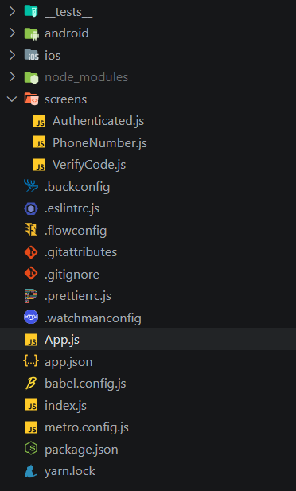
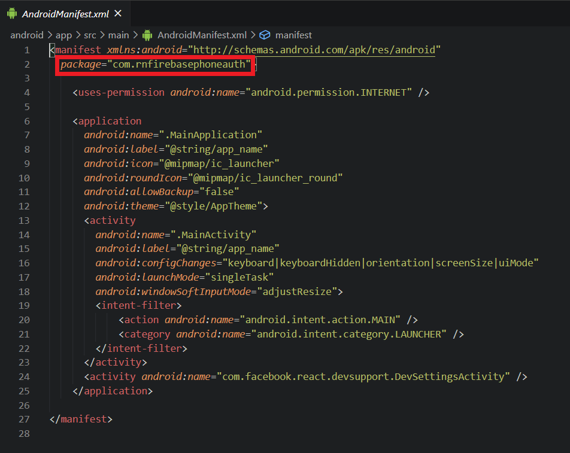
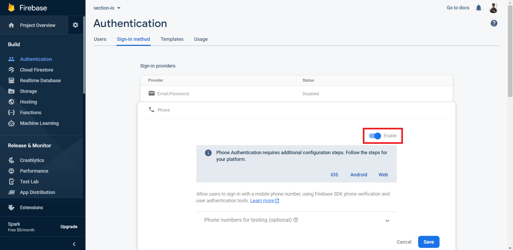
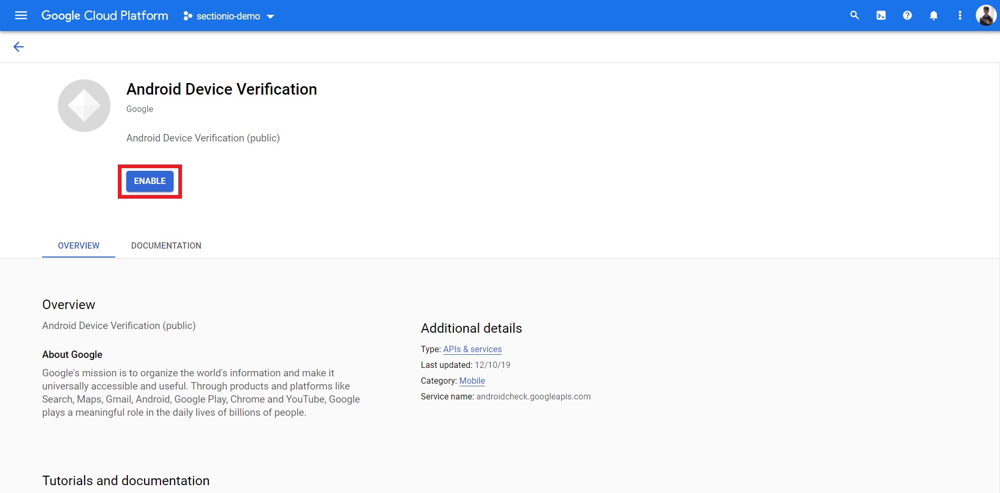
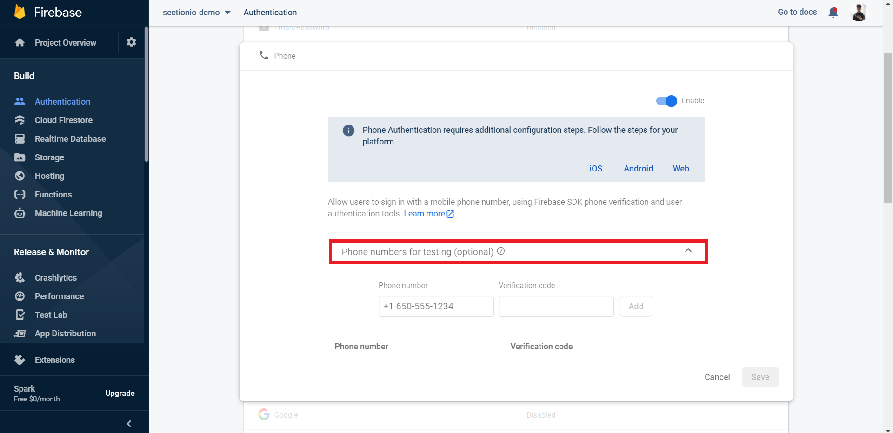

In this tutorial, we will learn how to authenticate users with their phone number using Firebase's authentication module in a Non-Expo React Native application.

### Firebase

Firebase is a platform developed by Google for creating mobile and web applications. It was originally an independent company founded in 2011. In 2014, Google acquired the platform and it is now their flagship offering for app development.

Firebase's authentication module provides backend services and SDKs to authenticate users in your app. It supports authentication using passwords, phone numbers, popular identity providers like Google, Facebook and Twitter, and more.

### Prerequisites

The basics of React and React Native will not be covered in this tutorial. If you are not comfortable with the basics, this is a [helpful tutorial](https://reactnative.dev/docs/tutorial).

### Overview

We'll be going through these steps in this article:

1. Development environment.
2. Cloning the starter code.
3. Installing dependencies.
4. Setting up the Firebase project.
5. Setting up Firebase Authentication.
6. Phone Number.
7. Verification Code.
8. Authenticated Screen.
9. Signout.
10. Test phone numbers.
11. Recap.

### Development environment

> **IMPORTANT** - We will not be using Expo in our project.

You can follow [this documentation](https://reactnative.dev/docs/environment-setup) to set up the environment and create a new React app.

Make sure you're following the React Native CLI Quickstart, not the Expo CLI Quickstart.


### Cloning the starter code

To focus more on the authentication module, You can clone the starter code from this [repository](https://github.com/zolomohan/rn-firebase-phone-auth-starter) on GitHub. Follow the Repository's README for instructions.

For the final code, you can look at this [GitHub Repository](https://github.com/zolomohan/rn-firebase-phone-auth).

This will be the folder structre of the application.



I've set up 3 screens in the `screens/` directory:

- _PhoneNumber.js_: Screen to enter the phone number.

- _VerifyCode.js_: Screen to enter the one-time verification code.

- _Authenticated.js_: Screen that the user can see only if he is logged in.

In the _App.js_, the PhoneNumber screen is exported. As we write the code for the authentication, we will conditionally display various screens at various stages.

### Installing dependencies

You can install these in advance or while going through the article.

```JSON
"@react-native-firebase/app": "^10.5.0",
"@react-native-firebase/auth": "^10.5.1",
"react": "16.13.1",
"react-native": "0.63.4"
```

To install a dependency, run:

```bash
npm i --save <package-name>
```

After installing the packages, for iOS, go into your `ios/` directory, and run:

```bash
pod install
```

> **IMPORTANT FOR ANDROID**
>
> Adding more native dependecies may bump you over the 64k method limit on the Android build system. If you reach this limit, you will see the following error while attempting to build your Android application.
>
> `Execution failed for task ':app:mergeDexDebug'.`
>
> Use [this documentation](https://rnfirebase.io/enabling-multidex) to enable multidexing.
> To learn more about multidex, view the official [Android documentation](https://developer.android.com/studio/build/multidex#mdex-gradle).

### Setting up the Firebase project

Head to the [Firebase console](console.firebase.google.com/u/0/) and sign in to your account.

Create a new project.


Once you create a new project, you'll see the dashboard.


Now, click on the Android icon to add an android app to the Firebase project.


You will need the package name of the application to register the application. You can find the package name in the `AndroidManifest.xml` which is located in `android/app/src/main/`.



You will also need the Debug signing certificate `SHA-1`. You can get that by running the following command in the application directory.

```bash
cd android && ./gradlew signingReport
```

This will generate the signing certificate of the application. You will get a similiar output like this:

```bash
Variant: debugUnitTest
Config: debug
Store: C:\Users\Mohan\.android\debug.keystore
Alias: AndroidDebugKey
MD5: 5F:BB:9E:98:5E:E7:E6:29:19:28:61:4F:42:B9:74:AB
SHA1: 9E:61:75:0E:5C:F4:EB:B4:EB:9D:B3:13:5F:50:D6:AB:2E:4E:12:0D
SHA-256: 6C:BB:49:66:18:B9:7F:74:49:B5:56:D0:24:43:6A:1B:41:91:97:A3:2E:7C:4A:6E:59:40:8F:5C:74:6F:CC:93
Valid until: Friday, December 23, 2050
```

Copy the `SHA1` value and paste it in the firebase console.

Now, Proceed to the next step, you can download the `google-services.json` file. You should place this file in the `android/app` directory.

This file contains configurations that'll enable your application to access firebase services.


After adding the file, proceed to the next step. It will ask you to add some configurations to the `build.gradle` files.

First, add the `google-services` plugin as a dependency inside of your `android/build.gradle` file:

```gradle
buildscript {
  dependencies {
    // ... other dependencies

    classpath 'com.google.gms:google-services:4.3.3'
  }
}
```

Then, execute the plugin by adding the following to your `android/app/build.gradle` file:

```Gradle
apply plugin: 'com.android.application'
apply plugin: 'com.google.gms.google-services'
```

You need to perform some additional steps to configure `Firebase` for `iOS`. Follow [this documentation](https://rnfirebase.io/#3-ios-setup) to set it up.

Finally, We should install the `@react-native-firebase/app` package in our app to complete the set up for Firebase.

```bash
npm install @react-native-firebase/app
```

### Setting up Firebase Authentication

Head over to the Authentication section in the dashboard and click on the `Get Started` button. This will enable the authentication module in your project.


Next, you should enable the phone authentication in the sign-in methods. Once you've enabled it, press save.



Firebase must be able to verify that the requests are coming from your app.

There are two ways to accomplish this:

1. **SafetyNet**: If the user has a device with Google Play Services installed, then Firebase can verify whether the request is legitimage.

   In the Google Cloud console, enable the [Android Device Verification API](https://console.cloud.google.com/apis/library/androidcheck.googleapis.com) for your project. The default Firebase API Key will be used, and needs to be allowed to access the DeviceCheck API.

   

2. **reCAPTCHA**: In the event that SafetyNet cannot be used, Firebase does a _reCAPTCHA_ verification. The _reCAPTCHA_ challenge can often be completed without the user having to solve anything.

   > Please note that this flow requires that a SHA-1 is associated with your application.

Now, let's head to the application and install the auth module.

Let's install the `@react-native-firebase/auth` package in our app.

```bash
npm install @react-native-firebase/app
```

Let's declare the dependency for the authentication module in the `android/app/build.gradle` file using the [Firebase Android BoM](https://firebase.google.com/docs/android/learn-more?authuser=0#bom)

```gradle
dependencies {
    // Add these lines
    implementation platform('com.google.firebase:firebase-bom:26.3.0')
    implementation 'com.google.firebase:firebase-auth'
}
```

When `reCAPTCHA` is used for device verification, the application will open the browser for the `reCAPTCHA` test. So, we should also add `implementation "androidx.browser:browser:1.2.0"` in the `android/app/build.gradle` file.

```gradle
dependencies {
    implementation platform('com.google.firebase:firebase-bom:26.3.0')
    implementation 'com.google.firebase:firebase-auth'

    // Add this line
    implementation "androidx.browser:browser:1.2.0
}
```

With this, the firebase authentication module is set up in our application.

### Phone Number

In _App.js_, Let's import the Authentication module from Firebase.

```JSX
import auth from '@react-native-firebase/auth';
```

We should use the `signInWithPhoneNumber` method in the auth module. It accepts a phone number in the form of a string as it's argument. It is an `async` function, thus it returns a Promise.

The phone number should also contain the country code in it.

```JSX
auth().signInWithPhoneNumber('+91 1234567890');
```

This will trigger the Firebase servers to send a verification code to the given phone number.

The `signInWithPhoneNumber` method returns a object with a `confirmation` method that is used to verify the one-time code sent to the number.

Let's create a state using the `useState` hook to hold the `confirmation` method.

```JSX
import React, { useState } from 'react';
```

```JSX
const [confirm, setConfirm] = useState(null);
```

Now, let's write a function that accepts a phone number as an argument, and calls `signInWithPhoneNumber` function with the given phone number. We should use `async/await` to wait for the promise to be resolved. If the promise is resolved, let's set the returned `confirmation` method to the `confirm` state using the `setConfirm` method.

```JSX
async function signIn(phoneNumber) {
  try {
    const confirmation = await auth().signInWithPhoneNumber(phoneNumber);
    setConfirm(confirmation);
  } catch (error) {
    alert(error);
  }
}
```

We should pass this function to the `PhoneNumber` screen as a prop, and call this function when the user presses the button.

```JSX
return <PhoneNumber onSubmit={signIn} />;
```

In *PhoneNumber.js*, I've already set up a state that holds the phone number from the input. Let's call the function that we passed and send the phone number as the argument.

To call a function when the user presses a button, you should pass the function to the `onPress` property of the button.

```JSX
<Button title="Phone Number Sign In" onPress={() => props.onSubmit(phoneNumber)} />
```

Now, when the user presses the button, the `signInWithPhoneNumber` method from the auth module is called and it will trigger the Firebase servers to send a verification code to the given phone number. It will also return a method that should be used to confirm the verification code.

### Verification Code

When the `confirmation` method is available, we should display the *VerifyCode* screen instead of the *PhoneNumber* screen.

```JSX
if (confirm) return <OTPScreen />;

return <PhoneNumber onSubmit={signIn} />;
```

Now, let's write a function to confirm the verification code.

The `confirm` method is an async method. If the verification code is correct, the promise will be resolved. If not, it'll be rejected. We should also make sure to clear the `confirm` method from the state once it serves its purpose.

```JSX
async function confirmVerificationCode(code) {
  try {
    await confirm.confirm(code);
    setConfrim(null);
  } catch (error) {
    alert('Invalid code');
  }
}
```

Let's pass this function to the *VerifyCode* screen as a prop, and call this function when the user presses the confirm button.

```JSX
if (confirm) return <OTPScreen onSubmit={confirmVerificationCode} />;

return <PhoneNumber onSubmit={signIn} />;
```

In *VerifyCode.js*, I've already set up a state that holds the verification code from the input. Let's call the function that we passed and pass the verification code as the argument.

```JSX
<Button title="Confirm OTP" onPress={() => props.onSubmit(otp)} />
```

Now, when the user presses the button, the `confirm` method is called and that will verify the whether is code is correct or not. The user will be authenticated into the app if the verfication code is correct. If not, we will display an error message to the user.

### Autheticated Screen

We can add a listener to the authentication state of the user. The `onAuthStateChanged` event will be triggered whenever the authentication state of the user changes inside the application.

You can set an event handler to this listener. This handler will recieve the `user` object. If the `user` object is `null`, it means the user is signed-out, otherwise they are signed-in. 

Let's create a state to track whether the user is authenticated or not. We should set the default value to `false`.

```JSX
const [authenticated, setAutheticated] = useState(false);
```

Let's set the `authenticated` state to `true` if the `user` object is not `null` in the `onAuthStateChanged` handler.

```JSX
auth().onAuthStateChanged((user) => {
  if(user) {
    setAutheticated(true);
  }
})
```

If the user is autheticated, we should display the *Authenticated* screen. 

```JSX
if (authenticated) return <Autheticated />;

if (confirm) return <OTPScreen onSubmit={confirmOTP} />;

return <PhoneNumber onSubmit={signIn} />;
```

### Signout

We should use the `signOut` method in the auth module to sign out a user from the application.

Let's import the `auth` module in *Authenticated.js*.

```JSX
import auth from '@react-native-firebase/auth';
```

Let's call the `signOut` method when the user presses the signout button.

```JSX
<Button title="Signout" onPress={() => auth().signOut()} />
```

Now, when the user presses the button, the auth module will signout the user from the application. This will trigger the `onAuthStateChanged` listener. The handler will recieve `null` instead of the `user` object.

Thus, we should set the authenticated state to `false` if we recieve `null`.

```JSX
auth().onAuthStateChanged((user) => {
  if(user) {
    setAuthenticated(true);
  } else {
    setAuthenticated(false);
  }
})
```

### Test Phone Numbers

Firebase provides support for testing phone numbers.

In the Firebase Console, click on the "Phone numbers for testing" dropdown in the "Phone" authentication provider.



Enter a new phone number and a test code.

Once added, the number can be used with the `signInWithPhoneNumber` method. The firebase server will not send a verification code to a test number. You should enter the test code that you specified here in the application to sign-in.

### Let's Recap

1. We set up our development environment and created a React Native app.

2. We created a Firebase project.

3. We set up the authentication module and enabled phone numbe authentication in our project.

4. We enabled the Device Verification API in the Google Cloud Console for our project.

5. We cloned the starter code.

6. We added the dependencies to the `build.gradle` files.

7. We used the `auth` module to send a verification code to the given phone number.

8. We added a method to confirm the verification code.

9. We displayed the authenticated screen is the verification code is correct.

Congratulations, :partying_face: You did it.

Thanks for Reading!