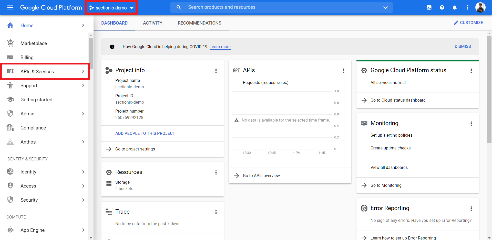
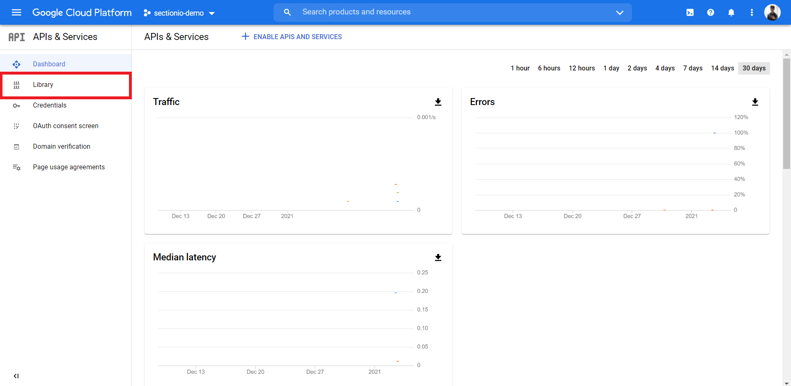
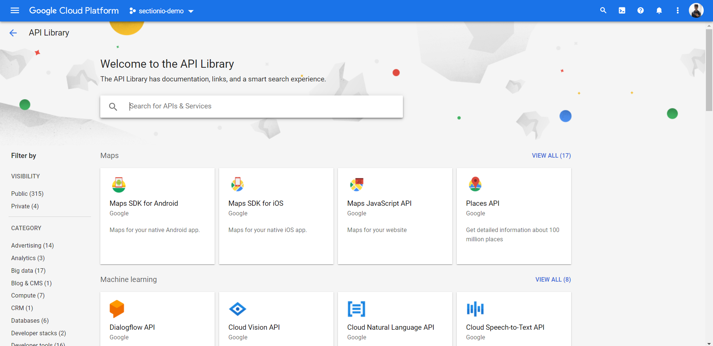
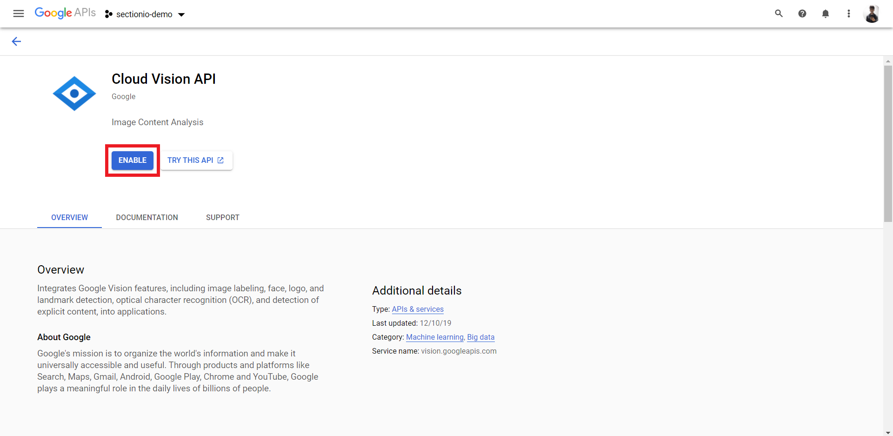
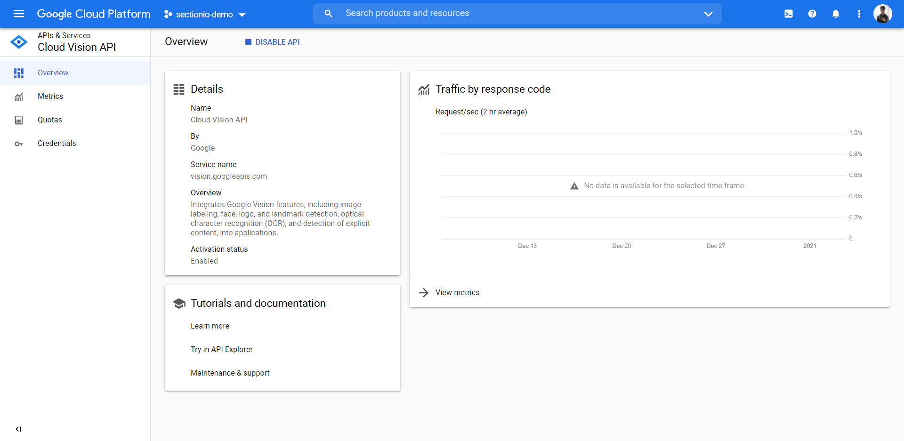

In this tutorial, we will be building a Non-Expo React Native application to recognize landmarks from images using Firebase's machine learning kit.

### Firebase

Firebase is a platform developed by Google for creating mobile and web applications. It was originally an independent company founded in 2011. In 2014, Google acquired the platform and it is now their flagship offering for app development. [Wikipedia](https://en.wikipedia.org/wiki/Firebase)

### Prerequisites

The fundamentals of React and React Native will not be covered in this tutorial. If you are not comfortable with the fundamentals, this is a [helpful tutorial](https://reactnative.dev/docs/tutorial) that you can go through before beginning with this project.

### Overview

We'll be going through these steps in this article:

1. Development environment.
2. Installing dependencies.
3. Setting up the Firebase project.
4. Setting up Cloud Vision API.
5. Building the UI.
6. Adding media picker.
7. Recognize Landmarks from Images.
8. Additional Configurations.
9. Recap.

You can take a look at the final code in this [GitHub Repository](https://github.com/zolomohan/react-native-firebase-ml-landmark-recognition).

### Development environment

> **IMPORTANT** - We will not be using Expo in our project.

You can follow [this documentation](https://reactnative.dev/docs/environment-setup) to set up the environment and create a new React app.

Make sure you're following the React Native CLI Quickstart, not the Expo CLI Quickstart.

### Installing dependencies

You can install these packages in advance or while going through the article.

```JSON
"@react-native-firebase/app": "^10.4.0",
"@react-native-firebase/ml": "^10.4.0",
"react": "16.13.1",
"react-native": "0.63.4",
"react-native-image-picker": "^3.1.3"
```

To install a dependency, run:

```bash
npm i --save <package-name>
```

After installing the packages, for iOS, go into your `ios/` directory, and run:

```bash
pod install
```

> **IMPORTANT FOR ANDROID**
>
> As you add more native dependencies to your project, it may bump you over the 64k method limit on the Android build system. Once you reach this limit, you will start to see the following error while attempting to build your Android application.
>
> `Execution failed for task ':app:mergeDexDebug'.`
>
> Use [this documentation](https://rnfirebase.io/enabling-multidex) to enable multidexing.
> To learn more about multidex, view the official [Android documentation](https://developer.android.com/studio/build/multidex#mdex-gradle).

### Setting up the Firebase project

Head to the [Firebase console](console.firebase.google.com/u/0/) and sign in to your account.

Create a new project.


Once you create a new project, you'll see the dashboard.


Now, click on the Android icon to add an android app to the Firebase project.


You will need the package name of the application to register the application. You can find the package name in the `AndroidManifest.xml` which is located in `android/app/src/main/`.


Once you enter the package name and proceed to the next step, you can download the `google-services.json` file. You should place this file in the `android/app` directory.


After adding the file, proceed to the next step. It will ask you to add some configurations to the `build.gradle` files.

First, add the `google-services` plugin as a dependency inside of your `android/build.gradle` file:

```gradle
buildscript {
  dependencies {
    // ... other dependencies

    classpath 'com.google.gms:google-services:4.3.3'
  }
}
```

Then, execute the plugin by adding the following to your `android/app/build.gradle` file:

```Gradle
apply plugin: 'com.android.application'
apply plugin: 'com.google.gms.google-services'
```

You need to perform some additional steps to configure `Firebase` for `iOS`. Follow [this documentation](https://rnfirebase.io/#3-ios-setup) to set it up.

We should install the `@react-native-firebase/app` package in our app to complete the set up for Firebase.

```bash
npm install @react-native-firebase/app
```

### Setting up Cloud Vision API

Head to [Google Cloud Console](https://console.cloud.google.com/) and select the Google project that you are working on.



Go to the API & Services tab.



In the API & Service tab, Head to the Libraries section.



Search for Cloud Vision API. Once you open the API page, click on the Enable button.



Once you've enabled the API, you'll see the Cloud Vision API Overview page.



With this, you have set up the Cloud Vision API for your Firebase project. This will enable us to use the ML Kit for landmark recognition.

### Building the UI

In the `App.js`, let's add 2 buttons to the screen to take a photo and pick a photo.

```JSX
import { StyleSheet, Text, ScrollView, View, TouchableOpacity } from 'react-native';

export default function App() {
  return (
    <ScrollView contentContainerStyle={styles.screen}>
      <Text style={styles.title}>Landmark Recognition</Text>
      <View>
        <TouchableOpacity style={styles.button}>
          <Text style={styles.buttonText}>Take Photo</Text>
        </TouchableOpacity>
        <TouchableOpacity style={styles.button}>
          <Text style={styles.buttonText}>Pick a Photo</Text>
        </TouchableOpacity>
      </View>
    </ScrollView>
  );
}
```

Styles:

```JSX
const styles = StyleSheet.create({
  screen: {
    flex: 1,
    alignItems: 'center',
  },
  title: {
    fontSize: 35,
    marginVertical: 40,
  },
  button: {
    backgroundColor: '#47477b',
    color: '#fff',
    justifyContent: 'center',
    alignItems: 'center',
    paddingVertical: 15,
    paddingHorizontal: 40,
    borderRadius: 50,
    marginTop: 20,
  },
  buttonText: {
    color: '#fff',
  },
});
```

### Adding media picker

Now, the first 2 buttons should open the camera to take a photo and record a video respectively, and the next 2 buttons should open the gallery to pick an image and video respectively.

Let's install the `react-native-image-picker` to add these functionalities.

```bash
npm install react-native-image-picker
```

> The minimum target SDK for the React Native Image Picker is 21. If your project targets an SDK below 21, bump up the minSDK target in `android/build.gradle`.

After the package is installed, import the `launchCamera` and `launchImageLibrary` functions from the package.

```JSX
import { launchCamera, launchImageLibrary } from 'react-native-image-picker';
```

Both functions accept 2 arguments. The first argument is `options` for the camera or the gallery, and the second argument is a callback function. This callback function is called when the user picks an image or cancels the operation.

Check out the [API Reference](https://www.npmjs.com/package/react-native-image-picker#api-reference) for more details about these functions.

Now let's add 2 functions, one for each button.

```JSX
const onTakePhoto = () => launchCamera({ mediaType: 'image' }, onImageSelect);

const onSelectImagePress = () => launchImageLibrary({ mediaType: 'image' }, onImageSelect);
```

Let's create a function called `onImageSelect`. This is the callback function that we are passing to the `launchCamera` and the `launchImageLibrary` functions. We will get the details of the image that the user picked in this callback function.

We should start the landmark recognition only when the user did not cancel the media picker. If the user canceled the operation, the picker will send a `didCancel` property in the response object.

```JSX
const onImageSelect = async (media) => {
  if (!media.didCancel) {
    // Landmark Recognition Process
  }
};
```

You can learn more about the response object that we get from the `launchCamera` and the `launchImageLibrary` functions [here](https://www.npmjs.com/package/react-native-image-picker#the-response-object).


Now, pass these functions to the `onPress` prop of the `TouchableOpacity` for the respective buttons.

```JSX
<TouchableOpacity style={styles.button} onPress={onTakePhoto}>
  <Text style={styles.buttonText}>Take Photo</Text>
</TouchableOpacity>
<TouchableOpacity style={styles.button} onPress={onSelectImagePress}>
  <Text style={styles.buttonText}>Pick a Photo</Text>
</TouchableOpacity>
```

Let's create a state to display the selected image on the UI.

```JSX
const [image, setImage] = useState();
```

Now, let's add an Image component below the buttons to display the selected image.

```JSX
<View>
  <TouchableOpacity style={styles.button} onPress={onTakePhoto}>
    <Text style={styles.buttonText}>Take Photo</Text>
  </TouchableOpacity>
  <TouchableOpacity style={styles.button} onPress={onSelectImagePress}>
    <Text style={styles.buttonText}>Pick a Photo</Text>
  </TouchableOpacity>
  <Image source={{ uri: image }} style={styles.image} />
</View>
```

Styles for the Image:

```JSX
image: {
  height: 300,
  width: 300,
  marginTop: 20,
  borderRadius: 10,
},
```

Let's set the image state with the URI of the selected image in the `onImageSelect` function when the user did not cancel the operation.

```JSX
const onImageSelect = async (media) => {
  if (!media.didCancel) {
    setImage(media.uri);
  }
};
```

### Recognize Landmarks from Images

Let's install the package for Firebase ML.

```bash
npm install @react-native-firebase/ml
```

Once the package is installed, let's import the package.

```JSX
import ml from '@react-native-firebase/ml';
```

We should use the `cloudLandmarkRecognizerProcessImage` method in the `ml` package to process the image and get the landmarks in the image.

We will pass the URI of the selected image to this function.

```JSX
const landmarks = await ml().cloudLandmarkRecognizerProcessImage(media.uri);
```

The function will process the image and return the list of landmarks that are identified in the image along with:

- The 4-point coordinates of the landmarks on the image.

- Latitude & Longitude of the landmarks.

- The confidence the Machine Learning service has in its own results.

- An entity ID for use on Google's [Knowledge Graph Search API](https://developers.google.com/knowledge-graph/).


Let's set up a state to store the results and render them in the UI. Since the result will be an array of landmarks, let's set the initial state to an empty array.

```JSX
const [landmarks, setLandmarks] = useState([]);
```

Let's set the state to the response of the `cloudLandmarkRecognizerProcessImage` function.

```JSX
const onImageSelect = async (media) => {
  if (!media.didCancel) {
    setImage(media.uri);
    const landmarks = await ml().cloudLandmarkRecognizerProcessImage(
      media.uri,
    );
    setLandmarks(landmarks);
  }
};
```

We can use this state to render the details in the UI.

```JSX
{landmarks.map((item, i) => (
  <View style={{ marginTop: 20, width: 300 }} key={i}>
    <Text>LandMark: {item.landmark}</Text>
    <Text>BoundingBox: {JSON.stringify(item.boundingBox)}</Text>
    <Text>Coordinates: {JSON.stringify(item.locations)}</Text>
    <Text>Confidence: {item.confidence}</Text>
    <Text>Confidence: {item.entityId}</Text>
  </View>
))}
```

### Additional Configurations

The `cloudLandmarkRecognizerProcessImage` method accepts an optional configuration object.

- **maxResults**: Sets the maximum number of results of this type.

- **modelType**: Sets model type for the detection. By default, the function will use the `STABLE_MODEL`. However, if you feel that the results are not up-to-date, you can optionally use the `LATEST_MODEL`.

- **apiKeyOverride**: API key to use for ML API. If not set, the default API key from `firebase.app()` will be used.

- **enforceCertFingerprintMatch**: Only allow registered application instances with matching certificate fingerprints to use ML API.

### Let's Recap
1. We set up our development environment and created a React Native app.

2. We created a Firebase project.

3. We set up the Cloud Vision API to use the Landmark Recognizer in the Firebase ML Kit.

4. We built a simple UI for the app.

5. We added the `react-native-image-picker` package to pick images using the gallery or capture images using the camera.

6. We installed the Firebase ML package.

7. We used the `cloudLandmarkRecognizerProcessImage` function in the `ml` package to recognize the landmarks in the images.

8. We displayed the results in the UI.

9. We learned about the additional configurations that we can pass to the `cloudLandmarkRecognizerProcessImage` function.

Congratulations, :partying_face: You did it.

Thanks for Reading!