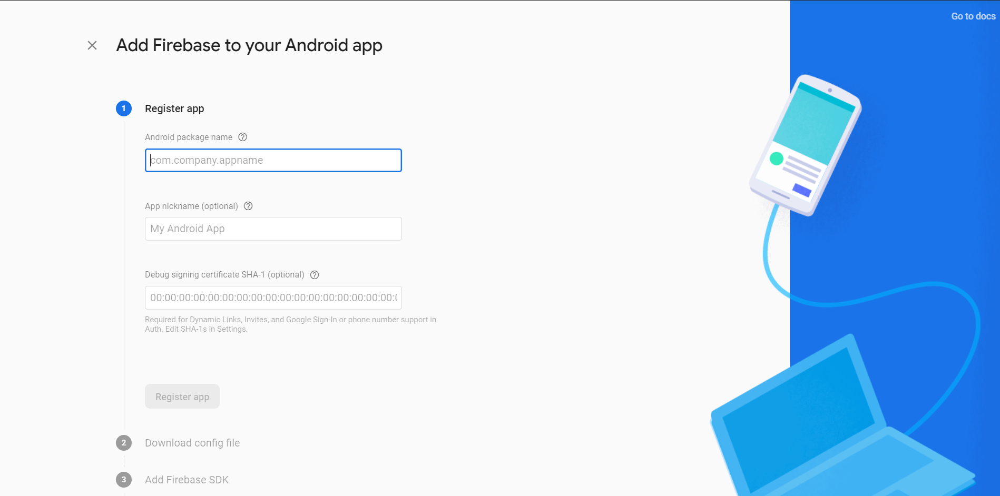
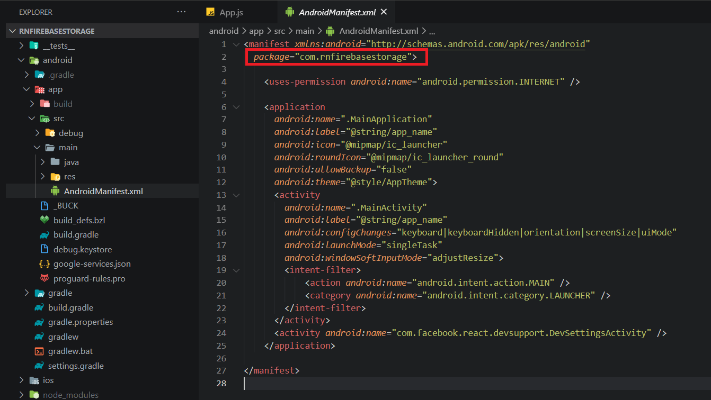
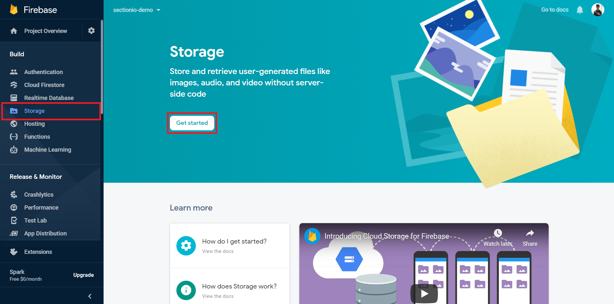
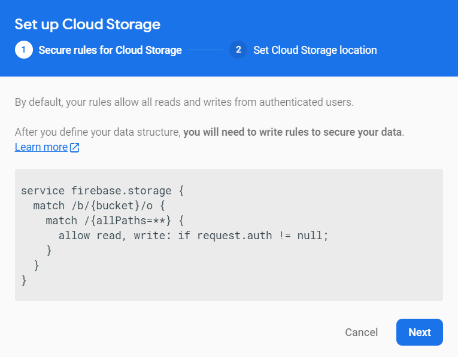
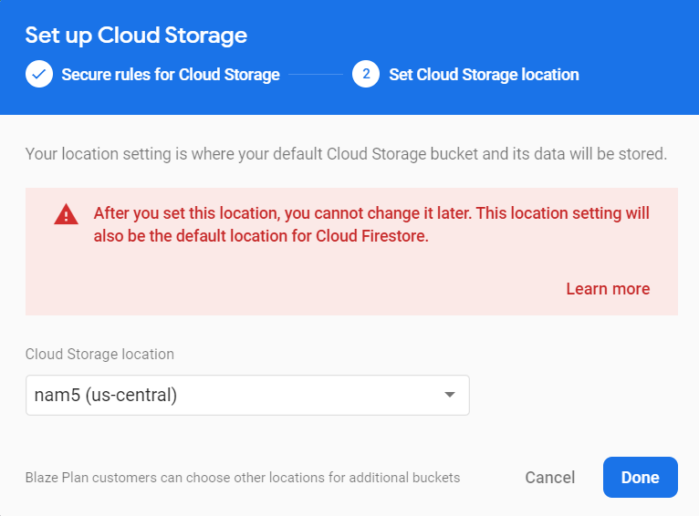
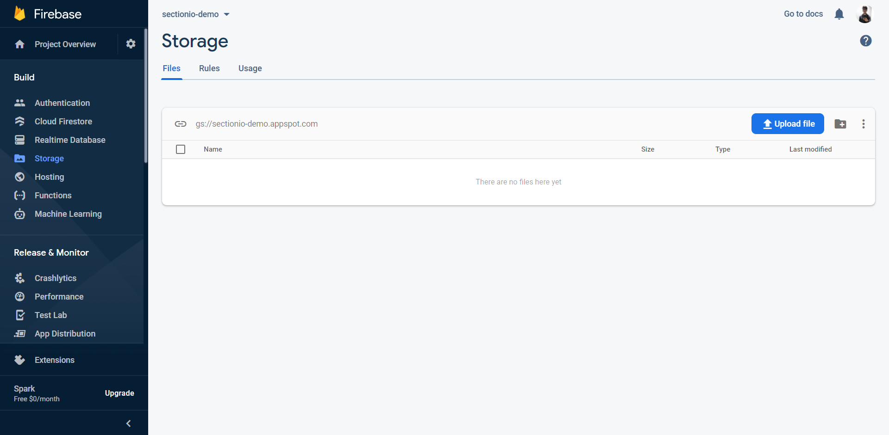
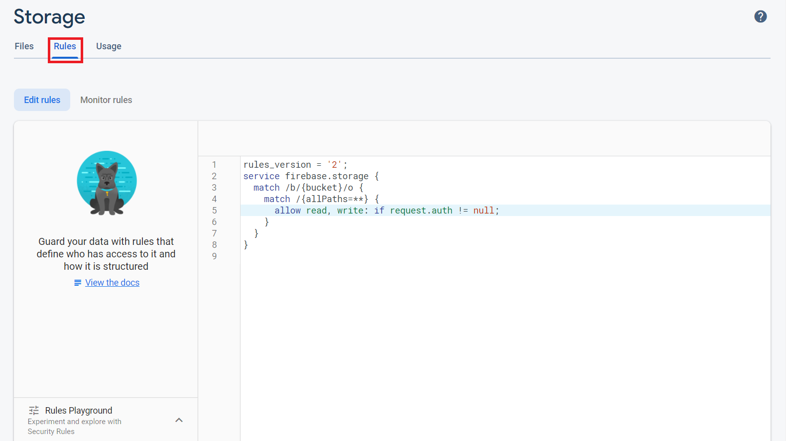

In this tutorial, we will be building a React Native application to upload images and videos to Firebase's cloud storage.

### Firebase
Firebase is a platform developed by Google for creating mobile and web applications. It was originally an independent company founded in 2011. In 2014, Google acquired the platform and it is now their flagship offering for app development.

### Prerequisites
The fundamentals of React and React Native will not be covered in this tutorial. If you are not comfortable with the fundamentals, this is a [helpful tutorial](https://reactnative.dev/docs/tutorial) that you can go through before beginning with this project.

### Overview
We'll be going through these steps in this article:

1. Development environment.
2. Set up Firebase Project.
3. Set up Firebase Storage.
4. Installing dependencies.

> You can take a look at the final code in this [GitHub Repository](https://github.com/zolomohan/react-native-firebase-storage-non-expo).

### Development environment
> **IMPORTANT** - We will not be using Expo in our project.

You can follow [this](https://reactnative.dev/docs/environment-setup) documentation to set up the environment and create a new React app.

> Make sure you're following the React Native CLI Quickstart, not the Expo CLI Quickstart.

### Set up Firebase Project
Head to [Firebase console](console.firebase.google.com/u/0/) and sign in to your account.

Create a new project.


Once you create a new project, you'll see the dashboard.


Now, click on the Android icon to add an android app to the Firebase project.



You will need the package name to register the application. You will find the package name in the `AndroidManifest` which is located in `android/app/src/main/AndroidManifest.xml`.



Once you enter the package name and proceed to next step, you can download the `google-services.json` file. You should place this file in the `android/app` directory.


After adding the file, proceed to the next step. It will ask you to add some configurations to the `build.gradle` files.

First, add the `google-services` plugin as a dependency inside of your `android/build.gradle` file:

```gradle
buildscript {
  dependencies {
    // ... other dependencies

    classpath 'com.google.gms:google-services:4.3.3'
  }
}
```

Then, execute the plugin by adding the following to your `android/app/build.gradle` file:

```gradle
apply plugin: 'com.android.application'
apply plugin: 'com.google.gms.google-services'
```

You need to perform some additional steps to configure `Firebase` for `iOS`. Follow [this documentation](https://rnfirebase.io/#3-ios-setup) to set it up.

### Set up Firebase Storage

Head over to the Storage section in the dashboard and click on `Get Started` button.



A modal will pop-up with information about the storage rules. By default, only authenticated users can read and write from the cloud storage. Since we are not going to cover authenctication in this tutorial, we will change the rules and set the cloud storage to open. 

> Do not set your cloud storage open in a production application. This will allow anyone to read and write to your cloud storage, compromising all the data in your cloud storage. 



On the next step, it will ask you for the storage bucket location.



Once this is done, you'll see this screen. You can upload files and delete files manually from this screen.



Now, Let's alter the cloud storage rules and set it to open. Switch to the `Rules` tab.



Now, replace the existing rules with this.

```rules
rules_version = '2';
service firebase.storage {
  match /b/{bucket}/o {
    match /{allPaths=**} {
      allow read, write: if true;
    }
  }
}
```

If you'd like to learn more about cloud storage rules, refer [here](https://firebase.google.com/docs/storage/security).

### Installing dependencies
You can install these in advance or while going through the article.

```json
"@react-native-firebase/app": "^10.4.0",
"@react-native-firebase/storage": "^10.4.0",
"react": "16.13.1",
"react-native": "0.63.4",
"react-native-image-picker": "^3.1.3",
```

To install a dependency, run:

```bash
npm i --save <package-name>
```

After installing the packages, for iOS, go into your `ios/` directory, and run:

```bash
pod install
```

> **IMPORTANT FOR ANDROID**
>
> As you add more native dependencies to your project, it may bump you over the 64k method limit on the Android build system. Once you reach this limit, you will start to see the following error while attempting to build your Android application.
>
> `Execution failed for task ':app:mergeDexDebug'.`
>
> Use [this documentation](https://rnfirebase.io/enabling-multidex) to enable multidexing.
> To learn more about multidex, view the official [Android documentation](https://developer.android.com/studio/build/multidex#mdex-gradle).

