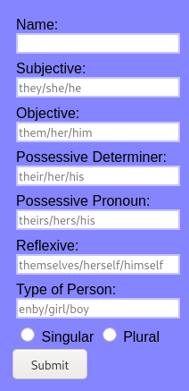
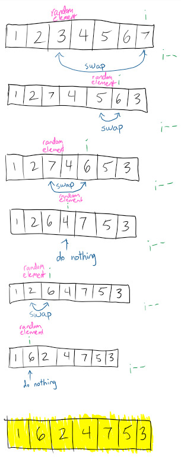
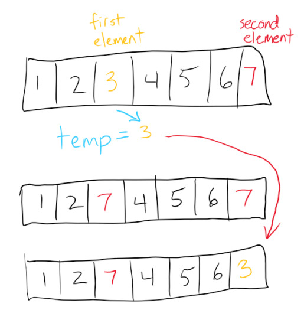

# How to Shuffle a List

## The Problem

A couple of months ago, I made a webpage called the [Pronoun Testing Grounds](https://botahamec.github.io/pronoun_test/). It allows users to try a different set of pronouns. It comes up with a cute little story to try them out. It's like the [Pronoun Dressing Room](http://www.pronouns.failedslacker.com/), if you've heard of that.

Problem: Most people don't know what objective and possessive determiner pronouns are.

The Pronoun Dressing Room solves this by using she/her pronouns as placeholder text. It tells you that the subjective pronoun for a girl is "she", and the reflexive pronoun is "herself". This is problematic, because the objective and possessive determiner pronouns are both "her". Someone could very feasibly be confused about which pronouns are which.


My solution was to give three examples for each pronoun: "he/him", "she/her", and "they/them". This way, nobody should be confused about which pronoun is which. If you click on the link to the Pronoun Testing Grounds, you may notice that these pronouns are in the wrong order. Or you're now very confused because it seems like they're in the right order.



I didn't want to come up with one order for the list of pronouns, so I shuffle the list each time. When I loaded it just now, the order was they/she/he. Our goal is clear. We need a completely random shuffling method to do this. What's the best way of doing this?

## The Fisher-Yates Method

This is the definitive way to shuffle a list. All we need to do is swap every item with another, randomly selected item. We can break down the problem step-by-step. All the code in this article will use Javascript.



We can start the function to shuffle the list like this:

```javascript
/// Randomly shuffles a list in-place using the Fisher-Yates algorithm
/// @param list The list to shuffle
function shuffle(list) {
    // code goes here
}
```

We need to go through the list in reverse order, and swap each one. We can use a for loop for this:

```javascript
function shuffle(list) {
    // Start with the last element
    // On each iteration, move forward one element
    // Repeat until the beginning of the list has been reached
    for (var i = list.length - 1; i > 0; i--) {
        // swap two elements
    }
}
```

For each element in the array we need to pick a random element to swap with. Luckily, Javascript includes a function called `Math.random()`. It picks a random floating-point number between 0 and 1. We'll need to use some arithmetic to turn it into a number between 0 and the current index.

```javascript
for (var i = list.length - 1; i > 0; i--) {
    // Multiply the random number by i+1, so that it is between 0 and (i + 1)
    // Use Math.floor() to round it down to a whole number
    var random_index = Math.floor(Math.random() * (i + 1));
}
```

Now we need a function that swaps two elements of an array. We can start of the function like this:

```javascript
/// Swaps two elements of an array
/// @param list The list to perform the swap on
/// @param index_one The index of the first element to swap
/// @param index_two The index of the second element to swap
function swap(list, index_one, index_two) {
    // code goes here
}
```

The first parameter specifies the list to perform a swap. Then it needs the indexes of the two elements that you wish to swap. This is the common way of performing a swap:

```javascript
var temp = list[index_one]; // save the value of the first element, so it's not overwritten
list[index_one] = list[index_two]; // put the value of index_one into index_two
list[index_two] = temp; // put the old value of index_two into index_one
```



Finally, we can call the `swap` function in our `shuffle` function, so that the final code looks like this:

```javascript
/// Swaps two elements of an array
/// @param list The list to perform the swap on
/// @param index_one The index of the first element to swap
/// @param index_two The index of the second element to swap
function swap(list, index_one, index_two) {
    var temp = list[index_one]; // save the value of the 1st element
    list[index_one] = list[index_two]; // put the 1st value in the 2nd
    list[index_two] = temp; // put the old 2nd value into the 1st
}

/// Randomly shuffles a list in-place using the Fisher-Yates algorithm
/// @param list The list to shuffle
function shuffle(list) {

    // Start with the last element
    // On each iteration, move forward one element
    // Repeat until the beginning of the list has been reached
    for (var i = list.length - 1; i > 0; i--) {

        // Multiply the random number by i+1, so that it is between 0 and i+1
        // Use Math.floor() to round it down to a whole number
        const random_index = Math.floor(Math.random() * (i + 1));

        swap(list, i, random_index); // swap the two elements
    }
}
```

That's it! Pass any list into the `shuffle` function, and the list will be shuffled.