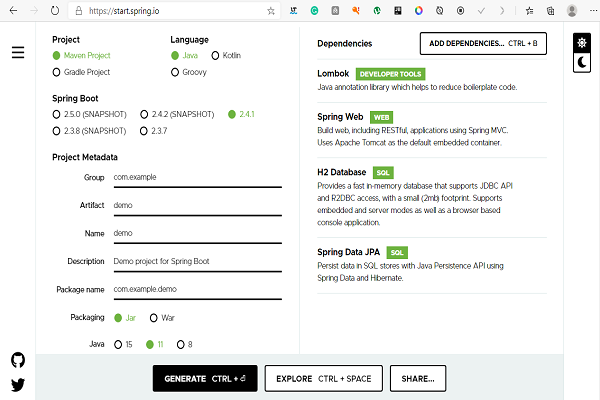
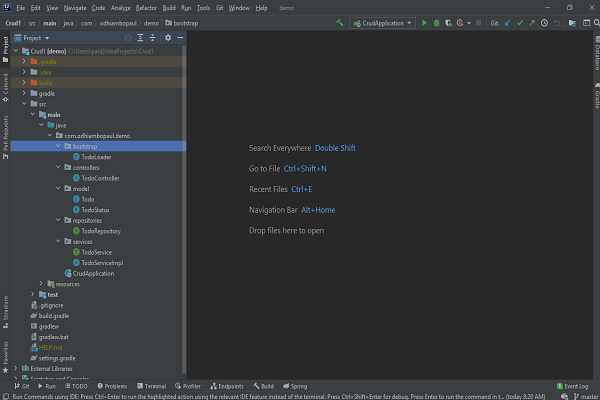
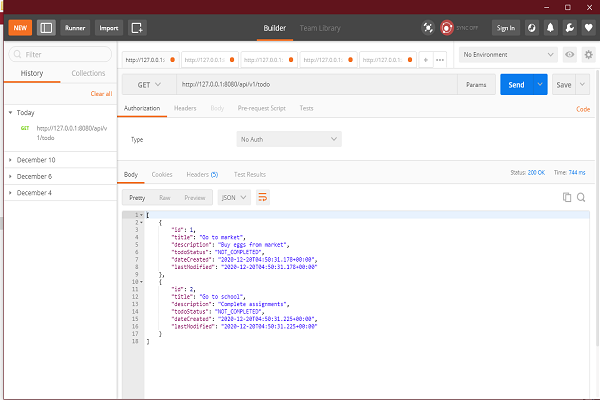
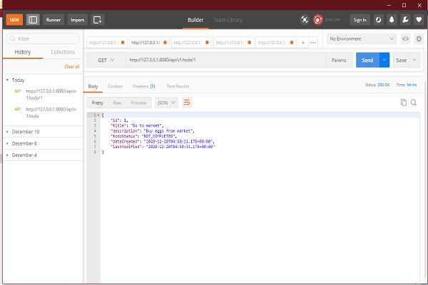
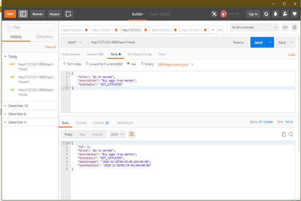
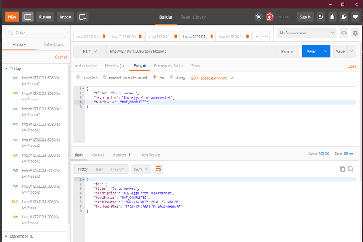
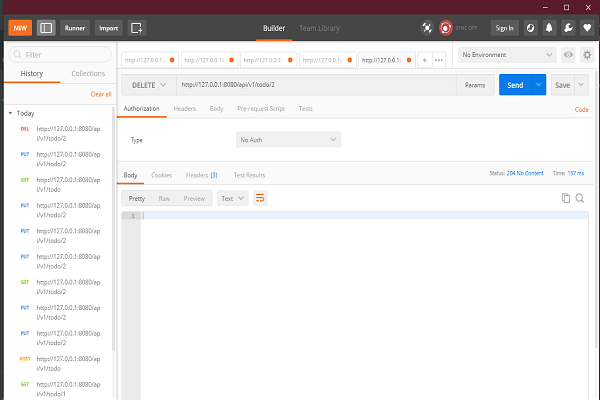

In this tutorial, we are going to build a Spring Boot Rest CRUD API with Gradle as our build tool.
Rest APIs makes it possible to establish a communication between a backend server and a frontend web or mobile applications.

### Prerequisites
- Basics of [Spring framework and Spring Boot](https://spring.io/guides/gs/spring-boot/)
- Basic Knowledge of [Java programming language](https://www.javatpoint.com/java-tutorial)
- [Java development kit](https://www.oracle.com/java/technologies/javase-jdk15-downloads.html) (JDK) installed and setup on your computer.
- Your favourite Java IDE installed. I use [Intellij](https://www.jetbrains.com/idea/download/#section=windows)

To verify if Java and java compiler are installed and configured correctly on your system, Open the terminal and type in the command `java --version` to see the version of java installed and `javac --version` to see the version of java compiler installed.

```bash
$ java --version
java 15.0.1 2020-10-20
Java(TM) SE Runtime Environment (build 15.0.1+9-18)
Java HotSpot(TM) 64-Bit Server VM (build 15.0.1+9-18, mixed mode, sharing)
```

```bash
$ javac --version
javac 15.0.1
```
Rest API CRUD operations map to HTTP verbs and SQL operations as shown in the table below.

| Operation  | SQL  | HTTP verb  | Rest web service  |
|---|---|---|---|
| Create  | INSERT  | POST/PUT  | POST  |
| Read  | SELECT  | GET  | GET  |
| Update  | UPDATE  | POST/PUT/PATCH  | PUT |
| Delete  | DELETE  | DELETE  |  DELETE |


### Project setup
The easiest way to create a new spring boot application is to use the [spring initializr](https://start.spring.io/).

- Open [spring initializr](https://start.spring.io/) in your web browser.
- Choose Gradle project.
- Choose Java as the language.
- Leave the default selected Spring Boot version.
- Select Java 8 as the Java Version.
- In the dependencies section add Lombok, Spring Web,H2 Database,Spring Data JPA as the dependancies.
- Click on the generate button to download the project as a zip file.
- Extract the zip file and open the project in your favourite IDE.
- Sync the dependencies with gradle.



### Configuring Spring Datasource, JPA, Hibernate
We are using H2 database which is an in-memory database meaning the data stored in the database is destroyed if the application is stopped ore restarted.

Under src/main/resources folder, open application.properties and write these lines.
In the `resources` folder within the `src/main` folder, open `application.properties` file and write the below properties.
```groovy
spring.datasource.url=jdbc:h2:mem:todo
spring.datasource.driverClassName=org.h2.Driver
spring.datasource.username=sa
spring.datasource.password=password
spring.jpa.database-platform=org.hibernate.dialect.H2Dialect
```
- `spring.datasource.username` & `spring.datasource.password` properties are the H2 database username and password. The default H2 database `username` is `sa` and `password` is `password`.
- Spring Boot uses Hibernate for Spring Data JPA implementation. Configure `spring.jpa.database-platform=org.hibernate.dialect.H2Dialect`.
- `spring.datasource.url=jdbc:h2:mem:todo` species the database url and the database name. In our case the database name is `todo`.

### Todo model
Models are plain old java objects that represents a table in database.

We will start by creating a model package in our root project package `com.example.demo`.
Within the `model` package created above create a Java enum with the name `TodoStatus` with the fields as shown below.
```java
public enum TodoStatus {
    COMPLETED, NOT_COMPLETED
}
```


Within the `model` package created above create a Java class with the name `Todo` with the fields as shown below.
```java
import lombok.AllArgsConstructor;
import lombok.Data;
import lombok.NoArgsConstructor;
import org.hibernate.annotations.CreationTimestamp;
import org.hibernate.annotations.UpdateTimestamp;

import javax.persistence.Column;
import javax.persistence.Entity;
import javax.persistence.GeneratedValue;
import javax.persistence.Id;
import java.sql.Timestamp;

@Entity
@Data
@NoArgsConstructor
@AllArgsConstructor
public class Todo {
    @Id
    @GeneratedValue
    @Column(updatable = false, nullable = false)
    Long id;
    @Column
    String title;
    @Column
    String description;
    @Column
    TodoStatus todoStatus;

    @CreationTimestamp
    @Column(updatable = false)
    Timestamp dateCreated;
    @UpdateTimestamp
    Timestamp lastModified;

}

```
- `@Entity` annotation shows that the class is a persistent Java class.
- `@Id` annotation shows that the annotated field is the primary key.
- `@GeneratedValue` annotation is used to specify the generation strategy used for primary key.
- `@Column` annotation defines the column in database that maps annotated field.
-  `@CreationTimestamp` annotation is a JPA annotation thats automatically update the `todo` creation timestamp.
- `@UpdateTimestamp` annotation is a JPA annotation thats automatically update the `todo` last modified timestamp.
- `@Data` annotation is from project lombok. It generates the getters and setters for all the fields that we have in the todo class, equals method and a toString method.
- `@NoArgsConstructor` annotation is from project lombok and it generates an empty constructor for our `Todo` class.
- `@AllArgsConstructor` annotation is from project lombok and it generates a contructor will all the fields that are available in our `Todo` class.

### Creating the Repository interface

In the root package of our project, create a package with the name `repositories`.
In the `repositories` package created above create an interface with the name `TodoRepository` that extends `CrudRepository` interface with comes with CRUD functions already implemented.

```java
import com.odhiambopaul.demo.model.Todo;
import org.springframework.data.repository.CrudRepository;
import org.springframework.stereotype.Repository;

@Repository
public interface TodoRepository extends CrudRepository<Todo, Long> {
}

``` 
The `CrudRespository` interface takes in the model and the type of the id, in our case the model is `Todo` and the id type is `Long`.
We are now able to use all the `CrudRepository` methods `save()`, `findOne()`, `findById()`, `findAll()`, `count()`, `delete()`, `deleteById()` without providing implementation.
- `@Repository` annotation marks this interface a Spring Data JPA repository.

### Creating the todo service.
A service is an interface from which different implementations of the same functions can be made.

In the root package of our application create a package with the name `services`.
In the `services` package created above create an interface with the name `TodoService`.
```java
import java.util.List;

public interface TodoService {
    List<Todo> getTodos();

    Todo getTodoById(Long id);

    Todo insert(Todo todo);

    void updateTodo(Long id, Todo todo);

    void deleteTodo(Long todoId);
}
```
The above interface defines the base CRUD operations that we will implement in our `TodoServiceImpl` class.
In the `services` package create a class with the name `TodoServiceImp` and implements our `TodoService` interface we created above.

```java
import com.example.demo.model.Todo;
import com.example.demo.repositories.TodoRepository;
import org.springframework.stereotype.Service;

import java.util.ArrayList;
import java.util.List;

@Service
public class TodoServiceImpl implements TodoService {
    TodoRepository todoRepository;

    public TodoServiceImpl(TodoRepository todoRepository) {
        this.todoRepository = todoRepository;
    }

    @Override
    public List<Todo> getTodos() {
        List<Todo> todos = new ArrayList<>();
        todoRepository.findAll().forEach(todos::add);
        return todos;
    }

    @Override
    public Todo getTodoById(Long id) {
        return todoRepository.findById(id).get();
    }

    @Override
    public Todo insert(Todo todo) {
        return todoRepository.save(todo);
    }

    @Override
    public void updateTodo(Long id, Todo todo) {
        Todo todoFromDb = todoRepository.findById(id).get();
        System.out.println(todoFromDb.toString());
        todoFromDb.setTodoStatus(todo.getTodoStatus());
        todoFromDb.setDescription(todo.getDescription());
        todoFromDb.setTitle(todo.getTitle());
        todoRepository.save(todoFromDb);
    }

    @Override
    public void deleteTodo(Long todoId) {
        todoRepository.deleteById(todoId);
    }
}

```
we create and initialize our `TodoRepository` the constructor the above class so as to be able to use the various methods that `CrudRepository` provides.
- `@service` annotation makes Spring context to be aware of this class as a service.

### Creating the Rest API controller

In the root package of our project create a package with the name `controllers`.
In the `controllers` package create above, create a Java class with the name `TodoController`.

```java
import com.example.demo.model.Todo;
import com.example.demo.services.TodoService;
import org.springframework.http.HttpHeaders;
import org.springframework.http.HttpStatus;
import org.springframework.http.ResponseEntity;
import org.springframework.web.bind.annotation.*;

import java.util.List;

@RestController
@RequestMapping("/api/v1/todo")
public class TodoController {
    TodoService todoService;

    public TodoController(TodoService todoService) {
        this.todoService = todoService;
    }

    //The function receives a GET request, processes it and gives back a list of Todo as a response.
    @GetMapping
    public ResponseEntity<List<Todo>> getAllTodos() {
        List<Todo> todos = todoService.getTodos();
        return new ResponseEntity<>(todos, HttpStatus.OK);
    }
    //The function receives a GET request with id in the url path, processes it and returns a Todo with the specified Id
    @GetMapping({"/{todoId}"})
    public ResponseEntity<Todo> getTodo(@PathVariable Long todoId) {
        return new ResponseEntity<>(todoService.getTodoById(todoId), HttpStatus.OK);
    }
    //The function receives a POST request, processes it, creates a new Todo and saves it to the database and returns a resource link to the created todo.
    @PostMapping
    public ResponseEntity<Todo> saveTodo(@RequestBody Todo todo) {
        Todo todo1 = todoService.insert(todo);
        HttpHeaders httpHeaders = new HttpHeaders();
        httpHeaders.add("todo", "/api/v1/todo/" + todo1.getId().toString());
        return new ResponseEntity<>(todo1, httpHeaders, HttpStatus.CREATED);
    }
    //The function receives a PUT request, updates the Todo with the specified Id and returns the updated Todo
    @PutMapping({"/{todoId}"})
    public ResponseEntity<Todo> updateTodo(@PathVariable("todoId") Long todoId, @RequestBody Todo todo) {
        todoService.updateTodo(todoId, todo);
        return new ResponseEntity<>(todoService.getTodoById(todoId), HttpStatus.OK);
    }
    //The function receives a DELETE request, deletes the Todo with the specified Id.
    @DeleteMapping({"/{todoId}"})
    public ResponseEntity<Todo> deleteTodo(@PathVariable("todoId") Long todoId) {
        todoService.deleteTodo(todoId);
        return new ResponseEntity<>(HttpStatus.NO_CONTENT);
    }
}

```
- `@RestController` annotation marks this class a controller that is able to process the incoming `http` requests.
- `@RequestMapping("/api/v1/todo")` annotation sets the base path to the resource endpoints in the controller as `/api/v1/todo`.
- We inject the TodoService through our contructor so as to be able to use the various methods defined in it within our `TodoController` class.
- `@GetMapping` annotation indicates that the function processes a `GET` request.
- `@PostMapping` annotation indicates that a function processes a `POST` request.
- `@PutMapping` annotation indicates that a function processes a `PUT` request.
- `@DeleteMapping` annotation indicates that a function processes a `DELETE` request.


### Creating a bootstrapper
Data bootstrapper creates and loads the inital data whenever the application is run.

In the root package of our project, create a package with the name `bootstrap`.
In the `bootstrap` package created above create a Java class with the name `TodoLoader`.

```java
import com.example.demo.model.Todo;
import com.example.demo.model.TodoStatus;
import com.example.demo.repositories.TodoRepository;
import org.springframework.boot.CommandLineRunner;
import org.springframework.stereotype.Component;

@Component
public class TodoLoader implements CommandLineRunner {
    public final TodoRepository todoRepository;

    public TodoLoader(TodoRepository todoRepository) {
        this.todoRepository = todoRepository;
    }

    @Override
    public void run(String... args) throws Exception {
        loadTodos();
    }

    private void loadTodos() {
        if (todoRepository.count() == 0) {
            todoRepository.save(
                    Todo.builder()
                            .title("Go to market")
                            .description("Buy eggs from market")
                            .todoStatus(TodoStatus.NOT_COMPLETED)
                            .build()
            );
            todoRepository.save(
                    Todo.builder()
                            .title("Go to school")
                            .description("Complete assignments")
                            .todoStatus(TodoStatus.NOT_COMPLETED)
                            .build()
            );
            System.out.println("Sample Todos Loaded");
        }
    }
}

```
- `@Component` annotation informs Sprin that this class is a Spring component.

The final project structure should be as shown below.


### Testing the CRUD endpoints
**Geting list of todos**
Make a `GET` request to `http://127.0.0.1:8080/api/v1/todo` to get all the `todos`.


**Geting a `Todo` by id**
Make a `GET` request to `http://127.0.0.1:8080/api/v1/todo/2` specifying the id of the `Todo` at the end of the url, in our case id is 2.



**Creating a new `Todo`**
 Make a `POST` request with JSON body as shown below to `http://127.0.0.1:8080/api/v1/todo`.
```json
{
    "title": "Go to market",
    "description": "Buy eggs from market",
    "todoStatus": "NOT_COMPLETED"
}
```



**Updating a `Todo`**
Make a `PUT` request to `http://127.0.0.1:8080/api/v1/todo/2` adding the id of the `todo` to update in the url, in our case the id is 2 and a JSON body with the fields to update.

```json
{
    "title": "Market",
    "description": "Buy eggs from supermarket",
    "todoStatus": "NOT_COMPLETED"
}
```



**Deleting a `Todo`**
Make a `DELETE` request to `http://127.0.0.1:8080/api/v1/todo/2` adding to the end of the url the id of the `todo` to delete, in our case the id is 2.


### Conclusion
Now that you have learnt how to create a Restful web service in Spring Boot, Clone the project [here]() and `IN_PROGRESS` status to our `TodoStatus` enum in the `models` package.

In our next secure our Restful endpoints and handle various exceptions in our application.
