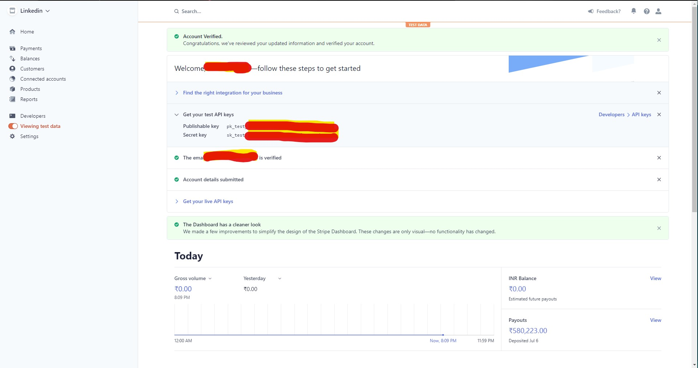

---
  layout: engineering-education
  status: publish
  published: true
  url: /engineering-education/stripe-integration-react/
  title: Integrating Stripe with React
  description: Learn how to create a Stripe account and integrate Stripe Payment with your React project.
  author: lalith-narayan
  date: 2020-08-24T00:00:00-10:00
  topics: [Blockchain][Cryptocurrency][Healthtech]
  excerpt_separator: <!--more-->
  images:

    - url: /https://images.app.goo.gl/53Wo8TroqUuzF85i9
      alt: Blockchain Health
  ---

# Integrating Stripe with React

All online stores need a payment gateway irrespective of the service or product being sold. Such an important step needs the utmost attention of the developer, for this is the source of income for the online store. In this article, we will look at setting up the Stripe API for all payment purposes. The stripe is the [go-to choice](https://stripe.com/en-in/payments/payment-methods-guide) of most of the developers in the world, for one, its developer-friendly rich [documentation](https://stripe.com/docs/api). Stripe offers security and ensures safe transactions. 

## Integration With React

Let's assume that we run an online store, and have a few variables defined like order details, order total, and user details to process the order. We will focus on the following:

1. Creating a Stripe Account
2. Switching to test mode on Stripe
3. Obtaining Stripe Access Token from your dashboard
4. Integrating with React using react-stripe-checkout
   
Before we get started with the implementation, let's understand the flow of payment information. How does Stripe help us with secure financial transactions?

1. Card details are entered on the website.
2. The web application sends a request to the Stripe API with card details in it.
3. Stripe API stores the card details securely and sends a token to the web application. 
4. The token is a point of reference to identify the card. Note that the card details are never shared with anyone for security reasons. The backend server receives the token and other meta-data related to the purchase.
5. The backend application makes a request to the API with the token in place. Also, it's a good practice to recalculate the price at the backend, for the token does not contain information about the total amount to be charged.  


*Image Source:* https://stripe.com/docs/payments/accept-a-payment#web

With this information in mind, we understand the important role Stripe plays. Payment gateways such as Stripe and PayPal garner the trust of millions of users by providing seamlessly integrated solutions. Let us set up the same.

### Creating a Stripe Account

To create an account, click on the following [link](https://dashboard.stripe.com/register?redirect=%2Ftest%2Fpayments) and provide details such as email, mobile number, name, and password. Upon successful registration, a confirmation mail is sent to the registered email-ID. Click on the email. Welcome to your new stripe account. 

If already registered, log in to your dashboard with your login credentials.

### Switch to Test Mode on Stripe

This step is important to ensure we are in testing mode. This enables us to test aspects of payments such as receiving payments, sending payments, or approving refunds. On the bottom left of your dashboard, you should find the *Viewing test data* button. Enable that by toggling the button provided. The dashboard is shown for your reference.


*Dashboard View*
### Obtain Stripe Access Token 
You will find a section called *Get your test API keys*. Under there, you will find two keys, a Publishable key, and a secret key. As the name suggests, we need to keep these keys secure. The publishable key is used to send requests, whereas the secret key is stored in the .env file at the backend.

*API Keys on Dashboard*
### Stripe Integration using react-stripe-checkout

There are many libraries available for integrating React with stripe. We will be using ```react-stripe-checkout``` library in this tutorial. 

Install the library using the following command:

```
npm install react-stripe-checkout
```

Once installed create a new component called *CheckoutWithStripe.js* and add it to your main component list. Insert the appropriate details and create your custom functions to add more details to the API call. One such example for a dummy function is given below.  I

```jsx
import React from 'react';
import StripeCheckout from 'react-stripe-checkout';

// sample function defined to compute total quantity of cart
function computeQuantity(cart) {
    return cart.reduce((count, itemInCart) => count + itemInCart.quantity, 0);
}
// similar functions can be defined to compute total price, email of the user, etc.

class CheckoutWithStripe extends React.Component {
    onToken = (res) => {
        fetch('/save-stripe-token', {
            method: 'POST',
            body: JSON.stringify(token),
        }).then(res => {
            res.json().then(data => {
                console.log(`Payment token generated, ${data.name}`)
            })
        })
    };

    render() {
        return (
            <StripeCheckout
                amount = '10.00'
                name="STRIPE_INTEGRATION"
                // functions defined above can be used to add more information while making the API call.
                // description={`Order of ${computeQuantity(cart)} items!`}
                image='LINKTOIMAGE'
                stripeKey="PUBLISHABLE_STRIPE_KEY"
                currency="INR"
                email='USER_EMAIL'
                token={this.onToken}/>          
        );
    }
}

export default CheckoutWithStripe
```

Call the component *CheckoutWithStripe* from the payment page. You should see a button which says, pay with the card. We get the dialog box to enter the card details.
It should look like this.


*Final Output*

The error says that the API key is invalid. To resolve the error, you may enter your public API key. To verify that the application is in test mode, you will get an alert on the top right corner as shown. 

### Conclusion

We have understood the entire process of accepting payments with Stripe. We begin with setting up an account, obtaining API keys, and finally integrating it with our application. Stripe has made payments easy and we encourage you to build your applications with integrated payment gateways. Until the next article, be legendary.
