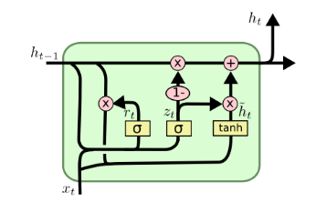
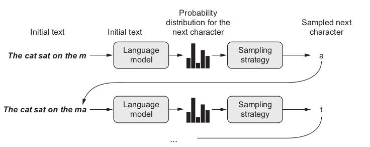

# Text Generation With RNN + TensorFlow

The potential of artificial intelligence to emulate human thought goes from passive tasks such as [object recognition](https://www.mathworks.com/solutions/image-video-processing/object-recognition.html) to [self driving cars](https://www.wired.com/story/guide-self-driving-cars/), it also extends to creative tasks such as text-generation, [music generation](https://magenta.tensorflow.org/), art generation, etc.

In this article we will see how neural networks can be use to generate text data,  same can be used for music generation.

**Pre-Requisites:** 

* Knowledge of Python, Tensorflow, Machine Learning concepts. Check out the resources.
* Environment
	* Locally install [Python 3.x](https://www.python.org/downloads/) and [Tensorflow 2.x](https://www.tensorflow.org/install)
	* OR use [Google Colab](https://colab.research.google.com) [Recommended]

## RNN- Recurrent Neural Network
A recurrent neural networks (RNN) are  a class of [artificial neural networks](https://en.wikipedia.org/wiki/Artificial_neural_network) that is powerful for modelling sequence data such as time series or natural language.
[Vanilla neural networks](https://en.wikipedia.org/wiki/Multilayer_perceptron) have one shortcoming when compared to RNNs, they cannot solve solve machine learning problems which need to rememeber information about the past inputs. When processing sequential data it is key that we remember the relationships in the data, and plain [CNNs](https://towardsdatascience.com/a-comprehensive-guide-to-convolutional-neural-networks-the-eli5-way-3bd2b1164a53) are not born good at length-varying input and output. Hence, we are using RNNs for the task of text generation.


We will use a special type of RNN called [LSTM](https://colah.github.io/posts/2015-08-Understanding-LSTMs/),  which are equipped to handle very large sequences of data. Simple RNNs  have a problem called the *[vanishing gradient problem](https://www.youtube.com/watch?v=qhXZsFVxGKo)*, because of which they cannot handle large sequences. LSTMs are designed to handle long-term dependencies.



## Text Generation 
The way to generate sequence data (text or music) is to train a network to predict the next token or next few tokens in a sequence, using the previous tokens as input. For instance, given the input “*the cat is on the ma*,” the network is trained to predict the target ***t***, the next character. When working with text data *tokens* are words or characters and any network that can model the probability of next token is called *language model*. A language model captures the statistical structure of the text.



## Implementing in Tensorflow
### The Dataset
For this tutorial we will use a dataset which contains the works of Shakespeare. 
```python
import tensorflow as tf
import numpy as np
#Download the dataset
path = tf.keras.utils.get_file('shakespeare.txt', 'https://storage.googleapis.com/download.tensorflow.org/data/shakespeare.txt')
#Explore the data
text = open(path, "r").read()
print(text[:200])
```
### Data Pre-Processing
Before training we need to map strings to numbers, extract partially overlapping sequences and pack them in a 3D numpy array of shape (sequences, maxlen, unique_characters). We [one-hot encode](http://scikit-learn.org/stable/modules/generated/sklearn.preprocessing.OneHotEncoder.html) the data.

```python
maxlen = 60 #extract sequences of length 60
step = 3 
sentences = []	#holds extracted sequences
next_chars = [] #holds the targets
for i in range(0, len(text)-maxlen, step):
	sentences.append(text[i:i+maxlen])
	next_chars.append(text[i+maxlen])
#VECTORIZATION
chars = sorted(set(text))
char_indices = dict((char, chars.index(char)) for char in chars)
x = np.zeros((len(sentences), maxlen, len(chars)), dtype=np.bool)
y = np.zeros((len(sentences), len(chars)), dtype=np.bool)
for i, sentence in enumerate(sentences):
	for t, char in enumerate(sentence):
		x[i, t, char_indices[char]] = 1
	y[i, char_indices[next_chars[i]]] = 1
```
### Building the Network
The network is a single LSTM layer followed by a `Dense` classifier and [softmax](https://medium.com/data-science-bootcamp/understand-the-softmax-function-in-minutes-f3a59641e86d) over all possible characters. 
```python
from tensorflow.keras import layers
model = tf.keras.models.Sequential()
model.add(layers.LSTM(128, input_shape=(maxlen, len(chars))))
model.add(layers.Dense(len(chars), activation="softmax"))
```

### Compile and Train the model
Use the `categorical_crossentropy` loss to train the model as the targets are one-hot encoded.

```python
model.compile(loss="categorical_crossentropy", optimizer="adam")
```
Given a trained model and a seed snippet, you can generate text by doing the following repeatedly:

* Draw from the model a probability distribution for the next character	
* Reweight the distribution to a certain *temperature*. (The temperature can be used to control the randomeness of the output. Higher temperatures result in sampling distributions of higher entropy that will generate more
surprising and unstructured generated data, whereas a lower temperature will result in less randomness and much more predictable generated data)
* Sample the next character accoding to the reweighted distribution.
* Add the character to the seed text

```python
def sample(preds, temperature=1.0):
	preds = np.asarray(preds).astype('float64')
	preds = np.log(preds) / temperature
	exp_preds = np.exp(preds)
	preds = exp_preds / np.sum(exp_preds)
	probas = np.random.multinomial(1, preds, 1)
	return np.argmax(probas)
```
The following loop repeatedly trains and generates the text.

```python
import random
for epoch in range(1, 60):
	model.fit(x, y, batch_size=128)
	start_index = random.randint(0, len(text) - maxlen - 1)
	generated_text = x[start_index: start_index + maxlen]
	for i in range(400): #generates 400 length string
		preds = model.predict(generated_text)[0]
		   next_index = sample(preds, temperature)
		   next_char = chars[next_index]
		   generated_text += next_char
		   generated_text = generated_text[1:]
```
The above mentioned loop is used for training if you want to look at the results at each epoch or at different temperatures, print or append to a file in between the epochs. You can even give your own starting string instead of randomly choosing one.

After 10 epochs and giving the output string length = 2000 the output is as follows:

```
ROMEO: Depose
The nostest have aldeghtenly
Unsuep a disposinging trebs: which least
Be it not to be, to sign our awherit to him.

Nurse: good speed!
I protest, up her countening and virtuous to the world:
Who is't it in,
and I will tet: these corn, Hastings, then I'ld
Cambio and trustly 'Hell my power from the tappe of her tafe:
Upon my rememinance, if he other gracious word,
Was not upon madch'd teach a dear ladgeness, that every faces
Proteck me for joyour of little henrer: tell me,
Engur King Edward's curse?
Within this angry ANTIGO:
His lady as you
Wast thou wilt bid the king!
Was a joy o'erthe moved, here forth, be with a pip-r,
To death alighture I have the mine
For this all when RINCE Turst, how mein yourselves for Rose, if thou dost i' thy peace.

CURTIS:
In the good Romeo Lord Shall Henry, py free-det, and then the king
Is chains so setch him, he will live with my pridoner.

LEONTES:
Madam, modrows give me leh on that mercy most we,
Command to tell him sweet as thou reported to ope?
Ah, Richard, wisely makes my twope:
I pray thee I am sups from Fersuing ignorance,
We merry they wouldiops by the world good to the servica, With ablected
Many's gross leed all heavy in meant to the flatteret?
Wasted along to speak. We thanks inhapp'd,
Is touch again to me, takes, he appeal with complaint
Against thy backs: then to-morrow,
Shall I trust to draze our patrim.
Will they be that last were nothing better thine;
Some mightyou tapet in feart, that or my resignner'd arre
Against whet have ever you to play and give my charter't.

PAULINA:
Let them boy!

KING EDWARD IV:
Why, then they shall be confect it again;
Thou still-stable shake! for he has been,
Till the king's bloody state, that she's my tell well
The search o' your obedience, hath he chairs
To the I did not go:
Rath being the first shall be a metted gone.

CLAOW OF GONTIS:
Why, and yet, I pray you shatter, gone to Rome,
Ere hard his king's master.

GRUMIO:
I prith earth, hath their
pride, sir, by the fresh perfects to o

```

### Conclusion

To improve the model we can use [stacked LSTM layers](https://machinelearningmastery.com/stacked-long-short-term-memory-networks/) instead of a single LSTM layer, use Bidirectional LSTM, Dropout to avoid over-fitting, clean the data. Dont expect a perfect speech from this as it is simply a statistical model, for better results we can train it on a large dataset like Wikipedia. 

[OpenAI GPT language Model](https://openai.com/blog/better-language-models/), have a look at this.

Full code [here](https://github.com/rohanreddych/Generative-NN-Applications).

### References and Resources
* Deep Learning With Python, F. Chollet, Manning Publications.
* [Python Tutorial](https://www.w3schools.com/python/).
* [TensorFlow tutorial](https://www.tensorflow.org/tutorials).
* [Machine_learning](https://en.wikipedia.org/wiki/Machine_learning)
* [https://dev.to/nedomas](https://dev.to/nedomas/pytorch-lstm-text-generation-tutorial-2nf5)
* [Rnn effectiveness, A Karpathy](http://karpathy.github.io/2015/05/21/rnn-effectiveness/)
* [https://www.tensorflow.org/tutorials/text/text_generation](https://www.tensorflow.org/tutorials/text/text_generation)
* 
