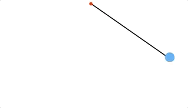
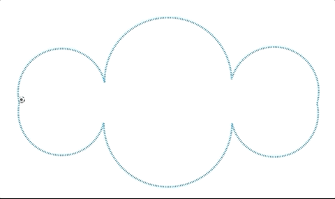

### Introduction

Anime.js is one of the most preferred javascript animation libraries. It is free, open-source, lightweight, and easy to use. The library supports modern browsers. I will guide you through the Anime.js animation library. You will learn how to create different animation effects for your web user interface.

### Prerequisites

This tutorial is suitable for web developers ranging from beginner to expert level. Nevertheless, you may need to have basic knowledge of HTML, CSS, and JavaScript. For free HTML, CSS, and JavaScript tutorials, I recommend [w3schools.com](https://w3schools.com).

### Setting up Anime.js

To get started using Anime.js, download the library [Anime.js website](https://animejs.com/). Include the anime.js JavaScript file in your HTML code.

```html
<script src="path/to/anime.min.js"></script>
```

We can also use the [Node Package Manager (npm)](https://www.npmjs.com/). If you use `npm`, the script location will be `node_modules/animejs/lib/anime.min.js`

```bash
$ npm install animejs --save
```

Another alternative is to use the latest release of the library hosted on a CDN. See the code below.

```html
<script src="https://cdnjs.cloudflare.com/ajax/libs/animejs/3.2.1/anime.min.js"></script>
```

### Getting started with Anime.js

We use the `anime()` function to create the animations. The `anime()` function takes an object as an argument. The object holds the animation details. You can refresh your knowledge on [Javascript Objects](https://www.w3schools.com/js/js_object_definition.asp).

```javascript
let animation = anime({
  /* animation details here*/
});
```

or

```javascript
anime({
  /* animation details here*/
});
```

In the animation details, we need to define targets, properties, property parameters, and animation parameters.

1. **Target:** This refers to the element to be animated. It can be any CSS selector, DOM Node, NodeList, JavaScript Object, or an array containing multiple targets. Examples are `div`, `.classSelector`, and `#idSelector`. Target tell anime how to find the elements on the web page.

2. **Properties:** This refers to the CSS Properties that can be animated: CSS Transforms, Object Properties, Dom Attributes, and SVG Attributes. They include `translate`, `rotate`, `scale`, `skew`, `opacity`, `color`, among others.

3. **Property parameters:** `duration`, `delay`, `endDelay`, `easing`, `round`, e.t.c

4. **Animation Parameters:** These are Direction, Loop, and Autoplay. Refer to [Anime.js Documentation](https://animejs.com/documentation/#direction) for more details.

In the next section, we will implement the above. Follow the comments in the code.

### Simple Animations with Anime.js

#### Shapes Animation

In this example, we will create a triangular shape inside a `div` identified by `#triangle1`. You require basic CSS knowledge to achieve this.

**Javascript code:**

```javascript
  <script type="text/javascript">
    //Create Anime object
    anime({
      //target
      targets: "#triangle1",
      //Properties
      rotateY: 360,
      scale: 0.5,
      translateX: 300,
      skew: 60,
      // Property Parameters
      duration: 1000,
      endDelay: 300,
      easing: "easeInOutSine",
      // Animation Parameters
      direction: 'alternate',
        loop: true,
    });
  </script>
```

**Explanation**
In the javascript code example above the target is `#triangle1`. Four transformations are applied to the target all at once. The resulting animation is shown in the output.

- `rotateY: 360`: Rotates the target along the Y-axis for 360&deg;
- `scale: 0.5`: Scales the target by a factor of 0.5.
- `translateX: 300`: Moves the target 300 pixels along the X-axis.
- `skew: 60`: Skews the target 60&deg;.

Other properties used in Anime.js can be found on [Anime.js documentation](https://animejs.com/documentation/#CSStransforms).

The parameters are `duration`, `endDelay`, and `easing`. The rotation happens in one second (1000ms), and there is a delay of 300 ms before the next rotation.

The animation parameters used in the example above are `direction` and `loop`. The target rotates in the `normal` direction, and the `autoplay` is set to `true`.

**Output:**


```html
<!DOCTYPE html>
<html>
  <head>
    <title></title>
    <style>
      #triangle1 {
        width: 1px;
        height: 1px;
        border-left: 45px solid transparent;
        border-right: 45px solid transparent;
        border-bottom: 80px solid #5599bb;
        margin: 50px 200px 100px;
      }
    </style>
  </head>
  <body>
    <h4>Animating Triangle Shape with Anime.JS</h4>
    <div id="triangle1"></div>
  </body>
  <script src="https://cdnjs.cloudflare.com/ajax/libs/animejs/3.2.1/anime.min.js"></script>
  <script type="text/javascript">
    //Create Anime object
    anime({
      //target
      targets: "#triangle1",
      //Properties
      rotateY: 360,
      scale: 0.5,
      translateX: 300,
      skew: 60,
      // Property Parameters
      duration: 1000,
      endDelay: 300,
      easing: "easeInOutSine",
      // Animation Parameters
      direction: "alternate",
      loop: true,
    });
  </script>
</html>
```

#### Pendulum Animation

A pendulum makes a natural motion that slows down at both peaks and is faster in the middle. The first task is to draw a pendulum-like shape in HTML and CSS. In this example, I will not explain the HTML and CSS code.
**Javascript Code**

```javascript
  <script type="text/javascript">
    let animation = anime({
      targets: "#pendulum_rod",
      rotate: [60, -60],
      duration: 4000,
      direction: "alternate",
      easing: "easeInOutSine",
      loop: true,
    });
  </script>
```

**Explanation**
In the above example, we were able to animate a pendulum using a few lines of Anime.js code. The pendulum rotates between 60&deg; and -60&deg; for a duration of 4000 milliseconds (4 seconds). We can implement the natural motion by using `easing: 'easeInOutSine'`. We keep the pendulum moving by setting the direction to `alternate` and `loop: true`.
**Output**



**Complete Source Code**

```html
<!DOCTYPE html>
<html>
  <head>
    <title></title>
    <style type="text/css">
      #pivot {
        border-radius: 50%;
        background-color: red;
        position: absolute;
        width: 10px;
        height: 10px;
        top: -6px;
        left: -4px;
      }
      #bob {
        position: absolute;
        bottom: -10px;
        left: -10px;
        width: 30px;
        height: 30px;
        border-radius: 50%;
        background-color: #03a9f4;
      }
      #pendulum_rod {
        width: 3px;
        height: 300px;
        background-color: #000;
        margin-top: 20px;
        margin-left: 50%;
        transform-origin: 50% 0%;
      }
    </style>
  </head>
  <body>
    <div id="pendulum_rod">
      <span id="bob"></span>
      <span id="pivot"></span>
    </div>
  </body>
  <script src="https://cdnjs.cloudflare.com/ajax/libs/animejs/3.2.1/anime.min.js"></script>
  <script type="text/javascript">
    let animation = anime({
      targets: "#pendulum_rod",
      rotate: [60, -60],
      duration: 4000,
      direction: "alternate",
      easing: "easeInOutSine",
      loop: true,
    });
  </script>
</html>
```

#### SVG Animations

Anime.js enables us to move an object using an SVG path. The first step is to create an SVG path. Some of the tools for creating the SVG path are Adobe Photoshop, Adobe Illustrator, and [Codepen SVG Path Builder](https://codepen.io/anthonydugois/pen/mewdyZ). Go ahead and create an SVG path or use the one I have already created in the example below.

**Javascript**

```javascript
let path = anime.path("#svg-path path");
anime({
  targets: "#object1",
  translateX: path("x"),
  translateY: path("y"),
  duration: 2000,
  easing: "linear",
  loop: true,
});
```

**Output**



**Explanation**
In the above example, the target is a ball emoji. It follows a predefined SVG path to create an animation.

**Complete Source Code**

```html
<!DOCTYPE html>
<html>
  <head>
    <title></title>
    <style type="text/css">
      #object1 {
        position: absolute;
      }
      #content {
        position: relative;
      }
      #path1{
        stroke-width: 4px;
        stroke-dasharray: 2,2;
      }
    </style>
  </head>
  <body>
    <div id="#content">
      <div id="object1">&#9917</div>
      <svg id="svg-path" width="800px" height="600px">
        <path id="path1"
          stroke="#03a9f4"
          fill="none"
          d="M 52 351 A 50 50 0 1 1 252 305 A 50 50 0 1 1 549 297 A 50 50 0 1 1 749 354 A 50 50 0 1 1 550 401 A 50 50 0 1 1 250 399 A 50 50 0 1 1 53 350 Z"
        />
      </svg>
    </div>
  </body>
  <script src="https://cdnjs.cloudflare.com/ajax/libs/animejs/3.2.1/anime.min.js"></script>
  <script type="text/javascript">
    let path = anime.path("#svg-path path");
    anime({
      targets: "#object1",
      translateX: path("x"),
      translateY: path("y"),
      duration: 2000,
      easing: "linear",
      loop: true,
    });
  </script>
</html>

```

#### Key Frames

In the first example, we moved an object from point A to Point B. We will use keyframes to move an object from A to B to C. The animation keyframes are defined in an array, as shown in the code below. The object will do four different continuous translations.

**Javascript code**

```javascript
  <script type="text/javascript">
    anime({
      targets: "#ball1, #ball2",
      keyframes: [
        { translateX: 250 },
        { translateY: 150 },
        { translateX: 0 },
        { translateY: 0 },
      ],
      duration: 4000,
      easing: "easeOutElastic(1, .8)",
      loop: true,
    });
  </script>

```

**Output**


**Complete Source Code**

```html
<!DOCTYPE html>
<html>
  <head>
    <title></title>
    <style type="text/css">
      #ball1 {
        position: absolute;
        margin: 40px 50px;
        width: 30px;
        height: 30px;
        border-radius: 50%;
        background-color: #03a9f4;
      }
      #ball2 {
        position: absolute;
        margin: 80px 50px;
        width: 30px;
        height: 30px;
        border-radius: 50%;
        background-color: #03a9f4;
      }
    </style>
  </head>
  <body>
    <div id="ball1"></div>
    <div id="ball2"></div>
  </body>
  <script src="https://cdnjs.cloudflare.com/ajax/libs/animejs/3.2.1/anime.min.js"></script>
  <script type="text/javascript">
    anime({
      targets: "#ball1, #ball2",
      keyframes: [
        { translateX: 250 },
        { translateY: 150 },
        { translateX: 0 },
        { translateY: 0 },
      ],
      duration: 4000,
      easing: "easeOutElastic(1, .8)",
      loop: true,
    });
  </script>
</html>
```

### Animating UI with Anime.js

#### Text Path Animation

We will use photoshop to create an SVG path. Create a text in photoshop, then convert the text into a path. Save the generated path as SVG. Copy the generated SVG path for use in this example.

**Javascript Code**

```javascript
anime({
  targets: "#svg-path path",
  strokeDashoffset: [anime.setDashoffset, 0],
  easing: "easeInOutSine",
  duration: 6000,
  easing: "linear",
  direction: "alternate",
  loop: true,
});
```

**Output**


**Full Source Code**

```html
<!DOCTYPE html>
<html>
  <head>
    <title></title>
    <style type="text/css">
      #svg-path path {
        stroke-dasharray: 400;
        stroke-dashoffset: 0;
      }
    </style>
  </head>
  <body>
    <div id="#content">
      <svg id="svg-path" width="900px" height="600px">
        <path id="text_path" stroke="#03a9f4" fill="none" d="M795.786,161.062
        C784.326,175.516 772.348,182.742 759.848,182.742 C745.200,182.742
        737.875,173.042 737.875,153.641 C737.875,138.016 743.604,122.961
        755.063,108.475 C766.521,93.989 778.403,86.746 790.707,86.746
        C805.551,86.746 812.973,96.448 812.973,115.848 C812.973,131.538
        807.243,146.609 795.786,161.062 ZM779.086,97.684 C771.664,97.684
        765.430,101.868 760.385,110.232 C755.339,118.599 752.817,128.967
        752.817,141.336 C752.817,161.648 759.099,171.805 771.664,171.805
        C779.150,171.805 785.417,167.639 790.463,159.305 C795.508,150.972
        798.032,140.588 798.032,128.152 C798.032,107.840 791.716,97.684
        779.086,97.684 ZM715.024,53.934 C722.314,50.940 728.305,46.805
        732.993,41.531 C733.643,42.444 733.969,43.387 733.969,44.363
        C733.969,53.088 724.919,63.016 706.821,74.148 L715.024,53.934
        ZM708.774,86.746 C713.657,86.746 716.098,90.127 716.098,96.890
        C716.098,98.192 715.837,100.857 715.317,104.889 L714.438,111.424
        C714.372,111.944 714.014,114.578 713.364,119.325 L709.360,147.223
        L708.383,153.465 C707.536,159.643 707.114,163.772 707.114,165.852
        C707.114,168.649 707.924,170.047 709.544,170.047 C714.989,170.047
        720.595,163.960 726.364,151.785 C728.113,152.827 728.989,153.836
        728.989,154.813 C728.989,157.156 726.157,161.780 720.493,168.680
        C712.875,178.055 705.811,182.742 699.301,182.742 C694.548,182.742
        692.172,179.588 692.172,173.280 C692.172,170.615 693.149,162.421
        695.102,148.700 L698.911,122.169 L699.887,115.439 L700.668,110.074
        C700.993,107.797 701.157,105.879 701.157,104.318 C701.157,101.068
        700.249,99.441 698.434,99.441 C693.381,99.441 687.936,105.008
        682.105,116.141 C680.873,115.034 680.258,113.928 680.258,112.820
        C680.258,108.850 683.920,103.511 691.245,96.805 C698.569,90.100
        704.411,86.746 708.774,86.746 ZM636.215,170.438 L650.613,156.668
        C654.828,159.859 658.591,164.448 661.899,170.438 L647.598,184.305
        C644.743,178.120 640.948,173.498 636.215,170.438 ZM599.950,182.742
        C594.865,182.742 592.325,179.097 592.325,171.805 C592.325,166.467
        593.008,159.077 594.376,149.637 L597.824,126.004 C598.930,118.323
        599.484,112.234 599.484,107.742 C599.484,102.600 597.694,100.027
        594.116,100.027 C585.791,100.027 577.353,105.676 568.800,116.971
        C560.248,128.267 555.257,140.393 553.825,153.348 L551.230,176.785
        L536.618,182.742 L536.911,180.008 L537.695,172.781 L538.478,165.945
        L543.567,120.633 L544.154,115.457 C544.545,111.421 544.742,108.166
        544.742,105.691 C544.742,101.526 543.698,99.441 541.612,99.441
        C536.720,99.441 531.471,104.976 525.864,116.043 C524.365,114.807
        523.618,113.733 523.618,112.820 C523.618,108.914 527.185,103.592
        534.323,96.854 C541.460,90.115 547.081,86.746 551.189,86.746
        C556.792,86.746 559.595,90.327 559.595,97.488 C559.595,99.312
        559.431,101.753 559.106,104.813 L558.325,112.723 L557.524,119.363
        L556.723,126.297 C564.404,114.839 572.820,105.383 581.967,97.928
        C591.113,90.474 598.911,86.746 605.356,86.746 C611.670,86.746
        614.828,91.136 614.828,99.914 C614.828,102.582 614.484,106.581
        613.794,111.912 L608.487,148.295 C607.407,155.580 606.868,161.334
        606.868,165.561 C606.868,168.942 607.780,170.633 609.608,170.633
        C614.110,170.633 619.656,164.676 626.248,152.762 C627.814,153.738
        628.598,154.748 628.598,155.789 C628.598,160.022 624.963,165.571
        617.696,172.439 C610.426,179.309 604.512,182.742 599.950,182.742
        ZM460.727,182.742 C446.078,182.742 438.754,173.042 438.754,153.641
        C438.754,138.016 444.482,122.961 455.942,108.475 C467.400,93.989
        479.282,86.746 491.586,86.746 C506.430,86.746 513.852,96.448
        513.852,115.848 C513.852,131.538 508.122,146.609 496.664,161.062
        C485.205,175.516 473.227,182.742 460.727,182.742 ZM479.965,97.684
        C472.543,97.684 466.309,101.868 461.264,110.232 C456.218,118.599
        453.696,128.967 453.696,141.336 C453.696,161.648 459.978,171.805
        472.543,171.805 C480.029,171.805 486.296,167.639 491.342,159.305
        C496.387,150.972 498.911,140.588 498.911,128.152 C498.911,107.840
        492.595,97.684 479.965,97.684 ZM415.903,53.934 C423.193,50.940
        429.184,46.805 433.871,41.531 C434.521,42.444 434.848,43.387
        434.848,44.363 C434.848,53.088 425.798,63.016 407.700,74.148
        L415.903,53.934 ZM409.653,86.746 C414.536,86.746 416.977,90.127
        416.977,96.890 C416.977,98.192 416.716,100.857 416.196,104.889
        L415.317,111.424 C415.251,111.944 414.893,114.578 414.243,119.325
        L410.239,147.223 L409.262,153.465 C408.415,159.643 407.993,163.772
        407.993,165.852 C407.993,168.649 408.803,170.047 410.423,170.047
        C415.868,170.047 421.474,163.960 427.243,151.785 C428.992,152.827
        429.868,153.836 429.868,154.813 C429.868,157.156 427.036,161.780
        421.371,168.680 C413.754,178.055 406.689,182.742 400.180,182.742
        C395.427,182.742 393.051,179.588 393.051,173.280 C393.051,170.615
        394.028,162.421 395.981,148.700 L399.789,122.169 L400.766,115.439
        L401.547,110.074 C401.872,107.797 402.036,105.879 402.036,104.318
        C402.036,101.068 401.128,99.441 399.313,99.441 C394.260,99.441
        388.815,105.008 382.983,116.141 C381.752,115.034 381.137,113.928
        381.137,112.820 C381.137,108.850 384.799,103.511 392.123,96.805
        C399.448,90.100 405.290,86.746 409.653,86.746 ZM370.963,100.613
        L339.661,100.613 L334.932,143.777 C334.085,151.526 333.662,157.254
        333.662,160.965 C333.662,168.323 336.162,172.000 341.161,172.000
        C346.545,172.000 352.126,167.573 357.899,158.719 C358.873,159.956
        359.360,161.062 359.360,162.039 C359.360,165.686 356.152,170.047
        349.741,175.125 C343.327,180.203 337.810,182.742 333.188,182.742
        C323.943,182.742 319.321,176.819 319.321,164.969 C319.321,160.608
        319.873,153.543 320.981,143.777 L325.665,100.613 L305.161,100.613
        L316.525,89.285 L326.920,89.285 L328.987,71.512 L343.372,66.727
        L340.999,89.285 L382.407,89.285 L370.963,100.613 ZM274.496,99.441
        C265.967,99.441 259.245,103.055 254.330,110.281 C249.414,117.508
        246.957,127.405 246.957,139.969 C246.957,148.823 248.730,155.952
        252.280,161.355 C255.827,166.760 260.466,169.461 266.196,169.461
        C275.896,169.461 283.513,163.113 289.047,150.418 C290.479,151.980
        291.196,153.445 291.196,154.813 C291.196,160.217 286.980,166.223
        278.549,172.830 C270.117,179.439 262.387,182.742 255.356,182.742
        C248.584,182.742 243.034,180.025 238.705,174.588 C234.375,169.153
        232.211,162.105 232.211,153.445 C232.211,136.584 237.939,121.252
        249.399,107.449 C260.857,93.648 273.584,86.746 287.582,86.746
        C292.661,86.746 296.989,87.593 300.571,89.285 L289.438,102.664
        C284.229,100.516 279.248,99.441 274.496,99.441 ZM190.707,170.047
        C201.645,170.047 210.596,163.081 217.563,149.148 C219.189,150.256
        220.004,151.558 220.004,153.055 C220.004,155.073 217.920,158.523
        213.754,163.406 C202.621,176.297 191.618,182.742 180.746,182.742
        C174.106,182.742 168.637,180.105 164.340,174.832 C160.043,169.559
        157.895,162.820 157.895,154.617 C157.895,139.773 163.510,124.751
        174.741,109.549 C185.971,94.348 197.087,86.746 208.090,86.746
        C216.032,86.746 220.004,91.011 220.004,99.539 C220.004,109.109
        215.366,118.452 206.088,127.566 C196.811,136.682 185.498,143.030
        172.153,146.609 C173.454,162.234 179.639,170.047 190.707,170.047
        ZM177.719,135.672 C185.791,135.672 192.856,133.198 198.911,128.250
        C204.965,123.303 207.993,117.508 207.993,110.867 C207.993,103.250
        204.118,99.441 196.371,99.441 C190.771,99.441 185.710,102.779
        181.186,109.451 C176.660,116.125 173.779,124.539 172.543,134.695
        C174.431,135.347 176.157,135.672 177.719,135.672 ZM137.680,71.121
        C136.247,74.507 134.555,76.199 132.602,76.199 C131.755,76.199
        130.876,75.873 129.965,75.218 C131.071,71.820 131.625,69.107
        131.625,67.081 C131.625,62.897 129.330,59.399 124.741,56.589
        C120.151,53.778 114.470,52.371 107.700,52.371 C92.334,52.371
        84.653,58.723 84.653,71.428 C84.653,75.990 86.362,80.371 89.780,84.573
        C93.198,88.776 100.310,95.274 111.118,104.069 L120.590,111.888
        C132.634,121.661 138.657,131.923 138.657,142.673 C138.657,154.532
        133.659,164.403 123.666,172.285 C113.672,180.168 101.189,184.109
        86.215,184.109 C67.986,184.109 56.299,177.046 51.157,162.918
        L67.781,152.859 C70.387,168.875 80.003,176.883 96.628,176.883
        C104.710,176.883 111.327,174.686 116.478,170.291 C121.628,165.896
        124.203,160.249 124.203,153.348 C124.203,143.909 118.495,134.534
        107.082,125.223 L95.244,115.652 C85.721,107.840 79.361,101.672
        76.166,97.146 C72.969,92.622 71.371,87.527 71.371,81.863 C71.371,71.187
        75.635,62.366 84.164,55.398 C92.693,48.433 103.467,44.949 116.489,44.949
        C126.840,44.949 136.638,47.424 145.883,52.371 L140.219,65.359
        L137.680,71.121 Z"
      </svg>
    </div>
  </body>
  <script src="https://cdnjs.cloudflare.com/ajax/libs/animejs/3.2.1/anime.min.js"></script>
  <script type="text/javascript">
    anime({
      targets: "#svg-path path",
      strokeDashoffset: [anime.setDashoffset, 0],
      easing: "easeInOutSine",
      duration: 6000,
      easing: "linear",
      direction: "alternate",
      loop: true,
    });
  </script>
</html>
```

**Explanation**
In the example above, an animated path is created by using the `strokeDashoffset: [anime.setDashoffset, 0]` property.

### Conclusion

It is relatively easy to create animations with a few lines of Anime.js. All you need is to master Anime.js basics, and the only limitation will be your imagination. Keep animating your fantasies. Too much animations can be distracting to the users. Therefore, Be mindful not to overdo the animations.

---
Peer Review Contributions by: [Mike White](https://www.section.io/engineering-education/authors/mike-white/)
