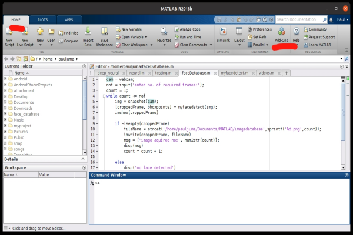
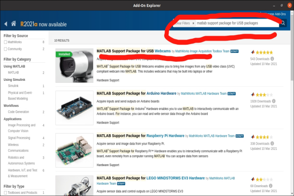
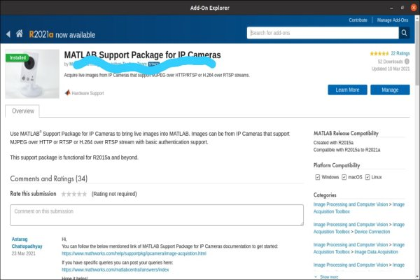
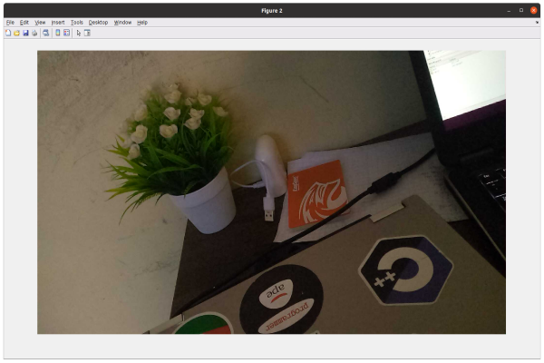
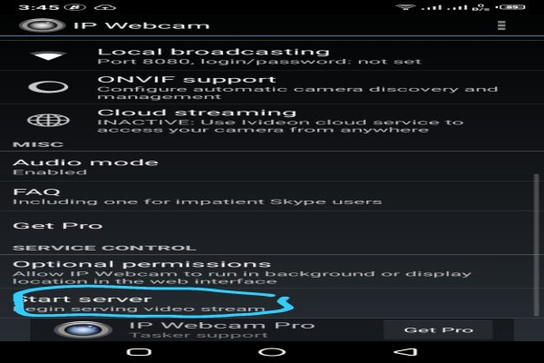

### WEBCAM AND IPCAM IN MATLAB
Introduction
A WEBCAM is connected to pc and can be used to make videos available to other users. The connection is normally through the USB. IPCAM involves the combination of high-end web functionality, pc and network interface to one network-ready product
In this tutorial, we will look at how to install the WEBCAM and IPCAM hardware package for MATLAB which is necessary to access the hardware. We will also look at how to access the laptop's inbuilt WEBCAM and external USB webcam with Matlab code to take snapshots, preview, and record a video clip.
The android application to convert mobile phone's camera as an IPCAM and look at the MATLAB code that can be used to make the mobile phone's camera as an IPCAM

### Prerequisites
- Matlab installed on your pc
- Webcam and Ipcam support packages installed.
- Webcam android application installed on your mobile phone.

### Need for camera interface.
There are several projects which require either image or videos as primary input when they are implemented. For example;
1. Face identification and recognition.
2. Face recognition-based security system and attendance system.
3. Facial expression recognition.
4. Object identification and classification.
5. Fire detection on site.
6. Vehicle license plate recognition and vehicle logging system.
7. and others...

### How to install the hardware support package for Matlab.
-Log in to your math work account at the top right corner of the Matlab window.


-Click on the `adds on` drop-down arrow and select the `get hardware support package`.

-The hardware support package opens up and on the search tab, type `Matlab support package for USB webcam`  and search.

-After locating it, select the support package and click on the install button.
Since we are accessing the IP camera, we need the IP support package.
-Using the same process above, we will locate the `Matlab support package for IP camera` and then install it.


### Matlab code for accessing laptop’s inbuilt webcam and an external USB webcam.
To see the list of all attached cameras to your laptop at the moment of use, execute the code below;
```Matlab
>>webcamlist
```

First, create a camera object with a webcam, so the cam1 is created by executing the command below;
```Matlab
>>cam1 = webcam    %integrated webcam
```

We then execute the preview. This is to see the live stream of the video your camera object is capturing.
```Matlab 
>>preview(cam1)
```

 You can take a snapshot and save the frame, this is done by executing the snapshot function and view the captured image using the imshow function. The captured image is stored in the variable `img1`
```Matlab
>>img1 = snapshot(cam1);
>>imshow(img1) 
```

Clear the camera object after the live stream and the snapshot.
```Matlab
>>clear cam1
```

### How to access external USB camera.
The command remains the same as that of accessing the internal webcam. The difference is that you need to change the hardware name when defining the webcam. Below is how to access it
```Matlab
>> cam2 = webcam(‘USB2.0 PC camera’);
>> preview(cam2);
>> img2 = snapshot(cam2);
>> imshow(img2)
```

```
clear cam2
```

### Matlab code for capturing a live video clip.
We first define the webcam object.
```Matlab
cam = webcam(‘USB2.0 PC camera’);
```

we then give the duration in which we want to capture our video and define the frames per second (fps)
```Matlab
t = 20; % the time is in second
fps = 30;
```

The no. of frames will be the product of the time and the frames per second. The total no. of frames is defined in the variable `nof`

```Matlab
nof = t* fps
```

We then declare the video writer object with your file name. This means that your output will be saved in the current directory folder with the file name `myvideo`

```Matlab
vidwriter = videowriter(‘myvideo.mp4’)
open(vidwriter)
```

define a for loop from one to the number of frames. This defines the number of frames you want to capture
```Matlab
for index = 1: nof
img = snapshot(cam); %this is to acquire the frame
```

we then write the video by executing the `writeVideo` function

```Matlab
writeVideo(vidWriter, img);
pause(t/nof)
end
```

by executing the `snapshot(cam)`, each snapshot will be stored in `img` and at the same time writing to vidWriter that we defined before. The `pause(t/nof)` command is a pause given proportionally to create the fps. 
Once this is done, we close the vidWrite and clear the camera object.
```Matlab
close(vidWriter)
clear cam
```

### Making mobile phone as an IP camera.
To make your mobile phone an IP camera, you need a third-party android application by which you can convert your mobile phone as an IP camera.
To find the android application, go to the google play store on your mobile phone and search for IPCAM. Note that you will find many applications. You only need to choose on and install but it is recommended to use IPCAM from Pavel since it is the most popular for converting mobile phones to IPCAM.


Once it is installed, follow the steps below to view the live stream video.
- Scroll down and select the start server option.

- once the start server is selected, the live stream video is visible on your phone.
- Note that at the lower part of the screen, you can see the IPv4 IP addresses. The IPv4 address will be used to access the camera in our Matlab and so it should be noted.
This IP address can also be opened in your PC browser and see the live streaming from the mobile IP camera. This is done by simply copying your IP address by long-pressing your screen and pasting and searching in your browser. Note that the phone and the PC must be in the wifi network.


### How to access the live video stream from your IP to your Matlab.
We first create a camera object. When creating the camera object, we need the IP address of the IP camera.
```Matlab
>> cam3 = ipcam(‘http://192.168.1.4:8080/video);
>> %execute the preview command to get the video on your Matlab
>> preview(cam3)
```

### Conclusion
Matlab is better software to use for live video streaming. This is because it has support packages that make this process easier. It also easier to use since the codes are not bulky and also easy to understand. IPCAM and WEBCAM are very important. This is because they apply to every sector to improve the security status. They can also be used to capture images for further analysis and data science. 
