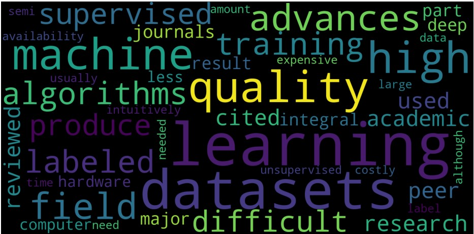

# Creating Word Clouds in Python

Welcome to an exciting article on the word cloud generation. Word clouds are great ways to summarize vast pieces of information visually. They are typically used to depict metadata on websites. The bigger the font size of the keyword, the higher is its significance on the website. In this article, we will code a program to generate custom word clouds.  

### Installing WordCloud Library

This article will be using the `wordcloud` package available at this [link](https://pypi.org/project/wordcloud/). To install the package, we use the following command. The command will ensure the package is installed and ready to use. 

```txt
pip install wordcloud
```

Once installed, check if the package is installed correctly. Run the following piece of code in your terminal, and you should get a valid output for the version number.
```py
>>> import wordcloud
>>> print(wordcloud.__version__)
```
If you get valid output, you have successfully installed the package and can proceed with the rest of the article.

### Word Cloud Generation

Let us now look at the code to generate word clouds. The input to the program will be a paragraph copied from any website of your choice. With the paragraph as input, we will pre-process it and send it to the `wordcloud` package. Let's begin.

We will be using the following libraries in the program:
1. **matplotlib:** A visualization and plotting tool used extensively in Python. 
2. **nltk.corpus.stopwords:** Natural language toolkit, known as `nltk`, is a library built for performing various Natural Language Processing (NLP) tasks. It is a vast library with tools for pre-processing, data cleaning, data visualization, data modeling, etc. We will use the list of stopwords for English. Stopwords are redundant words that don't add significant meaning to the data.
3. **nltk.tokenize.word_tokenize:** Tokenization is the process of breaking down the text into smaller units called tokens. The tokens can be words, sub-words, or phrases. We will use the tokenizer available in `nltk`. 
4. **wordcloud:** It is a library that takes in the list of words and outputs a word cloud image. Developed by [Andrea Mueller](https://amueller.github.io/), it is quite extensible and flexible with respect to the features.

#### Code
We define a class called `WordCloudGeneration` and define the following methods in the class:
1. ** pre-processing**: We pass the input `data` through the tokenizer. The `data` is converted to lower case and tokenized. Tokenization results in a list of words. This list of words is further filtered. The filtering process copies words to `preprocessed_data` only if the word is not a stopword.

2. **create_word_cloud**: This function takes in the processed list of words and calls the `WordCloud` class object. The `generate` method in the `WordCloud` class returns an image of the word cloud. Using the library `matplotlib`, we plot the image. 


```py
import matplotlib.pyplot as plt

from nltk.corpus import stopwords
from nltk.tokenize import word_tokenize
from wordcloud import WordCloud

class WordCloudGeneration:
    def preprocessing(self, data):
        # convert all words to lowercase
        data = [item.lower() for item in data]
        # load the stop_words of english
        stop_words = set(stopwords.words('english'))
        # concatenate all the data with spaces.
        para = ' '.join(data)
        # tokenize the paragraph using the inbuilt tokenizer
        word_tokens = word_tokenize(para) 
        # filter words present in stopwords list 
        preprocessed_data = ' '.join([w for w in word_tokens if not w in stop_words])
        print("\n Preprocessed Data": ,preprocessed_data)
        return preprocessed_data

    def create_word_cloud(self, final_data):
        # initiate WordCloud object with parameters width, height, maximum font size and background color
        # call the generate method of WordCloud class to generate an image
        wordcloud = WordCloud(width=1600, height=800, max_font_size=200, background_color="black").generate(final_data)
        # plt the image generated by WordCloud class
        plt.figure(figsize=(12,10))
        plt.imshow(wordcloud)
        plt.axis("off")
        plt.show()

wordcloudgen = WordCloudGeneration()
# data = input("Enter the text here: ")
data = 'These datasets are used for machine-learning research and have been cited in peer-reviewed academic journals. Datasets are an integral part of the field of machine learning. Major advances in this field can result from advances in learning algorithms (such as deep learning), computer hardware, and, less-intuitively, the availability of high-quality training datasets.[1] High-quality labeled training datasets for supervised and semi-supervised machine learning algorithms are usually difficult and expensive to produce because of the large amount of time needed to label the data. Although they do not need to be labeled, high-quality datasets for unsupervised learning can also be difficult and costly to produce.'
data = data.split('.')
clean_data = wordcloudgen.preprocessing(data)
wordcloudgen.create_word_cloud(clean_data)

```

The output of the code is shown below:



### Conclusion

This was a fun experiment we coded in Python. I encourage you to test the program with various inputs and play around with the code. Happy learning. 