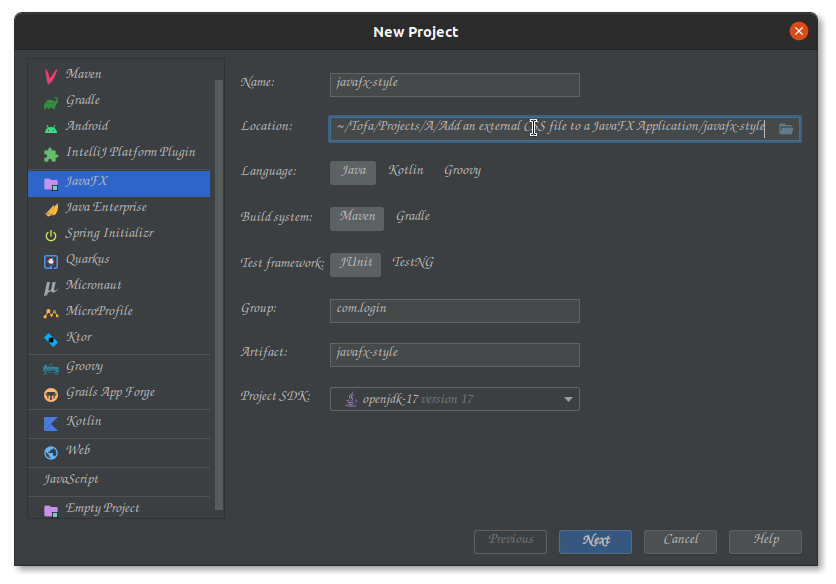
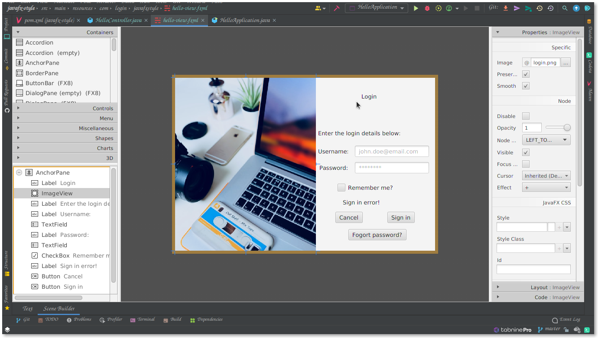
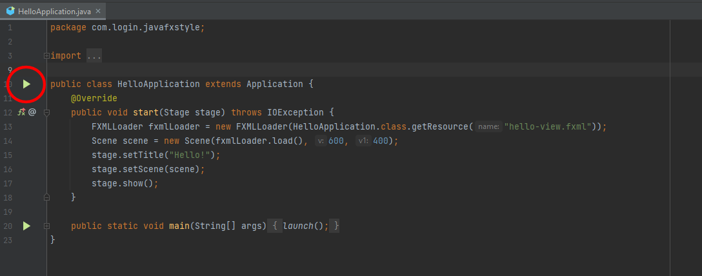
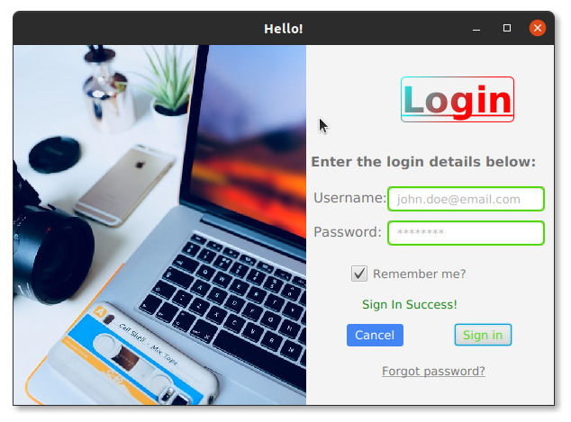
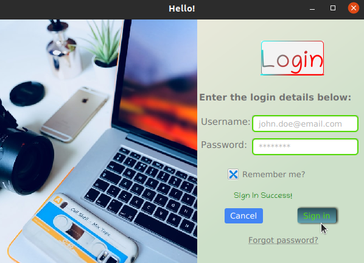

Are you having trouble attaching an external CSS file to a JavaFX application?. Or, having issues with how to link an externally designed styling sheet to your program?.
<!--more-->
Worry no more! in this article, you will find answers to these problems. By now, as you have noticed, JavaFX is easy to work with. 

Challenges come when one decides to style the JavaFX application. It is a cumbersome procedure since each element requires its style. Issues of the designer remembering previously used styles on different elements arises again and again. This is pretty challenging. 

In the FXML file, it also is hard to follow up with the styling in the code since it is not continuous. You may also have noticed that the keywords used during styling are different from those of an HTML file. Well, there is a solution to this problem.

### Table of contents
- [Key takeaways](#key-takeaways)
- [Prerequisites](#prerequisites)
- [Ways of styling a JavaFX application](#ways-of-styling-a-javafx-application)
- [Create a new JavaFX file](#create-a-new-javafx-file)
- [Folder Structure](#folder-structure)
- [Add code inside the FXML application](#add-code-inside-the-fxml-application)
- [Add styling to the application](#add-styling-to-the-application)
  - [Adding an internal styling](#adding-an-internal-styling)
    - [Hardcode it](#hardcode-it)
    - [Using the SceneBuilder](#using-the-scenebuilder)
  - [Using pre-saved variables](#using-pre-saved-variables)
  - [Using an external CSS file](#using-an-external-css-file)
    - [Setting up the project for external CSS styling](#setting-up-the-project-for-external-css-styling)
      - [Adding via the Main class file](#adding-via-the-main-class-file)
      - [Adding it via the SceneBuilder or Hardcoding it](#adding-it-via-the-scenebuilder-or-hardcoding-it)
    - [External styling format](#external-styling-format)
    - [External CSS for many scenes instances](#external-css-for-multiple-scenes-instances)
- [Conclusion](#conclusion)
- [References](#references)

### Key takeaways
At the end of the article, you will gain the following knowledge:
- Saving a repetitive style for easier use on other elements using variables.
- Adding an external stylesheet to the application.
- Referencing elements in the stylesheet by adding JavaFX classes.
- Linking the stylesheet to many scenes.

### Prerequisites
The basics needed for quick follow-up of this article are:
- Java Development Kit installed on your machine. The recommendation is the latest JDK in the market. JDK 17 was used for the article.
- A good Java IDE. The recommendation is the latest version of the IntelliJ ultimate edition. This is because it has the support of JavaFX. For the article, IntelliJ version `2021.2.2` was used as seen in the screenshot captured.
- A good internet connection. This is for fetching indexes for quick development. It will also be used in the generation of the project.

> **NOTE**: The prerequisites can change as time changes from the day the article is published.
> Make sure to follow up on _the latest versions_ of the technologies mentioned.
> The appearance of the applications used may also vary based on the dates of release.

### Ways of styling a JavaFX application
A JavaFX application can be customized using different styles. These styles include the following:
- _Using an internal styling_: This is provided by default by the SceneBuilder
- _Using pre-saved variables_: These variables help one to re-use them hence reducing code duplication in the FXML file.
- _Using an external CSS file_: This file customizes according to the requirements of the project. It reduces code duplication and errors.

In this article, all the above will be demonstrated in a JavaFX application. To do this, we will follow the steps below:
- Design a sample JavaFX login application.
- Know how styling can be done to the application.
- Style the JavaFX application using the normal internal styling.
- Style the application using pre-saved styling variables.
- Apply the styling using an external CSS file.

### Create a new JavaFX file
- Head over to the IDE. Open it and click on the create new project button. Check this out in the image below:



- Select _BootstrapFX_, _ControlsFX_, and _FormsFX_ as the project's dependencies. These are shown in the image below:


### Folder structure
The application folder structure looks as shown below:

```shell
.
├── src
│   └── main
│       ├── java
│          └── com.login
│            ├── javafxstyle
│                  ├── HelloApplication.java
│                  └── HelloController.java
|            └── module-info.java
│       └── resources
│          └── com.login.javafxstyle
│               └── hello-view.fxml
├── target
├── javafx-style.iml
└── pom.xml
```

### Add code inside the FXML application
- Delete the following code inside the `HelloController.java` file shown in the folder structure above:

```java
    @FXML
private Label welcomeText;

@FXML
protected void onHelloButtonClick(){
        welcomeText.setText("Welcome to JavaFX Application!");
        }
```

This will remove the functionality of the 'Hello button' in the application.
- Delete the `V-Box` that contains the `Hello button` and the Label in the `hello-view.fxml` file using the SceneBuilder as shown below:


If SceneBuilder isn't installed, check out how to install it and configure it in IntelliJ [here](https://www.section.io/engineering-education/design-a-sign-up-and-login-gui-using-javafx/). 

The article also shows how to set up JavaFX on IntelliJ ultimate edition. In case of any errors, make sure to restart the IDE.

The above step deletes this code in the file:

```xml

<VBox alignment="CENTER" spacing="20.0" xmlns:fx="http://javafx.com/fxml"
      fx:controller="com.example.demo.HelloController">
  <padding>
    <Insets bottom="20.0" left="20.0" right="20.0" top="20.0"/>
  </padding>

  <Label fx:id="welcomeText"/>
  <Button text="Hello!" onAction="#onHelloButtonClick"/>
</VBox>
```

- Download the `login.png` image found in this [link](https://github.com/blacklihgt/Add-an-external-CSS--stylesheet-file-to-a-JavaFX-Application/blob/main/src/main/resources/com/login/javafxstyle/login.png).
- Copy-paste the image into the location where the `hello-view.fxml` file is.
- Copy the code below and paste it into the `hello-view.fxml` file where the deleted code was.

```xml

<AnchorPane maxHeight="-Infinity" maxWidth="-Infinity" minHeight="-Infinity" minWidth="-Infinity"
            prefHeight="400.0" prefWidth="600.0" xmlns="http://javafx.com/javafx/11.0.2"
            xmlns:fx="http://javafx.com/fxml/1"
            fx:controller="com.login.javafxstyle.HelloController">
  <children>
    <Label fx:id="loginTitleLabel" layoutX="430.0" layoutY="35.0" text="Login"/>
    <ImageView fitHeight="400.0" fitWidth="325.0" pickOnBounds="true" preserveRatio="true">
      <image>
        <Image url="@login.png"/>
      </image>
    </ImageView>
    <Label fx:id="enterDetailsLabel" layoutX="330.0" layoutY="120.0" text="Enter the login details below:"/>
    <Label fx:id="usernameLabel" layoutX="333.0" layoutY="160.0" text="Username:"/>
    <TextField fx:id="usernameTextField" layoutX="415.0" layoutY="157.0" promptText="john.doe@email.com"/>
    <Label fx:id="passwordLabel" layoutX="333.0" layoutY="198.0" text="Password:"/>
    <PasswordField fx:id="passwordPasswordField" layoutX="415.0" layoutY="195.0" promptText="********"/>
    <CheckBox fx:id="rememberMeCheckBox" layoutX="375.0" layoutY="245.0" mnemonicParsing="false"
              text="Remember me?"/>
    <Label fx:id="errorLabel" layoutX="387.0" layoutY="280.0" prefHeight="16.0" prefWidth="171.0"
           text="Sign in error!"/>
    <Button fx:id="cancelButton" layoutX="370.0" layoutY="310.0" mnemonicParsing="false" text="Cancel"/>
    <Button fx:id="signInButton" layoutX="490.0" layoutY="310.0" mnemonicParsing="false" text="Sign in"/>
    <Button fx:id="forgotPasswordButton" layoutX="400.0" layoutY="350.0" mnemonicParsing="false"
            text="Forgot password?"/>
  </children>
</AnchorPane>
```

The step produces the following output when viewed using the SceneBuilder:
- **ImageView**: _login.png_ image view.
- **Labels**: _Login title_, _enter the details below_, _Username_, _Password_, _Sign in error_.
- **TextField**: _Username_.
- **PasswordField**: _Password_.
- **CheckBox**: _Remember Me_.
- **Buttons**: _Cancel_, _Sign in_, _Forgot password_.



- Head over to the `HelloApplication.java` file and make sure to set the Scene dimensions to 600 by 400. This step can be done by copy-pasting the code below in the Scene section:

```java
Scene scene=new Scene(fxmlLoader.load(),600,400);
```

### Add styling to the application
As mentioned before there are three ways to customize the appearance of the application. These include:
- Internal styling.
- Pre-saved variables.
- External CSS file.

Let us start with the first one.

#### Adding an internal styling
It can be achieved in two ways:
- By hardcoding it into the application.
- By using the SceneBuilder.

##### Hardcode it
- Open the FXML file. Click on the `Text` option, at the bottom left part near the status bar, to view the window in a text format.
- In the file, under the label with the **fx:id** of loginTitleLabel, add the following styling:

```xml

<Label fx:id="loginTitleLabel" layoutX="430.0" layoutY="35.0"
       style="-fx-font-size: 40; -fx-text-fill: linear-gradient(from 0% 0% to 100% 200%, repeat, aqua 0%, red 50%); -fx-font-weight: BOLD;"
       text="Login" textFill="#31ebfc"/>

```

The styling makes it _huge_, _bold_ , and with some _linear gradient filling_ in it.
- In the label with the **fx:id** of `enterDetailsLabel`, add the following styling to it:

```xml

<Label fx:id="enterDetailsLabel" layoutX="330.0" layoutY="120.0"
       style="-fx-text-fill: #727272; -fx-font-size: 15; -fx-font-weight: BOLD;"
       text="Enter the login details below:"/>

```

- In the labels with the **fx:id** of `usernameLabel` and `passwordLabel`, add the following respectively:

```xml

<Label fx:id="usernameLabel" layoutX="333.0" layoutY="160.0"
       style="-fx-text-fill: #727272; -fx-font-size: 15;"
       text="Username:"/>

```

and

```xml

<Label fx:id="passwordLabel" layoutX="333.0" layoutY="198.0"
       style="-fx-text-fill: #727272; -fx-font-size: 15;"
       text="Password:"/>

```

- Add the styling below to the checkbox:

```xml

<CheckBox fx:id="rememberMeCheckBox" layoutX="375.0" layoutY="245.0" mnemonicParsing="false"
          style="-fx-text-fill: #727272;" text="Remember me?"/>

```

- Add the following styling to the label with the **fx:id** of `errorLabel`:

```xml

<Label fx:id="errorLabel" layoutX="387.0" layoutY="280.0" prefHeight="16.0" prefWidth="171.0"
       style="-fx-text-fill: red;" text="Sign in error!"/>

```

- As for the remaining buttons, the following will be the styling to be applied to them:

```xml

<Button fx:id="cancelButton" layoutX="370.0" layoutY="310.0" mnemonicParsing="false"
        onAction="#onCancelButtonClick"
        style="-fx-background-color: #4385F4; -fx-text-fill: white; -fx-font-size: 13;" text="Cancel"/>
<Button fx:id="signInButton" layoutX="490.0" layoutY="310.0" mnemonicParsing="false"
        onAction="#onSignInButtonClick"
        style="-fx-background-color: #4385F4; -fx-text-fill: white; -fx-font-size: 13;" text="Sign in"/>
<Button fx:id="forgotPasswordButton" layoutX="400.0" layoutY="350.0" mnemonicParsing="false"
        style="-fx-background-color: transparent; -fx-text-fill: #727272;" text="Forgot password?"
        underline="true"/>
```

> The `onAction` property links the button to a function found in the controller. On a trigger event such as a button click, the function gets executed.

- Open the `HelloCOntroller` file and copy-paste the code below inside the `HelloController` class. Make sure to do the recommended imports as suggested by the IDE:

```java
/*Import JavaFX controls*/
@FXML
Button cancelButton,signInButton;

@FXML
Label errorLabel,loginTitleLabel;

@FXML
TextField usernameTextField;

@FXML
PasswordField passwordPasswordField;

/*Close the scene once the cancel button is clicked*/
@FXML
protected void onCancelButtonClick(){
        Stage stage=(Stage)cancelButton.getScene().getWindow();
        stage.close();
        }

/* Make the label with the fx:id of 'errorLabel' change its text and color on Sign in Button click */
@FXML
protected void onSignInButtonClick(){
        errorLabel.setText("Sign In Success!");
        errorLabel.setStyle("-fx-text-fill: GREEN;");
        }
```

- Run the application via the `HelloApplication.java` file as shown in the image below:



The output looks as shown below:


As we have seen, the application runs as expected.

##### Using the SceneBuilder
- Open the FXML file using the SceneBuilder option found at the bottom left side of the window near the status bar.
- To add the styling for the controls used in the application, click on the control in mind. In this case, start with the label of `fx:id` of`loginTitleLabel`.
- On the tab on the right-hand side, under the properties section, notice that the SceneBuilder automatically recognizes the available formats set to the element. Now, set the following to it:
  - Check the **Underline** checkbox.
  - In the styles section add the following properties by clicking on the `+` sign.
    - `-fx-background-color`: _#f3f3f3_
    - `-fx-border-radius`: _5_
    - `-fx-border-color`: _linear-gradient(from 0% 0% to 100% 200%, repeat, aqua 0%, red 50%)_

The SceneBuilder styling section in the properties tab will look as follows:


- Click on the `Remember me` checkbox and select the `Selected` option.
- Run the application.

It produces the following output:


As seen, there are more options provided by the SceneBuilder in the _Properties_, _Layout_, and _Code_ tabs. Adding styling using this method is very simple and no need for much hustle since there is the provision of GUI.

#### Using pre-saved variables
To do this, the styling will be stored in variables. These variables will be reusable pieces of code. They reduce code errors especially when the styling is long and cumbersome to remember.
- Open up the Controller in the application.
- Above the importation of the controls, add variables that hold styling for the application. We do this by adding the code below:

```java
        String successStyle=String.format("-fx-border-color: #4fd800; -fx-border-width: 2; -fx-border-radius: 5;");
        String successStyleGradient=String.format("-fx-text-fill: #4fd800;");
```

Now use the variables to style different components of the page again and again. An example is both the TextField and the PasswordField.

- Copy the code below in the `onSignInButtonClick` function below the others.

```java
        usernameTextField.setStyle(successStyle);
        passwordPasswordField.setStyle(successStyle);
        signInButton.setStyle(successStyleGradient);
```

- Run the application. The output is as shown below when the `Sign-In button` is clicked:



As seen from the above steps, the styling can be quickly re-used in the project for efficient code. It makes it easy for the developer especially in large projects with many styling presets for different elements.

#### Using an external CSS file
When it comes to some advanced styling, it is better to use this kind of styling. Not only is it easy to manage but it also supports code readability.

##### Setting up the project for external CSS styling
There are two methods of adding an external stylesheet to the program. These are:
- Adding it via the `HelloApplication.java` file.
- Adding it via the SceneBuilder or hardcoding it.

Let us quickly look at both:

###### Adding via the main class file
To add it, follow the steps below:
- Create a new CSS file in the location of the FXML file.
- In the `HelloApplication.java` file, add the line of code below to it. Add it below the `Scene scene = new Scene(fxmlLoader.load(), 600, 400);` line.

```java
scene.getStylesheets().add(getClass().getResource("styles.css").toExternalForm());
```

This applies the styling in the `styles.css` file to the scene created.

###### Adding it via the SceneBuilder or Hardcoding it
The SceneBuilder adds a particular stylesheet styling to a specific control in the application.
This addition is different from using the scene styling mentioned above that adds styling to the whole scene.

Hence, one will be required to repeat the steps over and over again.
1. In the SceneBuilder view, click on the AnchorPane that was added first.
2. In the Properties tab, under the 'JavaFX CSS' section, click on the 'Stylesheets' option.
3. Select the CSS file, and that's it.

> One can also apply a styling of a particular class to control the application by just linking them.
> This linking can be achieved by adding the CSS class to the control in the SceneBuilder at the 'Styles Class' option in the 'JavaFX CSS' section.
> The class can be different from the ones which are known by the application. It can be defined in the Stylesheet added to the control or the Scene. This is shown later on in the code found in this article.

When the AnchorPane CSS class is set to 'unique', it produces the code shown below as seen in the Text View:

```xml
<AnchorPane maxHeight="-Infinity" maxWidth="-Infinity" minHeight="-Infinity" minWidth="-Infinity" prefHeight="400.0" prefWidth="600.0"
            styleClass="unique" xmlns="http://javafx.com/javafx/11.0.2" xmlns:fx="http://javafx.com/fxml/1"
            fx:controller="com.login.javafxstyle.HelloController">
```

Before adding any styling, first, let us look how the styling format looks like:

##### External styling format
For the external CSS styling, if one wants to refer to the **name** (fx:id) of the component, use a `#` symbol before the styles. The format is shown below:

```css
#titleLabel {
  /* Styling for the Control with the fx:id of titleLabel */
}
```

The **controls** provided, are referenced by the CSS file as a form of **classes**. Hence, to refer to a set of a whole class, first, start with a `.` (period) symbol. Follow it up with the name of the control in small letters before the styles.

Examples of such control and their class names are:
- **Button**: button
- **CheckBox**: checkbox
- **Label**: label
- **RadioButton**: radiobutton
- **TextField**: textfield
- **TextArea**: textarea

A sample of the CSS format is as shown below:

```css
.root {
  /*This applies styling for the root node*/
}

.label {
  /* Styling for all Control with the class of 'label' */
}
```

For any styling for the JavaFX application, start with the `-fx-` text then followed by the _styling supported_ by the controls or JavaFX item.

> Not all styles are supported by all controls.
> Make sure to find out the styling that can be applied to each and how it does before applying it.
> Check them out in the [JavaFX documentation](https://docs.oracle.com/javase/8/index.html) provided by Oracle.

- Now, in the StyleSheet created, copy-paste the code below to it:

```css
.root {
  /*This applies styling for the root node*/
  -fx-background-color: linear-gradient(
    from 0% 0% to 100% 200%,
    repeat,
    #fbeee6 0%,
    #cde0c9 50%
  );
  -fx-font-family: "Lucida Console";
}

.label {
  /* Styling for all Control with the class of 'label' */
  -fx-padding: -2px;
  -fx-start-margin: 2px;
  -fx-end-margin: 2px;
}

.guide-link {
  /*Unique class customized by user*/
}

#loginTitleLabel,
#errorLabel {
  -fx-font-family: "Chilanka";
}
```

It applies the styling for all root contents, label controls, and both the loginTitleLabel and errorLabel controls.

Also, more styling can be added to it. These include the after-effects on checkbox checking. To achieve the following, copy and paste the code below to it:

```css
/* Checkbox formatting */
.check-box .mark {
  -fx-shape: "M2,0L5,4L8,0L10,0L10,2L6,5L10,8L10,10L8,10L5,6L2,10L0,10L0,8L4,5L0,2L0,0Z";
}

.check-box:selected .mark {
  -fx-background-color: #0181e2ff;
}

/*Once the button is clicked, it will display the following effect when one hovers over it*/
.button:hover {
  -fx-background-color: linear-gradient(#2a5058, #61a2b1);
}
```

This produces the output below:



##### External CSS for multiple scenes instances
In the case of many scenes, add the styling by using different codes of lines.
- Add a line of code to first point to the location of the Stylesheet then refer to it per the many scenes created.

Open the `HelloApplication.java` file and copy-paste the code below:

```java
/*Multiple scenes created*/
Scene scene= new Scene(fxmlLoader.load(),600,400);
        Scene scene1= new Scene(fxmlLoader.load(),800,400);
        Scene scene2= new Scene(fxmlLoader.load(),1000,400);
        Scene scene3= new Scene(fxmlLoader.load(),1200,400);
        Scene scene4= new Scene(fxmlLoader.load(),1200,600);
        Scene scene5= new Scene(fxmlLoader.load(),1200,1000);

        /*Show the location of the CSS resource file*/
        String css = this.getClass().getResource("styles.css").toExternalForm();

        /*Add the stylesheet quickly to the many scenes*/
        scene.getStylesheets().add(css);
        scene1.getStylesheets().add(css);
        scene2.getStylesheets().add(css);
        scene3.getStylesheets().add(css);
        scene4.getStylesheets().add(css);
        scene5.getStylesheets().add(css);
```

### Conclusion
In conclusion, the following has been achieved and learned:
- Adding an internal styling to the application. This was through:
  - Hardcoding it into the FXML file.
  - Using the SceneBuilder.
- Using pre-saved variables to add the styling.
- Adding the styling via an external CSS file for one or many scenes.

### References
- [JavaFX Oracle Documentation](https://docs.oracle.com/javafx/2/api/)

---
Peer Review Contributions by: [Dawe Daniel](/engineering-education/authors/dawe-daniel/)