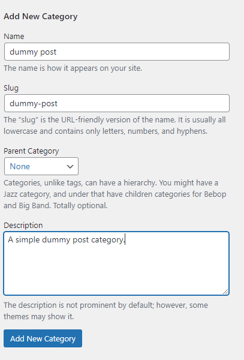
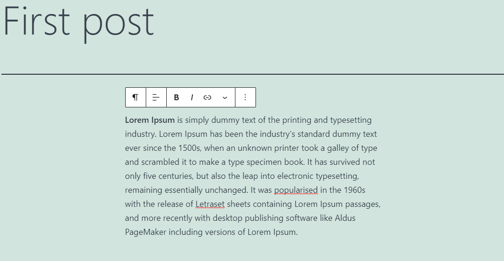
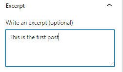

### Overview

- [Adding a post category](#adding-a-post-category).
- [Adding a post](#adding-a-post)
- [Installing the WpGraphQL plugin](#wp-graphql-plugin)
- [Running a query from the GraphiQL IDE](#running-a-query-from-the-graphiql-ide)
- [Setting up the Next.js environment](#setting-up-the-next.js-environment)
- [Conclusion](#conclusion)

### Adding a post

Since WordPress and Next.js are used to develop blog-based websites, we will use this scenario by first adding and posting a post in WordPress admin.

First, from your WpAdmin dashboard, navigate to `posts` and add a `categories`. On the left pane of the resulting page, enter a name, slug, and a description for the post category, and then click the button `Add new category`. Here is how I entered these fields.



Now add a new post.
From the Admin dashboard, navigate to the left sidebar and click on `posts`. On the resulting right pop-up, click on `Add new`. In the resulting panel, enter the title and some dummy content as below:



Each post published in a WordPress blog can be associated with a particular category. On the right side, click on the `Post` tab. And in the `Categories` menu tab, check the category you created in the previous step:


If you want to add a featured image, you can do so in the `Featured image` menu tab. In the `Excerpt` menu tab, add a short description of the post.



Once done, navigate to the top right corner and click `Publish`, and your post will be live.


With that, you have a post set up. Repeat the process a couple of times so that you can have a number of posts to query from.

### Installing the WpGraphQL plugin

[WPGraphQL](https://www.wpgraphql.com/docs/introduction/) is a free, open-source WordPress plugin that provides an extendable GraphQL schema and API for any WordPress site. We will be using it to fetch GraphQL schema to help the WordPress API communicate with Next.js. So go ahead and install this plugin.

From the left sidebar of the dashboard, Navigate to plugins. On the resulting pop-up to the right, click on `Add new`. On the search bar, search `WpGraphQL`:

.

Click `Install now` on the following result. Once the installation is over, make sure you activate the plugin.


### Running a query from the GraphiQL IDE

After installing the plugin on your WordPress site, you will have a `GraphQL` tab at the bottom of the left sidebar. Navigate to it, and on the resulting pop-up, click `GraphiQL IDE`. This will redirect you to a GraphQL playground where you can write your queries.

To query the posts we have published, we will use the following GraphQL schema.

```js
query postsQuery{
  posts{
      edges{
      node{
          title
          categories{
          edges{
              node{
              name
              }
          }
          }
          excerpt
          slug
          content
      }
      }
  }
 }
```

We are fetching all posts from the above query, with each getting the post title, category, excerpt, and content. On the left pane, paste in the above query. Then, execute the query by hitting the play button.

### Setting up the Next.js environment

To set up the Next.js environment, follow the following steps;

- Create a simple Next.js app using [create-next-app](https://nextjs.org/docs/api-reference/create-next-app) by running the following command.

```bash
npx create-next-app cms-wordpress-app
```

- A folder `cms-wordpress-app` will be created, which will contain all the necessary files to start working on a Next.js project. change to the directory to this folder path (project folder) by running;

```bash
cd cms-wordpress-app
```

- To test if everything is working fine, run the following command to start the Next.js development server.

```bash
npm run dev
```

The above command will start the development server on port 3000 and expose it to your local host. Open your browser and visit `http://localhost:3000`. A Next.js boilerplate blog will be served on your browser.

.

### Adding WordPress API to Next.js using the GraphQL schema

Create a `.env.local` file and a `WORDPRESS_API_URL` in the root folder as described below.

```bash
WORDPRESS_API_URL=your_wordpress_api_url
```

To get your `API_URL`;

- Go to your WordPress admin page.

- On the left sidebar, click on GraphQL.

- Get your URL under *GraphQL Endpoint*.

### Connectiong to the WordPress CMS

Create a folder `lib`. In this folder, we will handle the connection from our app to the WordPress CMS.

In the `pages` folder is an `api.js` file where we will implement the various functions for communicating with the WordPress API.

So in the `api.js` file, get the `API_URL` we saved in the `env.local` file by adding this line:

```js
const API_URL = process.env.WORDPRESS_API_URL;
```

Configure a function to be called to send the request to the API as below.

```js
async function fetchAPI(query, { variables } = {}) {
    const headers = { 'Content-Type': 'application/json' }

    if (process.env.WORDPRESS_AUTH_REFRESH_TOKEN) {
      headers[
        'Authorization'
      ] = `Bearer ${process.env.WORDPRESS_AUTH_REFRESH_TOKEN}`
    }

    const res = await fetch(API_URL, {
      method: 'POST',
      headers,
      body: JSON.stringify({
        query,
        variables,
      }),
    })

    const json = await res.json()
    if (json.errors) {
      console.error(json.errors)
      throw new Error('Failed to fetch API')
    }
    return json.data
  }
```

The above function;

- Will receive two parameters, the query to run and the variables to pass with the query. Then, we will fetch the data from the CMS using the query.

- The request will be sent as a POST using [Fetch](https://developer.mozilla.org/en-US/docs/Web/API/Fetch_API).

- If an error occurs when running the query, a message will be thrown else the data will be returned.

### Fetch all WordPress posts

Add a function to fetch all the posts as follows;

```js
export async function getPosts(){
    const data = await fetchAPI(
        `query AllPosts {
          posts(first: 20) {
            edges {
              node {
                title
                categories{
                edges{
                    node{
                    name
                    }
                }
                }
                excerpt
                slug
                author {
                  node {
                    name
                    firstName
                    lastName
                  }
                }
              }
            }
          }
        }
      `,
        {
          variables: {},
        }
      );
    return data?.posts?.edges;
}
```

From above, we are sending a request to the WordPress API to get the first twenty posts.

### Fetch a single WordPress post

Similarly, we add a function to get a single post as follows;

```js
export async function getSinglePost(id){
    const data = await fetchAPI(`
    query getSinglePost($id:ID!){
        post(id:$id){           
              title
              categories{
              edges{
                  node{
                  name
                  }
              }
              }
              excerpt
              content
              slug
              id
              author {
                node {
                  name
                  firstName
                  lastName
                }
              }
        }
      }
    `,{id});

    return data?.post;
}
```

In the above function, we receive the post's id that we want to retrieve and send it alongside the query to get its specific data.

To show the posts in our app,  we will utilize the [getServerSideProps()](https://nextjs.org/docs/basic-features/data-fetching) method. The method will run on each request to get the data from the CMS. The method will be implemented on the home page, where we fetch all the posts and on a specific post page.

To implement the method on the home page, follow the below steps in `pages/index.js`.

- Import the `getPosts` function;

```js
import {getPosts} from "../lib/api";
```

- Below the `Home` function call the `getServerSideProps()` as below:

```js
export async function getServerSideProps(ctx){
  let posts = await getPosts();
  return {
    props:{
      posts
    }
  }
}
```

In the above `getServerSideProps()`, we are calling the `getPosts()` function to get the posts and returning them inside the `props` object. The data will be sent to the component. We have to get it and map through it to show the posts.

- Edit the `Home` function as below;

```js
export default function Home({posts}) {
    return (
      <div className={styles.container}>
        <Head>
          <title>CMS blog</title>
          <meta name="description" content="CMS Wordpress with Next.js" />
          <link rel="icon" href="/favicon.ico" />
        </Head>

        <main>
        {
          posts.map((post,index) => (
            <div key={index}>

              <Link href={`/posts/${post.node.id}`}>
              <a style={{color:'blue'}}>{post.node.title}</a>
              </Link>
              
              <div dangerouslySetInnerHTML={{__html:post.node.excerpt}} />

              <p>By {post.node.author.node.name}</p>
            </div>
          ))
          }
        </main>

        <footer className={styles.footer}>
          <p>Posts</p>
        </footer>
      </div>
    )
  }
```

In the above function, we are;

- Getting the posts sent from the `getServerSideProps()`.

- Mapping through the posts and for each post showing the title, excerpt, and the author. The title is a link to a specific posts page.

### Testing

To test the above, ensure the development server is up and running, using the command;

```bash
npm run dev
```

In your browser, navigate to `http://localhost:3000`. Your post will be displayed based on the posts you added to your WordPress blog.


### Testing with a single post

To show a single post page, navigate to the the `pages` directory and create the `posts` directory. Inside the `posts` directory, create `[id].js` file. The [] signifies that the id will be dynamic. In the `[id].js` file, import the `getSinglePost` function;

```js
import {getSinglePost} from "../../lib/api";
```

This function;

- Gets the posts sent from the `getServerSideProps()`.

- Maps through the posts and for each post showing the title, excerpt, and the author. The title is a link to a specific posts page.

Next, implement `getServerSideProps()` as follows;

```js
export async function getServerSideProps(ctx){
    let {id} = ctx.params;
    let post = await getSinglePost(id);
    
    return {
        props:{
            post
        }
    }
}
```

From the above block of code, we get the post's id, fetching the post based on that id, and sending the post inside the props object. The next step is to implement a function for the view. To do that:

Import the styles module and Head package from Next.js:

```js
import Head from "next/head";
import styles from '../../styles/Home.module.css';
```

Create a `Post` function as below:

```js
export default function Post({post}) {
    return (
        <div className={styles.container}>

            <Head>
                <title>{post.title}</title>
            </Head>
            <main>                
                <div dangerouslySetInnerHTML={{__html:post.excerpt}} />
                <br />
                <br />
                <div dangerouslySetInnerHTML={{__html:post.content}} />
            </main>

        </div>
    )
}
```

Here we are simply getting the post passed and rendering it to the view from the above function by showing its title, excerpt, and content. Feel free to show as many fields as you want but make sure they are in the query.

To test this, ensure the development server is running, else start it by running;

```bash
npm run dev
```

In your browser, navigate to `http://localhost:3000`.

To test the implementation, click on the title of any post on the home page. You should be redirected to a single post page. Then, click on the back arrow and explore the other posts.

#### Conclusion

We have managed to create posts in WordPress, query, and show them from a Next.js application. To gain more insightful knowledge about the various technologies and concepts used, check out the following resources.

- [WpGraphQL](https://www.wpgraphql.com/)
- [Wordpress CMS](https://wordpress.org/)
- [Next.js](https://nextjs.org/)
- [GraphQL](https://graphql.org/)
- [Data fetching in Next.js](https://nextjs.org/docs/basic-features/data-fetching)