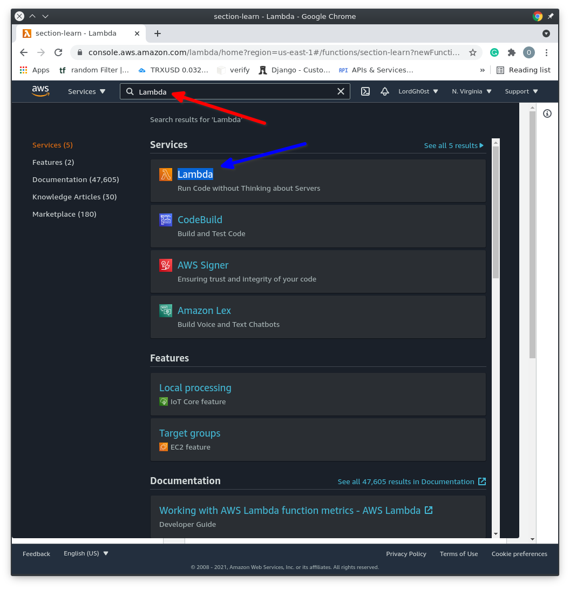
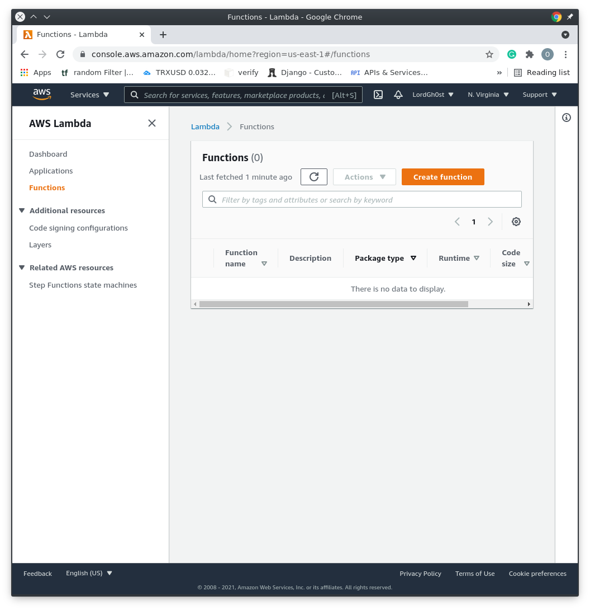

Creating Serverless Functions (Faas) with AWS Lambda and Golang

Serverless architecture is a new paradigm that is being used in the development of modern applications. The term "serverless" refers to the abstraction of "servers" from application development. Function-as-a-Service (FaaS) is a serverless method of running modular code on the cloud. You can use FaaS to write code that is triggered by events. For example, when a user clicks on a button in your web application, a specific cloud function is executed.

We will not only look at how to use FaaS in this tutorial, but we will also construct some for others to use. We'll be working in Golang, but the same method can be applied to Python, Node, Java, or any other language or framework you want.

### Requirements

* [AWS](https://aws.amazon.com) account
* Go 1.x installed on your machine

### Setting up a Lambda Function on AWS

<<<<<<< HEAD
1. After Creating your AWS account, on the main dashboard, search for Lambda.When you click on Lamda, the AWS lambda will be visible.
2. Click on the Create Function button to set up a new AWS Lambda function.The name of the function is user-profile. Click on Create function.
3. On the function’s dashboard, we will upload the function we want to run in the cloud. In the next section, we'll look at how to make a function that runs on AWS Lambda.
=======
1. After Creating your AWS account, on the main dashboard, search for Lambda.When you click on Lamda, you will see the AWS lambda page.
2. Click on the Create Function button to set up a new AWS Lambda function.The name of the function is user-profile. Click on Create function.
3. On the function’s dashboard, we will upload the function we want to run in the cloud. In the next section, we will see how to create a function that will run on AWS lambda.
>>>>>>> 012ab3bce84482631c2308ae86a7bca9c5bbe029

### Creating the User-Profile Function in Golang

In this section, we will see how to make the function that AWS Lambda will run and how to convert it into a zip file before we upload it on AWS Lambda. We need to install the "aws-lambda-go" package with:

* `go mod init`
* `go get github.com/aws/aws-lambda-go/lambda`

```go

package main

 

import (

 "fmt"

)

 

type InfoEvent struct {

 Firstname string `json:"firstname"`

 Lastname string `json:"lastname"`

 Age int `json:"age"`

}

 

type Response struct {

 Profile string `json:"profile"`

}

 

func HandleInfoEvent(event InfoEvent) (Response, error) {

 return Response{Profile: fmt.Sprintf("Their name is %s %s, they are %d ", event.Firstname, event.Lastname, event.Age)}, nil

}

 

func main() {

 lambda.Start(HandleInfoEvent)

}

```

You can also run `git clone https://github.com/Bamimore-Tomi/faas-golang.git` and navigate to the “server” folder to see this source code. In the program above, we created the `HandleInfoEvent` function. This is the function that runs in the cloud. Use the following steps to compile and zip the program.

#### Macos and Linux Installation Instructions

1. Compile the executable.

```bash

GOOS=linux go build main.go

```

2. Create the zip file with

```bash

zip user-profile-function.zip main

```

#### Windows Installation Instructions

1. Download the `build-lambda-zip` tool from GitHub

```bash

go.exe get -u github.com/aws/aws-lambda-go/cmd/build-lambda-zip

```

2. You can now use the tool downloaded earlier to create the zip file.

```bash

Set GOOS=linux

Go build -o main main.go

%USERPROFILE%\Go\bin\build-lambda-zip.exe -output main.zip main

```

You can now upload the zip file generated. You can test the function you uploaded right on AWS to see if it works well. First, we need to change the handler's name from the default `hello` to `main`. The Lambda function handler is the method in your function code that processes events.


Click on Edit:

Change the handler field from hello to main and save.

### Testing the Function on AWS Lambda

1. On the main dashboard, click on Test
2. Input this sample data in the json editor on the page and click on Test.

```json

{

"firstname":"Oluwatomisin",

"lastname":"Bamimore",

"age":19

}

```


The function we uploaded is executed. This is the result.

### Calling the Lambda Function From Golang

We can also execute the function uploaded to AWS lambda locally. We have to install the AWS Go SDK.

```bash

go get github.com/aws/aws-sdk-go

```

We can now use this code segment to execute the function in the cloud and see the results locally.

```go

package main

 

import (

 "encoding/json"

 "fmt"

 "os"

 

 "github.com/aws/aws-sdk-go/aws"

 "github.com/aws/aws-sdk-go/service/lambda"

 "github.com/joho/godotenv"

 

 "github.com/aws/aws-sdk-go/aws/credentials"

 "github.com/aws/aws-sdk-go/aws/session"

 // "github.com/aws/aws-lambda-go/lambda"

)

 

type Info struct {

 Firstname string `json:"firstname"`

 Lastname string `json:"lastname"`

 Age int `json:"age"`

}

 

type Response struct {

 Profile string `json:"profile"`

}

 

func main() {

 // lambda.Start(HandleLambdaEvent)

 // event := MyEvent{Name: "Tomi", Age: 17}

 // c, err := json.Marshal(event)

 // if err != nil {

 // fmt.Println("Error")

 // }

 godotenv.Load()

 sess := session.Must(session.NewSessionWithOptions(session.Options{SharedConfigState: session.SharedConfigEnable}))

 client := lambda.New(sess, &aws.Config{Region: aws.String("us-east-1"), Credentials: credentials.NewStaticCredentials(os.Getenv("aws_access_key_id"), os.Getenv("aws_secret_access_key"), "")})

 request := Info{Firstname: "Oluwatomisin", Lastname: "Bamimore", Age: 16}

 payload, err := json.Marshal(request)

 if err != nil {

 fmt.Println("Error marshalling request")

 os.Exit(0)

 }

 result, err := client.Invoke(&lambda.InvokeInput{FunctionName: aws.String("user-profile"), Payload: payload})

 if err != nil {

 fmt.Println("Error calling user-profile function", err)

 os.Exit(0)

 }

 var resp Response

 err = json.Unmarshal(result.Payload, &resp)

 if err != nil {

 fmt.Println("Error unmarshalling user-profile response")

 os.Exit(0)

 }

 

 fmt.Println(resp.Profile)

}

```

You need to create an [IAM](https://docs.aws.amazon.com/IAM/latest/UserGuide/id_users_create.html) user with the correct permissions. Store the `aws_access_key_id` and the `aws_secret_access_key` in a `.env` file in the directory you are currently working in.

After running the program, AWS will execute the cloud function, and you will get this result.


The program passes in some arguments into the cloud function and returns the result.

### Conclusion

We have successfully deployed and tested our AWS Lambda function with Golang. The same method may be used to build serverless functions in other languages such as Python, JavaScript, and Java.
