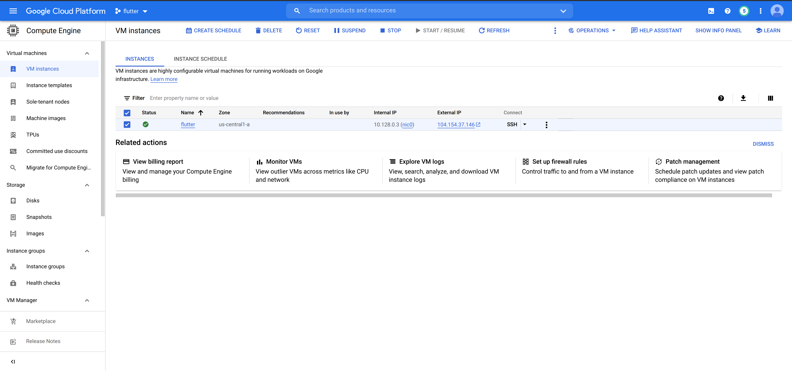
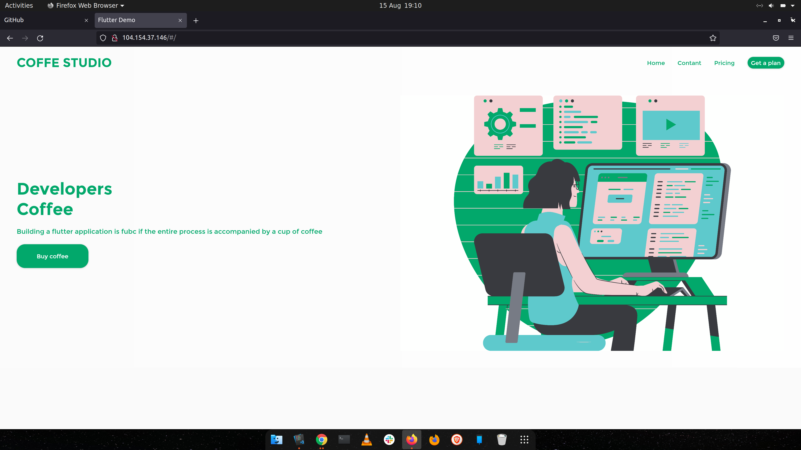

Based on the type of application one wants to deploy, Google provides various web hosting options for a developer. Deciding on this depends on whether your application is dynamic or static. For static sites, Google offers Cloud storage and Firebase hosting. However, dynamic applications have a different set of options, including Compute Engine, App Engine, and Cloud Run are the options. 
<!--more-->
This article will focus on our deployment using Google Compute Engine(GCE). In the demonstration, we will build a Flutter web application, and at the end of the tutorial, we should have our flutter project running live on Google Compute Engine with a unique IP address to access it. 

### Table of content
- [Creating a project on Google Cloud](#creating-a-project-on-google-cloud)
- [Setting up the virtual machine](#setting-up-the-virtualmachine)
- [Server stack deployment](#server-stack-deployment)
- [The Flutter application](#the-flutter-application)
- [Deployment to the Compute Engine](#deployment-to-the-compute-engine)
- [Testing the deployment](#testing-the-deployment)
- [Conclusion](#conclusion)

### Creating a project on Google Cloud
Everything with Google requires a project accessed using an API key. We have to create a new Google Cloud Platform project and enable the Google Compute Engine API to get started. Make sure that you set up billing so that you can use the Google compute engine API.

Google provides you with the $300 free credit to use for 90 days as you try out the new products they provide. However, make sure that you shut down your running instances if you do not want to incur extra charges after the 90 days.

After successfully creating our project, we need to install the Google Cloud SDK using the command-line tool. 

```bash
./google-cloud-sdk/install.sh
./google-cloud-sdk/bin/gcloud init
```

Lastly, update the Google cloud components.

```bash
gcloud components update
```

### Setting up the virtual machine
Google Compute Engine(GCE) is a high-end compute service that allows developers to create and run virtual machines on the underlying secure and reliable infrastructure of Google. Using GCE takes advantage of the complex computing capabilities and heavy workload without acquiring them physically.

Next, we add the complete engine by creating a new instance through the steps below.

- Go to Navigation menu ⇾ Compute Engine ⇾ VM instance ⇾ Create Instance.
- Choose a unique instance name, and for the rest of the fields, set them as below:
    - Machine family: General-purpose
    - Machine type: e2-micro
- If you have an existing domain name, click the `Management, security, disks, networking, sole tenancy` link to expand the available options. 
- Click on the `Networking` tab.
- In the `Hostname` field, add your domain name.
- On the sidebar, head over to the networking tab ⇾ VPC network ⇾ External IP addresses, change IP address type to static.

You will see the running instance as below.



### Server stack deployment
Most of the popular open-source web applications are running the LAMP stack. LAMP stack is a collection of open development software that facilitate hosting of dynamic application.

LAMP is an acronym for Linux Apache MySQL and PHP, which provide a set of software that delivers high performance for dynamic web applications. We will use the LAMP stack for our deployment, but first, we need to [install it](https://cloud.google.com/community/tutorials/setting-up-lamp) to the virtual machine we just created.

- To install LAMP, head over to launch a new terminal, then run the commands below:


```bash
sudo apt-get update
sudo apt-get install apache2 php libapache2-mod-php
```

- We can test LAMP deployment by open the URL `HTTP://[your-external-ip-address]`. You should see the default page of apache2.
- Next, install MariaDB on the running virtual machine instance.

```bash
sudo apt-get update
sudo apt-get install MariaDB-server PHP PHP-MySQL
```
- Start the MariaDB service on the virtual machine instance.

```bash
sudo systemctl start MariaDB
```

### The Flutter application
The Flutter application we will use for this project is a simple landing page built using the section.io theme. It has a navigation bar, a landing page image, and a dummy button to request coffee. 

Writing the code and describing every piece of the source code would make this tutorial unnecessarily long so, I have created and uploaded the files for the project in my [Repl.it](https://replit.com/@paulromans/flutter-web#). 

Click the link below and clone the application.

[Link to project used for the tutorial.](https://replit.com/@paulromans/flutter-web#)

### Deployment to the Compute Engine
- The first thing you need to do after cloning the project is ensuring that it runs by executing the command used to run flutter web applications.

```bash
flutter run -d chrome
```

- Next, build an uploadable web version of the project that we are to deploy to GCE.

```bash
flutter build web
```

If you are application compiled and runs well, you can proceed to the next step.

- Compress the web folder or your application from your machine, then obtain a `web.zip` file inside the `build` folder.
- Head over to your virtual machine instance, then click `SSH tools` to upload the file.


- Google virtual machine provides the upload function to deploy the application to the VM. Select the `web.zip` file.


- However, you can use the gcloud command if you have installed Cloud SDK in your workstation.

```bash
gcloud compute scp [LOCAL_FILE_PATH] root@lamp-tutorial:/var/www/html
```

- Next, we move the zip folder to the `/var/www/html` to be dynamically served by the LAMP stack.

```bash
sudo mv web.zip /var/www/html
```

- At this moment, the application cannot run because it's still a zip file, and as you know that our virtual machine is empty, we can't unzip the folder unless we install an application for that. 

- We will install `unzip` using the command

```bash
sudo apt-get install unzip
```

- Unzip the web folder of the application

```bash
sudo unzip web.zip
```

Navigate to the directory of your application using `cd web`, then execute the command below:

```bash
sudo mv * ../
cd ..
sudo rm -r web
```

### Testing the deployment
Now, if you head over to your browser and paste the URL `http://your-external-ip`, you should see your application running.



### Conclusion
In this article, we demonstrated how to deploy a flutter web application on Google's compute engine. It's so satisfying that we can use the GCE to explore the Google infrastructure in running applications. Having built a web application, we successfully deployed and accessed the application using a public IP address that we can access from any device.

### Further reading
You can do more research on this topic. For instance, our application IP address is insecure such that you cannot access it using the `HTTPS` protocol. The insecurity problem is tackled by securing the Apache server using a Secure Socket Layer certificate(SSL). You can find more about the process in [this link](https://www.linux.com/topic/networking/how-install-ssl-certificate-linux-server/).
