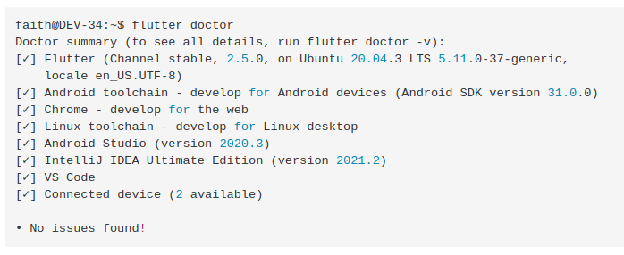
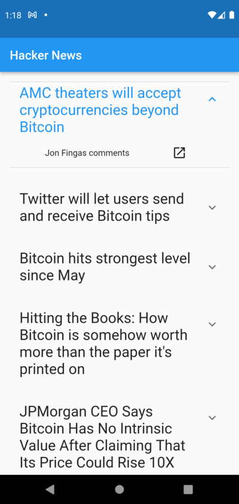

### Introduction

Managing application state in a clean and optimized way is very important when dealing with large Flutter applications. State management is the handling of application data between different screens and components. This article will discuss how to retrieve data from an API and pass it to a service class to the UI. The UI will listen for data from the API. When the data is available, the application will display a list of items. When it is in a loading state, The application will show a progress indicator.

### Prerequisites

1. [Flutter SDK]() installed.
2. Preferred IDE or code editor installed.
3. Knowledge in [Flutter]().

### Table of contents

- [Introduction](#introduction)
- [Prerequisites](#prerequisites)
- [Table of contents](#table-of-contents)
- [Project setup](#project-setup)
- [Domain](#domain)
- [Service](#service)
- [State Manager](#state-manager)
- [UI](#ui)
- [Testing](#testing)
- [Conclusion](#conclusion)

### Project setup

Before proceeding, run the command below to verify that you have installed Flutter correctly on your machine.

```bash
$ flutter doctor
```

Now that you have verified that everything is set up correctly, execute the command below to create a new flutter project.

```bash
$ Flutter create news_app # news_app is the name of the application
```

Open the generated project in your code editor, add the dependencies below to `pubspec.yml` file.

```yaml
dependencies:
  flutter:
    sdk: flutter
  mobx:
  flutter_mobx:
  http:
  url_launcher:
  cupertino_icons: ^1.0.2

dev_dependencies:
  build_runner:
  mobx_codegen:
  flutter_test:
    sdk: flutter
```

* `mobx`- state manager we will be using.
* `http`- internet connection library we will be using to retrieve news data from an API.
* `url_launcher`- opens a browser with the URL provided. In our case, every news item will have a URL pointing to the website where the news was published.
* `mobx_codegen`- code generation tool for `mobx` state manager.

### Domain

In the project's lib folder we created, create a new dart file named `article.dart` and add the code snippet below.

```dart
class Articles {
  // Default constructor
  Articles({
    String? author,
    String? title,
    String? description,
    String? url,
    String? urlToImage,
    String? publishedAt,
    String? content,
  }) {
    _author = author;
    _title = title;
    _description = description;
    _url = url;
    _urlToImage = urlToImage;
    _publishedAt = publishedAt;
    _content = content;
  }
  //Converts a news JSON item to Article model 
  Articles.fromJson(dynamic json) {
    _author = json['author'];
    _title = json['title'];
    _description = json['description'];
    _url = json['url'];
    _urlToImage = json['urlToImage'];
    _publishedAt = json['publishedAt'];
    _content = json['content'];
  }

  String? _author;
  String? _title;
  String? _description;
  String? _url;
  String? _urlToImage;
  String? _publishedAt;
  String? _content;

  String? get author => _author;

  String? get title => _title;

  String? get description => _description;

  String? get url => _url;

  String? get urlToImage => _urlToImage;

  String? get publishedAt => _publishedAt;

  String? get content => _content;

  //Converts Article model to a JSON
  Map<String, dynamic> toJson() {
    final map = <String, dynamic>{};
    map['author'] = _author;
    map['title'] = _title;
    map['description'] = _description;
    map['url'] = _url;
    map['urlToImage'] = _urlToImage;
    map['publishedAt'] = _publishedAt;
    map['content'] = _content;
    return map;
  }
}

```

### Service

Create a new dart file named `service.dart` and add the code snippet below in the lib folder.

```dart
import 'dart:convert';

import 'package:http/http.dart' as http;

import 'articles.dart';

class NetworkService {
  //Creates an empty list of articles
  List<Articles> articles = [];

  //This method is asynchronous, hence the async keyword used, meaning the application can make the network request and continue performing other tasks. When there is a response, then the application acts on the data.
  Future<List<Articles>> getData(String url) async {
    final response = await http.get(Uri.parse(url));
    if (response.statusCode == 200) {
      //Retrieves the reponse from the http reponse body
      final data = jsonDecode(response.body); 
      //Loops through the news list JSON converting each news item to Article model and adding to articles list we defined above.
      articles = (data["articles"] as List)
          .map((json) => Articles.fromJson(json))
          .toList();
    } else {
      //This section of the code is excuted if the netwrok request fails, i.e. due to unavailable network or incorrect URL.
      print("Error in URL");
    }
    return articles;
  }
}

```

* `getData(String url)` method takes in the URL and retrieves a list of news items from the API URL provided.
  

### State Manager

In the lib folder, create a new dart file named `news_store.dart` . This file will contain our state management code.
Add the code snippet below to `news_Store.dart` file created above.

```dart
import 'package:mobx/mobx.dart';
import 'package:structure/articles.dart';

import 'network_service.dart';

part 'news_store.g.dart';

class NewsStore = _NewsStore with _$NewsStore;

abstract class _NewsStore with Store {
  //Creates an instance of the network service class
  final NetworkService httpClient = NetworkService();
  
  @observable
  List<Articles> articles = [];

  @action
  Future<List<Articles>> fetchArticle() async {
    await httpClient
        .getData(
            'https://newsapi.org/v2/everything?q=bitcoin&apiKey=1bfba80a852a4a36b61239f758f97cb5')
        .then((articleList) {
      articles.addAll(articleList);
    });
    return articles;
  }

  void getTheArticles() {
    fetchArticle();
  }
}
```

* `@observable` annotation indicates that the application can listen for any changes in the variable marked. For example, our application will listen for changes in the list of articles. When the articles are retrieved from the API and added to the articles list, the articles will be displayed on the UI rather than a progress indicator.
* `@action` annotation marks the `fetchArticle()` as actionable, meaning it performs certain operations and changes the data state in the variable marked with `@observable` annotation.
 

### UI
In the lib folder, create a new dart file named `home_screen.dart` and add the code snippet below.
```dart
import 'package:flutter/material.dart';
import 'package:flutter_mobx/flutter_mobx.dart';
import 'package:structure/articles.dart';
import 'package:url_launcher/url_launcher.dart';

import 'news_store.dart';

class HomeScreen extends StatefulWidget {
  const HomeScreen({Key? key}) : super(key: key);

  @override
  _HomeScreenState createState() => _HomeScreenState();
}

class _HomeScreenState extends State<HomeScreen> {
  //Initializes the NewsStore state manager class
  NewsStore newsStore = NewsStore();
  List<Articles> articles = [];

  @override
  void initState() {
    super.initState();
    getNews();
  }
  //Call the fetchArticle() method from the newsStore state manager class, the getData() method from the network service class is called to make network request.
  getNews() async {
    await newsStore.fetchArticle();
    //When the newStore articles list has data the the data is retrieved and add to the articles list in this screen.
    articles.addAll(newsStore.articles);
  }

  @override
  Widget build(BuildContext context) => Scaffold(
        appBar: AppBar(
          title: const Text('News'),
        ),
        //The Observer widgets checks if the state of the observable varibale changed and renders a widget conditionaly.
        body: Observer(
          builder: (context) => RefreshIndicator(
            //Whenever the page is refreshed a network call is made to retrive new news items.
            onRefresh: () async {
              await Future.delayed(const Duration(seconds: 4));
              await newsStore.fetchArticle();
              Scaffold.of(context).showSnackBar(snackBar);
            },
            child: Observer(
              //A list of news items shows if the observable variable has data or a progress indicator is shown.
                builder: (_) => (!articles.isEmpty)
                    ? ListView.builder(
                        itemCount: articles.length,
                        itemBuilder: (_, index) {
                          final newsArticles = articles[index];
                          return ArticleContainer(newsArticles);
                        },
                      )
                    : const Center(
                        child: CircularProgressIndicator(),
                      )),
          ),
        ),
      );

  Widget ArticleContainer(Articles newsArticle) {
    return Padding(
      key: Key(newsArticle.title!),
      padding: const EdgeInsets.all(16.0),
      child: ExpansionTile(
        title: Text(
          newsArticle.title!,
          style: const TextStyle(fontSize: 24.0),
        ),
        children: <Widget>[
          Row(
            mainAxisAlignment: MainAxisAlignment.spaceEvenly,
            children: <Widget>[
              Text("${newsArticle.author} comments"),
              IconButton(
                onPressed: () async {
                  if (await canLaunch(newsArticle.url!)) {
                    launch(newsArticle.url!);
                  }
                },
                icon: const Icon(Icons.launch),
              )
            ],
          ),
        ],
      ),
    );
  }
}
```

In the `main.dart` file, add the code snippet below.

```dart
import 'package:flutter/material.dart';
import 'package:structure/home_screen.dart';

void main() {
  runApp(const Application());
}

class Application extends StatelessWidget {
  const Application({Key? key}) : super(key: key);

  @override
  Widget build(BuildContext context) {
    return const MaterialApp(
      debugShowCheckedModeBanner: false,
      home: HomeScreen(),
    );
  }
}

```

### Testing



### Conclusion

With all the content covered in this article, you can now try building a production-grade Flutter application, managing the application state using Mobx, and following the recommended patterns, i.e. model view, ViewModel(MVVM) pattern. You can download the complete source code [here]().
