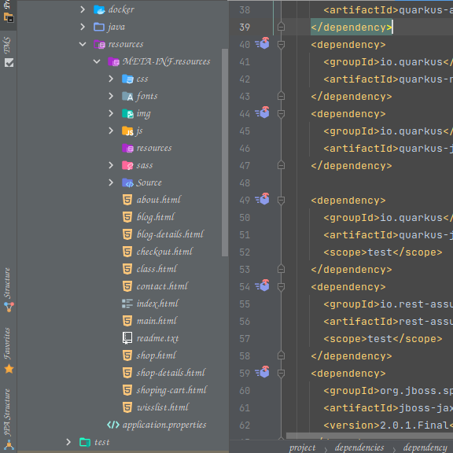
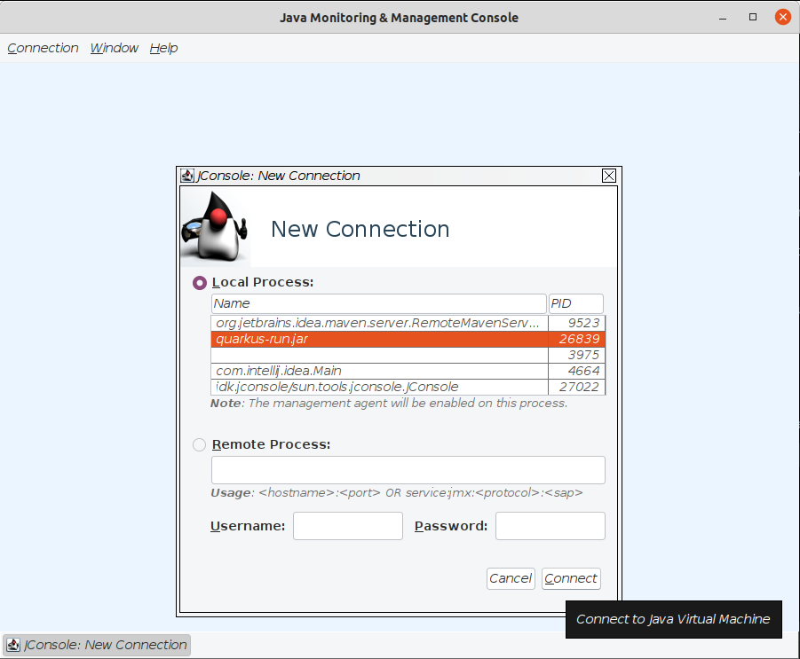
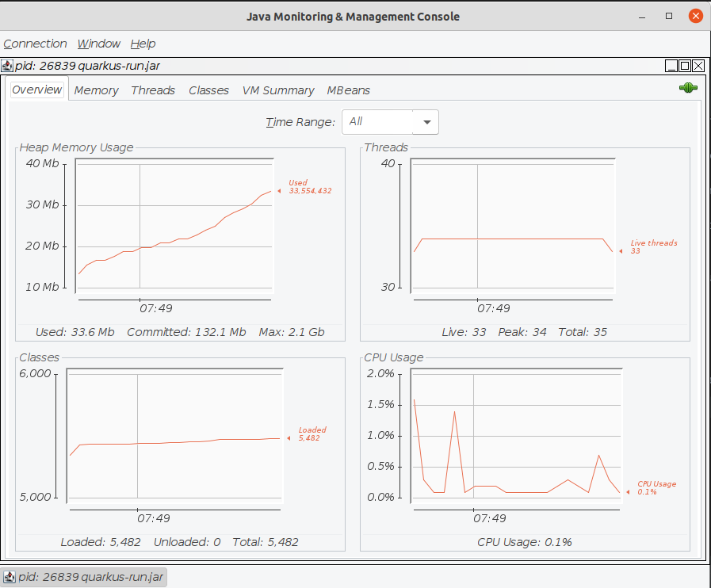
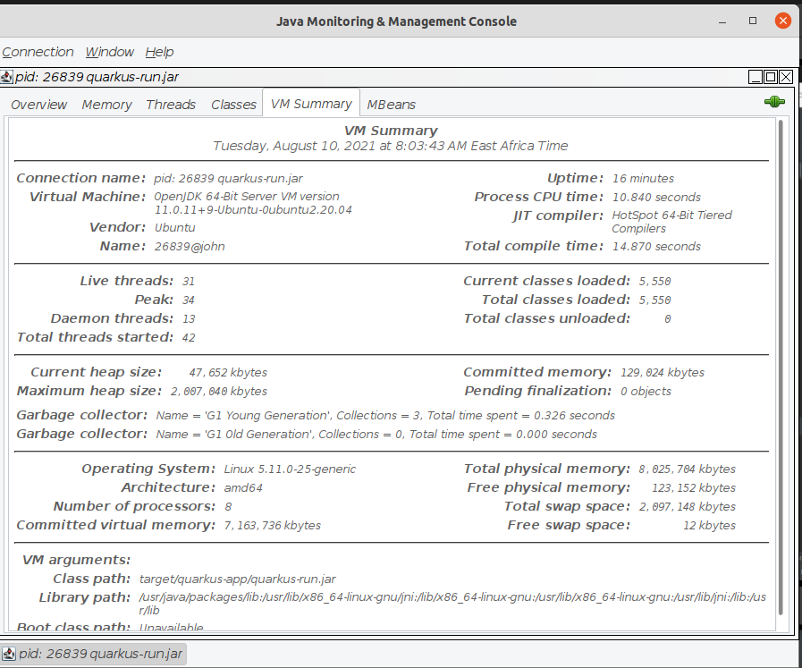
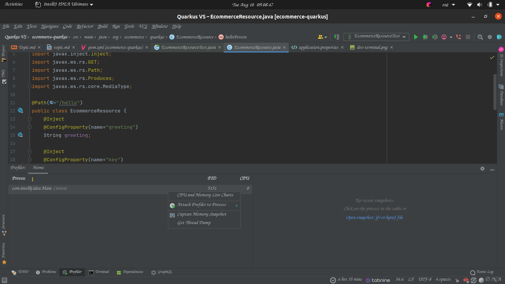

Quarkus is an open-source Java native framework useful for creating and managing Kubernetes native Java stack, microservices, and serverless environments which is optimized for the open JDK and the GraalVM runtime. 

It is a very effective platform for Kubernetes, cloud, and serverless environments.
In similarity to the Spring Boot framework, Quarkus is a combination of different Java libraries and standards, providing you a consolidation along with improvements on the JVM. 

Although this framework is young compared with the language (over 20 years old), it has some promising features and results that make it catchy to developers. Quarkus is natively integrated with Java libraries, hence you don't have to learn a new thing.


_(Quarkus Official icon)_

In this tutorial, we will get started on Quarkus and see how we can have some hands-on Quarkus projects using different tools and software environments.

### Table of Contents

- [Key takeaways](#key-takeaways)
- [Pre-requisites](#pre-requisites)
- [Quarkus briefs](#quarkus-briefs)
- [Comparison between Quarkus and other Java frameworks](#comparison-between-quarkus-and-other-java-frameworks)
- [Get started with a Quarkus project](#get-started-with-a-quarkus-project)
  - [Quarkus.io project initializer](#quarkusio-project-initializer)
        - [Folder structure](#folder-structure)
    - [Using Visual Studio Code](#using-visual-studio-code)
    - [Using IntelliJ](#using-intellij)
- [Compile your Quarkus project](#compile-your-quarkus-project)
- [Quarkus extensions](#quarkus-extensions)
- [Run tests of the Endpoint](#run-tests-of-the-endpoint)
- [Add a website template to Quarkus resources](#add-a-website-template-to-quarkus-resources)
- [Build the application](#build-the-application)
- [Run the created application](#run-the-created-application)
- [Test the application using JConsole and IntelliJ profiler](#test-the-application-using-jconsole-and-intellij-profiler)
- [Build and run a Quarkus project in a Docker container](#build-and-run-a-quarkus-project-in-a-docker-container)
- [Conclusion](#conclusion)
- [Further activities](#further-activities)
- [References](#references)

### Key takeaways

Coming to the tip of the article, we shall have the following to take with us:

- Comparison between Quarkus and other Java frameworks
- Quarkus prerequisites
- Advantages and trade-offs of Quarkus framework
- Creation of a Quarkus application using different methods or tools, such as from the [https://code.quarkus.io/](https://code.quarkus.io/) website, using Visual Studio Code and IntelliJ.
- Quarkus project structure
- Differences between the Quarkus framework and the Spring Boot framework.
- Testing Quarkus resources usage using JConsole.

### Pre-requisites

Some basics required for easy follow-up on this article include:

- A modern IDE that supports Java frameworks installed on your machine. This may either be Visual Studio Code or IntelliJ (Ultimate version) or any other. We shall focus on the two in this article.
- A stable internet connection for dependency downloads.
- JDK 11+ of any distribution installed. This is because Quarkus is not supported with lower versions than 11.
- Gradle or Apache Maven 3.8.1+ installed.
- Java programming skills (It will be a bit hard for a beginner to understand or catch up)
- Must have interacted with at least one Java framework
- A stable internet connection.

>**_Note_:** that some of these may change in the future.

### Quarkus briefs

Some features provided by Quarkus include:

- **Hot reload**:  Each code change will  reload in the system and the differences  will  be automatically reflected in the system.
- **Imperative and Reactive development**: That is, it supports both synchronous and asynchronous operations.
- **Standards and Libraries**: More Libraries built on known standards easily support full-stack development.

### Comparison between Quarkus and other Java frameworks

Java is a well-built and supported language. It has many available frameworks for large and small projects. Some include:

- Spring
- Spring Boot
- Hibernate
- Struts
- Google Web Toolkit (GWT)
- Blade
- Grails
- Quarkus
- Micronaut
- Microprofile among many more...

Applications are build basing the choices of algorithms, data structures, and frameworks based on the performance and efficiency per requirements.

You shall look at the similarities and differences between Quarkus and other Java frameworks such as Spring Boot, Micronaut, and Microprofile.

### Quarkus vs Spring Boot
_**Similarities**:_

- Both use Spring Web dependencies
- Have similar REST points
- Are built using Maven and Gradle into JAR files
- Java EE frameworks

_**Differences**:_

- Quarkus' applications are faster and more efficient than Spring Boot's. Quarkus was built for performance and efficiency, in that it should take the least amount of memory and Boot and response time.
- Quarkus is a modern framework, while Spring Boot has stayed in the industry for some time.
- Compared to Quarkus, Spring Boot has a great community due to its time present. Quarkus has an increasing community.

#### Quarkus vs Micronaut

_**Similarities**:_

- Are modern frameworks
- Built for microservices and serverless applications
- Build for JDK and GraalVM


_**Differences**:_

- Quarkus relies more on Java Enterprises and Eclipse MicroProfile APIs, while Micronaut defines its APIs and is more based on the Spring and Grails frameworks.

- Quarkus is based on an extension architecture which makes it integrate easily with third-party frameworks, while Micronaut has an Aspect-Oriented Programming (AOP) implementation that doesn't use reflection to define cross-cutting concerns.

> **[GraalVM](https://www.graalvm.org/)**: A high-performance JDK distribution.
Is a high-performance Java Development Kit (JDK) distribution built to quicken the application executions written in Java and other JVM languages.
It provides other runtimes for Python, JavaScript, Ruby, and some other popular languages.
Availability of polyglot capabilities makes it possible to mix multiple programming languages in a single application while removing call costs of any foreign language.

#### Quarkus vs Microprofile

_**Similarities**:_

- Centered on microservices and serverless applications.
- Are compatible with each other since Quarkus  is an implementation of Microprofile which is well-built based on the given specifications.

_**Differences**:_
- While Microprofile is used to do microservices specification in the Java Enterprise environment, Quarkus is an **implementation** of Microprofile which is well-built based on the given specifications.

If you have worked with Microprofile, Quarkus is going to be simpler for you.

Quarkus boasts of its reload speed and memory efficiency when built and run on Native environment via [GraalVM](https://www.graalvm.org/) followed by the JVM compared to the Traditional environment.

This is well indicated by the image below, found on its [official website](https://quarkus.io/).


_(Photo from Official Quarkus website)_

### Get started with a Quarkus project

You will create your Quarkus project using:

- [Quarkus.io](https://code.quarkus.io/) project initializer.
- Using Visual Studio Code.
- Using IntelliJ.

#### Quarkus.io project initializer

[Quarkus.io](https://code.quarkus.io/) project initializer, just like the [Spring initializer](https://start.spring.io/) or [Micronaut initializer](https://micronaut.io/launch), is used to quickly create a Quarkus project together with all needed dependencies.
Just head over to the site. It looks like this:


_(Screenshot by Author)_

You can do the following:
- Rename the _Group_, _Artifact_, and the _Build Tool_.
- Search and select the needed dependencies before generating your project zip file.
Dependencies can also be added using the Quarkus CLI as you will later see on.
- Add more configurations such as the SNAPSHOT version and availability of Starter code by clicking on the 'CONFIGURE MORE OPTIONS'.

Go ahead and generate your project with the following:

- **Group**: org.ecommerce.quarkus

  **Artifact**: ecommerce-quarkus

  **Build Tool**: <_Select your build tool_>

_Select your build tool_: That is whether Maven or Gradle.

- **Dependencies**: RESTEasy JAX-RS

This will help you create REST API endpoints using JAX-RS.

- Click on the `Generate your Application` button to generate your app.
- Download the zip file, extract it and open it on your preferred IDE.
- You can notice that you can also 'Push to GitHub' directly by clicking on the dropdown options in the button.

##### Folder structure

The following shows you how the application folder looks like if you have used Maven as your build tool:

```shell
.
├── .mvn
├── src
│   ├── main
│       ├── docker
│       ├── java
│       └── resources
│   └── test
├── mvnw.cmd
├── mvnw
├── .gitignore
├── .dockerignore
├── pom.xml
└── README.md
```

or as shown below for Gradle users:

```shell
.
├── gradle
├── src
│   ├── main
│       ├── docker
│       ├── java
│       └── resources
│   ├── native-test
│   └── test
├── .gitignore
├── .dockerignore
├── build.gradle
├── gradle.properties
├── gradlew
├── gradle.bat
├── settings.gradle
├── pom.xml
└── README.md
```

Availability of Dockerfile in the project indicates that it can support microservices for your project run in containers.
The project lacks the 'main' class, as in the Spring Boot framework, inside the `ecommerce-quarkus/src/main/java/org/ecommerce/quarkus`.
It has the 'EcommerceResource.java' file which by default has a simple 'hello' REST endpoint.

#### Using Visual Studio Code

Open up VS Code. Make sure that Java tools are well installed. Some are shown [here](https://code.visualstudio.com/docs/languages/java).

Click on the extensions tab.

Search for `Quarkus` in the extensions tab identified by `redhat.vscode-quarkus`, built by the 'Redhat team'.
Its preview looks like shown below:


_(Screenshot by Author)_

Install it and restart the application.

You shall notice that when you wait for some time, the application automatically opens up a new Quarkus initializer window.
The window will look as follows:


_(Screenshot by Author)_

- If it doesn't, just navigate to the Command Palette found in the `Views` menu.
- Search for Quarkus and choose 'Create a Quarkus project'.
- On the pop-up window that displays, select the build tool, then the groupIdartifactId, project version, package name, resource name (i.e. EcommerceResource), 
- Select extensions or the dependencies (RESTEasy JAX-RS) by searching and clicking on it.
- Once done click Enter to move to the next step. 
- Select whether to use a starter code or not. Select the folder to generate the Project.

Now, select whether to open the project on the current or new window by adding it to the current workspace.

#### Using IntelliJ

- Launcher your IntelliJ application.
-  Click on the 'Create New Project' button.
- On the left-hand side of the opened window.
- Select Quarkus as your project type.
Intellij provides you with the text inputs for your project's _Group_, _Artifact_, _Build Tool_, _Language_ (Java or Kotlin), and _Project SDK_.


_(Screenshot by Author)_

It then automatically fetches the files for your project, extracts them, and opens them up.


_(Screenshot by Author)_

### Compile your Quarkus project

Compilation of the application is done using the `mvnw` file found inside the project folder ('ecommerce-quarkus').

Make sure that you are in the folder which shall be your working directory.

If not, run:

```shell
cd ecommerce-quarkus
```

You can now compile your application. Do this by running the following command in the terminal window:

**Maven**:

```shell
./mvnw compile quarkus:dev
```

This builds the app in development mode, allowing live reloading (hot reload).
You can follow the instructions provided on the terminal to navigate around.

**Gradle**:

As for a Gradle project, run:

```shell
./gradlew quarkusDev
```

In the output displayed to the Terminal, you will see the _URL_ to access the application together with the installed features.
This is shown in the image below:


_(Screenshot by Author)_

By default, Quarkus on `http://localhost:8080/` request, will return the file in the `ecommerce-quarkus/src/main/resources/META-INF/resources/`.

Commonly, the 'index.html' file found there will be your output.
Access the app using the browser or terminal to view the outputs.
This will be as follows:

- **Browser**:

  In the browser, open `localhost:8080` or `http://0.0.0.0:8080/` to access the application.
  You will see the 'index.html' file found inside `ecommerce-quarkus/src/main/resources/META-INF/resources`.
  The _Application configurations_ are always set in `ecommerce-quarkus/src/main/resources` inside the 'application.properties' file.

  Since Quarkus now ships with the Dev mode User Interface (Dev UI) available, you can use it to run and view the project in a dev mode.
  Just access it in your browser using `http://localhost:8080/q/dev/`. _This functionality is only available at dev mode_.


_(Screenshot by Author)_

You can now easily add configurations for the project using the interface by clicking on the `Config Editor` button.

- **Terminal**:

  If you have **_curl_** installed, you can do this in the terminal window. Run `curl http://localhost:8080/` to get the 'index.html' file output.

  You shall also use _curl_ to test the REST Endpoint found in the 'EcommerceResource.java' file mentioned previously.
  Find this file inside `/ecommerce-quarkus/src/main/java/org/ecommerce/quarkus/` folder.

Run `curl http://localhost:8080/hello`. This gives the _return_ value as an output.
Change the return value to `Second hot reload!` and save. See that now the output will automatically be modified utilizing the hot reload functionality.

Whenever a request is fetched, the application records the action in the Terminal.
You can also notice that it is utilizing the [`Vert.X`](https://vertx.io/) framework per the Terminal output as shown in the image below:


_(Screenshot by Author)_

> What is Vert.X?
[**Vert.X**](https://vertx.io/): is an _Opensource toolkit_ that is used to build distributed reactive systems on the top of the JVM using an asynchronous and non-blocking development model.

To add built-in injection for instance, from the configurations, you will just need to do the following:

In the `EcommerceResource.java` file, add the following lines:

- First, import the application configurations
- Injection and the configuration property to be injected into the file for use or display
- Return the values as your output

The `EcommerceResource.java` file will look like this:

```java
package org.ecommerce.quarkus;

import org.eclipse.microprofile.config.inject.ConfigProperty;

import javax.inject.Inject;
import javax.ws.rs.GET;
import javax.ws.rs.Path;
import javax.ws.rs.Produces;
import javax.ws.rs.core.MediaType;

@Path("/hello")
public class EcommerceResource {
    @Inject
    @ConfigProperty(name="greeting")
    String greeting;

    @Inject
    @ConfigProperty(name="key")
    String key;

    @GET
    @Produces(MediaType.TEXT_PLAIN)
    public String hello() {
        return greeting + " " + key;
    }
}
```

In the `application.properties` file, add the following:

- A configuration property named 'greeting' and its value as 'Hi Docs?'
- Another one with the configuration property named 'key' and its value like '4455'

The `application.properties` file shall look like this:

```properties
greeting = Hi Docs?
key = 4455
```

Save all and run `http://localhost:8080/hello` to see the return value as `Hi Docs? 4455`.X-RS

This will help you create REST API endpoints using JAX-RS.

Click on the `Generate your Application` button to generate your app.
Download the zip file, extract it and open it on your preferred IDE.
You can notice that you can also 'Push to GitHub' directly by clicking on the dropdown options in the button.

#### Folder structure

The following shows you how the application folder looks like if you have used Maven as your build tool:

```shell
.
├── .mvn
├── src
│   ├── main
│       ├── docker
│       ├── java
│       └── resources
│   └── test
├── mvnw.cmd
├── mvnw
├── .gitignore
├── .dockerignore
├── pom.xml
└── README.md
```

or as shown below for Gradle users:

```shell
.
├── gradle
├── src
│   ├── main
│       ├── docker
│       ├── java
│       └── resources
│   ├── native-test
│   └── test
├── .gitignore
├── .dockerignore
├── build.gradle
├── gradle.properties
├── gradlew
├── gradle.bat
├── settings.gradle
├── pom.xml
└── README.md
```

Availability of Dockerfile in the project indicates that it can support microservices for your project run in containers.
The project lacks the 'main' class, as in the Spring Boot framework, inside the `ecommerce-quarkus/src/main/java/org/ecommerce/quarkus`.
It has the 'EcommerceResource.java' file which by default has a simple 'hello' REST endpoint.

#### Using Visual Studio Code

- Open up VS Code. Make sure that Java tools are well installed. Some are shown [here](https://code.visualstudio.com/docs/languages/java).
- Click on the extensions tab.
- Search for `Quarkus` in the extensions tab identified by `redhat.vscode-quarkus`, built by the 'Redhat team'. Its preview looks like shown below:


_(Screenshot by Author)_

- Install it and restart the application.

You shall notice that when you wait for some time, the application automatically opens up a new Quarkus initializer window.

The window will look as follows:


_(Screenshot by Author)_

If it doesn't, just navigate to the `Command Palette` found in the `Views` menu.
- Search for Quarkus.
- Choose 'Create a Quarkus project'.
- On the pop-up window that displays, select the build tool, then the groupId, artifactId, project version, package name, resource name (i.e. EcommerceResource), select extensions or the dependencies (RESTEasy JAX-RS) by searching and clicking on it.
- Once done click Enter to move to the next step. Select whether to use a starter code or not. Select the folder to generate the Project.

Now, select whether to open the project on the current or new window by adding it to the current workspace.

#### Using IntelliJ

- Launcher your IntelliJ application. 
- Click on the 'Create New Project' button.
- On the left-hand side of the opened window, select Quarkus as your project type.
- Intellij provides you with the text inputs for your project's _Group_, _Artifact_, _Build Tool_, _Language_ (Java or Kotlin), and _Project SDK_.


_(Screenshot by Author)_

It then automatically fetches the files for your project, extracts them, and opens them up.


_(Screenshot by Author)_

### Compile your Quarkus project

Compilation of the application is done using the `mvnw` file found inside the project folder ('ecommerce-quarkus').
Make sure that you are in the folder which shall be your working directory.

If not, run:

```shell
cd ecommerce-quarkus
```

You can now compile your application. Do this by running the following command in the terminal window:

**Maven**:

```shell
./mvnw compile quarkus:dev
```

This builds the app in development mode, allowing live reloading (hot reload).
You can follow the instructions provided on the terminal to navigate around.

**Gradle**:

As for a Gradle project, run:

```shell
./gradlew quarkusDev
```

In the output displayed to the Terminal, you will see the _URL_ to access the application together with the installed features.
This is shown in the image below:


_(Screenshot by Author)_

By default, Quarkus on `http://localhost:8080/` request, will return the file in the `ecommerce-quarkus/src/main/resources/META-INF/resources/`.
Commonly, the 'index.html' file found there will be your output.
Access the app using the browser or terminal to view the outputs.
This will be as follows:

- **Browser**:

  In the browser, open `localhost:8080` or `http://0.0.0.0:8080/` to access the application.
  You will see the 'index.html' file found inside `ecommerce-quarkus/src/main/resources/META-INF/resources`.
  The _Application configurations_ are always set in `ecommerce-quarkus/src/main/resources` inside the 'application.properties' file.

  Since Quarkus now ships with the Dev mode User Interface (Dev UI) available, you can use it to run and view the project in a dev mode.

  Just access it in your browser using `http://localhost:8080/q/dev/`. _This functionality is only available at dev mode_.


_(Screenshot by Author)_

You can now easily add configurations for the project using the interface by clicking on the 'Config Editor' button.

- **Terminal**:

  If you have **_curl_** installed, you can do this in the terminal window. Run `curl http://localhost:8080/` to get the 'index.html' file output.

  You shall also use _curl_ to test the REST Endpoint found in the 'EcommerceResource.java' file mentioned previously.
  Find this file inside `/ecommerce-quarkus/src/main/java/org/ecommerce/quarkus/` folder.

Run `curl http://localhost:8080/hello`. This gives the _return_ value as an output.
Change the return value to '**_Second hot reload!_**' and save. 

See that now the output will automatically be modified utilizing the hot reload functionality.

Whenever a request is fetched, the application records the action in the Terminal.
You can also notice that it is utilizing the [**Vert.X**](https://vertx.io/) framework per the Terminal output as shown in the image below:


_(Screenshot by Author)_

> What is Vert.X?
>
> [**Vert.X**](https://vertx.io/): is an _Opensource toolkit_ that is used to build distributed reactive systems on the top of the JVM using an asynchronous and non-blocking development model.

To add built-in injection for instance, from the configurations, you will just need to do the following:

In the '**EcommerceResource.java**' file, add the following lines:

- First, import the application configurations
- Injection and the configuration property to be injected into the file for use or display
- Return the values as your output

The '**EcommerceResource.java**' file will look like this:

```java
package org.ecommerce.quarkus;

import org.eclipse.microprofile.config.inject.ConfigProperty;

import javax.inject.Inject;
import javax.ws.rs.GET;
import javax.ws.rs.Path;
import javax.ws.rs.Produces;
import javax.ws.rs.core.MediaType;

@Path("/hello")
public class EcommerceResource {
    @Inject
    @ConfigProperty(name="greeting")
    String greeting;

    @Inject
    @ConfigProperty(name="key")
    String key;

    @GET
    @Produces(MediaType.TEXT_PLAIN)
    public String hello() {
        return greeting + " " + key;
    }
}
```

In the '**application.properties**' file, add the following:

- A configuration property named 'greeting' and its value as 'Hi Docs?'
- Another one with the configuration property named 'key' and its value like '4455'

The '**application.properties**' file shall look like this:

```properties
greeting = Hi Docs?
key = 4455
```

Save all and run `http://localhost:8080/hello` to see the return value as `Hi Docs? 4455`.

### Quarkus extensions

You can view **all** extensions supported by Quarkus in the terminal using the command below:

```shell
 ./mvnw quarkus:list-extensions
```

If you need to install more than one additional extensions, those are:

- JSON-B
- Hibernate Reactive with Panache

from the list of extensions, you will need to run:

```shell
./mvnw quarkus:add-extension -Dextensions="quarkus-jsonb, quarkus-hibernate-reactive-panache"
```

The extensions are fetched by using their unique identifier in which the names are separated with hyphens(found on the right column of the displayed list).

_Remember to separate the extensions with commas._

Check the '**pom.xml**' file for the installed dependencies.
For instance, for the installed '_JSON-B_' extensions, you will see the code below inside it:

```xml
    <dependency>
      <groupId>io.quarkus</groupId>
      <artifactId>quarkus-jsonb</artifactId>
    </dependency>
```

To install all extensions matching a globalizing pattern is possible.
For example, to install all which have 'Hibernate' in their name can be done as follows:

```shell
./mvnw quarkus:add-extension -Dextensions="hibernate-*"
```

To uninstall a Quarkus dependency, just head over to the '**pom.xml**' file and delete the dependency and the properties inside its tags.
These may include the _groupId_ and the _artifactId_. Re-compile and re-build the application.

### Run tests of the Endpoint

Run the tests found in the '**test**' folder to see if the endpoints are working correctly.
Open the 'EcommerceResourceTest' file found in the `test/java/org.ecommerce.quarkus` folder.

Since you had made the output of the Endpoint to be `Hi Docs? 4455`, change it to replace it with that of the initial results.
This shall look as follows:

```java
package org.ecommerce.quarkus;

import io.quarkus.test.junit.QuarkusTest;
import org.junit.jupiter.api.Test;

import static io.restassured.RestAssured.given;
import static org.hamcrest.CoreMatchers.is;

@QuarkusTest
public class EcommerceResourceTest {

    // Change the expected output
    @Test
    public void testHelloEndpoint() {
        given()
          .when().get("/hello")
          .then()
             .statusCode(200)
             .body(is("Hi Docs? 4455"));
    }

}
```

Run the tests using the IDE and see if it is a whole successful test.

### Add a website template to Quarkus resources

To add a website template to be automatically displayed when `http://localhost:8080/` (default URL with no endpoints) is accessed, add it and its resources inside the `src/main/resources/META-INF/resources/` folder.

Head over to [this](https://themewagon.com/themes/free-responsive-bootstrap-4-html5-food-website-template-cake/) link and download the free cakes' template to try it out.

You can find and download other free templates at [https://themewagon.com/themes](https://themewagon.com/themes).

Once downloaded, extract it and copy and paste all the contents inside the folder to the 'resources' folder mentioned previously.
The contents include the 'index.html' and all its styling and scripts.


_(Screenshot by Author)_

Open the browser and access it via `http://localhost:8080/`. Find also the output through the Terminal using `curl http://localhost:8080/`.

Stop the application using the `q` or `Ctrl + C` command in the interactive terminal.

### Build the application

Build or package the application into a _JAR_ using the following command:

**Maven**:

```shell
./mvnw package
```

or in **Gradle** using:

```shell
./gradlew quarkusDev
```

You can perform both the build and clean process which will remove all the previous build output in the build directory.
This is done by running the command:

- In **Maven**:

```shell
./mvnw clean package
```

If the tests take too long to run or produce errors, that is the dependency compatibility tests, you can skip them.
Run:

```shell
./mvnw -DskipTests=true package
```

The **pros**, is that it leads to faster builds and few errors. The **cons** include future dependency unseen errors.

When done successively, it creates the `quarkus-run.jar` file in the `target/quarkus-app/` folder.

> **NOTE**: The application _JAR_ file created is not an _über-jar_ type.
> This is because the dependencies are copied into the `target/quarkus-app/lib/` directory.
>
> An _**über-jar**_ is also known as a **Fat** jar, which is a JAR file with all its dependencies.
> You can build an _über-jar_ by running:
>
> ```shell
> ./mvnw package -Dquarkus.package.type=uber-jar
> ```

### Run the created application

Run the newly created JAR file using:

```shell
java -jar target/quarkus-app/quarkus-run.jar
```

The application is now of a smaller size and more efficient. It has all dependencies and resources needed.
Access it in the browser and terminal again.

### Test the application using JConsole and IntelliJ profiler

> **JConsole**: is an OpenSource graphical JVM and Java applications monitoring tool used to monitor applications running both on a local or remote machine.

It comes with a JDK installation hence no additional installations are needed.
Open it by running `jconsole` in a new terminal. On the newly opened window, select your running local process.

Run your packaged application by using:

```shell
java -jar target/quarkus-app/quarkus-run.jar
```

That is the `quarkus-run.jar` JVM and connect to it.


_(Screenshot by Author)_

Now, fetch some data on the end-points in terminal windows as before.



_(Screenshots by Author)_

Observe the application performance in terms of:

- CPU threads in usage
- CPU usage
- Memory heap usage
- MBeans
- Classes as shown below:

You can use the IntelliJ profiler as a JConsole substitute. You can use it to view Java processes or even snapshots as seen below:

It is located in your status bar as shown below. When you open it, it shows running JVMs and if you either click or right-click on any, it will show you some drop-down options.


_(Screenshot by Author)_

Some available options include: CPU and memory live charts, Attach profiler to process (Java flight recorder, Async profiler), Capture memory snapshots, and Get Thread dump.

Select the '_CPU and memory live charts_' options. It will open up the window which looks as shown below:


_(Screenshot by Author)_

### Build and run a Quarkus project in a Docker container

Before building the container image, first, run the following in a new Terminal window:

```shell
./mvnw package
```

This does the application packaging before the image is created.

Now run the command below to build the image:

```shell
docker build -f src/main/docker/Dockerfile.jvm -t quarkus/ecommerce-quarkus-jvm .
```

Just be patient for the process to finish.

You can now run the container using the following terminal command:

```shell
docker run -i --rm -p 8080:8080 quarkus/ecommerce-quarkus-jvm
```

This shall expose the internal application port _8080_ to the host port, _8080_.
It shall also remove the container once closed due to the presence of the `--rm` docker option.
That assists those developers who are running prototypes and once quickly discard them once test runs are done.

Stop the container using `docker stop quarkus/ecommerce-quarkus-jvm` and remove it using `docker rm quarkus/ecommerce-quarkus-jvm`.

To create and store the image into your local machine, just remove the `--rm` (remove) options.
You can then run `docker ps -a` to view your container in the list of displayed locally stored containers.

Access the Docker container application by first running it using the command above and then opening `http://localhost:8080/` in the browser or Terminal.


### Conclusion

Quarkus is a modern Java framework built with performance and efficiency in mind for microservices and serverless applications.
It is based on Microprofile standards which define microservices rules and utilizes Java EE dependencies.
By this point, you have learned the following:

- What Quarkus is and the problems the developers tried to solve when creating it
- Comparison between Quarkus and other Java frameworks such as Spring boot, Microprofile, and Micronaut.
- How to get started with Quarkus using [Quarkus.io](https://code.quarkus.io/), Visual Studio Code, and IntelliJ development environments.
- How to compile, build and run Quarkus applications in both Operation and development environments.
- How to add website templates in the project and other endpoints
- Adding more dependencies to the project.
- Creating Quarkus native applications
- Testing the application and profiling how it utilizes system resources using JConsole and the IntelliJ built-in profiler
- Working with Quarkus applications inside Docker containers

### Further activities
- Build a native Quarkus image using GraalVM as illustrated [here](https://quarkus.io/guides/building-native-image).
- Quarkus can be used to run another application inside it on a separate port by placing it inside the resources.
  Try this out and route the endpoints in your project to fetch values from a database.
  Do this by using Quarkus as your backend application.
- Try using Quarkus to create a distributed microservices' application by utilizing Kubernetes and Kafka dependencies available.

### References

- [Free cakes' website template](https://themewagon.com/themes/free-responsive-bootstrap-4-html5-food-website-template-cake/)
- [Other free templates](https://themewagon.com/themes/)
- [RESTEasy JAX-RS guide](https://quarkus.io/guides/rest-json): REST endpoint framework implementing JAX-RS and more.
