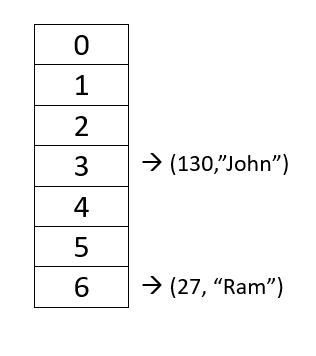
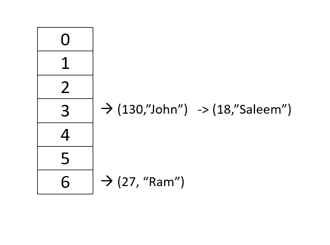
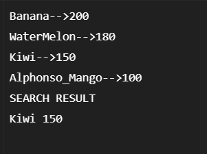

### Hashing in Data Structure

Hashing is the process of converting an input of any length into a fixed size string or a number using an algorithm.

In hashing, the idea is to use a hash function that converts a given key to a smaller number and uses the small number as an index in a table called a hash table.

We generate a hash for the input using the hash function and then store the element using the generated hash as the key in the hash table.


**Hash Table**: The hash table is a collection of key-value pairs. It is used when the searching or insertion of an element is required to be fast.

Operation in hash function:

- **Insert** - T[ h(key) ] = value;
  - It calculates the hash, uses it as the key and stores the value in hash table.
- **Delete** - T[ h(key) ] = NULL;
  - It calculates the hash, resets the value stored in the hash table for that key.
- **Search** - return T[ h(key) ];
  - It calculates the hash, finds and returns the value stored in the hash table for that key.

**Hash Collision**: When two or more inputs are mapped to the same keys as used in the hash table.
Example: h("John") == h( "joe")

A collision cannot be completely avoided but can be minimized using a 'good' hash function and a bigger table size.

The chances of hash collision are less if the table size is a prime number.

#### How to choose Hash Function:

- An efficient hash function should be built such that the index value of the added item is distributed equally across the table.
- An effective collision resolution technique should be created to generate an alternate index for a key whose hash index corresponds to a previously inserted position in a hash table.
- We must select a hash algorithm that is fast to calculate.

#### Characteristics of a good Hash Function :

- **Uniform Distribution**: For distribution throughout the constructed table.
- **Fast**: The generation of hash should be very fast, and should not produce any considerable overhead.

#### Collision Hashing Techniques:

1. **Open Hashing (Separate Chaining)**: It is the most commonly used collision hashing technique implemented using Lined List. When any two or more elements collide at the same location, these elements are chained into a single-linked list called a chain. In this, we chain all the elements in a linked list that hash to the same slot.

Let's consider an example of a simple hash function	
   
   `h(key) = key%table size`

   In a hash table with the size 7
   
   h(27) = 27%7 = 6
   
   h(130) = 130%7 = 4

   

   If we insert a new element (18, "Saleema" ), that would also go to the 4th index.
   
   h(18) = 18%7 = 4

   ;

   For separate chaining, the worst-case scenario is when all of the keys will get the same hash value and will be inserted in the same linked list. We can avoid this by using a good hash function.

2. **Closed Hashing (Open Addressing)**: In this, we find the "next" vacant bucket in Hash Table and store the value in that bucket.

   1. **Linear Probing**: We linearly go to every next bucket and see if it is vacant or not.
  
      `rehash(key) = (n+1)%tablesize`

   2. **Quadratic Probing**: We go to the 1st, 4th, 9th ... bucket and check if they are vacant or not.
   
      `rehash(key) = (n+ k<sup>2</sup> ) % tablesize

3. **Double Hashing**: Here we subject the generated key from the hash function to a second hash function.

   ` h2(key) != 0 and h2 != h1`

**Load Factor**: This is a measurement of how full a hash table may become before its capacity is increased. 

The hash table's load factor, T, is defined as:

- N = number of elements in T - Current Size
- M = size of T - Table Size
- e = N/M - Load factor

Generally, if the load factor is greater than 0.5, we increase the size of the bucket array and rehash all the key-value pairs again.

#### How Hashing gets O(1) complexity?

Given the above examples, one would wonder how hashing may be O(1) if several items map to the same place...  

The solution to this problem is straightforward. We use the load factor to ensure that each block, for example, (linked list in a separate chaining strategy), stores the maximum amount of elements fewer than the load factor on average. Also, in practice, this load factor is constant (generally 10 or 20). As a result, searching in 10 or 20 elements become constant.

If the average number of items in a block exceeds the load factor, the elements are rehashed with a larger hash table size.

**Rehashing**

When the load factor gets "too high" (specified by the threshold value), collisions would become more common, so rehashing comes as a solution to this problem.
- We increase the size of the hash table, typically, doubling the size of the table.
- All existing items must be reinserted into the new doubled size hash table.

Now let's deep dive into the code. I will implement everything in code that we have learned till now.

```C++
#include<iostream>
using namespace std;

class node{
    public:
    string name;
    int value;
    node* next;
    node(string key,int data){
        name=key;
        value=data;
        next=NULL;
    }
};

class hashmap{
    node** arr;
    int ts;
    int cs;

    int hashfn(string key){
        int ans=0;
        int mul=1;
        for(int i=0; key[i]!='\0';i++){
            ans =  (ans + ((key[i]/ts)*(mul%ts))%ts);
            mul *= 37;
            mul %=ts;
        }
        ans = ans %ts;
        return ans;
    }

    void reHash(){
        node** oldarr=arr;
        int oldts=ts;
        arr= new node*[2*ts];
        ts *= 2;
        cs=0;

        for(int i=0;i<ts;i++){
            arr[i]=NULL;
        }

        //insert in new table
        for(int i=0;i<oldts;i++){
            node* head = oldarr[i];
            while(head){
                insert(head->name,head->value);
                head=head->next;
            }
        }
        delete []oldarr;


    }

    public:
    hashmap(int s=7){
        arr = new node*[s];
        ts=s;
        cs=0;
        for(int i=0;i<s;i++){
            arr[i]=NULL;
        }

    }

    void insert(string key, int data){
        int i=hashfn(key);
        node* n=new node(key,data);
        n->next=arr[i];
        arr[i]=n;
        cs++;

        if(cs/(1.0*ts)  > 0.6){
            reHash();
        }

    }

    node* search(string key){
        int i=hashfn(key);
        node*head= arr[i];
        while(head){
            if(head->name==key){
               return head;
                break;
            }
            head=head->next;
        }
        if(head==NULL){
            cout<<"not exist";
        }
        return NULL;
    }

    void print(){
        for(int i=0;i<ts;i++){
            node* head= arr[i];
            while(head){
                cout<<head->name<<"-->"<<head->value;
                head=head->next;
                 cout<<endl;
            }

        }
    }

    int& operator[](string key){
        node* ans=search(key);
        if(ans){
            return ans->value;
        }
        else{
            int agrbagevalue;
            insert(key,agrbagevalue);
            ans= search(key);
            return ans->value;
        }

    }

    void Delete(string key){
        int i=hashfn(key);
        node* head= arr[i];
        node* trail=NULL;

            while(head){

                    //first
                    if(head->name==key && trail==NULL){
                        arr[i]=NULL;
                        delete head;
                    }
                    //in end
                    if(head->name==key && trail!=NULL && head->next==NULL){
                        trail->next=NULL;
                        delete head;
                    }
                    //mid
                    if(head->name==key && head->next!=NULL){
                        node*ptr =head;
                        head=head->next;
                        delete ptr;
                        arr[i]=head;

                    }
                    trail =head;
                    head=head->next;
            }
        return;
    }

};

int main(){
    hashmap h;
    h.insert("Alphonso_Mango",100);
    h.insert("Kiwi",150);
    h.insert("Banana",200);
    h.insert("WaterMelon",180);
    h.print();

    node* x=  h.search("Kiwi");
    cout<<"SEARCH RESULT"<<endl;
    cout<<x->name<<" "<<x->value;

}

```

The complete execution of the above code can be found [here](https://replit.com/@Anubhavb11/HashMap#main.cpp).

=======

#### Output



* In the output, you can see we have inserted different key-value pairs into the custom hash table build by us. Try to experiment with these values and you will find collisions also and rehashing too if there are many collisions.

* Using the search function, we can find the value of the key in O(1) time complexity.

### Conclusion

With the help of hash tables, we can insert, search and delete in O(1) time which is a great achievement. Hash tables are widely used for making our code more efficient and faster. Here are some problems of data structures you can try and think the approach using hash tables.

[Leet Code Problem 1](https://leetcode.com/problems/two-sum/)

[Leet Code Problem 2](https://leetcode.com/problems/employee-importance/)

Happy Coding!

---
Peer Review Contributions by: [Willies Ogola](https://www.section.io/engineering-education/authors/willies-ogola/)
