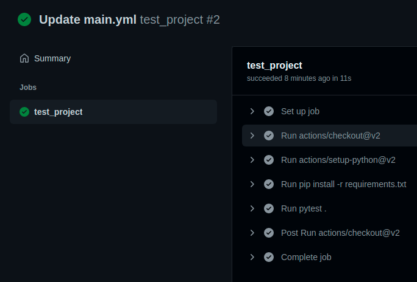
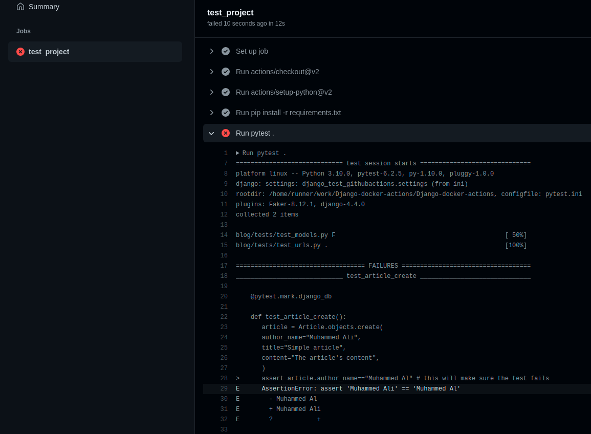

# How to Automate Tests for Dockerized Django Applications with GitHub Actions

## Introduction

Have you had a problem figuring out how to test your Django application continuously? Do you know how to integrate GitHub Actions, automated testing, and Django?

If these questions are in your mind, then you are in luck.

With [GitHub Actions](https://docs.github.com/en/actions), you can automate, customize, and execute your software development workflows right in your repository.

In this article, we will be testing the Django application with [Pytest](https://docs.pytest.org/en/stable/getting-started.html#:~:text=pytest%20is%20a%20framework%20that,for%20your%20application%20or%20library.).

Pytest is a framework that makes building tests easy. Details about the inner workings of Pytest will not be discussed in this tutorial.

Docker helps make sure your app works the same way on all platforms. Adding these functionalities to your application can make it easy for **[continuous delivery](https://en.wikipedia.org/wiki/Continuous_delivery#:~:text=Continuous%20delivery%20(CD)%20is%20a,with%20greater%20speed%20and%20frequency.)** and collaboration.

Here you will learn how to configure GitHub Actions to automate your Django tests.

**Prerequisites**

To follow this tutorial the following is required:

1. knowledge of Django
2. Knowledge of Git/GitHub
3. [Docker](https://docs.docker.com/get-docker/) and [Docker compose](https://docs.docker.com/compose/install/) installed

## Building a Base Django App

First of all, create a new virtual environment for the project, this will come in handy when you are trying to get a list of all the dependencies.

After creating the virtual environment, install Django with:

```bash
(env)$ pip install django
```

Run the code below to create a new project:

```bash
(env)$ django-admin startproject <name_of_project>
```

Example:

```bash
(env)$ django-admin startproject django_test_githubactions
```

cd into the directory that contains *manage.py* and run:

```bash
(env)$ python manage.py startapp blog
```

add “blog” to *settings.py* file

```python
INSTALLED_APPS = [
"blog",  #new

]
```

We will be building a blog application for this illustration.

Next, go to to ~*/blog/models.py* file and paste the code below:

```python
from django.db import models
    
    class Article(models.Model):  
       author_name = models.CharField(max_length=30)  
       title = models.CharField(max_length=20)  
       content = models.CharField(max_length=200)  
       def __str__(self):  
           return self.title
```

Next is to display the content. To do this, navigate to *app/views.py* on your text editor and paste the code below:

```python
from django.shortcuts import get_object_or_404, render
from .models import Article
def content_view(request, pk):
   post = get_object_or_404(Article, pk=pk)
   return render(request, "blog/article.html", {'post':post})
```

Next, update the project *urls.py* file to point to the content view.

```python
from django.contrib import admin  
    from django.urls import path  
    from blog import views        #new  
    urlpatterns = [  
       path('admin/', admin.site.urls),  
       path('<int:pk>', views.content_view, name="content") #new  
    ]
```

Next, create a template folder in the app directory to hold the  template to display the blog content. Navigate to your app folder and create *templates/blog/article.html* and paste the code below:

```
Blog title:  
      
    {{ post.content }}  
    
```

Migrate the models so that you can start adding articles to the database and to do this run:

```bash
(env)$ python manage.py makemigrations
```

Then run:

```bash
(env)$ python manage.py migrate
```

**Populate the Database**

To populate the database, go to your terminal the below instruction to go into the Django shell:

```bash
(env)$ python manage.py shell
```

Then run the code below one after the other

```bash
>>> from blog.models import Article
>>> Article.objects.create(author_name="Ali",title="First app", content="Some detail of the article").save()`
```

You can add more data if you like.

Now run your server and go to your localhost([http://127.0.0.1:8000/](http://127.0.0.1:8000/)) then add the *id* of the article you just added, like this: [http://127.0.0.1:8000/1](http://127.0.0.1:8000/1), you’ll see that the article content is being displayed.


## How to Add Tests to Django Application

Before you start testing the application you just created install the necessary libraries

(env)$ pip install pytest pytest-django

[Pytest-django](https://pytest-django.readthedocs.io/en/latest/) is a plugin for [Pytest](https://docs.pytest.org/en/stable/) that helps you use Pytest easily on Django.

Now to start up with the testing, create a file in the root directory *pytest.ini*. *pytest.ini* is used to tell Pytest where the settings file is located. In the pytest.ini file, paste the code below:

```
[pytest]
DJANGO_SETTINGS_MODULE = django_test_githubactions.settings
```

Next, create a test folder in the app directory where all your test files for that app will be.

To start, we will test the *urls.py* file so you’ll create a new folder in the blog application, blog*/tests/test_urls.py*.

Add the code snippet to the test_urls.py file.

```python
from django.urls import reverse, resolve  
    class TestUrls:  from django.contrib import admin
    from django.urls import path
    
    urlpatterns = [
        path('admin/', admin.site.urls),
    ]
     
        def test_post_content_url(self):  
            path = reverse('content', kwargs={'pk':1})  
            assert resolve(path).view_name == "content" # here you are checking if the "path"'s view name is content
```

Next, we will be testing the models, create a new file for it app/tests/test_models.py, and put:

```python
import pytest  
    from app.models import Article  
    @pytest.mark.django_db  
    def test_article_create():
    # Create dummy data  
       article = Article.objects.create(  
       author_name="Muhammed Ali",  
       title="Simple article",  
       content="This is my content",  
       )  
    # Assert the dummy data saved as expected
       assert article.author_name=="Muhammed Ali"  
       assert article.title=="Simple article"  
       assert article.content=="This is my content"
```

To run the tests, go to your command line and run:

```bash
(env)$ python -m pytest
```

You should see something like the image below to show that all the tests passed:


## Setting up Docker

Assuming you have installed Docker and Docker compose on your local machine,  create a *Dockerfile* file at the root of your project. *Dockerfile* contains a list of instructions for Docker to use to build our Docker image.

The *Dockerfile* you just created should contain the code below:

```docker
FROM python:3.7-alpine

ENV PYTHONUNBUFFERED 1

COPY ./requirements.txt /requirements.txt
RUN pip install -r /requirements.txt

# make a directory in our Docker image in which we can use to store our source code
# Copy the project folder from our local machine to the docker image
RUN mkdir /project
WORKDIR /project

COPY . .
```

`FROM python:3.7-alpine` is the image you are going to inherit your Dockerfile from, it is usually the language you are using.

`ENV PYTHONUNBUFFERED 1`  is necessary so Docker doesn't buffer the output and that you can see the output of your application (e.g. Django logs) in real time.

`COPY ./requirements.txt /requirements.txt` copy the *requirements.txt* file adjacent to the *Dockerfile* file in your local machine for our Docker image *requirements.txt*.

`RUN pip install -r /requirements.txt` Install requirements.txt file in docker image

Next, create *requirements.txt* file which will contain a list of all the dependencies we would like to install. In *requirements.txt* file at the root of your project and input the text below.

```
asgiref==3.4.1
attrs==21.2.0
Django==3.2.7
pytest==6.2.5
pytest-django==4.4.0
python-dateutil==2.8.2
pytz==2021.1
six==1.16.0
sqlparse==0.4.1
```

## Setup Docker Compose

At the root of your project, create *docker-compose.yml* file and add the following:

```yaml
version: "3"   # Verion of docker-compose we want to use
services:
  proj:
    build:
      context: .
  #  map port on local machine to port on docker image
    ports:
      - "8000:8000"
      
    volumes:
      - .:/project
    command: >
      sh -c "python manage.py runserver 0.0.0.0:8000"
```

`build`: command that is used to run services

`context`: Sets the directory for docker-compose to build, in our case the “.” represent the current directory.

`volumes`: Used to copy changes made to the project into our image in realtime.

`command`: handles the command that is used to run our project in our docker container.

After that, go to your terminal and run `$ docker-compose build` to build our image using the docker-compose configuration.

Docker-compose runs at 0.0.0.0:8000 and it is not recognized by Django so you need to add it to your ALLOWED_HOSTS in your settings.py file, like this:

`ALLOWED_HOSTS = ['0.0.0.0']`

Now run `$ docker-compose up`

 to start the server and go to [http`://0.0.0.0:8000/1](http://0.0.0.0:8000/1) on your browser and you will see the blog you created.


## Setup GitHub Actions

[GitHub Actions](https://docs.github.com/en/actions) enables you to automate, customize specified development and deployment processes in your GitHub repository.

**Some Terminology**

1. Jobs: a set of instructions that are executed sequentially on the runner or an action.
2. Workflows: A workflow is a list of automated processes made up of one or more jobs that are configured on a YAML file.

**Activate GitHub Actions in your Project**

On your text editor, navigate to the root of your project and create a directory named *.github/workflows* in there create *main.yml* file. The *main.yml* file will contain all the GitHub Actions commands.

In the *main.yml* file you just created, paste the code below

```yaml
name: test_project  
on:
  # Triggers the workflow on when there is a push or pull request on the main branch
  push:
    branches: [ main ]
  pull_request:
    branches: [ main ]
jobs:  
  test_project: 
# The type of runner that the job will run on
     runs-on: ubuntu-latest  
     steps:  
       - uses: actions/checkout@v2  
       - uses: actions/setup-python@v2  
       - run: pip install -r requirements.txt  # install requirements to enable GitHub run our code
       - run: pytest . # run the unit test
```

The code above just runs tests on your latest push. You can visit the [GitHub docs](https://docs.github.com/en/actions/reference/workflow-syntax-for-github-actions) page to learn more about syntax.

**GitHub Actions at Work**

Commit and push all the code you have at the moment to GitHub

After pushing your code, go to your project on GitHub and click on the “Actions” tab. You’ll see that your GitHub Actions ran completely and that your application has been tested and all tests passed.


When you click on it you should see this:



To check if the intention of GitHub Actions is met you will update the test so it fails.

In the models test, change it to:

```python
def test_article_create():  
   article = Article.objects.create(  
   author_name="Muhammed Ali",  
   title="Simple article",  
   content="The article's content",  
   )  
   assert article.author_name=="Muhammed Al" # this will make sure the test fails  
   assert article.title=="Simple article"  
   assert article.content=="The article's content"
```

Commit and push your code. Go to your project Actions and you should see the test fails, to show that our GitHub Actions instructions are working as expected.



## Conclusion

In this tutorial, you learned how to write unit tests for Django application URL and models at the same time you were able to automate the process of running the tests when your application is pushed to GitHub.

In addition, you can add some linting tests to the workflow to improve the continuous integration of your application. Through my explanation and some research, doing that should be easy.

Hopefully, with this article, you can add some continuous delivery with GitHub Actions for your future projects.

The code for this tutorial can be found on [GitHub](https://github.com/khabdrick/Django-docker-actions).