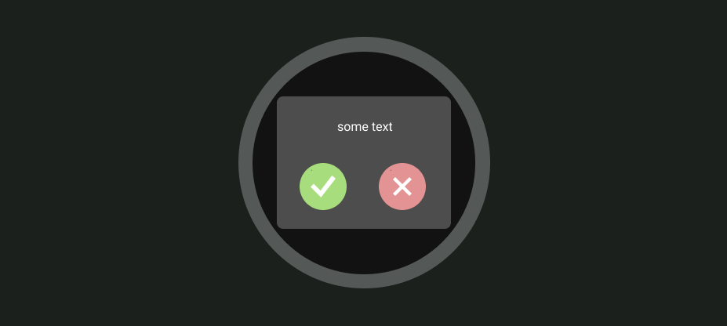
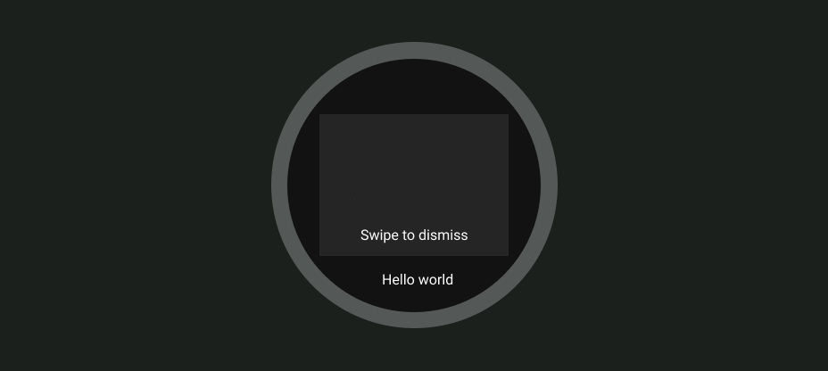

When developing mobile apps, we normally concentrate on only two types of devices: tablets, and smart phones. Every time we start a new Android Studio project, we generally come across the suggested templates for other types of devices.
<!--more-->
Have you ever considered how to build applications for wearables?

Smart watches differ from smart phones in terms of design and interactivity due to distinct usage circumstances and smaller screens. The layout is simpler and more reliant on swiping actions to operate.

In this article, we will learn how to create an app for a Wear OS wearable device.

### Prerequisites
To follow through this tutorial, you should have:
- [Android Studio](https://developer.android.com/studio) installed on your machine.
- A basic knowledge of the kotlin programming language.

### How does Wear OS compare to Android?
Wear OS is a new platform designed specifically for wearable devices. Although it is centered on Android, it offers a unique look and a set of distinct functionalities. Wear OS shouldn't be a challenge if you're already acquainted with Android mobile application development.

### Packages exclusively for Wear OS
- **android.webkit** - is an open-source web page rendering engine that has become a mobile browser mainstream. It was created using the code from the KDE desktop environment's [KHTML](https://api.kde.org/frameworks/khtml/html/index.html) and [KJS](<https://en.wikipedia.org/wiki/KJS_(software)>) modules.
- **android.print** - includes classes for implementing printing capabilities in Android apps. Other more specialized packages linked to printing make use of these fundamental classes as well.
- **android.app.backup** - includes backup and recovery functions. As a result, when apps with backups replication enabled are reinstalled, the old user data can be restored.
- **android.appwidget** - contains the tools required to develop applications widgets that allow users to access app data and services without having to create the solution itself.
- **android.hardware.usb** - allows Android-based devices to communicate with USB peripheral facilities.

### Creating a Wear OS project on Android Studio
When establishing an Android Wear app for a smart watch, select the Wear OS tab, an empty Activity, or any other available option, based on the project requirements or your tastes.

In the packages of your application, two modules will appear right away: a wear module for smart watches, and an application module for tablets and phones.

If you wish to add smartwatch functionality to an existing app, open it, pick the Wear OS module from the _File -> New -> New Module_ menu, and set it up. After that, a folder will appear with the filename of the desired module.

Two different `.apk` or `.aab` files will be created from the two modules. However, they must have the same package name and be verified with the same certification when they are published.

This is important because Google services allows applications to communicate with one another. You can still make a Wear OS app without using a smartphone platform.

### Creating user interface layouts
The first step is to design a layout for your application.

The layout is a visual depiction of your application's user interface. It is the app's graphic illustration that is displayed to the users.

One of the primary concerns in Android app development is the huge range of devices; varied sizes, shapes, and configurations. Even when it comes to Wear OS, there are a variety of screen styles to consider, including round, square, and circular with chopped edges.

Wear OS and Android OS have similar UI patterns. You can also use Google's Wear UI toolkit, that has a comprehensive set of features required to match smartwatch style requirements.

As a result, the implementation process is simplified, and development resources are reduced.

To do this, you should include the following dependencies in the app-level `build.gradle` file.

```gradle
dependencies {
    // For the Wear UI Toolkit
    implementation 'com.google.android.support:wearable:2.5.0'
    implementation 'com.android.support:percent:28.0.0'
    implementation 'com.android.support:wear:28.0.0'
    implementation 'androidx.wear:wear:1.0.0'
    compileOnly 'com.google.android.wearable:wearable:2.7.0'

    // For Google services
    implementation 'com.google.android.gms:play-services-wearable:16.0.1'
    implementation 'com.android.support:support-v4:28.0.0'
}
```

#### Set up the manifest
The manifest for Wear OS Apps differs slightly from that of Android smartphone.

We must define the feature and wear OS library, as well as other metadata.

```xml
<manifest xmlns:android="https://schemas.android.com/apk/res/android"
    package="com.demo.wear">

    <uses-feature android:name="android.hardware.type.watch" />
    <uses-permission android:name="android.permission.WAKE_LOCK" />

    <application
        android:allowBackup="true"
        android:icon="@mipmap/ic_launcher"
        android:label="@string/app_name"
        android:supportsRtl="true"
        android:theme="@android:style/Theme.DeviceDefault">

        <uses-library
            android:name="com.google.android.wearable"
            android:required="true" />

        <!-- If your software is Standalone, it means it doesn't need to be run on a mobile device. -->

        <meta-data
            android:name="com.google.android.wearable.standalone"
            android:value="true" />

        <activity
            android:name=".MainActivity"
            android:label="@string/app_name">
            <intent-filter>
                <action android:name="android.intent.action.MAIN" />

                <category android:name="android.intent.category.LAUNCHER" />
            </intent-filter>
        </activity>
    </application>

</manifest>
```

### Most common Wear OS UI components
There are four main UI elements in the toolkit that deserve special attention because they are useful in Wear OS development:
- **WearableLinearLayoutManager** - allows you to scroll through a list using the watch's mechanical wheels. Furthermore, it moves objects that are positioned along the screen borders to the center, which is highly useful when employing circular interface.
- **BoxInsetLayout** - is an Android FrameLayout capable of adapting child items to a circular display. It positions them in the rectangle region defined by the screen circle.

Such transformations are ignored at the system level for square displays. As a result, the layout will be similar across all watch interfaces.

- **WearableRecyclerView** - RecyclerView is a useful tool that is widely used in mobile apps, but it is been tailored for the watch in this case. The top and bottom Views may be truncated along the edges due to the display's curved edges, thus this pattern is used to address the problem.
- **EdgeItemsCenteringEnabled** - is a setting that allows you to create a curved layout for scrolling items and improve the core element, making it easier to view on a relatively small screen.
- **SwipeDismissFrameLayout** is another popular layout that makes it possible to swipe from left to right.

### Code example using the BoxInsetLayout element

```xml
<androidx.wear.widget.BoxInsetLayout
    xmlns:android="http://schemas.android.com/apk/res/android"
    xmlns:app="http://schemas.android.com/apk/res-auto"
    android:layout_height="match_parent"
    android:layout_width="match_parent"
    android:padding="8dp"
    tools:deviceIds="wear"
    tools:context=".MainActivity">

    <androidx.constraintlayout.widget.ConstraintLayout
        android:layout_width="match_parent"
        android:layout_height="match_parent"
        android:padding="4dp"
        app:layout_boxedEdges="all">

        <ImageButton
            android:background="@android:color/transparent"
            android:layout_height="60dp"
            android:layout_width="60dp"
            app:layout_constraintBottom_toBottomOf="parent"
            app:layout_constraintStart_toStartOf="parent"
            android:src="@drawable/ic_ok" />

        <TextView
            android:layout_height="wrap_content"
            android:layout_width="match_parent"
            android:text="some text"
            android:textAlignment="center"
            app:layout_constraintEnd_toEndOf="parent"
            app:layout_constraintStart_toStartOf="parent"
            app:layout_constraintTop_toTopOf="parent" />

        <!--In this example, this ImageButton requires an icon named ic_cancel-->
        <ImageButton
            android:background="@android:color/transparent"
            android:layout_height="60dp"
            android:layout_width="60dp"
            app:layout_constraintBottom_toBottomOf="parent"
            app:layout_constraintEnd_toEndOf="parent"
            android:src="@drawable/ic_cancel" />
    </androidx.constraintlayout.widget.ConstraintLayout>
</androidx.wear.widget.BoxInsetLayout>
```



### Code example using the SwipeDismissFrameLayout element

```xml
<?xml version="1.0" encoding="utf-8"?>
<android.support.wear.widget.BoxInsetLayout
    xmlns:android="https://schemas.android.com/apk/res/android"
    xmlns:app="https://schemas.android.com/apk/res-auto"
    xmlns:tools="https://schemas.android.com/tools"
    android:layout_width="match_parent"
    android:layout_height="match_parent"
    android:padding="8dp"
    tools:context=".MainActivity"
    tools:deviceIds="wear">

    <FrameLayout
        android:layout_width="match_parent"
        android:layout_height="match_parent"
        android:padding="8dp"
        app:boxedEdges="none">

        <android.support.wear.widget.SwipeDismissFrameLayout
            android:layout_width="match_parent"
            android:layout_height="match_parent"
            android:id="@+id/swipe_dismiss_root" >

            <TextView
                android:id="@+id/test_content"
                android:layout_width="match_parent"
                android:layout_height="match_parent"
                android:gravity="bottom"
                android:text="Swipe to dismiss"/>
        </android.support.wear.widget.SwipeDismissFrameLayout>

        <TextView
            android:id="@+id/text"
            android:layout_width="wrap_content"
            android:layout_height="wrap_content"
            android:layout_gravity="center"
            android:text="Hello world" />

    </FrameLayout>
</android.support.wear.widget.BoxInsetLayout>
```



### Navigation
Navigation refers to the interactions that allow users to navigate across, into, and back out from the different screens or destinations within an application.

#### Using NavigationDrawer
The watch application normally does not have a title bar to conserve significant display space. When using ViewPager, TabLayout is not displayed, but we can't be sure what page we are on.

Let's have a look at the effect of the navigation bar `WearableNavigationDrawerView`, which is utilized to fix this problem.

A navigation bar will display as you slide down from the top of the screen, revealing the icon and title of the current page. If there are numerous pages, slide the page side to side to change it.

Let's look at how it's used. We change the layout file and make `WearableDrawerLayout` the root layout, as well as adding a navigation bar control.

```xml
<android.support.wear.widget.drawer.WearableNavigationDrawerView
        android:id="@+id/navigation_drawer"
        android:layout_width="match_parent"
        android:layout_height="match_parent"
        app:navigationStyle="multiPage"/>
```

Set an adapter for the NavigationDrawer, as well as the icon and title for each page, as shown below:

```kotlin
class DrawerAdapter(context: Context) : WearableNavigationDrawerView.WearableNavigationDrawerAdapter() {

    private val context = context

    override fun getItemText(pos: Int): CharSequence {
        return when (pos) {
            0 -> "First page"
            else -> "The second page"
        }
    }

    override fun getItemDrawable(pos: Int): Drawable {
        // create two icons and name them as shown below
        return when (pos) {
            0 -> ContextCompat.getDrawable(context, R.drawable.icon_one)!!
            else -> ContextCompat.getDrawable(context, R.drawable.icon_two)!!
        }
    }

    override fun getCount(): Int {
        return 2
    }

}
```

Set the drawer in the `MainActivity`.

```kotlin
navigation_drawer.apply{
    setAdapter(DrawerAdapter(this))
    controller.peekDrawer()
    addOnItemSelectedListener { pos ->
    // switch the page
    }
}
```


#### RemoteIntent
This allows you to start an activity on another device. This API currently supports sharing intents with action set to `ACTION_VIEW`, a data uri provided by setData (Uri), and with the `CATEGORY_BROWSABLE` category present.

```kotlin
 RemoteIntent.startRemoteActivity(context, nodeId, Intent(Intent.ACTION_VIEW)
     .setData(Uri.parse("http://play.google.com/store/apps/details?id=com.example.myapp")),
     null)
```

### Conclusion
In this tutorial, we have learned how to create an Android-based Wear OS app using the ConstraintLayout, SwipeDismissFrameLayout, and WearableNavigationDrawerView.

This tutorial offers fundamental knowledge that you can use to create a wear OS app based on your imagination.

Happy coding!

---
Peer Review Contributions by: [Eric Gacoki](/engineering-education/authors/eric-gacoki/)
