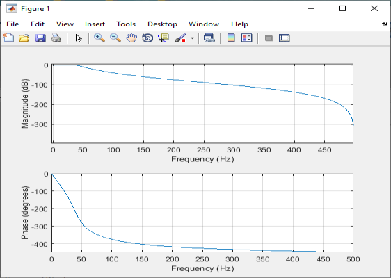
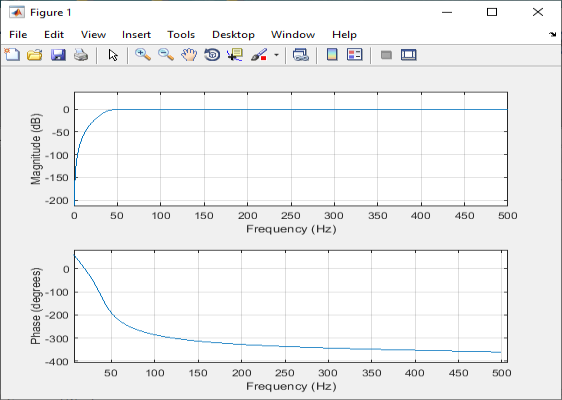
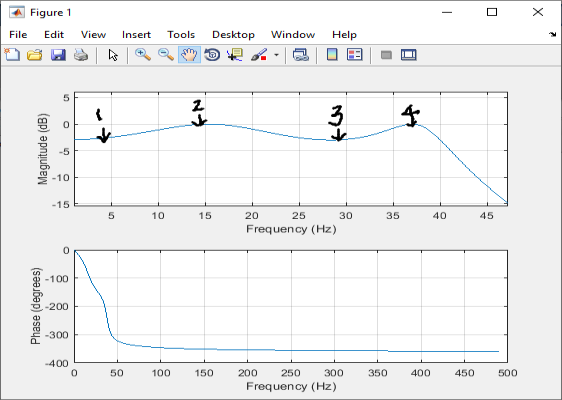

To filter is to remove the unwanted properties of a signal. IIR filters with an infinite number of impulses. Here the output y(n) response depends on the present input x(n), previous input x(n-1) as well as the previous output y(n-1).
<!--more-->

### HOW TO DESIGN AN INFINITE IMPULSE RESPONSE FILTERS(IIR)
### Introduction
To filter is to remove the unwanted properties of a signal. IIR are filters with an infinite number of impulses. Here the output y(n) response depends on the present input x(n), previous input x(n-1) as well as the previous output y(n-1). The differential equation for the IIR filter can be given by the differential equation $y(n)=b_0x(n)+b_1x(n-1)+---b_mx(n-m)-a_1y(n-1)---a_ny(m-n)$. To see more about this, you can get it [here](https://www.sciencedirect.com/topics/engineering/iir-filters). Since the filter uses the previous outputs, there is feedback from the filter structure. When designing an IIR filter, the transfer function($H_s$) that meets the filter's specification is considered. The transfer function($H_s$) is the ratio of the output response to the input response.

### Prerequisites
- [Matlab](https://www.mathworks.com/products/get-matlab.html?s_tid=gn_getml) installed.
- Proper understanding of [matlab](https://www.section.io/engineering-education/getting-started-with-matlab/) basics.
- Understanding of the filters

We have various types of IIR filters. This type includes;
1. Butterworth filters.
2. Chebyshev filters.
3. Chebyshev II filters.
4. Elliptic filters.
5. Bessel filters.

We will look at the design of the Butterworth filter and Chebyshev filters since these are the most common filters.

### How to design lowpass and highpass Butterworth filters using Matlab.
The other name for the Butterworth filter is a maximally flat filter. It is because it is designed in such a way that the frequency response is as flat as possible in the passband. Passband is defined as the range of frequencies that are passed through a filter. The frequency response is the transfer function of a given filter. Butterworth filter achieves its maximum flatness as it changes from passband to stopband at the expense of a wide transition band. It is a disadvantage since it results in poor characteristics. A transition band is the range of frequencies that allows transition between the passband and the stopband. The two types of Butterworth are;
- low pass Butterworth filter
- high pass Butterworth filter

### Matlab code used to design the lowpass type
Here, we want to design a low pass Butterworth filter with less than 3dB of ripple in the passband, defined from 0 to 40Hz, atleast 60dB of attenuation in the stopband 150Hz to the Nyquist frequency(500Hz) and 1000Hz sampling frequency.
```matlab
% Program to design and implementation of low pass butterworth filter
clc
clear 
close all
kp = 3;          % passband ripple
ks = 60;          % stop attenuation
fp = 40;          %passband frequency
fs = 1000;        %sampling frequency
Fs = 150;         % stop band frequency
```
When designing a filter, you first define its variable, as shown above. 
Then,  passband ripple, which is the range of the amplitude in the filter's passband.
- passband frequency - as defined earlier, it is the range of frequency that passes through a filter. It means that it only allows signals of a given frequency to pass.
- Stop attenuation - is the lowest attenuation level in the designated stopband. 
- Sampling frequency - Sampling is the conversion of a continuous-time signal to a discrete-time signal. The sampling frequency is the samples per second that are converted from continuous-time signal to make a discrete-time signal. 
After defining our filter, we need to normalize the filter. Normalization is changing the component values to a suitable frequency. To remove undesirable characteristics, we normalize the filter. To carry out normalization of we filter, we use the code below;
```Matlab
wp = fp/(fs/2);
ws = Fs/(fs/2);
```
The next activity is the determination of filter order and the filter cut-off frequency. The transfer function defines filter order. The cut-off frequency is the frequency at which the response becomes too weak. To determine this, use the code below; 
```Matlab
[N wc] = buttord(wp, ws, kp, ks);
```
We will get the filter order `N` and the cut-off frequency `wc` in the command window when we run this code. 


The next step is to normalize the cut-off frequency `wc` obtained above. Then, finally, the filter order is found from the transfer function, the output ratio to the input of a filter. Since we are designing a Butterworth filter, we use the `buttord` function and pass `wp`, `ws`, `kp`, and `ks` as the inputs.
```matlab
[den num] = butter(N, wc, 'low');
```
We obtain the filter's coefficients using the code above.The coefficients are the numerator(output) `num` and the denominator(input) `den`. It is done by passing the filter order obtained and cut-off frequency to the `butter` function. Since we are designing a low pass filter, we define using `low` when passing the filter order and the cut-off frequency. 

The coefficients that we obtained previously help plot the filter's response, which is done using the `freqz` function. Finally, we pass the filter coefficients, the number of points used for plotting, and the sampling frequency to this function.

```Matlab
freqz(den, num, 1000, fs)
```
When we run the program, we have;


### Highpass butterworth filter
If we want to design a Butterworth high pass filter, it is now easy because the codes remain the same. The only thing is to change the `low` that we defined when finding the filter's coefficients to be `high`. So, the code will be;
```Matlab
kp = 3;          % passband ripple
ks = 60;          % stop attenuation
fp = 40;          %passband frequency
fs = 1000;        %sampling frequency
Fs = 150;         % stop band frequency

wp = fp/(fs/2);   %filter normalization
ws = Fs/(fs/2);

[N wc] = buttord(wp, ws, kp, ks);
[b a] = butter(N, wc, 'high');
freqz(b, a, 1000, fs)
```
The filter response will be as shown below;



### How to design Chebyshev filter using Matlab
We have two types of Chebyshev filters, that is, Chebyshev I and Chebyshev II. Chebyshev filters have more ripples in the passband for low pass Chebyshev filters and more ripples for high Chebyshev filters. The most commonly used Chebyshev filter is type I. We will use the similar specifications we used to design the Butterworth filter for our Chebyshev filter type I for `low` and `high`. The good thing about designing filters using Matlab is that you need to make a few changes and have your filter. Let's start by designing a lowpass Chebyshev filter. We have two types of Chebyshev filters.
- low pass Chebyshev filter
- high pass Chebyshev filter

### Matlab code for low pass chebyshev filter
```matlab
clc
clear all
close all
fs = 1000;
kp = 3;
ks = 60;
fp = 40;
Fs = 150;
wp = fp/(fs/2);  %normalizing the stop band
ws = Fs/(fs/2);   %normalizing the passband
```
We then use the `cheb1ord` function to find the order and the cut-off frequency of our Chebyshev filter.
```Matlab
[N wc] = cheb1ord(wp, ws, kp, ks);   %order of the filter
```

In finding the numerator and the denominator coefficients, we need to add the passband ripple `kp`. It is because the Chebyshev has ripples in the passband. It is what makes the difference in the design of the Butterworth filter and Chebyshev filter. So we get these coefficients and then plot the response using the `freqz` function.
```Matlab
[num den] = cheby1(N, kp, wc, 'low')    % numerator and denominator coefficients
freqz(b, a, 1000, fs)    %plot the response
```


You zoom in on the passband to see the ripples. The alternative way of finding the filter order in Chebyshev filters is by counting the maxima and the minima for the ripples in the passband for the magnitude response. For example, we can zoom our response to see our filter order as shown below;



If we count these maxima as seen, we get the number of maxima and minima is four, equal to the filter order we found before. So if, for example, we want to design a high pass filter with similar specifications, just as we did when designing the lowpass and highpass Butterworth filter, we will change the `low` label to `high`.

### Matlab code for high pass chebyshev filter
```matlab
clc
clear all
close all
fs = 1000;
kp = 3;
ks = 60;
fp = 40;
Fs = 150;
wp = fp/(fs/2);  %normalizing the stop band
ws = Fs/(fs/2);   %normalizing the passband
[N wc] = cheb1ord(wp, ws, kp, ks);   %order of the filter
[b a] = cheby1(N, kp, wc, 'high')    % numerator and denominator coefficients
freqz(b, a, 1000, fs)    %plot the response
```


### Conclusion
A filter is essential in the engineering field. They help get rid of the unwanted part of a signal by considering specific prescriptions discussed above. Matlab forms a vital tool in the design of filters and the visualization of their response. Furthermore, it helps improve the performance of a filter since you can respond and compare with the expected response. Such activities are made easier in Matlab by the use of the in-built functions. Designing the various types of filters is made easy, and the codes are easy to understand. As we have seen before, you can use a code of a different filter to build another filter by making a few changes.

Peer Review Contributions by: [Miller Juma](/engineering-education/content/authors/miller-juma/)
