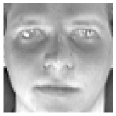
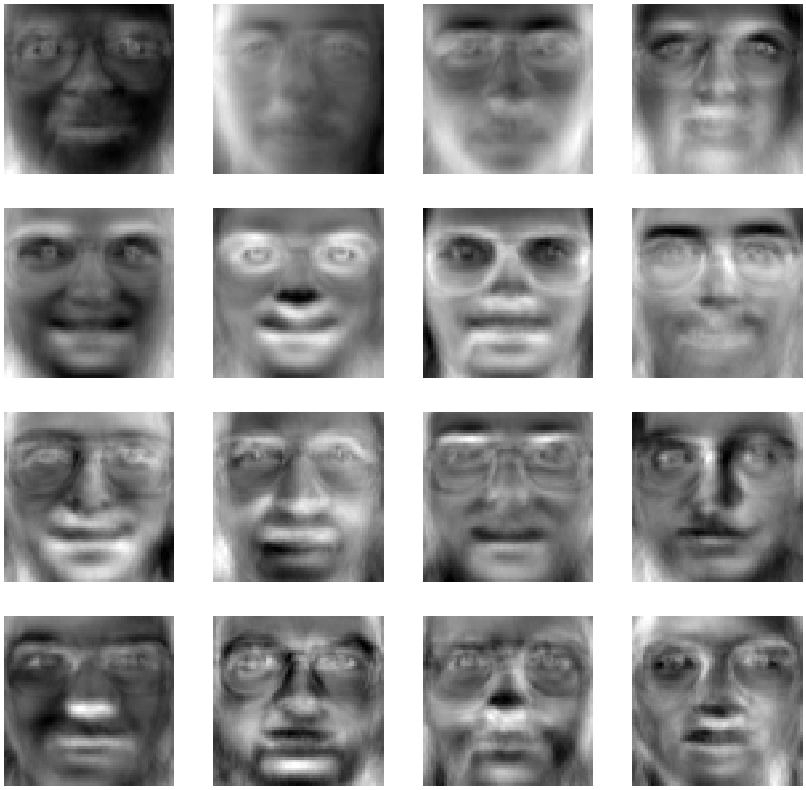

Principal Component Analysis, PCA, is a dimensionality reduction method used to reduce the dimensionality of a dataset by transforming the data to a new basis where the dimensions are non-redundant(low covariance) and have high variance. This tutorial aims to make the reader understand the concept of PCA(Principal Component Analysis) mathematically by providing them one of the use cases of PCA, that is, image compression.

## Table of Contents

- Prerequisites.
- Introduction
  -  What is Dimensionality Reduction?
  - Motivation for Dimensionality Reduction.
  - Why not care about u<sub>2</sub>.
  - Correlation.
  - Desideratum.

- Principal Component Analysis(PCA)
  -  Orthogonal Transformation.
  - Covariance Matrix.
  - What do we want from the covariance matrix of transformed data?
  - Few points to ponder.
  - Principal Components.
  - Dimensionality Reduction.

- Use case: Image Compression
  - How is an image compressed?
  - Reconstructing images using less information.

- Conclusion.

## Prerequisites

The reader needs to have basic knowledge of algebra(matrix operations and their properties) and statistics.

## Introduction

### What is Dimensionality Reduction?

<b>Dimensionality</b>: The number of input variables or features for a dataset is referred to as its dimensionality.

> **Dimensionality reduction** is the transformation of data from a high-dimensional space into a low-dimensional space so that the low-dimensional representation retains some meaningful properties of the original data, ideally close to its intrinsic dimension(number of variables needed in a minimal representation of the data).

Dimensionality reduction refers to techniques that reduce the number of input variables in a dataset. More input features often make a predictive modeling task more challenging to model, more generally referred to as the <b>curse of dimensionality</b>.

To explain the concept of dimensionality reduction, I will take an example, consider the following data where each point(vector) is represented using a linear combination of the **x** and **y** axes:

<center>


</center>

### Motivation for Dimensionality Reduction

Now, what if we choose a different basis

<center>


</center>

Here I have used <b>u<sub>1</sub></b> and <b>u<sub>2</sub></b> as a basis instead of <b>x</b> and <b>y</b>. We can observe that all the points have a minimal component in the direction of <b>u<sub>2</sub></b>(almost noise). It seems that the same data that was initially in R<sub>2</sub>:(x,y) can now be represented in R<sub>1</sub>:(u<sub>1</sub>) by making more an intelligent choice of basis.

### Why not care about u<sub>2</sub>.

Because the variance in the data in this direction is minimal (all data points have almost the same value in the u<sub>2</sub> direction), if we were to build a classifier on top of this data, then u<sub>2</sub> would not contribute to the classifier as the points are not distinguishable along this direction. In this way, we have reduced the dimensionality.

> In general, we are interested in representing the data using fewer dimensions such that the data has higher variance along these dimensions.

### Correlation

Data correlation is how one set of data may correspond to another set. If two columns are highly correlated(or have high covariance), then one of the two columns is redundant since it is linearly dependent on the other column. We can normalize the correlation to get the correlation coefficient. The formula for the correlation coefficient is defined as :

<center>


</center>

### Desideratum

In general, we are interested in representing the data using fewer dimensions such that,

- The data has <b>high variance</b> along these dimensions.
- The dimensions are linearly <b>independent</b>(uncorrelated)
- If we want to reduce dimensions by transforming the data into a new basis, that basis should be <b>orthogonal</b>.

## Principal Component Analysis(PCA)

> **Principal Component Analysis (PCA)** is a statistical procedure that uses an orthogonal transformation that converts a set of correlated variables to a set of uncorrelated variables.

To explain the concept of PCA mathematically, I will take an example:

### Orthogonal  Transformation

#### Assumptions 

Let p<sub>1</sub>, p<sub>2</sub>, p<sub>3</sub>,....,p<sub>n</sub> be a set of n orthonormal vectors. Let p be a square matrix of order n such that p<sub>1</sub>, p<sub>2</sub>, p<sub>3</sub>,....,p<sub>n</sub> are the columns of matrix p.

Let x<sub>1</sub>, x<sub>2</sub>, x<sub>3</sub>,.....,x<sub>n</sub> &isin; R<sup>n</sup> be n data points and let X be a square matrix such that x<sub>1</sub>, x<sub>2</sub>, x<sub>3</sub>,.....,x<sub>n</sub>  are the rows of a matrix (Assumption: Data is zero-mean and unit variance), why we have this assumption we will come to this at later part.

#### Transformation

Now suppose we want to represent x<sub>i</sub> using the new basis P.

 x<sub>i</sub> = &prop;<sub>i1</sub>p<sub>1</sub> + &prop;<sub>i2</sub>p<sub>2</sub> + ....... + &prop;<sub>in</sub>p<sub>n</sub> 

As we have assumed P as an orthonormal basis, for an orthonormal basis, we can find &prop;<sub>i</sub>'s using, &prop;<sub>ij</sub> = x<sub>i</sub><sup>T</sup> p<sub>j</sub> .

In general, the transformed data x'<sub>i</sub> is given by <b>x'<sub>i</sub>  =  x<sub>i</sub><sup>T</sup> P </b>, thus transformed matrix will be given as:

<center><b>X' = XP</b></center> 

### Covariance Matrix ( &sum; )

If X is a matrix with zero mean, then &sum; = 1/m*(X<sup>T</sup> X) is the covariance matrix. In other words,  &sum;<sub>ij</sub> stores the covariance between columns i and j of X.

<b>Explanation</b>: Let C be the covariance matrix of X. Let &mu;<sub>i</sub> and &mu;<sub>j</sub> denote the means of i<sup>th</sup> and j<sup>th</sup> column of X, respectively. Then by the definition of covariance, we can write:

 C<sub>ij</sub> = 1/m* &sum;<sup>m</sup><sub>k=1</sub> (X<sub>ki</sub>-&mu;<sub>i</sub>)(X<sub>kj</sub>-&mu;<sub>j</sub>)

 C<sub>ij</sub> = 1/m* &sum;<sup>m</sup><sub>k=1</sub> X<sub>ki</sub>X<sub>kj</sub>  (&because; &mu;<sub>i</sub> = &mu;<sub>j</sub> = 0) 

C<sub>ij</sub> = 1/m * X<sup>T</sup><sub>i</sub> X<sub>j</sub>  = <b>1/m*( X<sup>T</sup>X)<sub>ij</sub> </b>

So far we know that,

<center><b>X' = XP</b></center>

covariance matrix of transformed data can be written as: 

=1/m * X'<sup>T</sup> X'                                                                                                                                                                                        

=1/m * (XP)<sup>T</sup> XP                                                                                                                                                                                     

=1/m * P<sup>T</sup> X<sup>T</sup> XP                                                                                                                                                                          

=1/m * P<sup>T</sup> (X<sup>T</sup> X)P                                                                                                                                                                                

=P<sup>T</sup>( 1/m*( X<sup>T</sup> X)) P                                                                                                                                                                                 

=<b>P<sup>T</sup> &sum; P</b> 

### What do we want from the covariance matrix of transformed data?

Ideally we want,

- <b>(1/m * X'<sup>T</sup> X')<sub>ij</sub> = 0 </b>         if i &ne; j     (<b> Covariance = 0 </b>)
- <b>(1/m * X'<sup>T</sup> X')<sub>ij</sub>  &ne; 0 </b>        if  i = j    (<b> Variance =0 </b>)           

​    in other words, we want <b> P<sup>T</sup> &sum; P = D   </b> (where D is a diagonal matrix)

### Few points to ponder

- X<sup>T</sup>X  is symmetrical in nature.
- It will have distinct non-negative eigenvalues, and thus, linearly independent eigenvectors.                           
- Eigenvectors of a symmetric matrix are orthogonal, which can be turned into an orthonormal basis.                                        

### Principal Components

Now we know that<b> &sum; </b>is a symmetric matrix, and the eigenvectors of <b>&sum;</b> can be used as a suitable orthonormal basis. From the [Diagonalization of matrix](https://math.okstate.edu/people/binegar/3013-S99/3013-l16.pdf) principle, we can say that to make <b>P<sup>T</sup> &sum; P</b> a diagonal matrix, <b>P</b> will be the matrix of eigenvectors of the matrix <b>&sum;</b>. Now we can perform orthonormal transformation:

<center><b> x<sub>i</sub> = &sum;<sup>n</sup><sub>j=1</sub>  (&alpha;<sub>ij</sub>p<sub>j</sub>) </b></center>

The<b> n</b> orthogonal eigenvectors <b>p<sub>j</sub> </b>are the <b>Principal Components</b>.

### Dimensionality Reduction

As discussed already, we want to retain uncorrelated dimensions that have maximum variance. Therefore for dimensionality reduction, we will sort the eigenvectors according to eigenvalues in descending order and keep top <b>k</b> eigenvectors to represent <b>x<sub>i</sub></b>:

<center><b> x'<sub>i</sub> = &sum;<sup>k</sup><sub>j=1</sub> &alpha;<sub>ij</sub>p<sub>j</sub> </b></center>

Where <b>x'<sub>i</sub></b> is a reconstructed vector with <b>k</b> dimensions, earlier we were using <b>n</b> dimensions to represent it. Hence dimensionality is being reduced.

## Use case: Image Compression

(<i>For illustration, I have used Olivetti dataset, the link for the dataset: </i>https://www.kaggle.com/imrandude/olivetti)

Consider we are given a large number of images of human faces(for this dataset, we have 400 images), each image is 64X64(<b>4096 dimensions</b>). Now, we would like to represent and store the images using much fewer dimensions(say <b>100 dimensions</b>).


```python
# Importing necessary libraries
import numpy as np
import matplotlib.pyplot as plt
from numpy import linalg as LA

dirname = '/content/gdrive/My Drive/Kaggle'
fileName = 'olivetti_faces.npy'
faces = np.load(os.path.join(dirname,fileName))
```

Let us see a sample image from the dataset.

```python
plt.imshow(faces[1], cmap='gray')
plt.axis('off')
```


Lets see what the average of all images looks like

```python
avgFace = np.average(faces, axis=0)
plt.imshow(avgFace, cmap='gray')
plt.axis('off')
```


First of all, we will make all our images zero centered, for zero centering subtracting the average image from each image in the matrix.

```python
X = faces
X = X.reshape((X.shape[0], X.shape[1]**2)) #flattening the image 
X = X - np.average(X, axis=0) #making it zero centered

#printing a sample image to show the effect of zero centering
plt.imshow(X[0].reshape(64,64), cmap='gray')
plt.axis('off')
```



Now, after making the images zero centered we will calculate covariance matrix

```python
cov_mat = np.cov(X, rowvar = False)

#now calculate eigen values and eigen vectors for cov_mat
cov_mat = np.cov(X, rowvar = False)

#sort the eigenvalues in descending order
sorted_index = np.argsort(eigen_values)[::-1]
 
sorted_eigenvalue = eigen_values[sorted_index]
#similarly sort the eigenvectors 
sorted_eigenvectors = eigen_vectors[:,sorted_index]
```

Initially image had 4096 dimensions, lets reduce the dimension from 4096  to 100

```python
n_components = 100
eigenvector_subset = sorted_eigenvectors[:,0:n_components]
print(eigenvector_subset.shape)
```


These 100 dimensions are the <b>Principal Components</b>. Now, as we can see, the shape of eigenvector_subset is (4096,100). If represented as a 64 X 64 image after performing transpose on this matrix, we can get 100 such images. These 100 images will be called <b>Eigenfaces</b>, and one can represent any image as a linear combination of these 100 images.

Let's print first 16 eigenfaces.

```python
fig = plt.figure(figsize=[25,25])
for i in range(16):
  if(i%4==0):
  fig.add_subplot(4,4,i+1)
  plt.imshow(eigenvector_subsetT[i].reshape(64,64) , cmap= 'gray')
  plt.axis('off')
plt.show()
```



### How  is  the  image compressed?

Initially, the image had 4096 dimensions. Let's reduce the dimension from 4096  to 100

```python
x_reduced = np.dot(eigenvector_subset.transpose(),X.transpose()).transpose()
print(x_reduced.shape)
```


Earlier, to store 400 images, we required a 400 X 4096 matrix. Now we need to store 400 X 100 matrix for x_reduced and 4096 X 100 matrix for storing principal components. As the image is gray-scale, let us suppose it requires 2 bits to store each pixel of an image. Therefore, after compressing the image, we will be able to save

=((400&times;4096)&times;2) - ((400&times;100)+(4096&times;100))&times;2                                                                                                                                        

=2377600 bits                                                                                                                                                                                                                              

=297200 bytes                                                                                                                                                                                                     

&asymp; <b> 290 KB </b>

For our example, the images were gray-scale and had a low resolution; that is why we were able to save only 290 KB. Now suppose images have very high resolution with more than one channel, then this method can be used to save lots of space.

### Reconstructing images using less information

```python
# Reconstructing the first image
temp= np.matmul(eigenvector_subset,x_reduced[1])
temp.shape
temp=temp.real
plt.imshow(temp.reshape(64,64) , cmap= 'gray')
plt.axis('off')
```

<b>Reconstructed Image:</b>


<b>Original Image</b>


## Conclusion

As we have seen in this tutorial, using the concept of PCA, we have compressed the images and stored the eigenfaces. And to retain the image, we reconstruct it using the stored eigenfaces. But we have to note that there is extra calculation overhead for reconstructing the image (matrix multiplication), and also, there will be some reconstruction error. The greater the number of eigenfaces lesser the reconstruction error.

