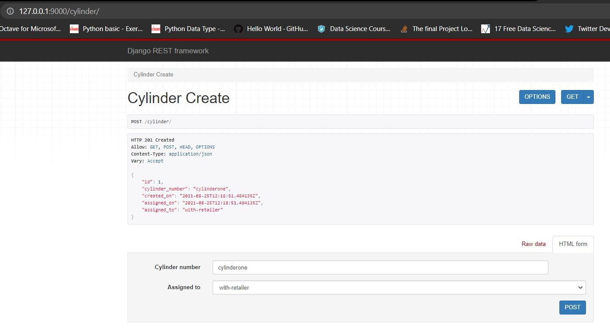
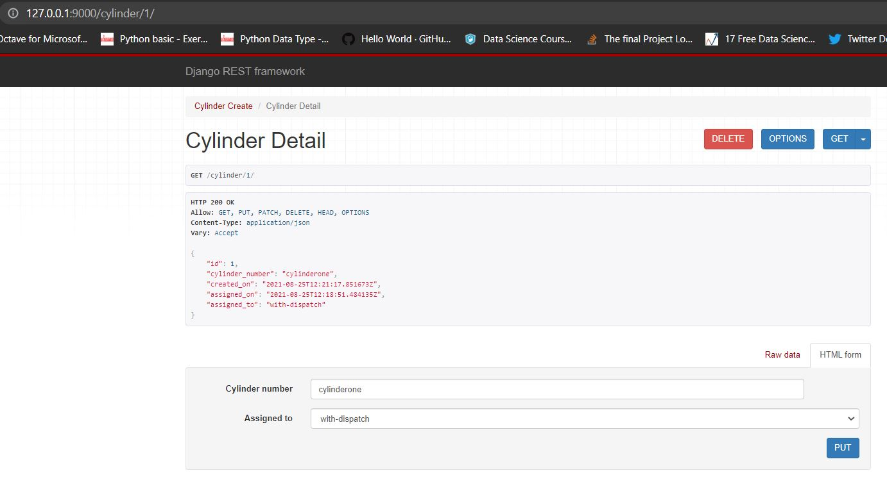
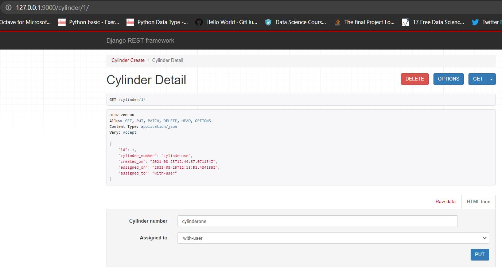

As we build and projects get bigger, the tendency to tilt towards spaghetti code becomes inevitable –
conditions here and there, choices up and down; all to accommodate the intricacies of a growing system.
One way to avoid these complications is to apply Finite State Machines (FSM) concept in handling state changes
of objects. This is because FSM helps you simplify code, avoid numerous if/else conditions by defining states and
the connections between them.

### Table of Contents
The tutorial will cover the following items:
- What is finite state machines?
- How the Finite State Machine works in Django
- Points to note when choosing approach to changing a state from one value to another
- Conclusion and Recommendation

### Prerequisites
To make the most of this tutorial, it is required to have the following readied:
- Basic understanding of Python.
- Familiarity with the Django framework and Django Rest framework
- Familiarity with the Django rest framework browseable API interface
- PyCharm Professional code editor installed.

### Introduction
In this article, we would learn how to manipulate and change an object's state at runtime.
To demonstrate how this work, we will be building a lightweight cylinder tracking system, with basic CRUD operations

### What is Finite State Machine
A Finite State Machine (FSM) is a system that facilitates an object’s dynamism in object-oriented programming.
The idea is that objects can only assume one state per time. The most popular, most relatable example would be
the traffic lights. At any given point, regardless of the number of light boards there are, each board can only
have one light at a time, or there might be chaos on our roads. In this tutorial, we would be implementing transitions
of objects states using the CynTrack application built in Django, to explain how FSM works.

### How does the Finite State Machine work in Django
CynTrack is a simple application that tracks a cylinder, based on who is in possession at the time of checking.
As the cylinder moves around, the possessor changes on the fly and the new possessor is always recorded against
the cylinder object.


Let us dive into the implementation.

To create this system, we will work with four steps:
- Define the states that this object can assume
- Create the object’s model
- Define the transitions between the states of the object
- Implement the views that are responsible for this transition

We want to assume readers are familiar with quick setup of a Django project.
However, the commands for quickly setting up one are shared below:

``django-admin startproject project .``
``python manage.py startapp tracker``

You can read up on setting up a Django project on other articles here on Section.io
Before we create the object’s model class, we need to install the Django-fsm library into our system.
You can use the following command to do this:

``pip install django-fsm``

This is what the cylinder object would look like after defining its states and creating the object:

```python
from django.db import models
from django_fsm import FSMField, transition

LOCATION = (
    ('with-retailer', 'with-retailer'),
    ('with-dispatch', 'with-dispatch'),
    ('with-user', 'with-user')
)


class Cylinder(models.Model):
    cylinder_number = models.CharField(max_length=20)
    assigned_on = models.DateTimeField(auto_now=True)
    created_on = models.DateTimeField(auto_now_add=True)
    assigned_to = FSMField(choices=LOCATION, default='with-retailer', protected=True)

    def __str__(self):
        return self.cylinder_number
```

From the picture above, we see a field names ``assigned_to``. With this field, we can check for the current
location of a cylinder. It is named an FSMField with the following parameters:
- Choices: the list of states that any cylinder can assume
- Default: the initial state that a cylinder object assumes upon creation
- Protected: initialized to True; means that states cannot be changed unless they are defined
Now, we can define the transitions between the different states for any given cylinder, using the ``@transition`` decorator.
Have a look at it below:

```python
from django.db import models
from django_fsm import FSMField, transition

LOCATION = (
    ('with-retailer', 'with-retailer'),
    ('with-dispatch', 'with-dispatch'),
    ('with-user', 'with-user')
)


class Cylinder(models.Model):
    cylinder_number = models.CharField(max_length=20)
    assigned_on = models.DateTimeField(auto_now=True)
    created_on = models.DateTimeField(auto_now_add=True)
    assigned_to = FSMField(choices=LOCATION, default='with-retailer', protected=True)

    def __str__(self):
        return self.cylinder_number

    @transition(field=assigned_to, source='with-retailer', target='with-dispatch')
    def issue_cylinder_for_delivery(self):
        return "Cylinder has been issued for delivery to user"

    @transition(field=assigned_to, source='with-dispatch', target='with-user')
    def issue_cylinder_to_final_user(self):
        return "Cylinder has been delivered to the final user"

    @transition(field=assigned_to, source='with-user', target='with-dispatch')
    def return_cylinder_from_final_user(self):
        return "Cylinder has been retrieved from final user for return"

    @transition(field=assigned_to, source='with-dispatch', target='with-retailer')
    def return_cylinder_to_retailer_store(self):
        return "Cylinder has been returned to the retailer"
```

Let us create a minimalistic serializer for our object; we would use this serializer to create a cylinder object with
which we will work throughout this tutorial.
Below is our serializer:

```python

from rest_framework import serializers
from tracker.models import Cylinder


class CylinderSerializer(serializers.ModelSerializer):
    class Meta:
        model = Cylinder
        fields = '__all__'
```

Now, it is time to create a cylinder object, create Views to manipulate this object’s state and URLs to see these
changes as they happen. The Views and URLs respectively for creating and fetching an instance of a cylinder are shown below:

```python
from rest_framework import generics

from tracker.models import Cylinder
from tracker.serializer import CylinderSerializer


class CylinderCreateView(generics.ListCreateAPIView):
    queryset = Cylinder.objects.all()
    serializer_class = CylinderSerializer


class CylinderDetailView(generics.RetrieveUpdateDestroyAPIView):
    queryset = Cylinder.objects.all()
    serializer_class = CylinderSerializer
```

```python

from django.urls import path

from tracker.views import CylinderCreateView, CylinderDetailView,

urlpatterns = [
    path("cylinder/", CylinderCreateView.as_view()),
    path("cylinder/<int:pk>/", CylinderDetailView.as_view()),
]
```

With the endpoints above, we can create a cylinder. Run the project’s server with the command.


The default server port is 8000 for Django, except when specified with another value. Navigate
to the endpoint: [http://127.0.0.1:9000/cylinder](http://127.0.0.1:9000/cylinder) and create a cylinder



From the picture above, we see that the cylinder is resident with the retailer. Now let us try to issue it
to the dispatch guy. A simple view will get this done. The View and URL respectively to do this are shown below:

```python
@api_view(['GET', 'PATCH'])
def change_location_from_retailer_to_dispatch(self, cylinder_name):
    obj = get_object_or_404(Cylinder, cylinder_number=cylinder_name)
    obj.issue_cylinder_for_delivery()
    obj.save()
    return Response("Changed state to dispatch")
```

```python
from django.urls import path

from tracker.views import CylinderCreateView, change_location_from_retailer_to_dispatch, CylinderDetailView,

urlpatterns = [
    path("cylinder/", CylinderCreateView.as_view()),
    path("cylinder/<int:pk>/", CylinderDetailView.as_view()),

    path("retailer_to_dispatch/<str:cylinder_name>/", change_location_from_retailer_to_dispatch), # New line
    ]
```
Now, we can visit the URL; [http://127.0.0.1:9000/retailer-to-dispatch/cylinderone/](http://127.0.0.1:9000/retailer-to-dispatch/cylinderone/)
and see that the cylinder has been passed to the dispatch from the retailer

Check the cylinder object by its database index ID, which is 1, through the endpoint:
[http://127.0.0.1:9000/retailer-to-dispatch/cylinder/1/](http://127.0.0.1:9000/retailer-to-dispatch/cylinder/1/)



To pass the same cylinder from the dispatch to the end-user, visit the endpoint [http://127.0.0.1:8000/dispatch-to-user/cylinderone/](http://127.0.0.1:8000/dispatch-to-user/cylinderone/,)


And we can see that the location of the cylinder has changed from ‘with-dispatch’ to ‘with-user’.




The same approach can be used to pass the cylinder from the user to dispatch and from the dispatch to the retailer. The views and URLs to do this have been provided. Take a look at them below:

[http://127.0.0.1:8000/user_to_dispatch/cylinderone/](http://127.0.0.1:8000/user_to_dispatch/cylinderone/)
[http://127.0.0.1:8000/dispatch_to_retailer/cylinderone/](http://127.0.0.1:8000/dispatch_to_retailer/cylinderone/)

```python
@api_view(['GET', 'PATCH'])
def change_location_from_user_to_dispatch(self, cylinder_name):
    obj = get_object_or_404(Cylinder, cylinder_number=cylinder_name)
    obj.return_cylinder_from_final_user()
    obj.save()
    return Response("Changed state to dispatch")


@api_view(['GET', 'PATCH'])
def change_location_from_dispatch_to_retailer(self, cylinder_name):
    obj = get_object_or_404(Cylinder, cylinder_number=cylinder_name)
    obj.return_cylinder_to_retailer_store()
    obj.save()
    return Response("Changed state to retailer")
```

```python

from django.urls import path

from tracker.views import CylinderCreateView, change_location_from_retailer_to_dispatch, CylinderDetailView, \
    change_location_from_dispatch_to_user, change_location_from_user_to_dispatch, \
    change_location_from_dispatch_to_retailer

urlpatterns = [
    path("cylinder/", CylinderCreateView.as_view()),
    path("cylinder/<int:pk>/", CylinderDetailView.as_view()),

    path("retailer_to_dispatch/<str:cylinder_name>/", change_location_from_retailer_to_dispatch),
    path("dispatch_to_user/<str:cylinder_name>/", change_location_from_dispatch_to_user),
    path("user_to_dispatch/<str:cylinder_name>/", change_location_from_user_to_dispatch),
    path("dispatch_to_retailer/<str:cylinder_name>/", change_location_from_dispatch_to_retailer),
]

```

### Points to note when choosing approach to changing a state from one value to another
For a moment, let us assume we want to alter more than one field. For instance, in our cylinder tracker project,
we might want to check the gas level of each cylinder – whether empty or filled – as it moves from one location
to another. Doing this is very simple. We simply create another tuple of choices, like the location tuple, in the model.
We then include a field in the model to refer to this new tuple and then write transitions for this gas volume states.
Finally, we call the transition state for each gas volume state in the corresponding views file.

### Conclusion
To conclude, using FSM offers us a wonderful way to deal with complexity issues of projects.  By adopting it, we can
lower the total amount of errors that can arise as a result of a system’s inconsistency. Also, code structures would
be better organised; cleaner to the eyes, easier to read and easily scalable. You can clone the project, to follow along,
from this [repository](https://github.com/teevyne/mini-tracker). I hope you were able to learn a few things
by reading this tutorial.
