### GRAPHICAL USER INTERFACE IN MATLAB
### Introduction
A graphical user interface is a pictorial interface that allows the user to use an application without understanding the language.
This is done by providing intuitive controls. The controls are the buttons that the user clicks to obtain a determined output and we will discuss later them in this article. GUI is an event-driven program. This is because it acquires input at any given time and uses the call back functions to execute the program and give results.
In this article, we will be looking at the components that are used to construct the graphical user interface. We will also look at how to write the callback function of the components that make it possible for them to execute the controls. Matlab generates the codes for a GUI. This makes it a better tool for designing the GUI for engineering applications.
### Prerequisites
1. [Matlab](https://www.mathworks.com/downloads/) installed.
2. A proper understanding of [Matlab](https://www.section.io/engineering-education/getting-started-with-matlab/) language.

### How to access the graphical interface in Matlab
You can access the graphical user interface in Matlab by typing `guide` in Matlab’s workspace.
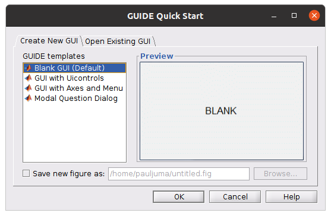
when this command is executed, the window that gives an option of the type of guide that you want to work with opens up. The options include; blank GUI(default), GUI with UI controls, GUI with axes and menu, and a modal question dialog.
Here in this tutorial, we are to use a blank GUI. This is because this is the introduction to the user interface. After selecting the type of model that you will use, a new workspace opens us. This is where we will design our graphical user interface. On the left part of the workspace, we get the buttons that we will use while designing the user interface. The components are aligned and are nameless. To access the names, use the procedure below;
- In the file folder, select the `preferences`.
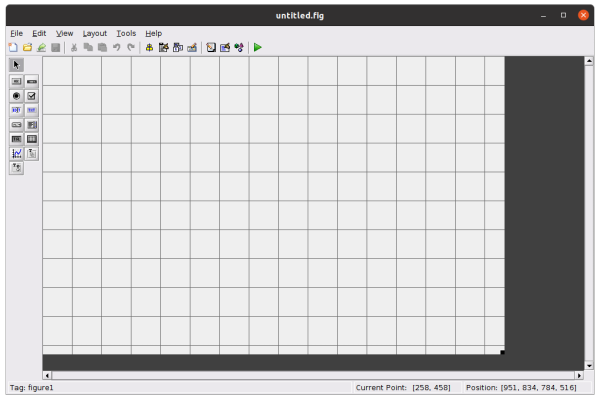
- Select the `show names in the component palette`
- To enable the applied changes, click on the `apply` then `OK`.
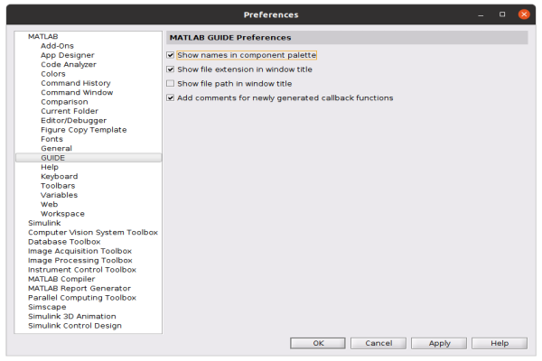
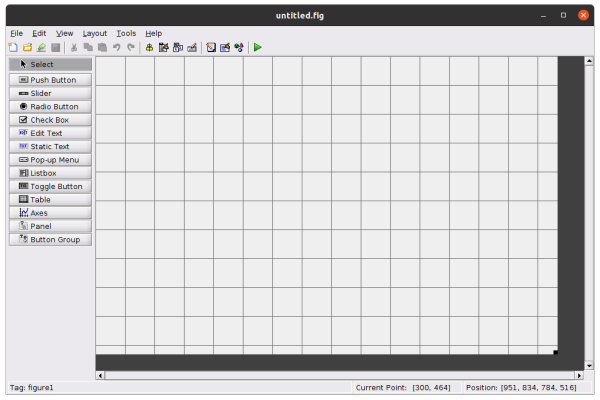
when you want to add a component to your canvas, you select it and drop it there. The components can be resized by dragging the edges. They can also be moved from one point to another by double-clicking the component and dragging it to the required position.

We are now going to discuss the buttons that are used in the design of the user interface from top to the bottom.
1. `Push Button` – It is a button with a raised background. It calls the callback function for a given program to be executed.
2. `Slider` - It looks like a scroll bar that is used to change the numerical value continuously. When the position of the pad changes, a callback function is generated and called. To change the current position of the pad, you drag and drop it. You can also click on the back point or front point and it changes by a predetermined value.                                          
3. `Radio Button` – The button has two states, that is, `on` and `off`. Clicking on it changes the state and calls the callback function. The on-state is represented by a solid circle inside the hollow circle and the `off` state is represented by an empty hollow circle. The radio buttons are grouped and they work alternatingly. This means the only one can be `on` a time in the group.
4. `Check Box` – Just like the radio buttons, it has the `on` and `off` state. Clicking on the check box calls the callback. They can also be grouped but unlike the radio buttons, activating another check box does not deactivate the currently active checkbox. This means numerous checkboxes can be selected in the same group at the same time.
5. `Edit Text` – It is used to get the input from the user. It allows string input but this can be modified into numbers by using the `str2num` or `str2double` function. Once the input has been entered into the edit text box, you click the enter button or any necessary button, and the callback function is called.
6. `Static Text` – It is used to add labels that do not change on the GUI. It has no callback
7. `Pop-up Menu` – When clicked, it shows the list of selections. When a selection is made, the menu disappears and only the current selection is visible. When the selection is made, the callback function is executed.
8. `List box` – It allows the user to select a choice from a list. It is similar to the pop-up menu. The difference is the all list will be visible at all times. Making a selection activates the execution of the callback function.
9. `Toggle Button` – It is similar to the radio button. The difference comes only from the look.
10. `Table` – It is used to add the spreadsheet into the GUI. It can be made visible. Whenever the input is modified, the callback function is executed.
11. `Axes` – They are used to add images, charts, and plots to the GUI and do not have a callback function.
12. `Panel` – It is used to group the necessary GUI components. The name of the panel depends on the function of the buttons grouped. It has no callback function. Note that you need to add the panel first before adding the buttons.
13. `Button Group` – It looks like the panel and it is used to add a group of radio buttons. When a radio button is added, it acts in a synchronized manner. To correct this, we write the callback function. This will ensure that only one radio button is `on`. You first add the button group before adding the radio buttons.
### Simple example GUI
We want to create a simple GUI. For easy work to design the GUI, we add all the required components in the canvas. For this sample GUI, we require the Panel, Static text, Axes, Push Button, Slider, and Edit Text. Drag and drop the components into the canvas as described earlier. The GUI components should be arranged as shown below;

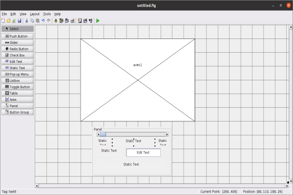
We need to modify the characteristic of the components so that the GUI can make sense to the users. This is by changing the string type.
To modify the characteristic of the component, double-click the component. we get a new window as shown;
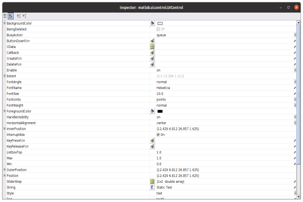
This can also be done by selecting the component and selecting the property inspector at the top of the window.
We can change the background color, foreground color, font size, font weight, string, and the tag of the components depending on how we want our GUI to appear. Note that the string of the components should be compatible with the component function and the tag should be easy and related to the component for easy identification of the callback function.
We will modify the GUI and make it similar to the figure below;
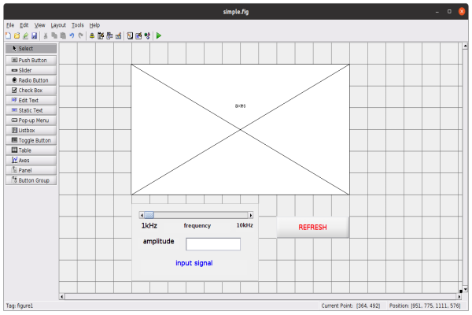
We will change the tag of the `Axes` to `axes`, `slider1` to `Freq`, `edit1` to `Amp`. Note that the tag for the static text is not necessary to change since they have no callback function for modification.

When you try to run the GUI, it will prompt you to save it before it runs. GUI automatically generates the `.m file` and the `.fig file` for the GUI as shown below;
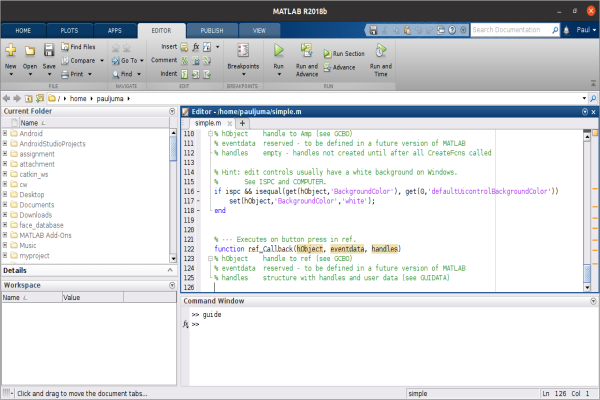
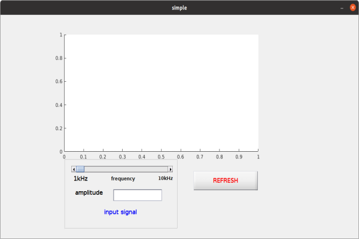
The `create` function is called right after the object is created and its properties set before displaying on the screen. The create function can also be used when additional initialization is required for an object beyond simply setting the properties in the Property inspector. For this sample, we will not use the create function. This is because it is used in a complex situation but this is just an introduction to GUI.
What we want this GUI to carry out is to check the current frequency from the slider, the amplitude that the user inputs, and then draw a sine wave using these data. This means that we do not even require the callback function for the slider. We require the callback function for the refresh button since we click it for the plotting after getting the current data. We also require the callback function for the edit box for error checking. It will check the string that the user inputs and ensures that it is a number. This means we will use some validation methods to verify.
Let's look at the callback function of the edit box. To locate the callback function of a component in the `.m file`;
- Select the component.
- Right-click and select the `view callback`.
- Select the `callback` and it will automatically drive you there.
After locating the callback, enter the following code.
;

```matlab
%str2double(get(hObject,'String')) returns contents of Amp as a double
Amp = str2double(get(hObject,'String'));
if isnan(amp) || ~isreal(amp)
% if we want a double and the user input a string that is not a number
% the refresh button is disabled.

set(hObject,'String','Error: NaN')
set(handles.ref,'Enable','off')
else
set(handles.ref,'Enable','on')
end
```
The first line of our code gets the user input using the `get` function. It then converts the input to double using the `str2double` function since the edit box receives string inputs. The program checks if the input is a real number. If it’s not, we use the `set` function to change the input to `Error: NaN` and disables the refresh button by setting the `handles` to `off` condition using `Enable`, `Off`. The set function is used to change the current state of the edit box to whatever it should display. If the input is real, we enable the refresh button that invokes the callback function. This is done using the `Enable`, `On` functions.
Let's now look at the refresh button callback. write this code below this comment;
>> Note that the position that you write you call back function doesn't interfere with the execution of the code. This is because the generated `.m file` only contains comments that are not executed.

```Matlab
% handles structure with handles and user data (see GUIDATA)

minFreq = 1;
maxFreq = 10;
% Get parameters from GUI
fs = get(handles.Freq,'Value');
freq = minFreq + fs * (maxFreq - minFreq);
amp = str2double(get(handles.Amp,'String'));
% Calculate data
x = amp * sin(2*pi*freq*t);
% Create time plot in proper axes
plot(handles.axes,t,x)
set(handles.axes,'XMinorTick','on')
grid on
```

we first set the helping data, that is, the minimum frequency and the maximum frequency which is used to translate the value from the frequency slider. The variable `t` helps to generate the sine function and plot it. We get the amplitude from the user input as stated before. All these variables are then used to calculate the data `x` that is to be plotted.
We then create the plot on the axes. To make the plottings appear on the axes, we use the `handles. axes` function and activate the axes using `set(handles. axes, ‘XminorTick’, 'on')` function.
We can play with the various amplitudes and frequency and plots made as shown below;
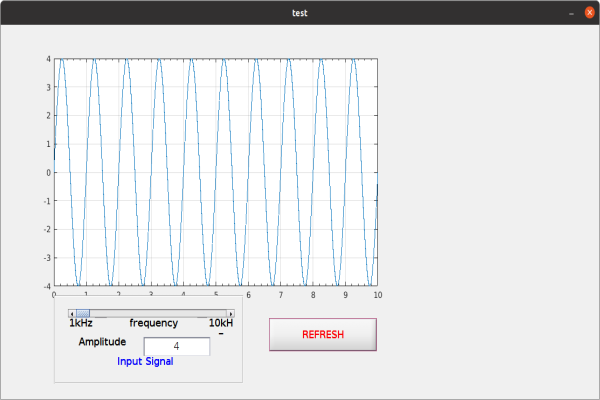
we can also have an error test by putting a letter on the amplitude edit box as shown below;
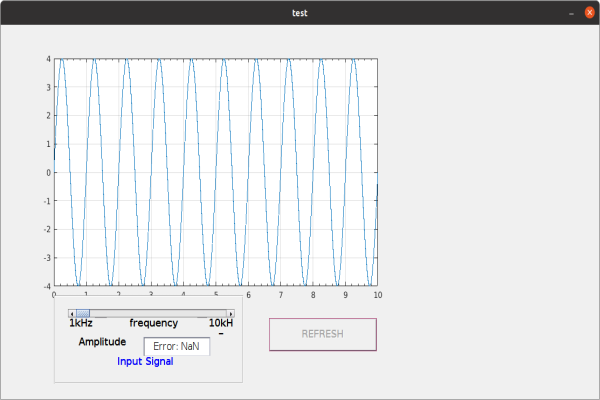
we also see that the refresh push button turns grey after this alphabetic input. This means it is deactivated until a real number is inputted.

### Conclusion
Matlab provides a good environment for creating the GUI. This is because it automatically generates the code for the design of the GUI. The generated codes also contain comments that make it easy for the programmer to understand what the code entails and also organize the callback functions. This makes it easy to work with and design a GUI. This automatic generation of the code also easen the programmer's work since the codes are so bulky to write. 
