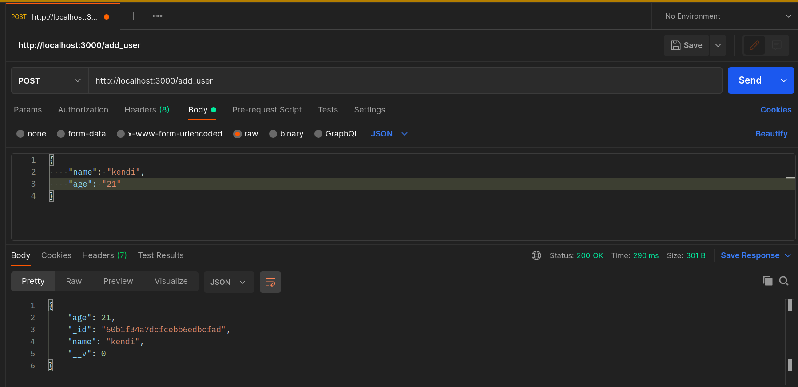
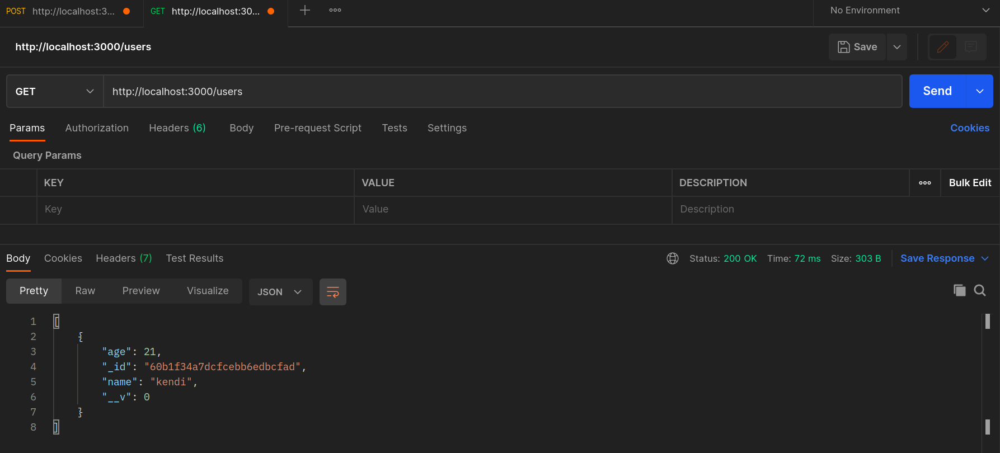

### How to Connect MongoDB to Node.js Using Mongoose
MongoDB is one of the most widely used No-SQL databases in the developer world today. No-SQL databases allow developers to send and retrieve data as JSON documents, instead of SQL objects. To work with MongoDB in a Node.js app, we can use Mongoose.

[Mongoose.js](https://mongoosejs.com) connects your MongoDB clusters or collections with your Node.js app. It enables you to create schemas for your documents. Mongoose provides a lot of functionality for creating and working with schemas. 

In this tutorial we will look at how to connect a MongoDB instance with a Node.js application.

### Prerequisites
Before we move on, you'll need to have the following:
- Node.js installed on your machine.
- A MongoDB instance running on your machine. You won't need this if you want to use MongoDB Atlas.
- Some knowledge of Node.js and Express.js.

### Step 1 - Installing Mongoose on a Node.js Environment
Create and navigate to a new folder by running the following commands on a terminal.

```bash
$ mkdir mongoose_tutorial
$ cd mongoose_tutorial
```

Then install Express and Mongoose by executing the following command on a terminal.

```bash
$ npm install express mongoose --save
```

If you are using Yarn, run:

```bash
$ yarn add express mongoose
```

### Step 2 -- Creating the connection
Create a new file `server.js` for starting our Express.js server. Load `mongoose` and `express` by adding the following code to `server.js`.

`server.js`
```javascript
const express = require("express");
const mongoose = require("mongoose");
const Router = require("./router")

const app = express();

app.use(express.json());
```

Then connect to a local MongoDB instance using the `mongoose.connect()` function.

`server.js`
```javascript
mongoose.connect('mongodb://localhost:27017/usersdb',
  {
    useNewUrlParser: true,
    useFindAndModify: false,
    useUnifiedTopology: true
  }
);
```

We pass the `useNewUrlParser: true`, etc.  to `mongoose.connect()` to avoid the [`DeprecationWarning`](https://mongoosejs.com/docs/deprecations.html).

To create a connection to MongoDB Atlas, use the following code. Replace the variables using your actual credentials.

`server.js`
```javascript
const username = "<mongodb username>";
const password = "<password>";
const cluster = "<cluster name>";
const dbname = "myFirstDatabase";

mongoose.connect(
  `mongodb+srv://${username}:${password}@${cluster}.mongodb.net/${dbname}?retryWrites=true&w=majority`,
  {
    useNewUrlParser: true,
    useFindAndModify: false,
    useUnifiedTopology: true
  }
);
```

Then, set the app to listen to port 3000. 

`server.js`
```javascript
// ...
app.use(Router); 

app.listen(3000, () => {
  console.log("Server is running at port 3000");
});
```

We will create the `Router` later.

### Step 3 -- Creating the schema
Now let's define a collection schema for our application. 

Create another file `models.js` and add the following code.

`models.js`
```javascript
const mongoose = require("mongoose");

const UserSchema = new mongoose.Schema({
  name: {
    type: String,
    required: true,
  },
  age: {
    type: Number,
    default: 0,
  },
});

const User = mongoose.model("User", UserSchema);

module.exports = User;
```

We create a schema `UserSchema` using the `mongoose.Schema()` method. The schema collects the `name` and `age` fields sent from the request.

We then export the schema using the last 2 lines.

### Step 4 -- Creating the POST endpoint
Create a new file `routes.js`. This file defines the endpoints for our app.

Load `express` and the schema we created in step 3 by adding the following code.

`routes.js`
```javascript
const express = require("express");
const userModel = require("./models");
const app = express();
```

Then create the POST endpoint by adding the following code.

`routes.js`
```javascript
// ...
app.post("/add_user", async (request, response) => {
    const user = new userModel(request.body);
  
    try {
      await user.save();
      response.send(user);
    } catch (error) {
      response.status(500).send(error);
    }
});
```

We create a route `/add_user` for adding a new user to the database. We parse the content to be saved to the database using the line `const user = new userModel(request.body);`.

We then use a `try/catch` block to save the object to the database using the `.save()` method.

### Step 5 -- Creating the GET endpoint
Add the following lines of code to the `routes.js` file.

`routes.js`
```javascript
// ...
app.get("/users", async (request, response) => {
  const users = await userModel.find({});

  try {
    response.send(users);
  } catch (error) {
    response.status(500).send(error);
  }
});
```

We create a route `/users` to retrieve all the users saved using the `/add_user` route. We collect these users from the database using the `.find()` method. We then use a `try/catch` block to 'send' the users to this endpoint.

Finally, export these endpoints by adding the line below.

`routes.js`
```javascript
// ...
module.exports = app;
```

At this point, your application is ready. Serve the app by running the command below.

```bash
$ node server.js
```

### Step 6 -- Testing the endpoints
Now, let's test the two endpoints we created above.

Open Postman and make a `POST` request to the `http://localhost:3000/add_user` endpoint.



A new `user` is added to the database. You can check your collections to confirm this.

Make a `GET` request to the `http://localhost:3000/users` endpoint. 



The endpoint returns a list of all the `users` added to the database.

### Conclusion
In this tutorial, we have looked at how to set up Mongoose. We have also looked at how to establish a database connection and how to create a schema for our collections. Mongoose can be used to connect to both MongoDB and MongoDB Atlas to your Node.js app. 

I hope you find this article helpful. 

Happy coding!
