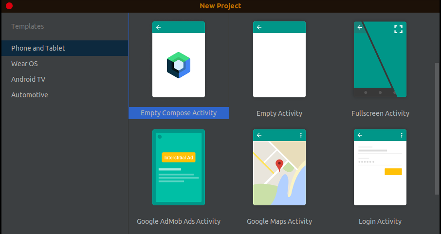
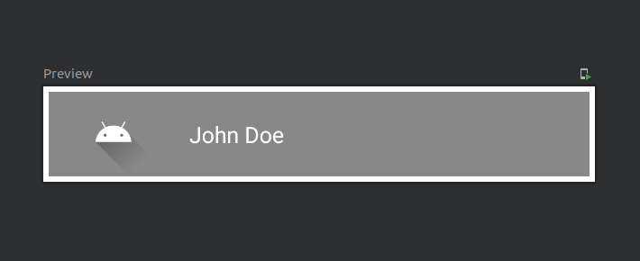

### Introduction
Jetpack Compose is an Android UI Toolkit with a new declarative approach. Compose makes it easy to design and manage your app's user interface by providing a declarative API that lets you render your app's UI without having to change front-end views. This jargon has to be explained, but the ramifications are crucial for app design.

Many apps require the visualization of multiple items. Jetpack Compose includes a set of components that only compose and lays out elements visible in the viewport of the component. `LazyColumn` and `LazyRow` are two of these components. They manage how items are displayed regardless of their number. This makes development easier and provides an interactive experience to the users.

In this tutorial, we'll learn the best practices to build such components.

### Prerequisites
To follow through with this tutorial, you need to have the following:
- [Android Studio Arctic Fox (2020.3.1) Stable](https://developer.android.com/studio#downloads) or higher - These versions of Android Studio have the Jetpack Compose plugin.
- [Basic knowledge on Jetpack Compose](https://developer.android.com/jetpack/compose/index.html). If you are not familiar with Jetpack Compose, feel free to check out [this article on Section](https://www.section.io/engineering-education/getting-started-with-jetpack-compose-in-android/) to get started.
- A good understanding of the [Kotlin Coroutines](https://kotlinlang.org/docs/reference/coroutines-overview.html) will help you understand [Kotlin Coroutines with Jetpack Compose](https://developer.android.com/jetpack/compose/coroutines.html).

> Note: At the time of writing this tutorial, Jetpack Compose is in version 1.0.0 -its first stable version.

### Terminologies
In this tutorial, we'll use the following Compose components:
- `LazyColumn` - A component that manages how items are displayed vertically regardless of their number.
- `LazyRow` - This component manages how a list of items is displayed horizontally.
- `Painter` - A component that renders an image to the Image composable function.
- `Modifier` - A property used to manipulate a component's appearance.
- `Box` - A composable used to hold other components.
- `Text` - This is a built-in composable function that displays a string that is passed as an argument.

### Creating a new project
Launch Android Studio and create a new `Empty Compose Project`. Let's name it `Scrolls`.



### Vertical scrolling
When working with containers such as `Box` or `Surface`, child elements can sometimes get out of view. In such cases, you can use the `Modifier.horizontalScroll` or `Modifier.verticalScroll` modifiers to enable the respective scrolling orientation mode.

In this tutorial, we'll be focusing on `LazyColumn` and `LazyRow` as they are more advanced since they have a built-in scrolling behavior and have several useful functions.

### Creating a sample list item
Moving on, let's create a `LazyColumn` that will contain an item with an `image` and a `Text`.

A sample item is used to generate a list of items with similar appearance but might contain different data/content.

#### i). List item model class
A model class is used to define the data type and its properties used in a sample item.

```kotlin
data class ListItem(val name: String)
```

Here we've defined a `ListItem` class that has a `name` property. Objects of this class will be used to generate multiple items.

#### ii). Sample item composable view
Here, we need to create the actual item using composable functions. We'll use a Box as the parent container of an `Image` and a `Text`

```kotlin
@Composable
fun ListItem(item: ListItem) {
    Box(
        modifier = Modifier
            .fillMaxWidth()
            .padding(4.dp)
            .height(60.dp)
            .background(color = Color.Gray)
    ) {
        Row(
            modifier = Modifier
                .padding(horizontal = 8.dp)
                .fillMaxWidth()
        ) {
            Image(
                painter = painterResource(id = R.drawable.ic_launcher_foreground),
                contentDescription = "user icon",
                modifier = Modifier
                    .padding(horizontal = 8.dp)
                    .align(CenterVertically)
            )
            Text(
                modifier = Modifier
                    .padding(horizontal = 16.dp)
                    .align(CenterVertically),
                text = item.name,
                color = Color.White,
                fontSize = 16.sp
            )
        }
    }
```

The `ListItem` composable function takes a `ListItem` as an argument and returns a `Box` that contains a `Row` with an `Image` and a `Text`.

The painter resource used in the `Image` function is generated automatically when creating a new project. You can use your image resource as well.

Preview:

```kotlin
@Preview(showBackground = true)
@Composable
fun Preview() {
    ScrollsTheme {
        ListItem(item = ListItem("John Doe"))
    }
}
```

`ScrollsTheme` is a default theme that is generated based on the name of the project. If you gave a different name to your project, the theme name might be different from this one.



#### iii). List item objects
The following is an array of `ListItem` objects. These items will be used to generate a scrollable list.

```kotlin
private val listItems: List<ListItem> = listOf(
    ListItem("Jayme"),
    ListItem("Gil"),
    ListItem("Juice WRLD"),
    ListItem("Callan"),
    ListItem("Braxton"),
    ListItem("Kyla"),
    ListItem("Lil Mosey"),
    ListItem("Allan"),
    ListItem("Mike"),
    ListItem("Drew"),
    ListItem("Nia"),
    ListItem("Coi Relay")
)
```

#### iv). Display a scrollable list of items
To display a vertically scrollable list, we'll create a composable function that accepts a list of items as the argument, in this case, the `listItems` we just created.

The function then uses the `items()` method which is part of `LazyColumn` to pass items as the user scrolls.

```kotlin
@Composable
fun DisplayList(items: List<ListItem>) {
    LazyColumn(modifier = Modifier.fillMaxSize(1F)) {
        items(items) { item ->
            ListItem(list = item)
        }
    }
}
```

#### v). Call the `DisplayList` function
At this point, we can only view a sample item on the preview screen. We need to call the `DisplayList` function in the `onCreate()` method to display the list of items when the app runs.

```kotlin
override fun onCreate(savedInstanceState: Bundle?) {
    super.onCreate(savedInstanceState)
    setContent {
        ScrollsTheme {
            Surface(color = MaterialTheme.colors.background) {
                DisplayList(items = listItems)
            }
        }
    }
}
```

#### Run the App
Upon running the app, you should see a scrollable list as shown below:


Unlike imperative programming, declarative programming is quite simple in terms of the number of steps and the logic required.

### Grouping items with Sticky Headers
In the following example, we'll create a scrollable list that will be grouped with sticky headers. Each header will be identified by the first character of the elements in a common group. This way, each group will have a different header.

It is called a sticky header because it is pinned to the top of the list when the user scrolls down.

The code below is an advancement of the [previous example](#iv-display-a-scrollable-list-of-items).

```kotlin
@ExperimentalFoundationApi
@Composable
fun DisplayList(items: List<ListItem>) {
    LazyColumn(modifier = Modifier.fillMaxSize(1F)) {
    // Note: Grouping should be should be done in a viewModel
        val grouped = items.groupBy { it.name[0] }
        grouped.forEach {initial, items ->
            stickyHeader {
                Text(
                    text = initial.toString(),
                    modifier = Modifier.padding(10.dp)
                )
            }
            items(items) { item ->
                ListItem(item = item)
            }
        }
    }
}
```

**Explanation:**
- `grouped` - is a `Map` that contains a `List` of `ListItem` objects grouped by the first character of the `name` property.
- `initial` - is the first character of the `name` property in the `List` of `ListItem` objects.

> Note: The Sticky header API is still being developed and it might change in the future. For this reason, we're using the experimental API by annotating the function with `@ExperimentalFoundationApi`


### Scroll states
In Jetpack Compose, a state is a property of an object that can change during recomposition. We use an inbuilt constructor called `LazyStates` to create a state object used to trace the state and interactions of scrollable components.

Example:

```kotlin
@Composable
fun DisplayList(items: List<ListItem>) {
    val listState = rememberLazyState()

    // Update the state
    LazyColumn(
        state = listState,
        modifier = Modifier.fillMaxSize(1F)) {
        ...

        }
```

### Scroll positions
A LazyState can also be used to keep track of the positions of the items in the list. Using the listState in the example above, we can keep track of the current scroll position or scroll to a certain valid position.

This is done by using the state's `scrollToItem()` method. This method initiates a suspendable job hence the need to use Coroutines.

#### Add Coroutines dependency

```gradle
implementation("org.jetbrains.kotlinx:kotlinx-coroutines-android:1.5.0")
```

#### Implementation example

```kotlin
fun DisplayList(items: List<ListItem>) {
    val listState = rememberLazyListState()

    LazyColumn(modifier = Modifier.fillMaxSize(1F), state = listState) {
        val grouped = items.groupBy { it.name[0] }
        grouped.forEach { initial, items ->
            stickyHeader {
                Text(
                    text = initial.toString(),
                    modifier = Modifier.padding(10.dp)
                )
            }
            items(items) { item ->
                ListItem(item = item)
            }
        }
        CoroutineScope(Dispatchers.IO).launch {
            listState.scrollToItem(items.size-1)
        }
    }
}
```

For demonstration purposes, we have scrolled to the last item in the list. This can be advanced such that the list scrolls to a certain remembered position especially during a configuration change or a recomposition.

### Displaying a Horizontal Scrollable list
As the name suggests, the main difference between a vertical and a horizontal scrollable component is the orientation. A `LazyRow` is a scrollable component that can be used to display a horizontal list. It's comparable to a LazyColumn in terms of implementation.

Example:

```kotlin
@Composable
fun LazyRowExample(items: List<ListItem>) {
    // implement LazyRow
	LazyRow(
		contentPadding = PaddingValues(4.dp),
		horizontalArrangement = Arrangement.spacedBy(4.dp),
        modifier = Modifier.fillMaxSize(1F)
	) {
        // display items horizontally
        items(items) { item ->
            ListItem(list = item)
        }
	}
}
```

### Conclusion
In this tutorial, we have covered the basics of creating scrollable lists in Jetpack Compose. We've also learned how to create sticky headers in a scrollable list. The knowledge gained from this tutorial will be useful in creating a more complex scrollable list.

Happy Composing!
