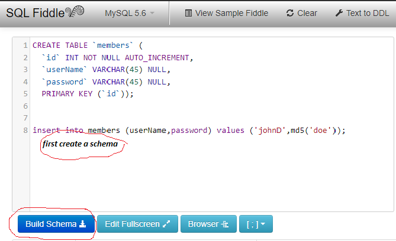

Information is the most crucial part of a data system. Information-base controlled web applications are utilized by most associations to get information from clients. Thus, drawing in information security.
<!--more-->
SQL injection is an assault that harms dynamic SQL articulations to remark out specific pieces of the assertion or affixing a condition that will consistently be valid. It exploits the plan imperfections in inadequately planned web applications. This is done to take advantage of SQL proclamations to execute vindictive SQL code.

This article will take the reader through SQL infusions.  And, it will have an unmistakable illustration of how it is carried out and how to forestall SQL infusions.

### Table of contents
- [Introduction](#introduction)
- [Understanding SQL infusion](#understanding-sql-infusion)
- [Activity: Infuse a webPage](#activity-infuse-a-webpage)
- [Other SQL infusion assault types](#other-sql-infusion-assault-types)
- [Automation devices for SQL infusion](#automation-devices-for-sql-infusion)
- [Forestall SQL infusion assaults](#forestall-sql-infusion-assaults)
- [Conclusion](#conclusion)

### Understanding SQL infusion
The sorts of assaults that can be performed utilizing SQL infusion differ contingent upon the kind of data set motor. The assault chips away at dynamic SQL articulations. 

A powerful assertion is an explanation that is created at a run time utilizing boundaries secret phrases from a web structure or URI query string.

Let's take a look at a simple login form with some basic styling:
- [Get the form](https://github.com/fabulousDesigns/sql-injection-login-page)
- create 2 files:
  1.  `index.html`
  2.  `style.css`

```html
<!DOCTYPE html>
<html lang="en">
  <head>
    <meta charset="UTF-8" />
    <meta http-equiv="X-UA-Compatible" content="IE=edge" />
    <meta name="viewport" content="width=device-width, initial-scale=1.0" />
    <link rel="stylesheet" href="style.css" />
    <title>Demo</title>
  </head>
  <body>
    <div class="wrapper">
      <form action="loginAuth.php" method="post">
        <h4 class="logo-text">LOGIN</h4>
        <div class="line"></div>
        <input
          type="text"
          name="uName"
          class="input-group"
          placeholder="Enter your Username"
        /><input
          type="text"
          name="pass"
          class="input-group"
          placeholder="Enter your Password"
        />
        <pre> <input type="checkbox" name="chkbox"> Remember me</pre>
        <button type="submit" name="submit" class="btn">LOGIN</button>
      </form>
    </div>
  </body>
</html>
```


The above structure acknowledges the username, and password then, at that point submits them to a PHP record named `loginAuth.php`. It has an alternative of putting away the login session in a cookie. 

We have derived this from the `remember-me` checkbox. It utilizes the post strategy to submit information. This implies the user credentials are not shown in the URL.

**Suppose user authentication is done using the following statement:**

```sql
SELECT * FROM members WHERE username = $_POST['uName'] AND password = md5($_POST['pass']);
```

The above assertion utilizes the upsides of the `$_POST[]` cluster without cleaning them. The secret key, password, is encoded utilizing the `MD5` calculation. 

We will represent SQL infusion assault utilizing `sqlfiddle`. Open the [SQL Fiddle](http://sqlfiddle.com/) in your internet browser. 

You will get the accompanying window:

- The first thing you want to do in `sqlfiddle` is to create a schema
  so, on the left pane paste the SQL code below:

```sql
CREATE TABLE `members` (
  `id` INT NOT NULL AUTO_INCREMENT,
  `userName` VARCHAR(45) NULL,
  `password` VARCHAR(45) NULL,
  PRIMARY KEY (`id`));


insert into members (username,password) values ('johnD',md5('doe'));
```

- Click the `build schema` button
  
- On the right pane enter:

  ```sql
  SELECT * FROM members;
  ```

- and run the code
  
- Your output will be :
  
- Let us say the user supplies `logan` as the username and `5678` as the password.

The SQL code to execute would probably be :

```sql
SELECT * FROM members WHERE username = 'logan` AND password = md5('5678');
```

The above code can be taken advantage of by remarking out the secret key (password) part and affixing a condition that will consistently be valid. Let's say an assailant gives the following in the input fields:
1. `username = xyz.mnp' OR 1 = 1 LIMIT 1 — ']`
2. `password = fff`

- The statement to execute would be as follows: 

```sql
SELECT * FROM members WHERE username = 'xyz.mnp' OR 1 = 1 LIMIT 1 -- ‘ ] AND password = md5(‘5678’);
```

`Xyz.mnp` closes with a solitary statement that finishes the string quote.

Or so `1 = 1 LIMIT 1` is a condition that will consistently be valid and limits the returned results to just one record.

`-- 'AND … `is a SQL remark that takes out the secret key part.

- Run the above code in SQL FiddleRun SQL Text box as shown below
  
- The result is as shown below
  

### Activity: Infuse a webpage
- I have created a log-in form that we will use to employ SQL injection exploits. you can get it [here](https://github.com/fabulousDesigns/sql-injection-login-page)
- The form has some fundamental security, for example, sanitizing the username field.
- This implies our above code can't be utilized to sidestep the login. To get around that, we can rather take advantage of the secret word field.
- The outline below shows the steps that you should follow.

#### Step 1
Clone the source code in your local computer and run it with the `xammp` server.

#### Step 2
Enter log-in info :
- username = 'xyzxyz'
- password = 'xyz') OR 1=1 -- ]

- click on submit

#### Step 3
Access Granted -> redirected to Dashboard

If a user provides the following:

- username = `xyzxyz`
- password = `xyz') OR 1 = 1 -- ]`

The user will be redirected to the dashboard upon clicking submit button.

  **Let's take a closer look at the generated statements:**

```sql
SELECT * FROM members WHERE username = ‘xyzxyzx’ AND password = md5(‘xyz’) OR 1 = 1 — ]’);
```


### Other SQL infusion assault types
SQL Injections can do more damage than just bypassing the login calculations. A part of the assaults incorporate:
- Erasing information
- Updating information
- Embeddings information
- Executing orders on the worker that can download and introduce malignant projects like Trojans
- Sending out significant information, for example, Mastercard subtleties, email, and passwords to the assailant's far-off worker.
- Getting client login subtleties and so on.

The above list isn't thorough; it simply gives you a thought of what SQL Injection is capable of.

### Automation devices for SQL infusion
In the above model, we utilized manual assault methods dependent on our huge information on SQL. There are mechanized apparatuses that can assist you with playing out the assaults all the more proficiently and inside the briefest conceivable time. 

These apparatuses incorporate:
- **[Sonarqube](https://www.sonarqube.org/)**
- **[sqlsus](http://sqlsus.sourceforge.net/)**

### Forestall SQL infusion assaults
An association can take on the accompanying strategy to ensure itself against SQL Injection assaults:
1. Client info ought to never be trusted – It should consistently be disinfected before it is utilized in unique SQL explanations.
2. Use the put away method – these can exemplify the SQL explanations and treat all contributions as boundaries.
3. Arranged explanations – arranged proclamations work by making the SQL articulation first.  Then, at the point of all submitted client information as boundaries. This has no impact on the linguistic structure of the SQL articulation.
4. Customary articulations – these can be utilized to distinguish possible hurtful code. And, end it before executing the SQL explanations.
5. Information base association client access rights – only vital access rights ought to be given to accounts used to interface with the data set. This can assist with lessening what the SQL explanations can perform on the worker.
6. Blunder messages – these ought not to uncover touchy data and the precise area a mistake happened. Straightforward custom blunder messages, for example, "Heartbroken, we are encountering specialized mistakes. The specialized group has been reached. Kindly attempt again later" can be utilized rather than show the SQL explanations that caused the mistake.

### Conclusion
SQL injection is a sort of assault that benefits from terrible SQL articulations. SQL infusion can be utilized to sidestep login calculations, recover, addition, and refresh and erase information.

SQL infusion instruments incorporate `SqlSus`, `SQLPing`, and `Sonarqube`, and so on. A decent security strategy when composing SQL proclamation can assist with decreasing SQL infusion assaults.

Happy coding!

---
Peer Review Contributions by: [Dawe-Daniel](/engineering-education/authors/dawe-daniel/)