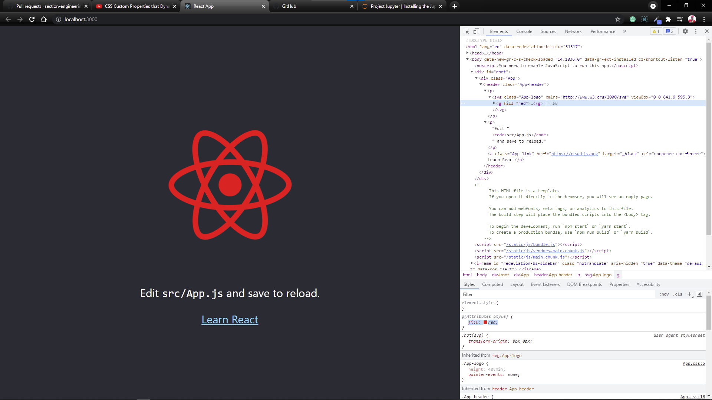
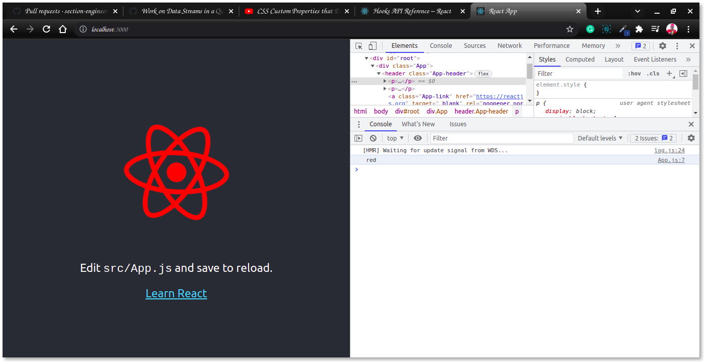
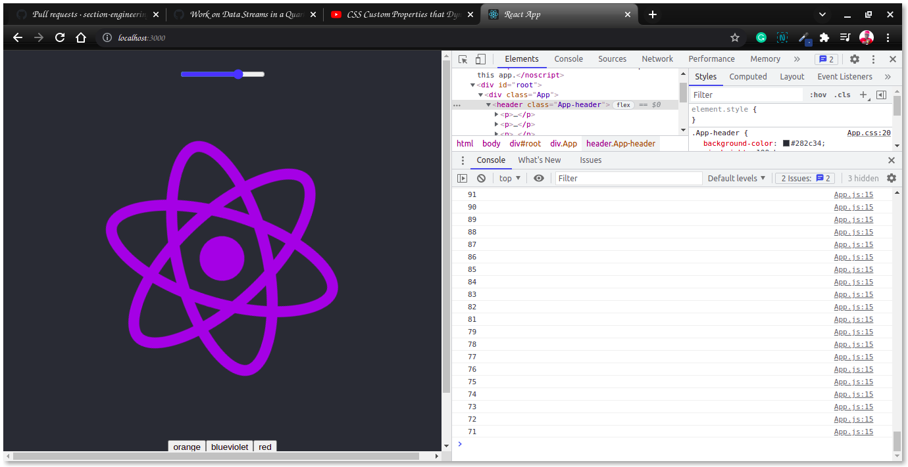

While one might be familiar with using CSS variables with something like SASS, custom properties are native CSS implementation of using the variables right inside the browser.
As already known, there are three main methods applied to use these custom variables. These include defining the double hyphen(`--`) prefixes on them, stating the variable's name, and prefixing it with the **var** keyword, representing it on an element or on a selector(this will make it be cascaded only within the scope).
The custom CSS variables are used in Javascript and Javascript frameworks.

In this article, one will learn how to use CSS Custom properties that dynamically update on the change of state.
This knowledge helps one to modify Javascript UI component properties as the variables state changes.

### Key takeaways

- Set up the custom variables in a JavaScript framework such as React.
- Get the fetch the properties of the variables used
- See how to use the custom variables during state changes and events
- Use the variables to update component properties dynamically
- Configure the variables to change with the application state dynamically

### Pre-requisites

The following are the article pre-requisites:

- Previous hands-on React experience
- Previous experience on Webpage design
- React environment already set up on the machine in use
- A good JavaScript IDE or editor
- A stable internet connection
- CSS knowledge

If all are in place, let's get started.

These are the steps to be followed in the process:

- Create a new React app


### Create a new React app

- Head over to the folder location where the project will lie. Create the app by running the command below on the terminal:

```shell
npx create-react-app my-custom-properties
```

That will create an app named `my-custom-properties`.

- Open it up and do a test run using the following command:

```shell
cd my-custom-properties
npm start
```

- Access it via `http://localhost:3000/`.
- If using VS Code, open it up using the `code .` command.

#### Folder Structure

The app has the following folder structure:

```shell
.
├── node_modules
├── public
├── src
│   ├── App.css
│   ├── App.js
│   ├── App.test.js
│   ├── index.css
│   ├── index.js
│   ├── logo.svg
│   ├── reportWebVitals.js
│   └── setupTests.js
├── .gitignore
├── package.json
├── package-lock.json
└── README.md
```

### Adding a Custom Variable to change the React logo color

To do this, follow the steps below:

- To target the SVG file used as the centered logo image, copy-paste it from the `logo.svg` file into the `App.js` file. Do this under the header tag in new `p` tags. Set its _className_ to "App-logo".
- Delete the last line that imported the image source. Doing this makes the SVG to be an inline SVG file. The result of these two steps results in the code shown below inside the header tag:

```javascript
<header className="App-header">
    <p>
        <svg className="App-logo" xmlns="http://www.w3.org/2000/svg" viewBox="0 0 841.9 595.3"><g fill="#61DAFB"><path d="M666.3 296.5c0-32.5-40.7-63.3-103.1-82.4 14.4-63.6 8-114.2-20.2-130.4-6.5-3.8-14.1-5.6-22.4-5.6v22.3c4.6 0 8.3.9 11.4 2.6 13.6 7.8 19.5 37.5 14.9 75.7-1.1 9.4-2.9 19.3-5.1 29.4-19.6-4.8-41-8.5-63.5-10.9-13.5-18.5-27.5-35.3-41.6-50 32.6-30.3 63.2-46.9 84-46.9V78c-27.5 0-63.5 19.6-99.9 53.6-36.4-33.8-72.4-53.2-99.9-53.2v22.3c20.7 0 51.4 16.5 84 46.6-14 14.7-28 31.4-41.3 49.9-22.6 2.4-44 6.1-63.6 11-2.3-10-4-19.7-5.2-29-4.7-38.2 1.1-67.9 14.6-75.8 3-1.8 6.9-2.6 11.5-2.6V78.5c-8.4 0-16 1.8-22.6 5.6-28.1 16.2-34.4 66.7-19.9 130.1-62.2 19.2-102.7 49.9-102.7 82.3 0 32.5 40.7 63.3 103.1 82.4-14.4 63.6-8 114.2 20.2 130.4 6.5 3.8 14.1 5.6 22.5 5.6 27.5 0 63.5-19.6 99.9-53.6 36.4 33.8 72.4 53.2 99.9 53.2 8.4 0 16-1.8 22.6-5.6 28.1-16.2 34.4-66.7 19.9-130.1 62-19.1 102.5-49.9 102.5-82.3zm-130.2-66.7c-3.7 12.9-8.3 26.2-13.5 39.5-4.1-8-8.4-16-13.1-24-4.6-8-9.5-15.8-14.4-23.4 14.2 2.1 27.9 4.7 41 7.9zm-45.8 106.5c-7.8 13.5-15.8 26.3-24.1 38.2-14.9 1.3-30 2-45.2 2-15.1 0-30.2-.7-45-1.9-8.3-11.9-16.4-24.6-24.2-38-7.6-13.1-14.5-26.4-20.8-39.8 6.2-13.4 13.2-26.8 20.7-39.9 7.8-13.5 15.8-26.3 24.1-38.2 14.9-1.3 30-2 45.2-2 15.1 0 30.2.7 45 1.9 8.3 11.9 16.4 24.6 24.2 38 7.6 13.1 14.5 26.4 20.8 39.8-6.3 13.4-13.2 26.8-20.7 39.9zm32.3-13c5.4 13.4 10 26.8 13.8 39.8-13.1 3.2-26.9 5.9-41.2 8 4.9-7.7 9.8-15.6 14.4-23.7 4.6-8 8.9-16.1 13-24.1zM421.2 430c-9.3-9.6-18.6-20.3-27.8-32 9 .4 18.2.7 27.5.7 9.4 0 18.7-.2 27.8-.7-9 11.7-18.3 22.4-27.5 32zm-74.4-58.9c-14.2-2.1-27.9-4.7-41-7.9 3.7-12.9 8.3-26.2 13.5-39.5 4.1 8 8.4 16 13.1 24 4.7 8 9.5 15.8 14.4 23.4zM420.7 163c9.3 9.6 18.6 20.3 27.8 32-9-.4-18.2-.7-27.5-.7-9.4 0-18.7.2-27.8.7 9-11.7 18.3-22.4 27.5-32zm-74 58.9c-4.9 7.7-9.8 15.6-14.4 23.7-4.6 8-8.9 16-13 24-5.4-13.4-10-26.8-13.8-39.8 13.1-3.1 26.9-5.8 41.2-7.9zm-90.5 125.2c-35.4-15.1-58.3-34.9-58.3-50.6 0-15.7 22.9-35.6 58.3-50.6 8.6-3.7 18-7 27.7-10.1 5.7 19.6 13.2 40 22.5 60.9-9.2 20.8-16.6 41.1-22.2 60.6-9.9-3.1-19.3-6.5-28-10.2zM310 490c-13.6-7.8-19.5-37.5-14.9-75.7 1.1-9.4 2.9-19.3 5.1-29.4 19.6 4.8 41 8.5 63.5 10.9 13.5 18.5 27.5 35.3 41.6 50-32.6 30.3-63.2 46.9-84 46.9-4.5-.1-8.3-1-11.3-2.7zm237.2-76.2c4.7 38.2-1.1 67.9-14.6 75.8-3 1.8-6.9 2.6-11.5 2.6-20.7 0-51.4-16.5-84-46.6 14-14.7 28-31.4 41.3-49.9 22.6-2.4 44-6.1 63.6-11 2.3 10.1 4.1 19.8 5.2 29.1zm38.5-66.7c-8.6 3.7-18 7-27.7 10.1-5.7-19.6-13.2-40-22.5-60.9 9.2-20.8 16.6-41.1 22.2-60.6 9.9 3.1 19.3 6.5 28.1 10.2 35.4 15.1 58.3 34.9 58.3 50.6-.1 15.7-23 35.6-58.4 50.6zM320.8 78.4z"/><circle cx="420.9" cy="296.5" r="45.7"/><path d="M520.5 78.1z"/></g></svg>
    </p>
    <p>
        Edit <code>src/App.js</code> and save to reload.
    </p>
    <a className="App-link" href="https://reactjs.org" target="_blank" rel="noopener noreferrer">
        Learn React
    </a>
</header>
```

- To verify that it uses the inline image, delete the `logo.svg` file and refresh the app.

- Open the webpage using the Inspect mode in the browser by first right-clicking anywhere on the page, then selecting the `Inspect` option.

Notice that the SVG is inside the following tag, `<g></g>`.


Unlike text, SVG color property can't be accessed using the `color` attribute. It is rather referenced to using the `fill` property as shown below:



- In the `App.css` file, create a new styling to apply the Red color fill to the SVG under the `App-logo` class as shown below:

```CSS
.App-logo g {
    fill: red;
}
```

This code applies the fill effect to the app.

- Open up the index.css file. Define the CSS variables here. Use the root element so that the variables may be visible in the entire application. For example, a variable to hold the color property.

```CSS
:root{
    --logo-color: red;
    }
```

The good thing about variables is that they use easy-to-understand names hence can be reused severally without errors.
To change the variable's scope, refer to the element into which it is bound. The component will replace the root position.

- Set the app logo to rely on the set variable for color property. Do this in the App.css file

```css
.App-logo g {
    fill: var(--logo-color);
}
```

- Refresh the browser. The logo doesn't change. This step proves that all is well.
- In-case of fallbacks, which may occur when the variable is not set yet or can't be found, use the following code syntax to specify another option:

```css
.App-logo g {
    fill: var(--logo-color, aqua);
}
```

Try it by removing the variable from the application and refreshing the webpage. Once re-run, return the app variable to its initial state.

### Getting property of a CSS custom property with JavaScript

To get the value dynamically inside the variables so that they can be dynamically modified, do the following:

- In the App.js file, import the `useEffect` from React as shown below:

```js
import { useEffect} from "react";
```

This allows the app to run client-side code outside the scope of the React rendering component.

Inside the `App()` function, add the _useEffect_ hook, grab the variable, and run it for the first time by using `[]`.
- Since no behavior is added in the block quotes, it prevents re-firing of the application in each render.
  That is due to lack of values passed to it:

```js
    useEffect(() => {

    }, []);
```

- In it, create a constant that uses the `getComputedStyle()` function to allow an element to be passed in so that the value of its style can be grabbed.
- Pass the root element (document.documentElement) because the `--logo-color` variable is defined in the root. Get the variable property value. Do this as shown below:

```js
const color = getComputedStyle(document.documentElement).getPropertyValue('--logo-color');
console.log(color);
```

When the page is refreshed, the application will log out the variable's value inside the root element in the console.



Try changing the color from red to orange and refresh the page.

> Notice that when the color is changed to another, e.g. yellow, it doesn't immediately log it out though the results are already applied to the SVG.
> This is because the `useEffect` hook is running only on that first instance. This requires another page refresh for it to be reflected.

### Setting the value of a CSS custom property with JavaScript

- In the _App.js_ file, under the _useEffect_ function, creates a function that sets the color of an element to the one passed as an argument. It shall do the changes in the root element.
- It will set the style property that is passed in the `--logo-color` variable with the new one passed as an argument. The two steps are shown in the code below:

```js
function setColor (newColor){
    document.documentElement.style.setProperty('--logo-color', newColor);
}
```

- Delete the code below in the _App.js_ file:

```js
<p>
    Edit <code>src/App.js</code> and save to reload.
</p>
<a className="App-link" href="https://reactjs.org" target="_blank" rel="noopener noreferrer">
    Learn React
</a>
```

Replace it with the following code that creates three buttons that, on click, can instantly set the color of the app logo to the one defined in each.

```js
<p>
    <button onClick={() => setColor('orange')}>orange</button>
    <button onClick={() => setColor('blueviolet')}>blueviolet</button>
    <button onClick={() => setColor('red')}>red</button>
</p>
```

This is just a simple way to change the variable values.

### Dynamically resizing the Logo with a custom CSS Property

Now, what about changing the value of the variables dynamically based on an actual input value?

Do this as follows:

- Create another variable in the index.css file. It will be named `--logo-size`, and it shall hold the size of the logo. The App.css file defined the initial logo size as'_40vmin_' as seen in the file under the `App-logo` class.

```css
--logo-size: 40vmin;
```

- Modify so that one may obtain the height of the logo from the variable set.

```css
.App-logo {
  height: var(--logo-size);
  pointer-events: none;
}
```

- Create an input of the _range_ type. It will have a range of 0 to 100 and a _defaultValue_ of `--logo-size`. Do this above the `p` tags holding the SVG.

```js
<p>
    <input type="range" name="size" min="0" max="100" defaultValue="40" onChange={handleOSizeChange}/>
</p>
```

- Create a function that handles the change of the value of the input of type 'range'. It will then set the value of the current position of the range input dynamically per each change. It will also return the current value in the browser console. Create it under the 'setColor()' method:

```js
    function handleOSizeChange(event) {
    console.log(event.currentTarget.value);
    document.documentElement.style.setProperty('--logo-size', event.currentTarget.value);
}
```

- Refresh the page and adjust the size of the input range to see if all is well. The app will automatically increase or decrease the logo size as it is made to slide in the right or left direction. This automatically updates whenever the range slider is moved.



### Speeding up a CSS animation by updating a CSS custom property

What if one would like to increase the speed of the animation per each click? Then at a specific rate, it will reset to the default speed.

Accomplish the above by following the steps below:

- Create a new variable named `logo-speed`. It shall contain the value previously stored in the 'animation' property of the App-logo class found media query.

```css
--logo-speed: 20s;
```

- Set the logo to use this property.

```css
@media (prefers-reduced-motion: no-preference) {
    .App-logo {
        animation: App-logo-spin infinite var(--logo-speedTiming) linear;
    }
}
```

- Add a function to the App.js file that increases the animation speed stored in the '_--logo-speed_' variable on each click. It then resets the speed to the default one.

> Remember that when the value is fetched from the variable, it has the `s` letter at its end. This makes it hard to do computation. Therefore it will be removed and later returned.

```js
function onSVGClick() {
    const timing = getComputedStyle(document.documentElement).getPropertyValue('--logo-speedTiming').replace('s', '');

    let newTiming = timing;

    /*Reset point*/
    if (newTiming < 0.5){
        newTiming = 20;
    } else {
        newTiming = newTiming / 2;
    }
    
    document.documentElement.style.setProperty('--logo-speedTiming', `${newTiming}s`);
}
```

- Target the SVG through the paragraph that encloses it. Targeting the SVG directly is quite tricky, hence pass through the paragraph.

```js
<p onClick={onSVGClick}>
    <svg className="App-logo" xmlns="http://www.w3.org/2000/svg" viewBox="0 0 841.9 595.3">
        <g fill="#61DAFB">
            ...
        </g>
    </svg>
</p>
```

- Re-run the application and click on the logo at a constant rate.

The speed of the logo will continuously speed up till it reaches a reset point.

The app will run as shown here:


In the above function, the variables have been dynamically fetched and updated per event changes.

All the above things, such as changing the color, size, and speed of rotation in the application, are examples of how CSS variables can be dynamically updated to create excellent effects.
This gives one idea on how to implement it in the application in a very intuitive way to meet needs in a React or JavaScript application.

### Conclusion

By reaching here, this means that one has learned the following:

- How to set up the custom variables in a JavaScript framework such as React
- Get the fetch the properties of the variables used
- Know how to use the custom variables during state changes and events
- How to use the variables to update component properties dynamically
- How to configure the variables to change with the application state dynamically

Happy Coding!

****
### References

- [React useEffect hooks](https://reactjs.org/docs/hooks-reference.html) documentation.