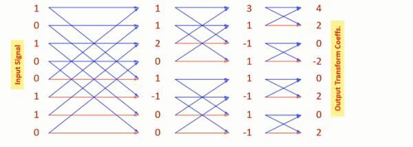

### Walsh Hadamard transform for signal and image compression using Matlab
### Introduction
The Walsh-Hadamard transform is a non-sinusoidal, orthogonal transform widely used in signal and image processing. Here, you decompose the signal into a set of basis functions (similar to harmonics in Fourier). These basis functions are the Walsh function, rectangular or square waves with +1 or -1. In addition, like the fast Fourier transform(FFT), the Walsh-Hadamard transform has a fast version known as fast Walsh-Hadamard transform(FWHT).

The Walsh-Hamard has a wide application in the field of science and engineering. These applications include image processing, speech processing, signal and image compression, power spectrum analysis, spread spectrum analysis e.t.c. This tutorial will look at signal and image compression using Matlab. We will look at its theory and computation for both 1d and 2d signals.

### Prerequisites
To follow along with this tutorial, you'll need:
- [MATLAB](https://www.mathworks.com/products/get-matlab.html?s_tid=gn_getml) installed.
- Proper understanding of [MATLAB](https://www.section.io/engineering-education/getting-started-with-matlab/) basics.

### Forward and inverse WHT
The forward(FWHT) and the inverse(IFWHT) are symmetrical and use identical calculation processes. You define the FWHT and IWHT for a signal `x(t)` of length `N` as;

$FWHT: y_n=\frac{1}{N}\sum x_i=\sum y_n WAL(n,i)$  for i = 1,2,...,N

Where;
WAL(n, i) are Walsh functions.

To compute WHT, the length of signal `N` must be in the power of 2(i.e., $N=2^2$). If the length is not in the power of 2, it is with zeros to make it to the power of 2. Thus, you compute the equation of FWHT by matrix multiplication.    

$x(t) ={x_1, x_2, ..., x_n}$

$y = \frac{1}{n}(H_n, x)$

To elaborate this, we have;

$$\begin{vmatrix}y_1\\y_2\\:\\:\\y_N\end{vmatrix}=\frac{1}{N}*\begin{vmatrix}H_{11}&H_{12}....&H_{1N}\\H_{21}&H_{22}....&H_{2N}\\:\\:\\H_{N1}&H_{N2}....&H_{NN}\end{vmatrix}*\begin{vmatrix}x_1\\x_2\\:\\:\\x_N\end{vmatrix}$$

Here, $H_N$ is the Hadamard matrix, where $N =2^n$. Similarly, inverse transform can be obtained by;

$x = H_n^{-1}=H_ny$

$H_n^{-1}=H_n^T=H_n$. It is because $H_n$ is orthogonal and involutionary. Orthogonal means that there is a perpendicular vector. So when we work this out, we are going to have;

$$\begin{vmatrix}x_1\\x_2\\:\\:\\x_N\end{vmatrix}=\frac{1}{N}*\begin{vmatrix}H_{11}&H_{12}....&H_{1N}\\H_{21}&H_{22}....&H_{2N}\\:\\:\\H_{N1}&H_{N2}....&H_{NN}\end{vmatrix}*\begin{vmatrix}y_1\\y_2\\:\\:\\y_N\end{vmatrix}$$

### Hadamard matrix
It is the square matrix of 2x2, 4x4, 8x8, e.t.c. The dimensions are given by $2^N$. The first order Hadamard matrix($H_1$) is given by;

$$H_1=
\left(\begin{array}{cc} 
1 & 1\\
1 & -1
\end{array}\right)
$$ 

The second Hadamard matrix is given by;

$$H_2=
\left(\begin{array}{cc} 
1 & 1 & 1 & 1\\
1 & -1 & 1 & -1\\
1 & 1 & -1 & -1\\
1 & -1 & -1 & 1
\end{array}\right)
$$

The matrix $H_2$ is obtained from $H_1$ using the Kronecker product.

$H_2=H_1 * H_1$

Where; 
`*` is the Kronecker product.
What Kronecker product mean is, if we have two matrix A and B, then it is the product of matrix A and elements of B as shown below;
$$A*B=
\left(\begin{array}{cc} 
A(1,1).B & A(1,2).B & ... & A(1,N).B\\
: & : &  & : &\\
: & : &  & :\\
A(N,1).B & A(N,2).B & ... & A(N,N).B
\end{array}\right)
$$

The higher-order Hadamard matrix $H_N$ can be obtained by the iteration rule below;

$H_N=H_1 * H_{N-1}$

We want to see how we can get the Walsh matrix from Hadamard.
Consider the hadamard matrix($H_2$)


If we look at the first row, we see that the sign of the elements does not change from the first column to the last. However, the sign changes from 1 to -1, then to 1, then -1 again, which sums to three changes in the second row, and then you move to the third and fourth rows. Here, we consider how the sign changes. If we arrange the rows in the increasing number of sign changes, it becomes the Walsh matrix, as shown below.


### Walsh-Hadamard transform for images
For 2-D signals(images of NxN),  You can obtain the forward Walsh method transform by the following matrix equation.

$Y=\frac{1}{N^2}(H_N*H_N)$

Where;
x is the input image.
y is the output transformation matrix.
$H_N$ is the Hadamard or Walsh matrix.

Note that if your input image is of the dimensions MxN, then instead of $\frac{1}{N^2}$ you will have $\frac{1}{MN^2}$. It is because M and N must be to the power of 2. 
Obtaining the inverse transform is by the similar operation as that of forwarding transform;

$X=H_NYH_N$

### Example of WHT of 1-D signal in matlab 
let $$x(n)=
\left(\begin{array}{cc} 
1 & 5 & -3 & 2\end{array}\right)
$$
Using N(hadamard matrix) as 4, we can find the inverse and forward transformation of the matrix. This can be done using the code below;
```matlab
x = [1;5;-3;2];       % signal
H = hadamard(4);       %hadamard matrix
y = (1/4)*H*x;         %forward transform
x_r = H*y;                %Inverse transform formula
```
In the code below, we use the formula of finding the forward and inverse transform of the matrix. We use `1/4*H*x` for the forward since it is a 1-D signal, and for the inverse, the formula is `H*y`. Thus, the `h` is the Hadamard matrix, and `x` is our matrix.

Alternatively, matlab has in-built functions `fwht` for forward transformation and `ifwht` for inverse transform. To apply this in our example, we will have the code below;
```matlab
Yy = fwht(x,4, 'hadamard');          %Forward WHT
xr = ifwht(Yy,4, 'hadamard');        %Inverse WHT
```

### Example of WHT of 2-D signals using matlab
let $$x(n)=
\left(\begin{array}{cc} 
250 & 128 & 100 & 25\\
40 & 102 & 95 & 48\\
75 & 64 & 120 & 97\\
10 & 255 & 0 & 55\end{array}\right)
$$
Just as we did for the 1-D, we will also do it here. We find the forward and the inverse transform of our matrix. The Hadamard matrix remains to be 4. Now for this 2-D signal, the formula will be `1/16*H*x`.
```Matlab
I = [250, 128, 100, 25;40 102 95 48;75, 64, 120, 97;10, 225, 0, 55];       % signal
H = hadamard(4);       %hadamard matrix
y = (1/16)*H*I*H;         %forward transform
x_r = H*y*H;                %Inverse transform formula
```

### Fast WHT
This method is developed with the complexity O(NlogN). It uses only addition and subtraction. To see how this works, we use the butterfly structure shown below;


The blue arrows show addition, while the red shows subtraction. It makes the computation faster. Matlab's in-built functions `fwht` and `ifwht` are based on this fast WHT algorithm.

### Matlab's code to implement signal filtering using FWHT
This program begins by loading the ECG signal in a .mat file. You can find ECG signal at [PhysioNet.com](https://physionet.org/content/heart-vector-origin-matlab/1.0.0/). To load the data, we use the `load` command. For this to work, ensure that this file is in the current directory 
```Matlab
%program for 1D hadamard transform
load ecg;    %loading ECG signal
```
We then extract the length of the signal, which corresponds to the $2^n$. Since our signal is of 5000samples, but 5000 is not to the power of 2, we take 4096, which is in the power of $2^n$. We use the' floor' function to ensure that the number of samples is 4096.
```Matlab 
n = log(length(x))/log(2);   %Adjusting length to make it power of 2
n = floor(n);
x = x(1:2^n);
```
Let us add noise to make this signal noisy and find the WHT coefficients. 
```matlab
x = x + 0.1.*randn(1, length(x));    %Adding noise
y = fwht(x);          %Walsh hadamard transform(WHT)
```
The `randn` function adds random noise to the signal, and the `fwt` is Matlab's in-built function for finding the forward Walsh Hadamard transform.

Since we want to visualize this, we should back up our coefficients. We are copying the coefficients to a different variable, ` yo', to get the backup for the coefficients.
```Matlab
y0=y; % backup
```
Since we just need the initials of the coefficients, we discard the coefficients. What we mean is that we are taking the coefficients which are less than 500 only and using these coefficients to re-construct our signal using the `ifwht` function.
```Matlab
y(500:end) = 0;   %Removing higher coefficients
xr = ifwht(y);     %signal reconstruction using inverse WHT
```
Now plot the signals to visualize the output.
```matlab
subplot(221)     %plot for the noisy ecg signal
plot(x);   title('noisyECG signal');

subplot(222)    %plot for the hadamard coefficients
plot(abs(y0), 'k');   title('Hadamard transform co-efficient')

subplot(223)   % Truncated hadamard transform coefficients
plot(abs(y), 'k');   title('Truncated Hadamard transform co-efficient')

subplot(224)    % filtered ecg signal
plot(x);   title('filtered ECG signal');
```


Let's create a plot for both the original and filtered signal in the same plot using the code below to see this more clearly.
```Matlab
figure   %plot of original and filtered ecg signals.
plot(x); hold on;
plot(xr, 'r', 'LineWidth', 1)
title('Original and filtered ECG signal')
```
`x` is the original signal, while `xr` is the filtered signal. The `r` means that the filtered signal is plotted red with a line width of 1.

The output is as shown below;


### Matlab code to implement image compression using FWHT
This method has a very good energy compaction property. Energy compaction property means very few coefficients have the maximum part of the energy. So, you can ignore or zero out a large number of co-efficient from the transform matrix. It is why you can achieve the compression of the input image.
```Matlab
%program for 2D Hadamard transform
[filename, pathname] = uigetfile('*.*', 'Select your greyscale image');
filewithpath = strcat(pathname, filename);
img = imread(filewithpath);
[r, c] = size(img);   %getting image size
```
We then make our image double format using the `double` function.
```Matlab
imgg = double(img);
```
Now, perform a WHT using Matlab's inbuilt function to the signal. Matlab is not capable of performing the transformation for 2-D signals. So we do it column and row-wise using the 1-D transformation method.
```Matlab
%Forward WHT
yc = fwht(imgg); %Column wise operation
yr = fwht(yc');  %Row wise operation
y = yr';   %WHT coefficients
yo=y;     %Co-efficient backup
```
`yc` gives the column-wise transformation, and `yr` gives the row-wise transformation equal to the WHT coefficients. 
Discard your coefficients. It is by using the code below;
```Matlab
y(256:r, 256:c) = 0;  %truncating WHT coefficients
```
You then perform inverse WHT on the discarded co-efficient to get the final signal. Also, here, Matlab cannot perform the inverse WHT for 2-D signals. So, we do it in column and row-wise, as shown below.
```Matlab
%inverse WHT
Ir1 = ifwht(y);  %column wise operation
Ir2 = ifwht(Ir1'); %Row wise operation 
imgr = Ir2';      %recorvered image
```
Since the output image from the inverse WHT is in the double format, we convert it to `uint8` format and write the image in the current directory with the name `imgcompressed.jpg`.
```Matlab
imgr8 = uint8(imgr);
imwrite(imgr8, 'imgcompressed.jpg');    % writing image
```
Now, compare the peak signal to noise ratio(PSNR) of the original and the compressed image. This enables you to have the idea about the quality.
```matlab
%Calculate PSNR
mse = sum(sum((imgr-imgg).^2))/(r*c);
maxp = max(max(imgr(:)), max(imgg(:)));
PSNR = 10*log10(double((maxp^2)/mse));

fprintf('\n PSNR=%f\n', PSNR);
```
`mse` is the root mean square of the signal, and `maxp` is the maximum pixel of the image. Thus, the formula for finding the `PSNR` is `10log10(maxp^2)/mse`.

To make it more visible, we plot the outputs using the codes below;
```Matlab
%displaying results
subplot(221)   %plot of the original image
imshow(img);    title('Original image')

subplot(222)   %plot of the hadamard transform coefficients
imshow(imadjust(yo));   title('Hadamard Transform co-efficients')

subplot(223)  %plot of the truncated hadamard transform coefficients
imshow(imadjust(y));  title('Truncated Hadamard transform co-efficients')

subplot(224)  % Plot of the finally compressed image
imshow(imgr8);    title('compressed image');
```
Below is the output;

As we can see, there is no difference between the input image and the output in terms of appearance. It is how efficiently this method works. To see if your image is compressed, you can compare the input and output sizes in the folders. The image is compressed from 113kb to 32kb, which is a good compression.

### Conclusion
Walsh-Hadamard, which is a combination of two algorithms, Walsh and Hadamard, is an efficient method of signal filtering and image compression, as we have seen. It is because these algorithms work on the matrix basic. Since signals and images are a combination of matrices, this method finds it easy to handle them efficiently and fast. Also, the in-built functions in Matlab make the whole process since writing the code of the whole algorithm is a whole bunch of work.

Happy coding!
